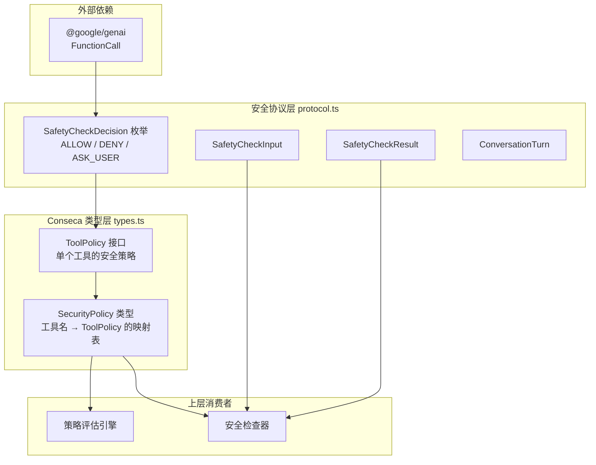

# types.ts

## 概述

`types.ts` 是 Conseca（Consent & Security Architecture）安全子系统中的核心类型定义文件。该文件定义了工具（Tool）级别的安全策略数据结构，用于描述每个工具的权限决策、约束条件和决策理由。它是 CLI 安全检查流程中"策略层"的基础类型，为上层的策略评估引擎提供结构化的类型约定。

**源文件路径**: `packages/core/src/safety/conseca/types.ts`

## 架构图（Mermaid）



## 核心组件

### 1. `ToolPolicy` 接口

```typescript
export interface ToolPolicy {
  permissions: SafetyCheckDecision;
  constraints: string;
  rationale: string;
}
```

`ToolPolicy` 是描述**单个工具安全策略**的核心接口，包含三个字段：

| 字段 | 类型 | 说明 |
|------|------|------|
| `permissions` | `SafetyCheckDecision` | 该工具的权限决策，取值为 `ALLOW`（允许）、`DENY`（拒绝）或 `ASK_USER`（询问用户） |
| `constraints` | `string` | 对该工具使用的约束条件描述，例如"仅限读取当前工作目录下的文件" |
| `rationale` | `string` | 该策略决策的理由说明，用于审计和调试，解释为什么对该工具做出此权限决策 |

**设计意图**：将权限决策与其背后的原因（rationale）和限制条件（constraints）绑定在一起，使安全策略既是可执行的（通过 `permissions` 字段），也是可解释的（通过 `rationale` 和 `constraints` 字段）。

### 2. `SecurityPolicy` 类型

```typescript
export type SecurityPolicy = Record<string, ToolPolicy>;
```

`SecurityPolicy` 是一个**字典类型**，键是工具名称（字符串），值是对应的 `ToolPolicy`。它代表了整个系统中所有工具的安全策略集合。

**使用示例**（概念性）：

```typescript
const policy: SecurityPolicy = {
  "read_file": {
    permissions: SafetyCheckDecision.ALLOW,
    constraints: "仅限工作目录内的文件",
    rationale: "读取文件是只读操作，风险较低"
  },
  "execute_command": {
    permissions: SafetyCheckDecision.ASK_USER,
    constraints: "需要用户确认",
    rationale: "命令执行具有潜在的系统级影响"
  },
  "delete_file": {
    permissions: SafetyCheckDecision.DENY,
    constraints: "禁止删除操作",
    rationale: "自动删除文件风险过高"
  }
};
```

## 依赖关系

### 内部依赖

| 依赖模块 | 导入内容 | 用途 |
|----------|----------|------|
| `../protocol.js` (`safety/protocol.ts`) | `SafetyCheckDecision` | 枚举类型，定义了三种安全检查决策：`ALLOW`、`DENY`、`ASK_USER`。被 `ToolPolicy.permissions` 字段使用 |

**`SafetyCheckDecision` 枚举详情**：

```typescript
export enum SafetyCheckDecision {
  ALLOW = 'allow',      // 允许工具调用
  DENY = 'deny',        // 拒绝工具调用
  ASK_USER = 'ask_user' // 需要用户确认
}
```

### 外部依赖

该文件没有直接的外部依赖（第三方包）。但其间接依赖链为：

- `types.ts` → `protocol.ts` → `@google/genai`（`FunctionCall` 类型）

## 关键实现细节

1. **极简设计**：整个文件仅 19 行代码（含许可证头），只定义了一个接口和一个类型别名。这种极简设计体现了单一职责原则——该文件只负责定义 Conseca 安全策略的数据结构。

2. **类型导入使用 `type` 关键字**：`import type { SafetyCheckDecision }` 使用了 TypeScript 的 `type-only import`，确保该导入在编译后完全被擦除，不会产生运行时依赖。这是一种性能最佳实践。

3. **`Record<string, ToolPolicy>` 的选择**：使用 `Record` 而非 `Map` 类型，意味着 `SecurityPolicy` 是一个普通的 JavaScript 对象字面量（POJO），可以直接从 JSON 反序列化，这对于从配置文件或网络传输策略数据非常友好。

4. **策略与执行分离**：`types.ts` 只定义了"策略长什么样"，不包含任何策略评估逻辑。实际的安全检查（基于这些策略判断是否允许工具调用）由上层模块实现，这体现了数据与行为分离的设计模式。

5. **可扩展性**：`constraints` 使用 `string` 类型而非结构化类型，提供了最大的灵活性——约束条件可以是自然语言描述，也可以是结构化的规则表达式，具体解释权交给消费者。

6. **命名空间归属**：该文件位于 `safety/conseca/` 目录下，"Conseca" 可能是 "Consent + Security" 的缩写，暗示这是一个基于用户同意的安全框架。
