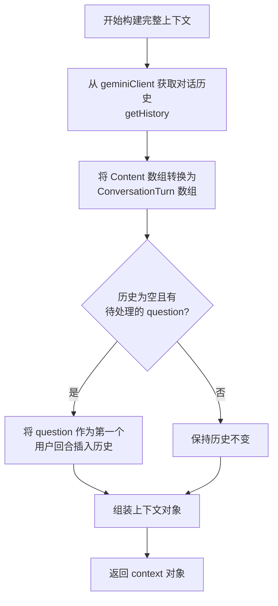
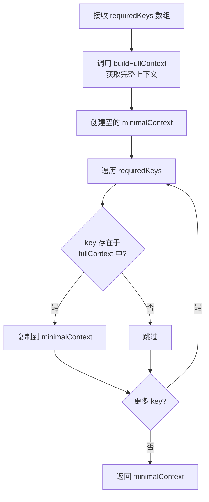
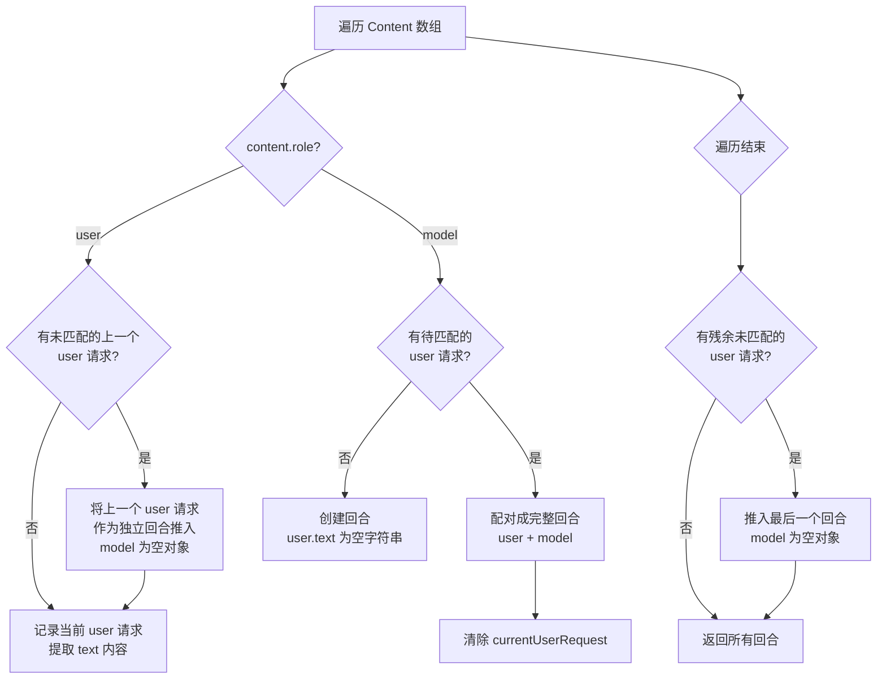

# context-builder.ts

## 概述

`context-builder.ts` 是 Gemini CLI 安全检查子系统的**上下文构建器**，位于 `packages/core/src/safety/` 目录下。该文件实现了 `ContextBuilder` 类，负责将 Gemini 客户端的对话历史和运行环境信息转换为安全检查协议所需的标准化上下文格式。

`ContextBuilder` 在安全检查流程中扮演着"数据适配器"角色：
- **输入端**：从 `AgentLoopContext` 中提取 Gemini 客户端的对话历史（`Content[]` 格式）和工作区配置
- **输出端**：将这些数据转换为安全检查协议定义的 `SafetyCheckInput['context']` 格式，供各种安全检查器消费

它还提供了上下文按需裁剪能力，检查器可以声明只需要上下文的某些字段，`ContextBuilder` 会仅构建并返回这些字段，减少不必要的数据传输。

## 架构图（Mermaid）

```mermaid
graph TB
    subgraph 数据源
        ALC[AgentLoopContext<br/>代理循环上下文]
        GC[geminiClient<br/>Gemini 客户端]
        CFG[config<br/>配置对象]
        WC[WorkspaceContext<br/>工作区上下文]
    end

    subgraph ContextBuilder 类
        BFC[buildFullContext<br/>构建完整上下文]
        BMC[buildMinimalContext<br/>构建最小上下文]
        CHTT[convertHistoryToTurns<br/>历史记录格式转换<br/>Content[] → ConversationTurn[]]
    end

    subgraph 输出格式
        SCI[SafetyCheckInput.context<br/>安全检查上下文]
        ENV[environment<br/>环境信息<br/>cwd + workspaces]
        HIST[history<br/>对话历史<br/>ConversationTurn 数组]
    end

    subgraph 消费者
        CKR[CheckerRunner<br/>检查器运行器]
        IPC[进程内检查器]
        EPC[外部检查器进程]
    end

    ALC --> BFC
    GC -->|getHistory| BFC
    CFG -->|getQuestion| BFC
    CFG -->|getWorkspaceContext| BFC
    WC -->|getDirectories| BFC

    BFC --> CHTT
    CHTT --> HIST

    BFC --> SCI
    SCI --> ENV
    SCI --> HIST

    BMC --> BFC
    BMC --> SCI

    SCI --> CKR
    CKR --> IPC
    CKR --> EPC
```

## 核心组件

### 1. ContextBuilder 类

#### 1.1 构造函数

```typescript
constructor(private readonly context: AgentLoopContext) {}
```

接收一个 `AgentLoopContext` 实例作为唯一依赖，包含了 Gemini 客户端实例、配置信息和工作区上下文。

#### 1.2 buildFullContext() -- 构建完整上下文

返回包含所有可用数据的完整安全检查上下文对象。



返回的上下文对象结构：

```typescript
{
  environment: {
    cwd: string,          // 当前工作目录 (process.cwd())
    workspaces: string[], // 工作区目录列表
  },
  history: {
    turns: ConversationTurn[], // 对话回合列表
  },
}
```

**关键行为**：
- 当对话历史为空（尚未开始对话）但存在待处理的用户问题时，会将该问题作为第一个对话回合插入历史中，确保安全检查器能看到初始的用户请求
- 当对话历史非空时，完全信任历史记录反映的真实状态，不额外插入 question

#### 1.3 buildMinimalContext(requiredKeys) -- 构建最小上下文

接受一个 `requiredKeys` 数组，从完整上下文中仅提取指定的顶层键：

```typescript
buildMinimalContext(
  requiredKeys: Array<keyof SafetyCheckInput['context']>,
): SafetyCheckInput['context']
```



**示例**：如果检查器只需要环境信息，可声明 `required_context: ['environment']`，则 `buildMinimalContext(['environment'])` 仅返回 `{ environment: {...} }`，不包含对话历史。

#### 1.4 convertHistoryToTurns(history) -- 历史格式转换

这是核心的私有方法，负责将 Google GenAI SDK 的 `Content[]` 格式转换为安全检查协议的 `ConversationTurn[]` 格式。

**转换规则**：



**Content 到 ConversationTurn 的映射**：

| Content 结构 | ConversationTurn 结构 |
|---|---|
| `{ role: 'user', parts: [{text: "..."}] }` | `{ user: { text: "拼接的文本" } }` |
| `{ role: 'model', parts: [{text: "..."}, {functionCall: {...}}] }` | `{ model: { text: "文本部分", toolCalls: [FunctionCall, ...] } }` |

**用户部分的文本提取**：
```typescript
text: content.parts?.map((p) => p.text).join('') || ''
```
将所有 part 的 text 拼接为一个字符串。

**模型部分的处理**：
- 文本：过滤出有 `text` 属性的 part，拼接为字符串
- 工具调用：过滤出有 `functionCall` 属性的 part，提取 `FunctionCall` 对象数组

**边界情况处理**：
1. **连续的用户消息**（没有中间的模型回复）：前一个用户消息作为独立回合（model 为空对象）推入
2. **没有前置用户消息的模型回复**：创建用户 text 为空字符串的回合
3. **末尾未匹配的用户消息**：作为最后一个回合（model 为空对象）推入

## 依赖关系

### 内部依赖

| 依赖模块 | 导入内容 | 用途 |
|---|---|---|
| `./protocol.js` | `SafetyCheckInput`, `ConversationTurn` 类型 | 安全检查协议的输入和对话回合类型定义 |
| `../utils/debugLogger.js` | `debugLogger` | 调试日志输出，记录上下文构建的中间状态 |
| `../config/agent-loop-context.js` | `AgentLoopContext` 类型 | 代理循环上下文，提供 Gemini 客户端和配置的访问 |

### 外部依赖

| 依赖模块 | 导入内容 | 用途 |
|---|---|---|
| `@google/genai` | `Content`, `FunctionCall` 类型 | Google GenAI SDK 的对话内容和工具调用类型定义 |

## 关键实现细节

1. **数据格式适配**：`ContextBuilder` 的核心价值在于将 Google GenAI SDK 的 `Content[]` 格式（按 role 的扁平消息列表）转换为安全检查协议的 `ConversationTurn[]` 格式（user-model 配对的回合列表）。这种转换使安全检查器不需要了解 GenAI SDK 的内部数据格式，只需处理标准化的回合结构。

2. **空历史时的 question 注入**：当对话历史为空但有待处理的 question 时，`buildFullContext` 会将其注入为第一个回合。这确保了在对话开始前（例如第一个工具调用前）安全检查器也能看到用户的原始请求，做出合理的安全判断。

3. **最小上下文优化**：`buildMinimalContext` 虽然内部先构建完整上下文再裁剪（非延迟计算），但从接口设计上为未来的优化预留了空间。当前实现的主要价值在于减少传输给外部检查器进程的数据量，降低序列化/反序列化开销。

4. **稳健的配对算法**：`convertHistoryToTurns` 使用"当前用户请求"缓冲变量来配对 user-model 消息。该算法能优雅地处理各种不规则的消息序列（连续用户消息、无前置用户消息的模型回复等），不会丢失任何消息。

5. **工作区目录获取**：环境信息中的 `workspaces` 通过 `config.getWorkspaceContext().getDirectories()` 获取，这些目录连同 `process.cwd()` 一起构成了 `AllowedPathChecker` 使用的允许目录列表。

6. **不可变设计**：`ContextBuilder` 的 `context` 字段声明为 `private readonly`，确保构建器在创建后不会修改其依赖的上下文对象，保证了数据一致性。
