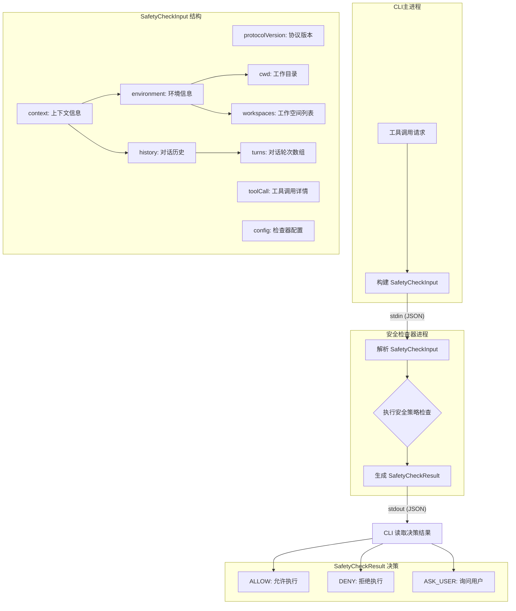

# protocol.ts

## 概述

`protocol.ts` 是 Gemini CLI 安全检查子系统的**协议定义文件**，定义了 CLI 主进程与安全检查器（Safety Checker）之间通信的数据契约。该文件不包含任何业务逻辑，仅通过 TypeScript 接口（interface）、枚举（enum）和类型别名（type）声明了输入、输出以及决策类型，是整个 safety 模块的基石。

安全检查器以独立进程运行，CLI 通过 **stdin** 向其发送 `SafetyCheckInput`，安全检查器通过 **stdout** 返回 `SafetyCheckResult`。协议版本化（`protocolVersion`）保证了向前兼容性。

## 架构图（Mermaid）



## 核心组件

### 1. `ConversationTurn` 接口

表示用户与模型之间一轮对话的数据结构，用于为安全检查器提供语义上下文，帮助理解工具调用的意图。

```typescript
export interface ConversationTurn {
  user: {
    text: string;           // 用户输入的文本
  };
  model: {
    text?: string;          // 模型回复的文本（可选）
    toolCalls?: FunctionCall[]; // 模型发起的工具调用列表（可选）
  };
}
```

**设计要点：**
- `user.text` 是必填字段，表示每轮对话必须有用户输入。
- `model.text` 和 `model.toolCalls` 都是可选的，因为模型可能只回复文本、只调用工具、或两者兼有。
- `FunctionCall` 来自 `@google/genai` 包，是 Google GenAI SDK 的标准工具调用类型。

### 2. `SafetyCheckInput` 接口

CLI 发送给安全检查器进程的**输入数据结构**，通过 stdin 以 JSON 格式传递。

```typescript
export interface SafetyCheckInput {
  protocolVersion: '1.0.0';  // 语义化版本号，字面量类型
  toolCall: FunctionCall;     // 待验证的工具调用
  context: {
    environment: {
      cwd: string;            // 当前工作目录
      workspaces: string[];   // 用户配置的工作空间根目录列表
    };
    history?: {
      turns: ConversationTurn[]; // 最近的对话历史
    };
  };
  config?: unknown;           // 安全检查器的自定义配置
}
```

**设计要点：**

| 字段 | 说明 | 必填 |
|------|------|------|
| `protocolVersion` | 使用字面量类型 `'1.0.0'` 而非 `string`，确保版本严格匹配。未来可通过联合类型支持多版本 | 是 |
| `toolCall` | 当前待校验的具体工具调用 | 是 |
| `context.environment` | 文件系统和执行环境信息 | 是 |
| `context.history` | 对话历史，可选。某些检查器可能需要上下文来判断意图 | 否 |
| `config` | 类型为 `unknown`，表示完全由检查器自行定义和解析。允许每个检查器有不同的配置结构（如允许的路径列表等） | 否 |

**`context` 采用分类分组设计**（`environment`、`history`）：
- 便于未来扩展新的上下文类别，而不会造成扁平化、难以管理的对象结构。
- 例如将来可添加 `context.permissions`、`context.user` 等。

### 3. `SafetyCheckDecision` 枚举

安全检查器可做出的三种决策：

```typescript
export enum SafetyCheckDecision {
  ALLOW = 'allow',     // 允许工具调用执行
  DENY = 'deny',       // 拒绝工具调用执行
  ASK_USER = 'ask_user', // 需要用户确认
}
```

**设计要点：**
- 使用字符串枚举（而非数字枚举），保证 JSON 序列化后可读性。
- `ASK_USER` 提供了一个介于完全允许和完全拒绝之间的中间态，允许安全检查器将决策权交还给用户。

### 4. `SafetyCheckResult` 类型

安全检查器通过 stdout 返回的**决策结果**，使用判别联合类型（Discriminated Union）实现：

```typescript
export type SafetyCheckResult =
  | {
      decision: SafetyCheckDecision.ALLOW;
      reason?: string;   // 可选：允许原因
      error?: string;    // 可选：系统故障导致的 fail-open 错误信息
    }
  | {
      decision: SafetyCheckDecision.DENY;
      reason: string;    // 必填：拒绝原因，将展示给用户
    }
  | {
      decision: SafetyCheckDecision.ASK_USER;
      reason: string;    // 必填：询问原因，将展示给用户
    };
```

**设计要点：**
- 使用判别联合类型（以 `decision` 为判别字段），TypeScript 编译器可以在不同分支中正确推断字段的可选性。
- `ALLOW` 时 `reason` 可选（通常不需要解释为什么允许），但包含 `error` 字段支持 **fail-open** 场景——当安全检查器内部出错时，默认允许执行但记录错误。
- `DENY` 和 `ASK_USER` 时 `reason` 为必填，因为必须向用户解释为何被拒绝或为何需要确认。

## 依赖关系

### 内部依赖

无。`protocol.ts` 是纯类型定义文件，不依赖项目内其他模块。它是 safety 模块中被其他文件依赖的基础。

### 外部依赖

| 依赖包 | 导入内容 | 用途 |
|--------|---------|------|
| `@google/genai` | `FunctionCall`（类型导入） | Google GenAI SDK 提供的工具调用类型定义，用于描述模型发起的函数调用 |

注意使用的是 `import type`，仅在编译时引入类型信息，不会在运行时产生任何依赖。

## 关键实现细节

1. **纯类型文件，零运行时开销**：整个文件仅包含接口、枚举和类型定义，编译后仅保留枚举的 JavaScript 代码，接口和类型别名完全被擦除。

2. **协议版本化策略**：`protocolVersion` 使用字面量类型 `'1.0.0'` 而非宽泛的 `string`，这意味着：
   - 当前代码只能构建版本 `1.0.0` 的输入。
   - 未来升级协议时，可以将类型扩展为 `'1.0.0' | '2.0.0'`，并通过判别联合处理不同版本的结构差异。

3. **进程间通信模型**：安全检查器被设计为独立进程（而非库函数调用），通过 stdin/stdout 进行 JSON 通信。这种设计的优势：
   - **语言无关**：安全检查器可以用任何语言实现，只要遵循 JSON 协议。
   - **隔离性**：检查器崩溃不会影响主进程。
   - **可插拔**：用户可以替换或自定义安全检查器。

4. **Fail-open 设计**：`SafetyCheckResult` 中 `ALLOW` 分支包含 `error` 字段，表明系统在安全检查器出错时采用 fail-open 策略——允许操作继续但记录错误，而不是阻塞用户工作流。

5. **`config` 使用 `unknown` 类型**：而非 `any`，强制消费方在使用前进行类型检查或断言，保证类型安全性。
