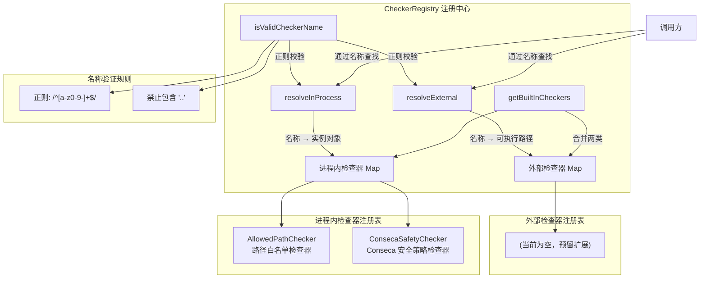

# registry.ts

## 概述

`registry.ts` 实现了安全检查器的**注册中心**（`CheckerRegistry`），负责将检查器名称解析为具体的可执行路径（外部检查器）或实例对象（进程内检查器）。它是安全子系统的"服务定位器"，在工具调用需要安全校验时，由上层调用方通过名称查找对应的检查器。

该注册中心支持两类检查器：
- **外部检查器（External Checker）**：以独立进程运行的可执行文件，通过 stdin/stdout 进行 JSON 通信（当前尚无内置的外部检查器，预留了扩展点）。
- **进程内检查器（In-Process Checker）**：直接在 CLI 进程内运行的检查器实例，包括 `AllowedPathChecker`（路径白名单检查）和 `ConsecaSafetyChecker`（Conseca 安全策略检查）。

## 架构图（Mermaid）



## 核心组件

### 1. `CheckerRegistry` 类

整个文件导出的唯一类，是安全检查器的集中管理和查找入口。

#### 静态属性

```typescript
// 外部检查器注册表（名称 → 相对路径），当前为空
private static readonly BUILT_IN_EXTERNAL_CHECKERS = new Map<string, string>([]);

// 进程内检查器注册表（延迟初始化），名称 → InProcessChecker 实例
private static BUILT_IN_IN_PROCESS_CHECKERS: Map<string, InProcessChecker> | undefined;

// 检查器名称合法性正则：仅允许小写字母、数字和连字符
private static readonly VALID_NAME_PATTERN = /^[a-z0-9-]+$/;
```

#### 构造函数

```typescript
constructor(private readonly checkersPath: string) {}
```

接收一个 `checkersPath` 参数，表示外部检查器可执行文件所在的基础目录路径。该路径与外部检查器的相对路径拼接后形成完整的可执行文件路径。

#### 方法详解

##### `resolveExternal(name: string): string`

将外部检查器名称解析为绝对可执行路径。

**处理流程：**
1. 调用 `isValidCheckerName` 验证名称合法性，不合法则抛出异常。
2. 在 `BUILT_IN_EXTERNAL_CHECKERS` 中查找：
   - 找到：拼接 `checkersPath` + 相对路径，验证文件存在后返回绝对路径。
   - 未找到：抛出异常（未来 Phase 5 将支持自定义外部检查器）。

```typescript
resolveExternal(name: string): string {
  if (!CheckerRegistry.isValidCheckerName(name)) {
    throw new Error(`Invalid checker name "${name}". ...`);
  }
  const builtInPath = CheckerRegistry.BUILT_IN_EXTERNAL_CHECKERS.get(name);
  if (builtInPath) {
    const fullPath = path.join(this.checkersPath, builtInPath);
    if (!fs.existsSync(fullPath)) {
      throw new Error(`Built-in checker "${name}" not found at ${fullPath}`);
    }
    return fullPath;
  }
  // TODO: Phase 5 - Add support for custom external checkers
  throw new Error(`Unknown external checker "${name}".`);
}
```

##### `resolveInProcess(name: string): InProcessChecker`

将进程内检查器名称解析为检查器实例。

**处理流程：**
1. 验证名称合法性。
2. 在进程内检查器 Map 中查找实例。
3. 找到则返回实例，未找到则抛出异常（并列出所有可用的检查器名称）。

```typescript
resolveInProcess(name: string): InProcessChecker {
  if (!CheckerRegistry.isValidCheckerName(name)) {
    throw new Error(`Invalid checker name "${name}".`);
  }
  const checker = CheckerRegistry.getBuiltInInProcessCheckers().get(name);
  if (checker) {
    return checker;
  }
  throw new Error(
    `Unknown in-process checker "${name}". Available: ${Array.from(
      CheckerRegistry.getBuiltInInProcessCheckers().keys(),
    ).join(', ')}`,
  );
}
```

##### `getBuiltInInProcessCheckers(): Map<string, InProcessChecker>`（私有静态）

使用**延迟初始化（Lazy Initialization）**模式创建进程内检查器注册表。

```typescript
private static getBuiltInInProcessCheckers(): Map<string, InProcessChecker> {
  if (!CheckerRegistry.BUILT_IN_IN_PROCESS_CHECKERS) {
    CheckerRegistry.BUILT_IN_IN_PROCESS_CHECKERS = new Map([
      [InProcessCheckerType.ALLOWED_PATH, new AllowedPathChecker()],
      [InProcessCheckerType.CONSECA, ConsecaSafetyChecker.getInstance()],
    ]);
  }
  return CheckerRegistry.BUILT_IN_IN_PROCESS_CHECKERS;
}
```

当前注册了两个进程内检查器：
| 名称常量 | 检查器类 | 功能 |
|----------|---------|------|
| `InProcessCheckerType.ALLOWED_PATH` | `AllowedPathChecker` | 路径白名单检查，验证工具调用是否在允许的路径范围内 |
| `InProcessCheckerType.CONSECA` | `ConsecaSafetyChecker` | Conseca 安全策略检查，基于策略规则进行更精细的安全校验 |

注意 `ConsecaSafetyChecker` 使用单例模式（`getInstance()`），而 `AllowedPathChecker` 每次初始化时创建新实例。

##### `isValidCheckerName(name: string): boolean`（私有静态）

验证检查器名称的合法性：

```typescript
private static isValidCheckerName(name: string): boolean {
  return this.VALID_NAME_PATTERN.test(name) && !name.includes('..');
}
```

**双重校验：**
1. 正则匹配：仅允许小写字母（`a-z`）、数字（`0-9`）和连字符（`-`）。
2. 路径遍历防护：禁止包含 `..`，防止目录遍历攻击。

##### `getBuiltInCheckers(): string[]`（静态公开）

返回所有内置检查器（外部 + 进程内）的名称列表，用于对外暴露可用检查器信息。

```typescript
static getBuiltInCheckers(): string[] {
  return [
    ...Array.from(this.BUILT_IN_EXTERNAL_CHECKERS.keys()),
    ...Array.from(this.getBuiltInInProcessCheckers().keys()),
  ];
}
```

## 依赖关系

### 内部依赖

| 模块路径 | 导入内容 | 用途 |
|----------|---------|------|
| `./built-in.js` | `InProcessChecker`（类型）, `AllowedPathChecker`（类） | 进程内检查器接口定义和路径白名单检查器实现 |
| `../policy/types.js` | `InProcessCheckerType`（枚举） | 进程内检查器的名称常量，用作注册表的键 |
| `./conseca/conseca.js` | `ConsecaSafetyChecker`（类） | Conseca 安全策略检查器，以单例模式注册 |

### 外部依赖

| 依赖包 | 导入内容 | 用途 |
|--------|---------|------|
| `node:path` | `path` 模块 | 路径拼接，用于构建外部检查器的绝对路径 |
| `node:fs` | `fs` 模块 | 文件系统操作，用于验证外部检查器可执行文件是否存在 |

## 关键实现细节

1. **延迟初始化模式**：`BUILT_IN_IN_PROCESS_CHECKERS` 使用延迟初始化，避免模块加载时立即实例化所有检查器。只有在首次需要解析进程内检查器时才会创建实例，减少启动开销。

2. **安全性防护 — 名称校验**：
   - 正则 `/^[a-z0-9-]+$/` 严格限制了名称字符集，防止注入攻击。
   - 额外的 `..` 检查防止路径遍历，即使正则已经不允许 `.`，这是一种纵深防御策略。

3. **两类检查器的分离设计**：
   - **外部检查器**通过 `resolveExternal` 返回文件路径，调用方需要自行启动子进程。
   - **进程内检查器**通过 `resolveInProcess` 直接返回实例，调用方可直接调用方法。
   - 这种设计允许灵活选择检查器的运行方式。

4. **扩展预留**：
   - `BUILT_IN_EXTERNAL_CHECKERS` 当前为空，但结构已就绪，新增外部检查器只需添加 Map 条目。
   - 代码中有 `TODO: Phase 5` 注释，表明未来将支持用户自定义的外部检查器。

5. **错误消息友好性**：`resolveInProcess` 在检查器未找到时，会在错误消息中列出所有可用的检查器名称，便于调试。

6. **单例与多实例混用**：`ConsecaSafetyChecker` 使用单例模式（可能因为其维护全局状态或资源较重），而 `AllowedPathChecker` 直接 `new` 创建（可能因为其无状态或轻量级）。这种差异化设计是有意为之的。
