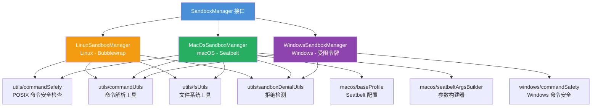
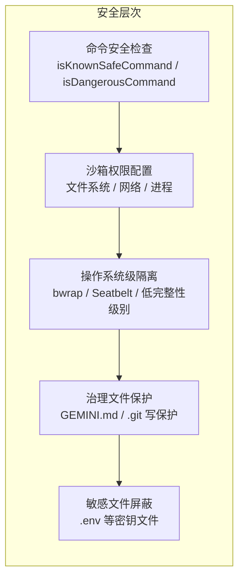
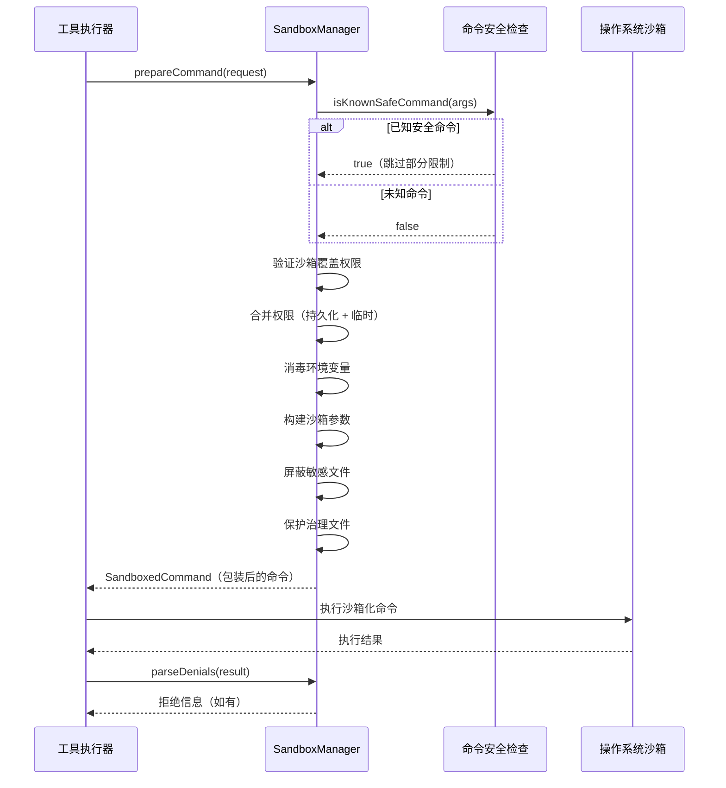

# sandbox

## 概述

`sandbox` 模块负责 Gemini CLI 的**命令沙箱隔离**。它为 AI 生成的 shell 命令提供安全的执行环境，根据不同的操作系统（Linux、macOS、Windows）使用对应的沙箱技术限制命令的文件系统访问、网络访问和进程权限。该模块是 Gemini CLI 安全体系的核心组件，确保 AI 执行的命令不会对用户系统造成意外损害。

## 目录结构

```
sandbox/
├── linux/                          # Linux 平台沙箱实现
│   ├── LinuxSandboxManager.ts      # 基于 Bubblewrap (bwrap) 的沙箱管理器
│   └── LinuxSandboxManager.test.ts
├── macos/                          # macOS 平台沙箱实现
│   ├── MacOsSandboxManager.ts      # 基于 Seatbelt 的沙箱管理器
│   ├── MacOsSandboxManager.test.ts
│   ├── baseProfile.ts              # Seatbelt SBPL 基础安全配置
│   ├── seatbeltArgsBuilder.ts      # Seatbelt 参数构建器
│   └── seatbeltArgsBuilder.test.ts
├── windows/                        # Windows 平台沙箱实现
│   ├── WindowsSandboxManager.ts    # 基于受限令牌和低完整性级别的沙箱管理器
│   ├── WindowsSandboxManager.test.ts
│   ├── commandSafety.ts            # Windows 命令安全检查
│   └── commandSafety.test.ts
└── utils/                          # 跨平台共享工具
    ├── commandSafety.ts            # POSIX 命令安全检查
    ├── commandUtils.ts             # 命令解析和审批工具
    ├── fsUtils.ts                  # 文件系统工具（realpath、git worktree）
    ├── sandboxDenialUtils.ts       # 沙箱拒绝检测和解析
    └── sandboxDenialUtils.test.ts
```

## 架构图





## 核心组件

### SandboxManager 接口

所有平台沙箱管理器实现的统一接口（定义在 `services/sandboxManager.ts`）：

| 方法 | 说明 |
|------|------|
| `prepareCommand(req)` | 将原始命令包装为沙箱化命令 |
| `isKnownSafeCommand(args)` | 判断命令是否已知安全（只读） |
| `isDangerousCommand(args)` | 判断命令是否已知危险 |
| `parseDenials(result)` | 解析命令执行结果中的沙箱拒绝 |

### 安全特性

所有平台的沙箱管理器共享以下安全特性：

1. **工作区访问控制** - 根据模式（只读/读写）控制对工作区的访问
2. **网络访问控制** - 默认禁用网络，需显式启用
3. **治理文件写保护** - GEMINI.md、.gitignore 等文件始终只读
4. **敏感文件屏蔽** - .env 等包含密钥的文件被屏蔽
5. **环境变量消毒** - 清理传递给沙箱进程的环境变量
6. **权限合并** - 合并持久化审批权限和临时请求权限
7. **计划模式限制** - 在 Plan 模式下禁止覆盖限制

## 依赖关系

### 内部依赖

| 模块 | 用途 |
|------|------|
| `services/sandboxManager` | `SandboxManager` 接口和共享常量（`GOVERNANCE_FILES`、`SECRET_FILES`） |
| `services/shellExecutionService` | Shell 执行结果类型 |
| `services/environmentSanitization` | 环境变量消毒 |
| `policy/sandboxPolicyManager` | 持久化沙箱权限管理 |
| `utils/shell-utils` | Shell 命令解析工具 |
| `utils/debugLogger` | 调试日志 |
| `utils/errors` | 错误类型检查 |

### 外部依赖

| 包 | 用途 |
|---|------|
| `shell-quote` | Shell 命令解析 |
| `node:fs` | 文件系统操作 |
| `node:path` | 路径处理 |
| `node:os` | 操作系统信息 |
| `node:child_process` | 进程管理 |

## 数据流

### 命令沙箱化流程


