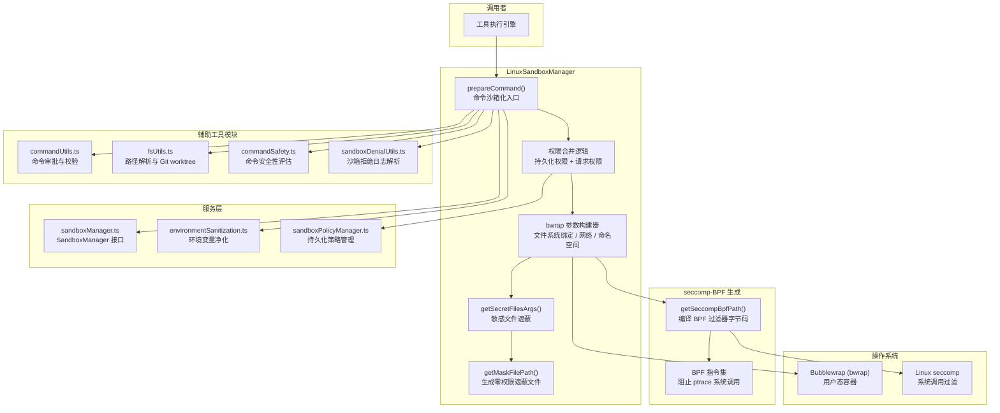

# LinuxSandboxManager.ts

## 概述

`LinuxSandboxManager.ts` 是 Gemini CLI 在 **Linux 平台**上的沙箱管理器实现。它基于 **Bubblewrap (bwrap)** 容器化工具和 **seccomp-BPF** 系统调用过滤器，为工具命令（如 shell 命令执行）提供文件系统隔离、网络隔离和系统调用级别的安全防护。

该文件是 `SandboxManager` 接口的 Linux 特化实现，核心职责是将一个普通的命令请求（`SandboxRequest`）转换为一个被沙箱包裹的安全命令（`SandboxedCommand`），使得 AI 代理执行的任何 shell 命令都在受限的沙箱环境中运行。

**源文件路径**: `packages/core/src/sandbox/linux/LinuxSandboxManager.ts`

## 架构图（Mermaid）



## 核心组件

### 1. `getSeccompBpfPath()` 函数（模块级私有）

```typescript
function getSeccompBpfPath(): string
```

该函数在模块级别（非类成员）生成 **seccomp-BPF 字节码文件**，用于在内核层面过滤危险的系统调用。

**功能详情**：

- **架构检测**：支持 `x64`、`arm64`、`arm`、`ia32` 四种 CPU 架构，为每种架构确定正确的 `AUDIT_ARCH` 常量和 `SYS_ptrace` 系统调用号。
- **BPF 指令编译**：生成 7 条 BPF 指令，逻辑如下：
  1. 加载系统调用的架构信息
  2. 验证架构是否匹配当前 CPU（不匹配则终止进程）
  3. 加载系统调用号
  4. 如果是 `ptrace` 系统调用，返回 `EPERM` 错误（阻止调试/注入攻击）
  5. 其他系统调用一律放行
- **文件输出**：将编译好的 BPF 字节码写入临时文件 `/tmp/gemini-cli-seccomp-XXXXXX/seccomp.bpf`
- **缓存机制**：使用模块级变量 `cachedBpfPath` 缓存，避免重复生成
- **进程退出清理**：注册 `process.on('exit')` 回调清理临时文件

**BPF 指令格式**（每条指令 8 字节）：

| 偏移 | 大小 | 字段 | 说明 |
|------|------|------|------|
| 0 | 2 字节 | code | 操作码 |
| 2 | 1 字节 | jt | 条件为真时跳转偏移 |
| 3 | 1 字节 | jf | 条件为假时跳转偏移 |
| 4 | 4 字节 | k | 操作数/常量 |

### 2. `touch()` 函数（模块级私有）

```typescript
function touch(filePath: string, isDirectory: boolean): void
```

确保指定的文件或目录存在。如果目标不存在：
- 目录：递归创建 (`mkdirSync` with `recursive: true`)
- 文件：创建父目录后，以 append 模式打开并立即关闭（创建空文件）

用于在挂载治理文件（GOVERNANCE_FILES）前确保路径存在。

### 3. `LinuxSandboxOptions` 接口

```typescript
export interface LinuxSandboxOptions extends GlobalSandboxOptions {
  modeConfig?: {
    readonly?: boolean;    // 是否为只读模式，默认 true
    network?: boolean;     // 是否允许网络访问
    approvedTools?: string[]; // 预批准的工具列表
    allowOverrides?: boolean; // 是否允许策略覆盖
  };
  policyManager?: SandboxPolicyManager; // 持久化策略管理器
}
```

扩展了 `GlobalSandboxOptions`，添加了 Linux 沙箱特有的模式配置。

### 4. `LinuxSandboxManager` 类

实现了 `SandboxManager` 接口，是文件的核心类。

#### 4.1 `isKnownSafeCommand(args: string[]): boolean`

委托给 `commandSafety.ts` 中的同名函数，判断命令是否已知安全（如 `ls`、`pwd` 等只读命令）。

#### 4.2 `isDangerousCommand(args: string[]): boolean`

委托给 `commandSafety.ts`，判断命令是否危险（如 `rm -rf /`）。

#### 4.3 `parseDenials(result: ShellExecutionResult): ParsedSandboxDenial | undefined`

委托给 `sandboxDenialUtils.ts`，解析 POSIX 系统的沙箱拒绝日志。

#### 4.4 `getMaskFilePath(): string`（私有）

创建一个零权限（`chmod 0`）的临时文件，用作敏感文件的遮蔽覆盖物（bind mount 的源）。使用静态变量缓存路径，进程退出时清理。

#### 4.5 `prepareCommand(req: SandboxRequest): Promise<SandboxedCommand>`（核心方法）

这是最重要的方法，将原始命令请求转换为沙箱化命令。执行流程如下：

**步骤 1 — 权限计算**：
- 确定只读模式（默认 `true`）
- 检查命令是否在预批准列表中（`isStrictlyApproved`）
- 计算工作区写权限：非只读模式 OR 已批准的工具
- 计算网络权限：全局配置 OR 请求策略
- 合并持久化权限和请求级权限（文件系统读/写、网络）

**步骤 2 — 环境变量净化**：
- 调用 `sanitizeEnvironment()` 清除或重写敏感环境变量

**步骤 3 — bwrap 基础参数**：
```
--unshare-all          # 取消共享所有命名空间（PID、net、mount 等）
--new-session          # 隔离 TTY 会话
--die-with-parent      # 父进程退出时终止沙箱
--share-net            # （可选）恢复网络共享
--ro-bind / /          # 只读挂载整个根文件系统
--dev /dev             # 创建最小化的 /dev
--proc /proc           # 创建隔离的 /proc
--tmpfs /tmp           # 创建隔离的 /tmp
```

**步骤 4 — 工作区挂载**：
- 根据写权限使用 `--bind-try`（读写）或 `--ro-bind-try`（只读）
- 处理符号链接解析（realpath 与原始路径可能不同）
- 处理 Git worktree 的特殊路径

**步骤 5 — 额外路径绑定**：
- `allowedPaths`：策略允许的额外路径
- `additionalReads`：额外只读路径
- `additionalWrites`：额外读写路径

**步骤 6 — 治理文件挂载**：
- 将 `GOVERNANCE_FILES`（如 `GEMINI.md` 等项目治理文件）以只读方式挂载

**步骤 7 — 禁止路径遮蔽**：
- 目录：挂载空的只读 tmpfs
- 文件：绑定 `/dev/null`
- 不存在的路径：创建指向 `/dev/null` 的符号链接

**步骤 8 — 敏感文件遮蔽**：
- 调用 `getSecretFilesArgs()` 查找并遮蔽 `.env` 等敏感文件

**步骤 9 — seccomp 过滤器加载**：
- 通过文件描述符 9 加载 BPF 字节码：`--seccomp 9`
- 使用 shell 重定向技巧：`exec bwrap "$@" 9< "$bpf_path"`

**最终输出**：
```typescript
{
  program: 'sh',
  args: ['-c', 'bpf_path="$1"; shift; exec bwrap "$@" 9< "$bpf_path"', '_', bpfPath, ...bwrapArgs],
  env: sanitizedEnv,
  cwd: req.cwd,
}
```

#### 4.6 `getSecretFilesArgs(allowedPaths?: string[]): Promise<string[]>`（私有）

使用 `find` 命令搜索工作区及允许路径中的敏感文件（`.env`、`.env.*` 等），生成 bwrap 绑定参数将这些文件用零权限文件覆盖。

搜索策略：
- 最大深度 3 层
- 跳过 `.git`、`node_modules`、`.venv`、`__pycache__`、`dist`、`build` 目录
- 使用 `-print0` 处理含特殊字符的文件名

## 依赖关系

### 内部依赖

| 依赖模块 | 导入内容 | 用途 |
|----------|----------|------|
| `../../services/sandboxManager.js` | `SandboxManager`, `GlobalSandboxOptions`, `SandboxRequest`, `SandboxedCommand`, `SandboxPermissions`, `GOVERNANCE_FILES`, `getSecretFileFindArgs`, `sanitizePaths`, `ParsedSandboxDenial` | 沙箱管理器接口定义和工具函数 |
| `../../services/shellExecutionService.js` | `ShellExecutionResult` | Shell 执行结果类型 |
| `../../services/environmentSanitization.js` | `sanitizeEnvironment`, `getSecureSanitizationConfig` | 环境变量安全净化 |
| `../../utils/debugLogger.js` | `debugLogger` | 调试日志 |
| `../../utils/shell-utils.js` | `spawnAsync` | 异步子进程执行（用于 `find` 命令） |
| `../../policy/sandboxPolicyManager.js` | `SandboxPolicyManager` | 持久化沙箱策略管理 |
| `../utils/commandUtils.js` | `isStrictlyApproved`, `verifySandboxOverrides`, `getCommandName` | 命令审批和校验 |
| `../utils/fsUtils.js` | `tryRealpath`, `resolveGitWorktreePaths`, `isErrnoException` | 文件系统路径解析工具 |
| `../utils/commandSafety.js` | `isKnownSafeCommand`, `isDangerousCommand` | 命令安全性分类 |
| `../utils/sandboxDenialUtils.js` | `parsePosixSandboxDenials` | 沙箱拒绝日志解析 |

### 外部依赖

| 依赖 | 用途 |
|------|------|
| `node:fs` | 文件系统操作（创建临时文件、检查路径存在性、写入 BPF 字节码） |
| `node:path` | 路径操作（`join`, `dirname`, `normalize`） |
| `node:os` | 获取 CPU 架构（`os.arch()`）和临时目录（`os.tmpdir()`） |
| **Bubblewrap (bwrap)** | 系统级依赖，Linux 用户态沙箱工具（需系统安装） |
| **find** | 系统级依赖，用于搜索敏感文件 |
| **sh** | 系统级依赖，POSIX shell，用于文件描述符重定向 |

## 关键实现细节

1. **双层安全防护**：
   - **Bubblewrap（用户态）**：通过 Linux namespace（PID、mount、network、user）实现文件系统和网络隔离
   - **seccomp-BPF（内核态）**：在系统调用层面阻止 `ptrace`，防止沙箱逃逸（通过调试器附加到沙箱外的进程）

2. **seccomp 文件描述符传递技巧**：由于 bwrap 的 `--seccomp` 参数要求文件描述符号而非文件路径，代码使用 `sh -c` 包装并通过 `9< "$bpf_path"` 将 BPF 文件绑定到 FD 9，再传给 bwrap。

3. **只读优先原则**：默认情况下工作区是只读的（`readonly: true`），只有在非只读模式或工具被明确批准时才授予写权限。这是最小权限原则的体现。

4. **路径双重绑定**：对于工作区路径，同时绑定原始路径和 `realpath` 解析后的路径（如果不同），确保符号链接和实际路径都能正确访问。

5. **Git Worktree 支持**：通过 `resolveGitWorktreePaths()` 检测并绑定 Git worktree 的特殊目录结构（`.git` 文件指向的外部 git 目录）。

6. **敏感文件遮蔽策略**：使用 `chmod 0` 的空文件通过 bind mount 覆盖 `.env` 等敏感文件，使得沙箱内的进程无法读取这些文件的内容。

7. **治理文件保护**：`GOVERNANCE_FILES` 始终以只读方式挂载，确保 AI 代理无法修改项目的治理配置（如 `GEMINI.md`）。

8. **禁止路径的差异化处理**：
   - 存在的目录 → 空只读 tmpfs 覆盖
   - 存在的文件 → `/dev/null` 覆盖
   - 不存在的路径 → 指向 `/dev/null` 的符号链接

9. **进程隔离**：`--die-with-parent` 确保父进程退出时沙箱进程也被终止，防止孤儿进程；`--new-session` 隔离 TTY 会话防止信号注入。

10. **缓存与清理**：BPF 字节码文件和遮蔽文件都使用缓存机制避免重复创建，并在进程退出时通过 `process.on('exit')` 回调自动清理临时文件。
