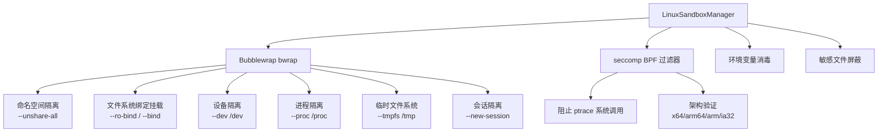
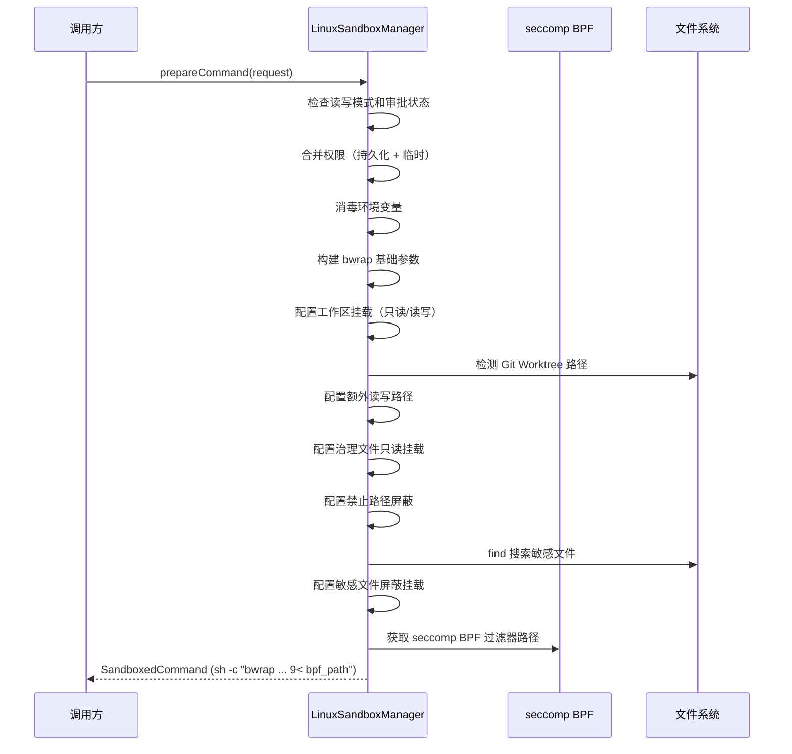

# linux

## 概述

`linux` 目录包含 Linux 平台的沙箱管理器实现。`LinuxSandboxManager` 使用 **Bubblewrap (bwrap)** 容器化工具和 **seccomp BPF** 系统调用过滤器，为 AI 生成的命令提供强大的进程隔离。Bubblewrap 通过 Linux 命名空间（namespace）实现文件系统、网络、PID 等资源的完全隔离。

## 目录结构

```
linux/
├── LinuxSandboxManager.ts       # Linux 沙箱管理器实现
└── LinuxSandboxManager.test.ts  # 单元测试
```

## 架构图



## 核心组件

### LinuxSandboxManager

实现 `SandboxManager` 接口，职责包括：

| 方法 | 说明 |
|------|------|
| `prepareCommand(req)` | 构建 bwrap 命令及其参数 |
| `isKnownSafeCommand(args)` | 委托给 `utils/commandSafety` |
| `isDangerousCommand(args)` | 委托给 `utils/commandSafety` |
| `parseDenials(result)` | 使用 POSIX 拒绝解析器 |

### seccomp BPF 过滤器 (`getSeccompBpfPath`)

生成 seccomp BPF 字节码文件，用于在内核层面阻止危险的系统调用：

- **阻止 `ptrace`** - 防止进程跟踪和调试（可用于沙箱逃逸）
- **架构验证** - 验证系统调用的架构字段，防止 32 位/64 位混淆攻击
- **支持多架构** - x64、arm64、arm、ia32

### Bubblewrap 参数构建

`prepareCommand` 方法构建以下 bwrap 参数：

1. **命名空间隔离** - `--unshare-all`：隔离所有命名空间
2. **会话隔离** - `--new-session`：隔离终端会话
3. **孤儿进程防护** - `--die-with-parent`：父进程退出时终止子进程
4. **只读根文件系统** - `--ro-bind / /`：以只读方式挂载根目录
5. **安全设备** - `--dev /dev`：最小化设备节点
6. **独立进程表** - `--proc /proc`：隔离进程信息
7. **临时空间** - `--tmpfs /tmp`：独立的临时目录
8. **工作区挂载** - 根据读写模式选择 `--bind-try` 或 `--ro-bind-try`
9. **Git Worktree 支持** - 自动检测并挂载 worktree 目录
10. **网络访问** - 按需使用 `--share-net` 启用网络
11. **治理文件保护** - 以只读方式挂载 GEMINI.md 等文件
12. **禁止路径** - 使用 `/dev/null` 或 tmpfs 屏蔽禁止访问的路径
13. **敏感文件屏蔽** - 使用 `find` 搜索并用空文件遮蔽 .env 等密钥文件

### 敏感文件屏蔽 (`getSecretFilesArgs`)

使用系统 `find` 命令搜索敏感文件，通过 `--bind` 将空文件（权限为 0）挂载到这些路径上，使沙箱内的进程无法读取实际内容。搜索深度限制为 3 层目录，并跳过 `.git`、`node_modules` 等大型目录。

## 依赖关系

### 内部依赖

| 模块 | 用途 |
|------|------|
| `services/sandboxManager` | `SandboxManager` 接口、`GOVERNANCE_FILES`、`sanitizePaths` |
| `services/environmentSanitization` | 环境变量消毒 |
| `policy/sandboxPolicyManager` | 持久化权限管理 |
| `sandbox/utils/commandUtils` | 命令审批检查和名称解析 |
| `sandbox/utils/commandSafety` | POSIX 命令安全检查 |
| `sandbox/utils/fsUtils` | `tryRealpath`、`resolveGitWorktreePaths` |
| `sandbox/utils/sandboxDenialUtils` | POSIX 沙箱拒绝解析 |
| `utils/debugLogger` | 调试日志 |
| `utils/shell-utils` | `spawnAsync` 执行子进程 |

### 外部依赖

| 包 | 用途 |
|---|------|
| `node:fs` | 文件系统操作（创建临时文件、检查路径） |
| `node:path` | 路径解析 |
| `node:os` | 获取系统架构和临时目录 |

## 数据流


