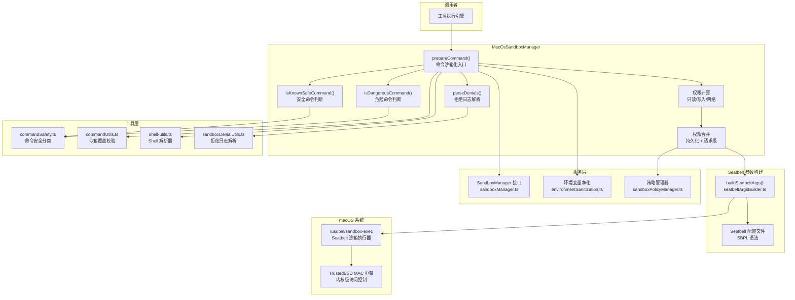

# MacOsSandboxManager.ts

## 概述

`MacOsSandboxManager.ts` 是 Gemini CLI 在 **macOS 平台**上的沙箱管理器实现。它基于 macOS 内置的 **Seatbelt (sandbox-exec)** 沙箱机制，为 AI 代理执行的 shell 命令提供文件系统访问控制、网络隔离等安全防护。

与 Linux 版本（基于 Bubblewrap + seccomp）不同，macOS 版本利用了 Apple 的 TrustedBSD 强制访问控制（MAC）框架。该类实现了 `SandboxManager` 接口，核心任务是将原始命令请求转换为通过 `/usr/bin/sandbox-exec` 执行的沙箱化命令。

**源文件路径**: `packages/core/src/sandbox/macos/MacOsSandboxManager.ts`

## 架构图（Mermaid）



## 核心组件

### 1. `MacOsSandboxOptions` 接口

```typescript
export interface MacOsSandboxOptions extends GlobalSandboxOptions {
  modeConfig?: {
    readonly?: boolean;      // 是否为只读模式，默认 true
    network?: boolean;       // 是否允许网络访问
    approvedTools?: string[];// 预批准的工具列表
    allowOverrides?: boolean;// 是否允许策略覆盖
  };
  policyManager?: SandboxPolicyManager; // 持久化策略管理器
}
```

扩展了 `GlobalSandboxOptions`，添加了 macOS 沙箱的模式配置。与 Linux 版本的 `LinuxSandboxOptions` 结构完全一致，保持了跨平台的配置一致性。

### 2. `MacOsSandboxManager` 类

实现了 `SandboxManager` 接口。

#### 2.1 `isKnownSafeCommand(args: string[]): boolean`

判断命令是否已知安全。与 Linux 版本不同的是，macOS 版本**额外检查了 `approvedTools` 列表**：

```typescript
isKnownSafeCommand(args: string[]): boolean {
  const toolName = args[0];
  const approvedTools = this.options.modeConfig?.approvedTools ?? [];
  if (toolName && approvedTools.includes(toolName)) {
    return true;  // 在批准列表中的工具视为安全
  }
  return isKnownSafeCommand(args);  // 回退到通用安全命令检查
}
```

这意味着在 macOS 上，用户配置的 `approvedTools` 中的工具会被直接视为"已知安全"，跳过更严格的安全检查。

#### 2.2 `isDangerousCommand(args: string[]): boolean`

直接委托给 `commandSafety.ts` 中的 `isDangerousCommand()`。

#### 2.3 `parseDenials(result: ShellExecutionResult): ParsedSandboxDenial | undefined`

委托给 `parsePosixSandboxDenials()`，解析 Seatbelt 的沙箱拒绝日志（通常出现在 stderr 中）。

#### 2.4 `prepareCommand(req: SandboxRequest): Promise<SandboxedCommand>`（核心方法）

将原始命令请求转换为沙箱化命令。执行流程：

**步骤 1 — 初始化 Shell 解析器**：
```typescript
await initializeShellParsers();
```
确保 tree-sitter 等 shell 语法解析器已加载（用于后续的命令名提取）。

**步骤 2 — 环境变量净化**：
```typescript
const sanitizationConfig = getSecureSanitizationConfig(req.policy?.sanitizationConfig);
const sanitizedEnv = sanitizeEnvironment(req.env, sanitizationConfig);
```
清除敏感环境变量（如 API key、token 等）。

**步骤 3 — 权限计算**：
- `isReadonlyMode`：默认 `true`，只读模式
- `allowOverrides`：默认 `true`，允许策略覆盖
- `verifySandboxOverrides()`：在不允许覆盖时拒绝覆盖尝试
- `isStrictlyApproved()`：检查命令是否被严格批准
- `workspaceWrite`：只有非只读模式或已批准工具才能写入工作区
- `defaultNetwork`：网络权限来自全局配置或请求策略

**步骤 4 — 权限合并**：
```typescript
const mergedAdditional: SandboxPermissions = {
  fileSystem: {
    read: [...persistentPermissions?.fileSystem?.read, ...requestPermissions?.fileSystem?.read],
    write: [...persistentPermissions?.fileSystem?.write, ...requestPermissions?.fileSystem?.write],
  },
  network: defaultNetwork || persistentPermissions?.network || requestPermissions?.network,
};
```
合并来自两个来源的权限：
- **持久化权限**（`policyManager.getCommandPermissions()`）：基于命令名的长期权限
- **请求级权限**（`req.policy?.additionalPermissions`）：单次请求附带的权限

**步骤 5 — 构建 Seatbelt 参数**：
```typescript
const sandboxArgs = buildSeatbeltArgs({
  workspace, allowedPaths, forbiddenPaths,
  networkAccess, workspaceWrite, additionalPermissions,
});
```
委托给 `seatbeltArgsBuilder.ts` 生成 Seatbelt 配置参数。

**步骤 6 — 返回沙箱化命令**：
```typescript
return {
  program: '/usr/bin/sandbox-exec',
  args: [...sandboxArgs, '--', req.command, ...req.args],
  env: sanitizedEnv,
  cwd: req.cwd,
};
```

## 依赖关系

### 内部依赖

| 依赖模块 | 导入内容 | 用途 |
|----------|----------|------|
| `../../services/sandboxManager.js` | `SandboxManager`, `SandboxRequest`, `SandboxedCommand`, `SandboxPermissions`, `GlobalSandboxOptions`, `ParsedSandboxDenial` | 沙箱管理器接口和类型定义 |
| `../../services/shellExecutionService.js` | `ShellExecutionResult` | Shell 执行结果类型 |
| `../../services/environmentSanitization.js` | `sanitizeEnvironment`, `getSecureSanitizationConfig` | 环境变量安全净化 |
| `./seatbeltArgsBuilder.js` | `buildSeatbeltArgs` | 构建 Seatbelt 沙箱参数（同目录下的核心依赖） |
| `../../utils/shell-utils.js` | `initializeShellParsers`, `getCommandName` | Shell 解析器初始化和命令名提取 |
| `../utils/commandSafety.js` | `isKnownSafeCommand`, `isDangerousCommand`, `isStrictlyApproved` | 命令安全性分类和审批检查 |
| `../../policy/sandboxPolicyManager.js` | `SandboxPolicyManager` | 持久化沙箱策略管理 |
| `../utils/commandUtils.js` | `verifySandboxOverrides` | 沙箱覆盖策略校验 |
| `../utils/sandboxDenialUtils.js` | `parsePosixSandboxDenials` | POSIX 沙箱拒绝日志解析 |

### 外部依赖

| 依赖 | 用途 |
|------|------|
| **/usr/bin/sandbox-exec** | macOS 系统内置的 Seatbelt 沙箱执行器，基于 Apple 的 TrustedBSD MAC 框架 |

该文件没有直接依赖任何 Node.js 内置模块或第三方 npm 包。所有文件系统和路径操作都委托给了 `seatbeltArgsBuilder.ts`。

## 关键实现细节

1. **与 Linux 版本的对比**：
   - Linux 版本（`LinuxSandboxManager`）有 ~460 行代码，直接构建 bwrap 参数 + seccomp BPF 字节码
   - macOS 版本只有 ~138 行代码，大部分复杂性委托给了 `buildSeatbeltArgs()`
   - 这体现了不同的设计取舍：Linux 版本将参数构建内联，macOS 版本将其抽取到独立模块

2. **Shell 解析器预初始化**：macOS 版本在 `prepareCommand()` 开头调用 `await initializeShellParsers()`，而 Linux 版本没有。这是因为 macOS 版本使用了 `getCommandName()` 来自 `shell-utils.ts`（需要 tree-sitter），而 Linux 版本使用了来自 `commandUtils.ts` 的不同实现。

3. **`isKnownSafeCommand` 的差异**：macOS 版本额外将 `approvedTools` 列表中的工具视为"已知安全"，这是一个 macOS 特有的行为。Linux 版本没有这个逻辑。

4. **sandbox-exec 命令格式**：最终生成的命令格式为：
   ```
   /usr/bin/sandbox-exec <seatbelt-args> -- <原始命令> <原始参数>
   ```
   其中 `--` 分隔符确保 seatbelt 参数和用户命令不会混淆。

5. **最小权限原则**：与 Linux 版本一致，默认只读模式，只有明确批准的工具才能获得写权限。网络默认关闭。

6. **策略校验顺序**：`verifySandboxOverrides()` 在权限计算之前调用，确保在不允许覆盖的模式下（如 plan 模式），任何覆盖尝试都会被立即拒绝，而不是在后续处理中悄悄忽略。

7. **权限合并的优先级**：持久化权限和请求级权限是**并集关系**（通过数组展开合并），而不是覆盖关系。这意味着两个来源的权限都会被尊重。
