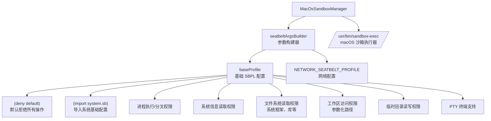
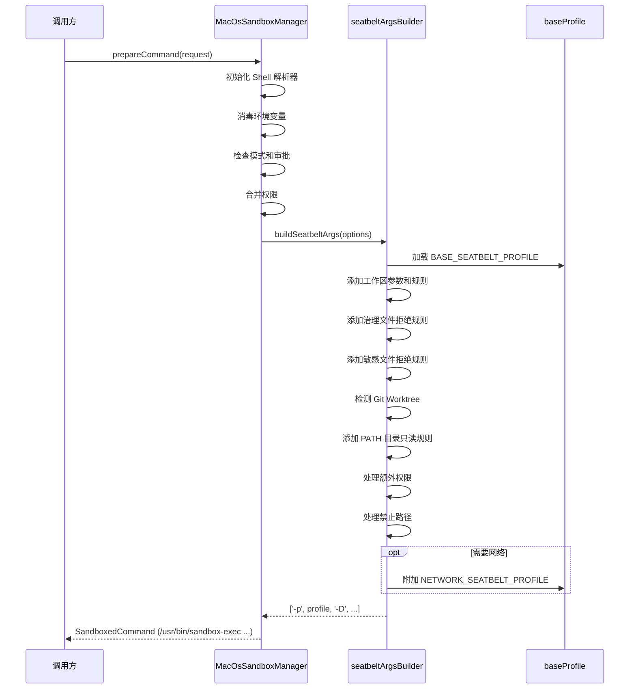

# macos

## 概述

`macos` 目录包含 macOS 平台的沙箱管理器实现。`MacOsSandboxManager` 使用 macOS 内建的 **Seatbelt (sandbox-exec)** 机制，通过 SBPL (Seatbelt Profile Language) 策略文件对命令执行进行细粒度的权限控制。Seatbelt 在内核层面强制执行访问控制策略，能有效限制文件系统访问、网络通信和系统调用。

## 目录结构

```
macos/
├── MacOsSandboxManager.ts        # macOS 沙箱管理器实现
├── MacOsSandboxManager.test.ts   # 单元测试
├── baseProfile.ts                # Seatbelt SBPL 基础安全配置
├── seatbeltArgsBuilder.ts        # Seatbelt 参数和配置构建器
└── seatbeltArgsBuilder.test.ts   # 参数构建器单元测试
```

## 架构图



## 核心组件

### MacOsSandboxManager

实现 `SandboxManager` 接口，使用 `/usr/bin/sandbox-exec` 执行沙箱化命令。

| 方法 | 说明 |
|------|------|
| `prepareCommand(req)` | 构建 sandbox-exec 命令参数 |
| `isKnownSafeCommand(args)` | 检查已批准工具列表和 POSIX 安全命令 |
| `isDangerousCommand(args)` | 委托给 `utils/commandSafety` |
| `parseDenials(result)` | 使用 POSIX 拒绝解析器 |

**执行流程：**
1. 初始化 Shell 解析器
2. 消毒环境变量
3. 检查读写模式和审批状态
4. 合并权限（持久化 + 请求的权限）
5. 调用 `buildSeatbeltArgs` 构建 Seatbelt 参数
6. 返回 `sandbox-exec` 包装的命令

### baseProfile.ts（SBPL 基础配置）

定义两个关键的 Seatbelt 配置常量：

**`BASE_SEATBELT_PROFILE`** - 基础安全配置，采用**默认拒绝**策略：
- 导入 `system.sb` 系统基础配置
- 允许进程执行和分叉
- 允许读取系统框架、库和二进制文件
- 允许读取工作区（参数化路径 `WORKSPACE`）
- 允许读写临时目录和 `/dev/null`
- 允许特定 sysctl 读取（CPU 信息、内核信息等）
- 允许 PTY 终端支持
- 允许 Mach 端口查找（系统服务通信）
- 允许 Python 多进程 POSIX 信号量

**`NETWORK_SEATBELT_PROFILE`** - 网络访问配置（按需附加）：
- 允许出站/入站/绑定网络操作
- 允许 DNS 解析相关 Mach 端口
- 允许 TLS 证书验证服务

### seatbeltArgsBuilder.ts（参数构建器）

`buildSeatbeltArgs` 函数负责动态构建 Seatbelt 配置和命令行参数：

| 功能 | 实现方式 |
|------|----------|
| 工作区访问 | 参数化 `WORKSPACE` 路径，按模式选择读/写权限 |
| 治理文件保护 | 为每个治理文件生成 `(deny file-write*)` 规则 |
| 敏感文件屏蔽 | 使用正则表达式规则匹配 .env 等文件并拒绝访问 |
| Git Worktree | 自动检测并授予 worktree 目录读写权限 |
| PATH 目录 | 遍历 `$PATH` 目录授予只读权限（支持 nvm、homebrew） |
| 额外路径 | 处理 `allowedPaths`、`additionalPermissions` 中的路径 |
| 禁止路径 | 为每个禁止路径生成 `(deny file-read* file-write*)` 规则 |
| 网络配置 | 按需附加 `NETWORK_SEATBELT_PROFILE` |

**安全设计：**
- 使用 `-D` 参数传递路径，避免字符串插值漏洞
- 路径通过 `tryRealpath` 规范化，防止符号链接逃逸
- 正则表达式转义防止注入

## 依赖关系

### 内部依赖

| 模块 | 用途 |
|------|------|
| `services/sandboxManager` | `SandboxManager` 接口、共享常量 |
| `services/environmentSanitization` | 环境变量消毒 |
| `policy/sandboxPolicyManager` | 持久化权限管理 |
| `sandbox/utils/commandSafety` | POSIX 命令安全检查 |
| `sandbox/utils/commandUtils` | 验证沙箱覆盖权限 |
| `sandbox/utils/fsUtils` | 路径规范化和 Git Worktree 检测 |
| `sandbox/utils/sandboxDenialUtils` | POSIX 沙箱拒绝解析 |
| `utils/shell-utils` | Shell 解析器初始化、命令名称提取 |

### 外部依赖

| 包 | 用途 |
|---|------|
| `node:fs` | 文件系统操作 |
| `node:os` | 临时目录获取 |
| `node:path` | 路径处理 |

## 数据流


