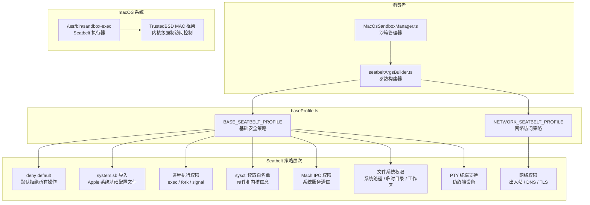

# baseProfile.ts

## 概述

`baseProfile.ts` 定义了 macOS Seatbelt 沙箱的 **SBPL (Seatbelt Profile Language) 配置文件**。它包含两个核心常量：`BASE_SEATBELT_PROFILE`（基础安全策略）和 `NETWORK_SEATBELT_PROFILE`（网络访问策略），这些 SBPL 配置会被 `sandbox-exec` 命令加载，控制沙箱内进程可以执行哪些操作。

该文件采用**默认拒绝（deny default）+ 显式白名单**的安全策略模型，只允许必要的系统调用、文件访问和 IPC 通信，是 macOS 沙箱安全的核心配置文件。

**源文件路径**: `packages/core/src/sandbox/macos/baseProfile.ts`

## 架构图（Mermaid）



## 核心组件

### 1. `BASE_SEATBELT_PROFILE` 常量

这是基础 Seatbelt 配置文件，以 SBPL（Seatbelt Profile Language，Scheme 风格的策略语言）编写。该配置采用**默认拒绝**策略，然后逐条放开必要的权限。

#### 1.1 策略基础

```scheme
(version 1)           ; SBPL 版本 1
(deny default)        ; 默认拒绝所有操作
(import "system.sb")  ; 导入 Apple 系统基础配置
```

- `(deny default)`：所有未明确允许的操作都会被拒绝。这是最严格的安全基线。
- `(import "system.sb")`：导入 Apple 官方的系统基础配置文件，处理未文档化的内部依赖、sysctl 和 IPC Mach 端口，避免标准工具出现 "Abort trap: 6" 错误。

#### 1.2 进程执行权限

```scheme
(allow process-exec)                    ; 允许执行进程
(allow process-fork)                    ; 允许 fork 子进程
(allow signal (target same-sandbox))    ; 允许向同沙箱内进程发送信号
(allow process-info*)                   ; 允许查询进程信息
```

这些是执行 shell 命令的最基本权限。`signal` 限定为 `same-sandbox`，防止沙箱内进程向外部进程发送信号。

#### 1.3 `/dev/null` 写入权限

```scheme
(allow file-write-data
  (require-all
    (path "/dev/null")
    (vnode-type CHARACTER-DEVICE)))
```

只允许写入 `/dev/null` 字符设备。使用 `require-all` 双重条件（路径 + vnode 类型）防止符号链接攻击。

#### 1.4 sysctl 读取白名单

允许读取的 sysctl 参数分为以下几类：

| 分类 | sysctl 参数示例 | 用途 |
|------|-----------------|------|
| **硬件信息** | `hw.activecpu`, `hw.memsize`, `hw.ncpu`, `hw.pagesize` | CPU 核心数、内存大小、页面大小等 |
| **CPU 特性** | `hw.cpufamily`, `hw.cputype`, `hw.optional.arm.*` | CPU 架构和可选指令集特性 |
| **缓存信息** | `hw.cachelinesize_compat`, `hw.l1dcachesize_compat` | L1/L2/L3 缓存大小 |
| **频率信息** | `hw.cpufrequency_compat`, `hw.busfrequency_compat` | CPU 和总线频率 |
| **内核信息** | `kern.osversion`, `kern.osrelease`, `kern.hostname` | 操作系统版本、主机名 |
| **进程限制** | `kern.maxfilesperproc`, `kern.maxproc`, `kern.argmax` | 文件描述符和进程上限 |
| **路由表** | `net.routetable.*` | 网络路由信息（前缀匹配） |
| **性能等级** | `hw.perflevel*`, `hw.nperflevels` | Apple Silicon 性能核/能效核信息 |

允许写入的 sysctl：
- `kern.grade_cputype`：CPU 类型分级（用于 Rosetta 2 兼容性）

#### 1.5 Mach IPC 权限

| Mach 服务 | 用途 |
|-----------|------|
| `com.apple.sysmond` | 系统监控守护进程 |
| `com.apple.system.opendirectoryd.libinfo` | 目录服务（用户/组解析） |
| `com.apple.PowerManagement.control` | 电源管理 |

#### 1.6 IOKit 权限

```scheme
(allow iokit-open
  (iokit-registry-entry-class "RootDomainUserClient"))
```

允许打开 `RootDomainUserClient` IOKit 客户端，通常用于电源状态查询。

#### 1.7 POSIX 信号量

```scheme
(allow ipc-posix-sem)
```

允许 POSIX 信号量操作，这是 **Python multiprocessing** 模块在 macOS 上所需的（用于 `SemLock`）。

#### 1.8 PTY 终端支持

```scheme
(allow pseudo-tty)
(allow file-read* file-write* file-ioctl (literal "/dev/ptmx"))
(allow file-read* file-write*
  (require-all
    (regex #"^/dev/ttys[0-9]+")
    (extension "com.apple.sandbox.pty")))
(allow file-ioctl (regex #"^/dev/ttys[0-9]+"))
```

允许创建和操作伪终端（PTY），这是交互式 shell 命令执行所必需的。`/dev/ptmx` 是 PTY 主设备，`/dev/ttys*` 是从设备。

#### 1.9 文件系统读取权限

| 路径 | 类型 | 用途 |
|------|------|------|
| `/System` | 子路径 | macOS 系统框架和库 |
| `/usr/lib` | 子路径 | 系统共享库 |
| `/usr/share` | 子路径 | 系统共享数据 |
| `/usr/bin` | 子路径 | 系统二进制工具 |
| `/bin` | 子路径 | 基础二进制工具 |
| `/sbin` | 子路径 | 系统管理工具 |
| `/usr/local/bin` | 子路径 | 用户安装的工具 |
| `/opt/homebrew` | 子路径 | Homebrew 安装的包（Apple Silicon） |
| `/Library` | 子路径 | 系统级库和框架 |
| `/private/var/run` | 子路径 | 运行时数据 |
| `/private/var/db` | 子路径 | 系统数据库 |
| `/private/etc` | 子路径 | 系统配置文件 |

#### 1.10 临时目录和设备节点（读写）

```scheme
(allow file-read* file-write*
  (literal "/dev/null")
  (literal "/dev/zero")
  (subpath "/tmp")
  (subpath "/private/tmp")
  (subpath (param "TMPDIR")))
```

允许读写临时目录和空设备。`TMPDIR` 是参数化的，由 `seatbeltArgsBuilder` 在运行时传入。

#### 1.11 工作区读取权限

```scheme
(allow file-read*
  (subpath (param "WORKSPACE")))
```

默认允许读取工作区目录。`WORKSPACE` 是参数化的，由 `seatbeltArgsBuilder` 传入实际路径。写入权限是可选的，由 `seatbeltArgsBuilder` 根据权限决策动态追加。

### 2. `NETWORK_SEATBELT_PROFILE` 常量

网络访问策略，仅在启用网络权限时追加到基础配置文件之后。

#### 2.1 网络套接字权限

```scheme
(allow network-outbound)   ; 出站连接
(allow network-inbound)    ; 入站连接
(allow network-bind)       ; 绑定端口

(allow system-socket
  (require-all
    (socket-domain AF_SYSTEM)
    (socket-protocol 2)))   ; 系统套接字（AF_SYSTEM 域，协议 2）
```

#### 2.2 网络相关的 Mach 服务

| Mach 服务 | 用途 |
|-----------|------|
| `com.apple.bsd.dirhelper` | 目录帮助器 |
| `com.apple.system.opendirectoryd.membership` | 组成员关系查询 |
| `com.apple.SecurityServer` | 安全服务器（密钥链访问） |
| `com.apple.networkd` | 网络守护进程 |
| `com.apple.ocspd` | OCSP 证书验证 |
| `com.apple.trustd.agent` | TLS 证书信任代理 |
| `com.apple.mDNSResponder` | DNS 解析（mDNS） |
| `com.apple.mDNSResponderHelper` | DNS 解析辅助 |
| `com.apple.SystemConfiguration.DNSConfiguration` | DNS 配置 |
| `com.apple.SystemConfiguration.configd` | 系统配置守护进程 |

#### 2.3 网络 sysctl

```scheme
(allow sysctl-read
  (sysctl-name-regex #"^net.routetable"))
```

允许读取路由表信息。

## 依赖关系

### 内部依赖

该文件**没有内部依赖**——它不导入任何其他模块。它是一个纯粹的常量定义文件。

### 外部依赖

该文件**没有外部依赖**——不导入任何 Node.js 内置模块或第三方包。

**被依赖方**：
- `seatbeltArgsBuilder.ts` 导入并使用 `BASE_SEATBELT_PROFILE` 和 `NETWORK_SEATBELT_PROFILE`

## 关键实现细节

1. **默认拒绝策略**：`(deny default)` 确保任何未明确放行的操作都会被拒绝。这是零信任安全模型的基石——只有被白名单明确列出的操作才能执行。

2. **`system.sb` 导入的必要性**：如果不导入 Apple 的基础系统配置，许多标准命令行工具会因为缺少必要的 Mach 端口和 sysctl 权限而崩溃（表现为 "Abort trap: 6"）。`system.sb` 处理了大量未文档化的系统内部依赖。

3. **参数化路径**：`WORKSPACE` 和 `TMPDIR` 使用 `(param "...")` 语法参数化，避免硬编码路径。这些参数在运行时由 `seatbeltArgsBuilder.ts` 通过 `-D` 标志传入 `sandbox-exec`。

4. **符号链接攻击防护**：对 `/dev/null` 的写入权限使用了 `require-all` 组合条件（路径 + vnode 类型），防止攻击者通过创建指向 `/dev/null` 的符号链接来绕过写入限制。

5. **Apple Silicon 支持**：sysctl 白名单包含了 `hw.optional.arm.*`、`hw.optional.armv8_*`、`hw.perflevel*` 等 ARM 架构特有的参数，确保在 Apple Silicon Mac 上正常运行。

6. **Python 多进程支持**：特别添加了 `(allow ipc-posix-sem)` 以支持 Python 的 `multiprocessing` 模块，说明该沙箱设计考虑了 Python 工具链的使用场景。

7. **网络策略的可组合性**：网络权限被分离到 `NETWORK_SEATBELT_PROFILE` 中，作为可选的叠加层。只有在明确请求网络访问时才会追加，实现了权限的按需授予。

8. **Homebrew 路径支持**：白名单中包含 `/opt/homebrew`（Apple Silicon 上 Homebrew 的默认安装路径），确保通过 Homebrew 安装的开发工具（如 `git`、`python` 等）可以在沙箱内正常运行。

9. **PTY 支持的安全约束**：`/dev/ttys*` 的读写权限额外要求 `com.apple.sandbox.pty` 扩展权限，这是 macOS 沙箱的特有机制，确保只有通过合法途径获取的 PTY 才能被访问。

10. **SBPL 语法说明**：SBPL 使用 Scheme/Lisp 风格的 S-表达式语法，主要构造有：
    - `(allow <operation> <filter>)`：允许匹配过滤器的操作
    - `(deny <operation>)`：拒绝操作
    - `(subpath <path>)`：匹配路径及其所有子路径
    - `(literal <path>)`：精确匹配路径
    - `(regex <pattern>)`：正则匹配路径
    - `(require-all <conditions>)`：所有条件必须同时满足
    - `(param <name>)`：引用运行时参数
