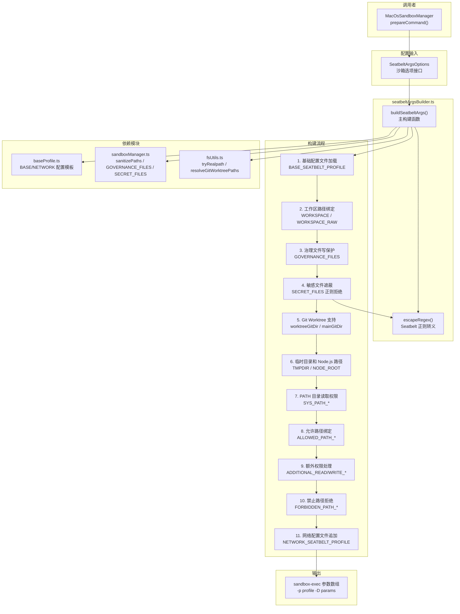

# seatbeltArgsBuilder.ts

## 概述

`seatbeltArgsBuilder.ts` 是 macOS Seatbelt 沙箱的**参数构建器**，负责将高层的沙箱选项（工作区路径、允许/禁止路径、网络权限等）转换为 `sandbox-exec` 命令所需的完整参数列表。它动态生成 SBPL（Seatbelt Profile Language）配置文件内容，并通过 `-D` 标志安全地传递参数化路径，避免字符串插值漏洞。

该文件是 `MacOsSandboxManager` 和 `baseProfile.ts` 之间的桥梁——它读取基础配置模板，根据运行时选项追加额外的 SBPL 规则，最终输出完整的 `sandbox-exec` 命令参数。

**源文件路径**: `packages/core/src/sandbox/macos/seatbeltArgsBuilder.ts`

## 架构图（Mermaid）



## 核心组件

### 1. `SeatbeltArgsOptions` 接口

```typescript
export interface SeatbeltArgsOptions {
  workspace: string;                         // 主工作区路径
  allowedPaths?: string[];                   // 额外允许的路径
  forbiddenPaths?: string[];                 // 显式禁止的路径（覆盖白名单）
  networkAccess?: boolean;                   // 是否允许网络访问
  additionalPermissions?: SandboxPermissions; // 细粒度额外权限
  workspaceWrite?: boolean;                  // 是否允许工作区写入
}
```

这是 `buildSeatbeltArgs()` 的输入参数类型，封装了所有影响沙箱配置的选项。

### 2. `buildSeatbeltArgs(options: SeatbeltArgsOptions): string[]`（核心函数）

这是文件的核心导出函数，执行以下 11 个步骤来构建 `sandbox-exec` 参数：

#### 步骤 1 — 加载基础配置文件

```typescript
let profile = BASE_SEATBELT_PROFILE + '\n';
```

以 `baseProfile.ts` 中的 `BASE_SEATBELT_PROFILE` 为起点，后续步骤在此基础上追加规则。

#### 步骤 2 — 工作区路径绑定

```typescript
args.push('-D', `WORKSPACE=${workspacePath}`);       // realpath 解析后的路径
args.push('-D', `WORKSPACE_RAW=${options.workspace}`); // 原始路径（可能含符号链接）
profile += `(allow file-read* (subpath (param "WORKSPACE_RAW")))\n`;
if (options.workspaceWrite) {
  profile += `(allow file-write* (subpath (param "WORKSPACE_RAW")))\n`;
  profile += `(allow file-write* (subpath (param "WORKSPACE")))\n`;
}
```

关键设计：同时绑定 realpath 和原始路径，确保符号链接场景下两条路径都能正确访问。基础配置中已有 `WORKSPACE` 的读取权限（`baseProfile.ts` 中定义），此处额外添加 `WORKSPACE_RAW` 的读权限和可选的写权限。

#### 步骤 3 — 治理文件写保护

```typescript
for (let i = 0; i < GOVERNANCE_FILES.length; i++) {
  // 根据实际类型（目录/文件）选择 subpath 或 literal
  const ruleType = isDirectory ? 'subpath' : 'literal';
  profile += `(deny file-write* (${ruleType} (param "GOVERNANCE_FILE_${i}")))\n`;
}
```

遍历 `GOVERNANCE_FILES` 列表，为每个治理文件（如 `.gemini/`, `GEMINI.md` 等）生成写入拒绝规则。关键细节：

- 在工作区允许规则**之后**添加拒绝规则（Seatbelt 后定义的规则优先级更高）
- 对目录使用 `subpath`，对文件使用 `literal`
- 同时处理 realpath 和原始路径

#### 步骤 4 — 敏感文件遮蔽

```typescript
for (const basePath of searchPaths) {
  for (const secret of SECRET_FILES) {
    // 生成正则规则拒绝读写
    profile += `(deny file-read* file-write* (regex #"${regexPattern}"))\n`;
  }
}
```

使用正则表达式拒绝读写 `.env`、`.env.*` 等敏感文件。与 Linux 版本使用 `find` 命令搜索文件不同，macOS 版本使用 **Seatbelt 原生正则规则**，无需实际扫描文件系统。

正则模式示例：
- `.env` → `^/path/to/workspace/(.*/)?\.env$`
- `.env.*` → `^/path/to/workspace/(.*/)?\.env\.[^/]+$`

`(.*/)?` 部分匹配任意深度的子目录，确保嵌套的敏感文件也被屏蔽。

#### 步骤 5 — Git Worktree 支持

```typescript
const { worktreeGitDir, mainGitDir } = resolveGitWorktreePaths(workspacePath);
if (worktreeGitDir) {
  profile += `(allow file-read* file-write* (subpath (param "WORKTREE_GIT_DIR")))\n`;
}
```

自动检测 Git worktree 结构，为 worktree 的 git 目录和主 git 目录授予读写权限。

#### 步骤 6 — 临时目录和 Node.js 路径

```typescript
args.push('-D', `TMPDIR=${tmpPath}`);
args.push('-D', `NODE_ROOT=${nodeRootPath}`);
profile += `(allow file-read* (subpath (param "NODE_ROOT")))\n`;
```

- `TMPDIR`：传递给基础配置中的参数化临时目录规则
- `NODE_ROOT`：Node.js 安装根目录（`process.execPath` 向上两级），授予只读权限

#### 步骤 7 — PATH 目录读取权限

```typescript
const paths = process.env['PATH'].split(':');
for (const p of paths) {
  let resolved = tryRealpath(p);
  if (resolved.endsWith('/bin')) {
    resolved = path.dirname(resolved);  // 提升到父目录
  }
  args.push('-D', `SYS_PATH_${pathIndex}=${resolved}`);
  profile += `(allow file-read* (subpath (param "SYS_PATH_${pathIndex}")))\n`;
}
```

遍历 `PATH` 环境变量中的所有目录，为每个目录授予只读权限。关键优化：如果路径以 `/bin` 结尾，自动提升到父目录，以支持通过符号链接引用的资源（如 Homebrew 的 Cellar 目录）。使用 `Set` 去重避免重复规则。

#### 步骤 8 — 允许路径绑定

```typescript
for (let i = 0; i < allowedPaths.length; i++) {
  profile += `(allow file-read* file-write* (subpath (param "ALLOWED_PATH_${i}")))\n`;
}
```

为策略中指定的额外允许路径授予完整的读写权限。

#### 步骤 9 — 额外细粒度权限

```typescript
// 额外读权限
if (isFile) {
  profile += `(allow file-read* (literal (param "${paramName}")))\n`;
} else {
  profile += `(allow file-read* (subpath (param "${paramName}")))\n`;
}

// 额外写权限
if (isFile) {
  profile += `(allow file-read* file-write* (literal (param "${paramName}")))\n`;
} else {
  profile += `(allow file-read* file-write* (subpath (param "${paramName}")))\n`;
}
```

处理 `additionalPermissions` 中的细粒度权限。对文件使用 `literal`（精确匹配），对目录使用 `subpath`（子路径匹配）。写权限同时包含读权限。

#### 步骤 10 — 禁止路径拒绝

```typescript
for (let i = 0; i < forbiddenPaths.length; i++) {
  profile += `(deny file-read* file-write* (subpath (param "FORBIDDEN_PATH_${i}")))\n`;
}
```

为显式禁止的路径生成读写拒绝规则。这些规则添加在配置文件的后部，利用 Seatbelt 的"后定义优先"规则确保它们能覆盖之前的允许规则。

#### 步骤 11 — 网络配置追加

```typescript
if (options.networkAccess || options.additionalPermissions?.network) {
  profile += NETWORK_SEATBELT_PROFILE;
}
```

只有在明确请求网络访问时，才追加网络相关的 SBPL 规则。

#### 最终输出

```typescript
args.unshift('-p', profile);
return args;
```

将完整的 SBPL 配置作为 `-p` 参数插入到参数数组开头。最终返回的参数数组格式为：

```
['-p', '<完整SBPL配置>', '-D', 'WORKSPACE=...', '-D', 'WORKSPACE_RAW=...', ...]
```

### 3. `escapeRegex(str: string): string`（私有函数）

为 Seatbelt SBPL 正则表达式字面量 `#"..."` 转义特殊字符。

```typescript
function escapeRegex(str: string): string {
  return str.replace(/[.*+?^${}()|[\]\\"]/g, (c) => {
    if (c === '"')  return '\\"';           // 双引号 → \"
    if (c === '\\') return '\\\\\\\\';      // 反斜杠 → \\\\（4个反斜杠）
    return '\\\\' + c;                       // 其他特殊字符 → \\c
  });
}
```

**转义层次解释**：Seatbelt 的正则表达式嵌套在 Scheme 字符串字面量 `#"..."` 中，因此需要双重转义：
1. **Scheme 字符串层**：`\\` → `\`（Scheme 的字符串转义）
2. **正则表达式层**：`\` → 转义下一个字符

所以要在正则引擎中得到一个字面量反斜杠 `\`，需要：
- 正则层需要 `\\`
- Scheme 字符串层需要 `\\\\`
- JavaScript 源码中需要 `\\\\\\\\`（8个反斜杠 → 4个 → 2个 → 1个字面量反斜杠）

## 依赖关系

### 内部依赖

| 依赖模块 | 导入内容 | 用途 |
|----------|----------|------|
| `./baseProfile.js` | `BASE_SEATBELT_PROFILE`, `NETWORK_SEATBELT_PROFILE` | 基础和网络 SBPL 配置模板 |
| `../../services/sandboxManager.js` | `SandboxPermissions`, `sanitizePaths`, `GOVERNANCE_FILES`, `SECRET_FILES` | 权限类型、路径净化、治理文件和敏感文件列表 |
| `../utils/fsUtils.js` | `tryRealpath`, `resolveGitWorktreePaths` | 安全的路径解析和 Git worktree 检测 |

### 外部依赖

| 依赖 | 用途 |
|------|------|
| `node:fs` | 文件系统操作（`existsSync`, `lstatSync`, `statSync`） |
| `node:os` | 获取临时目录（`os.tmpdir()`） |
| `node:path` | 路径操作（`join`, `dirname`） |

## 关键实现细节

1. **参数化防注入**：所有路径都通过 `-D` 标志以参数形式传递给 `sandbox-exec`，在 SBPL 中通过 `(param "NAME")` 引用。这避免了直接将路径字符串插入到 SBPL 配置中可能导致的注入漏洞（例如路径中包含特殊 Scheme 字符 `"`, `(`, `)` 等）。

2. **Seatbelt 规则优先级**：Seatbelt 采用"后定义优先"（last-match-wins）的规则评估策略。代码利用这一特性，先定义工作区允许规则，再定义治理文件拒绝规则和敏感文件拒绝规则，确保保护规则能覆盖更宽泛的允许规则。

3. **双路径绑定模式**：对于工作区路径，同时绑定原始路径（`WORKSPACE_RAW`）和 realpath（`WORKSPACE`）。这是因为用户可能通过符号链接进入工作区，而实际文件操作可能使用解析后的真实路径。

4. **正则 vs 扫描的权衡**：与 Linux 版本使用 `find` 命令扫描敏感文件不同，macOS 版本使用 Seatbelt 原生的正则匹配规则。这样做的优势是：
   - 无需执行外部命令，启动更快
   - 规则在内核层面匹配，覆盖动态创建的文件
   - 不受搜索深度限制

5. **`/bin` 目录提升策略**：当 PATH 中的路径以 `/bin` 结尾时，自动提升到父目录授予读权限。这解决了 Homebrew 等包管理器的符号链接结构（如 `/opt/homebrew/bin/git` → `/opt/homebrew/Cellar/git/2.x.x/bin/git`），确保通过符号链接引用的实际二进制和资源文件都能被读取。

6. **文件/目录智能匹配**：对于额外权限中的路径，通过 `fs.statSync()` 判断是文件还是目录，然后选择 `literal`（精确匹配文件）或 `subpath`（匹配目录及其子路径）。这避免了过度授权——单个文件的权限不会扩展到同级文件。

7. **治理文件类型检测**：对于治理文件，先使用 `GOVERNANCE_FILES` 中的默认值（`isDirectory`），然后尝试通过 `fs.lstatSync()` 获取实际类型。使用 `lstatSync`（而非 `statSync`）避免跟随符号链接。

8. **输出格式**：`args.unshift('-p', profile)` 将 SBPL 配置插入参数数组开头，确保 `-p` 是 `sandbox-exec` 的第一个参数。最终的参数结构为：
   ```
   sandbox-exec -p '<SBPL>' -D 'PARAM1=value1' -D 'PARAM2=value2' ... -- command args
   ```
   其中 `-- command args` 部分由 `MacOsSandboxManager.prepareCommand()` 在调用 `buildSeatbeltArgs()` 后追加。

9. **敏感文件正则的锚定策略**：正则以 `^basePath/` 开头锚定到工作区或允许路径下，而非全局匹配。这避免了误拦截系统目录中合法的 `.env` 文件（如某些系统配置），只屏蔽项目范围内的敏感文件。

10. **`escapeRegex` 的三层转义**：由于字符串经过 JavaScript → Scheme 字符串 → 正则引擎三层解析，转义逻辑需要格外小心。一个字面量 `.` 需要变成 `\\\\.`（JavaScript 中的 4 个反斜杠 + 点号），最终在正则引擎中变成 `\.`（转义的点号）。
