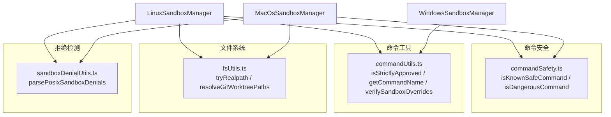
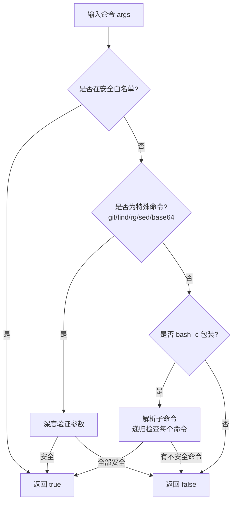
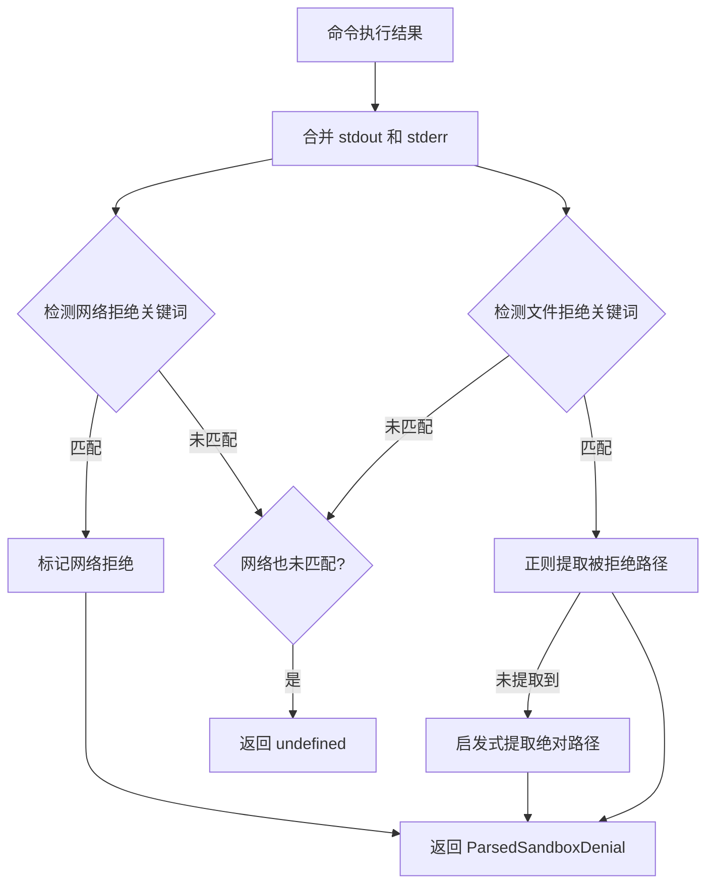

# utils

## 概述

`utils` 目录包含沙箱模块的跨平台共享工具函数。这些工具覆盖命令安全检查、命令解析、文件系统操作和沙箱拒绝检测四个方面，被 Linux、macOS 和 Windows 三个平台的沙箱管理器共同使用。

## 目录结构

```
utils/
├── commandSafety.ts          # POSIX 命令安全检查（安全/危险命令判定）
├── commandUtils.ts           # 命令解析和审批工具（Linux 专用版本）
├── fsUtils.ts                # 文件系统工具（路径规范化、Git Worktree 检测）
├── sandboxDenialUtils.ts     # POSIX 沙箱拒绝检测和路径提取
└── sandboxDenialUtils.test.ts # 拒绝检测单元测试
```

## 架构图



## 核心组件

### commandSafety.ts（POSIX 命令安全检查）

提供两个核心函数，用于 Linux 和 macOS 平台：

**`isKnownSafeCommand(args)`** - 判断命令是否安全（只读）：

安全命令白名单：`cat`、`ls`、`grep`、`head`、`tail`、`wc`、`pwd`、`echo`、`stat`、`which`、`whoami` 等。

针对特定命令进行深度验证：
| 命令 | 检查内容 |
|------|----------|
| `base64` | 禁止 `--output` 输出到文件 |
| `find` | 禁止 `-exec`、`-execdir`、`-delete` 等执行/删除操作 |
| `rg` | 禁止 `--pre`（外部预处理器）、`--search-zip` |
| `git` | 仅允许 `status`、`log`、`diff`、`show`、`branch`（只读模式） |
| `sed` | 仅允许 `sed -n Np` 或 `sed -n M,Np` 打印操作 |

支持 `bash -c "..."` 和 `bash -lc "..."` 包装命令的递归检查。

**`isDangerousCommand(args)`** - 判断命令是否危险：
- `rm -f`、`rm -rf`、`rm -fr` - 强制删除
- `sudo` - 递归检查子命令
- `find -exec`、`find -delete` - 执行/删除操作
- `rg --pre` - 外部程序执行
- `git -c` - 配置覆盖（可用于执行任意代码）
- `base64 --output` - 写入文件

### commandUtils.ts（命令解析和审批工具）

**`isStrictlyApproved(req, approvedTools)`** - Linux 版本的命令审批检查：
- 解析完整命令行并提取命令根（跳过 shell 包装器）
- 检查所有命令根是否在批准列表中
- 回退到检查管道中每个命令是否为安全命令

**`getCommandName(req)`** - 提取命令的主要名称：
- 解析 shell 命令并提取命令根
- 过滤掉 `shopt` 和 `set` 等 shell 配置命令
- 回退到使用 `path.basename`

**`verifySandboxOverrides(allowOverrides, policy)`** - 验证沙箱覆盖：
- 在 Plan 模式（`allowOverrides = false`）下，拒绝任何尝试覆盖网络/文件系统限制的请求
- 抛出错误以阻止权限提升

### fsUtils.ts（文件系统工具）

**`tryRealpath(p)`** - 安全的路径规范化：
- 使用 `fs.realpathSync` 解析符号链接
- 处理 `ENOENT`：递归解析父目录，保留不存在的尾部
- 防止沙箱通过符号链接逃逸

**`resolveGitWorktreePaths(workspacePath)`** - Git Worktree 检测：
- 检查 `.git` 是否为文件（worktree 标志）
- 解析 `gitdir:` 指向的实际 git 目录
- **安全验证**：检查双向链接（gitdir 文件中的反向链接必须指回工作区）
- 支持 submodule 的 `core.worktree` 配置回退
- 返回 worktree git 目录和主 git 目录路径

**`isErrnoException(e)`** - 检查错误是否为 Node.js 文件系统异常。

### sandboxDenialUtils.ts（拒绝检测）

**`parsePosixSandboxDenials(result)`** - 解析 POSIX 系统上的沙箱拒绝：

检测两种拒绝类型：
- **文件拒绝** - 关键词：`operation not permitted`、`vim:e303`、`sandbox_apply` 等
- **网络拒绝** - 关键词：`could not resolve host`、`network is unreachable`、`connection refused` 等

路径提取策略：
1. 使用正则匹配 `path: Operation not permitted` 格式
2. 回退启发式：匹配输出中的绝对路径（排除 `/bin/`、`/usr/bin/`）

## 依赖关系

### 内部依赖

| 模块 | 用途 |
|------|------|
| `services/sandboxManager` | `SandboxRequest` 类型、`ParsedSandboxDenial` 类型 |
| `services/shellExecutionService` | `ShellExecutionResult` 类型 |
| `utils/shell-utils` | Shell 命令解析（`splitCommands`、`stripShellWrapper`、`getCommandRoots`） |

### 外部依赖

| 包 | 用途 |
|---|------|
| `shell-quote` | Shell 命令解析 |
| `node:fs` | 文件系统操作 |
| `node:path` | 路径处理 |

## 数据流

### 命令安全检查流程



### 拒绝检测流程


