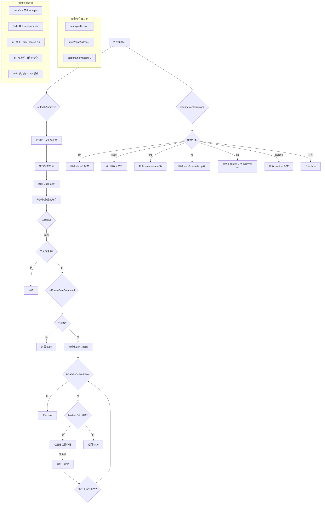

# commandSafety.ts

## 概述

`commandSafety.ts` 是 Gemini CLI 沙箱系统中的**命令安全性评估模块**。它负责判断用户或 AI 代理请求执行的 shell 命令是否安全（只读/无副作用），或者是否属于危险操作需要阻止或要求用户确认。该模块主要用于 macOS 沙箱环境下的命令审核流程，是沙箱安全策略的核心组件之一。

模块导出三个核心函数：
- `isStrictlyApproved`: 判断命令是否严格审批通过（白名单或已知安全命令）
- `isKnownSafeCommand`: 判断命令是否为已知安全命令（只读、无副作用）
- `isDangerousCommand`: 判断命令是否为已知危险命令（破坏性操作）

## 架构图（Mermaid）



## 核心组件

### 1. `isStrictlyApproved(command, args, approvedTools?)` (异步, 导出)

**功能**: 判断命令是否严格通过审批，可在 macOS 沙箱中直接执行。

**参数**:
| 参数 | 类型 | 说明 |
|------|------|------|
| `command` | `string` | 根命令名 |
| `args` | `string[]` | 命令参数列表 |
| `approvedTools` | `string[]` (可选) | 外部配置的审批通过工具列表，如 `['npm', 'git']` |

**处理流程**:
1. 初始化 Shell 解析器（`initializeShellParsers`）
2. 拼接完整命令字符串
3. 调用 `stripShellWrapper` 剥离外层 shell 包装（如 `bash -c "..."`）
4. 调用 `splitCommands` 按管道符 `|`、逻辑与 `&&`、逻辑或 `||`、分号 `;` 分割
5. 对每一段命令进行检查：根命令是否在白名单 `approvedTools` 中，或整段命令是否为已知安全命令
6. 所有段均通过则返回 `true`

**回退逻辑**: 若 `splitCommands` 解析失败（返回空数组），则仅检查根命令。

### 2. `isKnownSafeCommand(args)` (导出)

**功能**: 判断命令是否为已知安全命令（只读、无副作用）。

**处理流程**:
1. 空参数检查
2. 将 `zsh` 标准化为 `bash`（统一处理）
3. 优先尝试 `isSafeToCallWithExec` 直接判定
4. 若命令格式为 `bash -c "..."` 或 `bash -lc "..."`：
   - 检查脚本中是否包含危险操作符 `()` `<` `>`（用正则 `/[()<>]/g`）
   - 分割子命令，逐一用 `isSafeToCallWithExec` 验证
5. 其他格式返回 `false`

### 3. `isSafeToCallWithExec(args)` (内部)

**功能**: 核心安全验证逻辑，对单个命令及其参数进行白名单校验。

**安全命令白名单** (19个):
```
cat, cd, cut, echo, expr, false, grep, head, id, ls,
nl, paste, pwd, rev, seq, stat, tail, tr, true, uname,
uniq, wc, which, whoami, numfmt, tac
```

**深度校验的命令**:

| 命令 | 校验逻辑 |
|------|----------|
| `base64` | 禁止 `-o`、`--output`、`--output=...` 等输出重定向选项 |
| `find` | 禁止 `-exec`、`-execdir`、`-ok`、`-okdir`、`-delete`、`-fls`、`-fprint`、`-fprint0`、`-fprintf` |
| `rg` (ripgrep) | 禁止 `--pre`、`--hostname-bin`（带参数）及 `--search-zip`、`-z`（无参数） |
| `git` | 1) 禁止配置覆盖全局选项；2) 仅允许 `status/log/diff/show/branch` 子命令；3) 子命令参数必须为只读；4) `branch` 需额外验证只读 |
| `sed` | 仅允许 `sed -n {N}p` 或 `sed -n {M,N}p` 格式（行打印） |

### 4. `isDangerousCommand(args)` (导出)

**功能**: 判断命令是否为已知危险命令，应被阻止或需要严格用户确认。

**危险命令判定规则**:

| 命令 | 危险条件 |
|------|----------|
| `rm` | 带 `-f`、`-rf`、`-fr` 标志 |
| `sudo` | 递归检查 `sudo` 后面的子命令 |
| `find` | 包含 `-exec`、`-execdir`、`-ok`、`-okdir`、`-delete`、`-fls`、`-fprint`、`-fprint0`、`-fprintf` |
| `rg` | 包含 `--pre`、`--hostname-bin`、`--search-zip`、`-z` |
| `git` | 包含配置覆盖选项，或子命令参数包含非只读标志 |
| `base64` | 包含 `-o`、`--output` 等输出重定向 |

### 5. Git 安全辅助函数（内部）

#### `findGitSubcommand(args, subcommands)`
- 遍历 git 参数，跳过全局选项（`-C`、`-c`、`--git-dir`、`--work-tree` 等）
- 识别并返回第一个匹配的子命令及其索引位置
- 支持 `=` 连写格式（如 `--git-dir=/path`）和空格分隔格式

#### `gitHasConfigOverrideGlobalOption(args)`
- 检查 git 命令是否包含 `-c` 或 `--config-env` 配置覆盖选项
- 这些选项可被恶意利用执行任意代码

#### `gitSubcommandArgsAreReadOnly(args)`
- 检查子命令参数是否全部为只读
- 不安全标志：`--output`、`--ext-diff`、`--textconv`、`--exec`、`--paginate`

#### `gitBranchIsReadOnly(args)`
- 确保 `git branch` 仅用于列出分支
- 允许的只读标志：`--list`、`-l`、`--show-current`、`-a`、`--all`、`-r`、`--remotes`、`-v`、`-vv`、`--verbose`、`--format=...`
- 出现任何非只读标志的参数则返回 `false`
- 至少需要一个只读标志才返回 `true`（空参数列表除外）

### 6. `isValidSedNArg(arg)` (内部)

**功能**: 验证 `sed -n` 的脚本参数是否为安全的行打印指令。

**合法格式**:
- `Np`：如 `10p`，打印第10行
- `M,Np`：如 `5,10p`，打印第5到第10行

**校验规则**: 必须以 `p` 结尾，前面部分为纯数字或逗号分隔的两个纯数字。

## 依赖关系

### 内部依赖

| 依赖模块 | 导入项 | 用途 |
|----------|--------|------|
| `../../utils/shell-utils.js` | `extractStringFromParseEntry` | 从 shell-quote 解析结果中提取字符串 |
| `../../utils/shell-utils.js` | `initializeShellParsers` | 初始化 shell 解析器（异步） |
| `../../utils/shell-utils.js` | `splitCommands` | 按管道/逻辑操作符/分号分割命令字符串 |
| `../../utils/shell-utils.js` | `stripShellWrapper` | 剥离 `bash -c "..."` 等 shell 包装 |

### 外部依赖

| 依赖包 | 导入项 | 用途 |
|--------|--------|------|
| `shell-quote` | `parse` (别名 `shellParse`) | 解析 shell 命令字符串为 token 数组 |

## 关键实现细节

1. **三层安全模型**: 模块实现了"严格审批 → 已知安全 → 已知危险"三层安全分类模型。命令先尝试匹配严格审批（用户白名单 + 内置安全命令），再判断是否为危险命令，中间地带的命令则需要用户交互确认。

2. **管道命令安全性**: `isStrictlyApproved` 对管道和链式命令进行分段检查，确保每一段都是安全的。单段安全不代表组合安全，但本模块的策略是每段独立判定。

3. **Shell 包装处理**: `isKnownSafeCommand` 能处理 `bash -c "cmd"` 和 `bash -lc "cmd"` 两种包装格式，并递归验证内部脚本的每个子命令。同时对 `zsh` 透明地标准化为 `bash`。

4. **危险操作符拦截**: 在 `bash -c` 包装内部，使用正则 `/[()<>]/g` 拦截子shell `()`、输入重定向 `<` 和输出重定向 `>` 操作符，但允许 `&&`、`||`、`|`、`;` 等命令连接符。

5. **Git 安全的深度防御**:
   - 首先检查全局配置覆盖选项（`-c`/`--config-env`），因为这些可以注入任意配置执行代码
   - 然后识别子命令时需要正确跳过各种全局选项（如 `-C dir`、`--git-dir=path`）
   - 最后对子命令参数进行只读验证
   - `git branch` 需要额外的只读验证，因为它既可以列出分支也可以创建/删除分支

6. **`isDangerousCommand` 与 `isSafeToCallWithExec` 的对称设计**: 两个函数对同一组命令（`rm`、`find`、`rg`、`git`、`base64`）进行互补判定。`isSafeToCallWithExec` 判定"安全"，`isDangerousCommand` 判定"危险"，两者之间可能存在"未知"地带（既不安全也不危险的命令）。

7. **`sudo` 递归检查**: `isDangerousCommand` 对 `sudo` 命令递归调用自身检查后续子命令，确保 `sudo rm -rf /` 也能被正确识别为危险。

8. **`sed` 的极度保守策略**: 仅允许最基本的行打印用法 `sed -n Np` 或 `sed -n M,Np`，最多4个参数，排除了 sed 的所有其他功能（替换、删除、插入等），因为 sed 脚本语言本身具有很强的能力。
