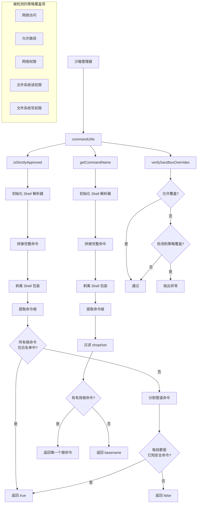

# commandUtils.ts

## 概述

`commandUtils.ts` 是沙箱系统中的**命令工具函数模块**，提供三个实用函数，用于命令审批判定、命令名称提取以及沙箱策略覆盖验证。该模块在命令安全评估流程中处于中间层角色，整合了 shell 解析工具和命令安全性检查模块的能力，为上层沙箱管理器提供简洁的 API。

模块导出三个函数：
- `isStrictlyApproved`: 判断沙箱请求的命令是否严格审批通过
- `getCommandName`: 从沙箱请求中提取主命令名称
- `verifySandboxOverrides`: 验证沙箱策略覆盖是否被允许

## 架构图（Mermaid）

## 核心组件

### 1. `isStrictlyApproved(req, approvedTools?)` (异步, 导出)

**功能**: 判断一个 `SandboxRequest` 中的命令是否严格通过审批，可以不经用户确认直接在沙箱中执行。

**参数**:
| 参数 | 类型 | 说明 |
|------|------|------|
| `req` | `SandboxRequest` | 沙箱执行请求对象，包含 `command` 和 `args` |
| `approvedTools` | `string[]` (可选) | 用户配置的审批通过工具列表 |

**处理流程**:
1. 若 `approvedTools` 为空或未定义，直接返回 `false`
2. 初始化 Shell 解析器
3. 拼接完整命令字符串并剥离 shell 包装
4. **第一层判定**：使用 `getCommandRoots` 提取所有命令根（管道中的每个命令的第一个 token），检查是否全部在 `approvedTools` 白名单中
5. **第二层判定**：若根命令不全在白名单中，分割管道命令，逐段调用 `isKnownSafeCommand` 检查是否为已知安全命令
6. 两层判定均不通过则返回 `false`

**与 `commandSafety.ts` 中同名函数的区别**:
- 本函数接受 `SandboxRequest` 对象而非裸参数
- 当 `approvedTools` 为空时直接返回 `false`（更严格）
- 使用 `getCommandRoots` 做第一层快速判定
- 回退逻辑使用 `isKnownSafeCommand` 而非内联判定

### 2. `getCommandName(req)` (异步, 导出)

**功能**: 从沙箱请求中提取主命令名称，用于日志记录、UI 展示或权限检查。

**参数**:
| 参数 | 类型 | 说明 |
|------|------|------|
| `req` | `SandboxRequest` | 沙箱执行请求对象 |

**处理流程**:
1. 初始化 Shell 解析器
2. 拼接完整命令并剥离 shell 包装
3. 提取命令根列表，过滤掉 `shopt` 和 `set`（shell 内置配置命令，不代表实际执行的命令）
4. 返回过滤后的第一个根命令
5. 若无有效根命令，回退到使用 `path.basename` 提取命令文件名

**设计考量**: 过滤 `shopt` 和 `set` 是因为这些常出现在 `bash -lc "shopt -s ...; actual_command"` 形式的命令中，实际需要展示的是后面的主命令。

### 3. `verifySandboxOverrides(allowOverrides, policy)` (同步, 导出)

**功能**: 验证沙箱请求的策略覆盖是否合法。在计划模式（Plan mode）下，不允许工具覆盖默认的沙箱限制。

**参数**:
| 参数 | 类型 | 说明 |
|------|------|------|
| `allowOverrides` | `boolean` | 是否允许策略覆盖 |
| `policy` | `SandboxRequest['policy']` | 沙箱请求的策略对象 |

**检查的覆盖项**:
- `policy.networkAccess` — 网络访问权限
- `policy.allowedPaths` — 允许的文件路径列表
- `policy.additionalPermissions.network` — 额外网络权限
- `policy.additionalPermissions.fileSystem.read` — 额外文件系统读权限
- `policy.additionalPermissions.fileSystem.write` — 额外文件系统写权限

**行为**: 若 `allowOverrides` 为 `false` 且检测到任何上述覆盖项存在（非空），则抛出 `Error`，错误信息为 `'Sandbox request rejected: Cannot override readonly/network/filesystem restrictions in Plan mode.'`

## 依赖关系

### 内部依赖

| 依赖模块 | 导入项 | 用途 |
|----------|--------|------|
| `../../services/sandboxManager.js` | `SandboxRequest` (类型) | 沙箱请求的类型定义 |
| `../../utils/shell-utils.js` | `getCommandRoots` | 从命令字符串提取所有根命令 |
| `../../utils/shell-utils.js` | `initializeShellParsers` | 异步初始化 shell 解析器 |
| `../../utils/shell-utils.js` | `splitCommands` | 分割管道/链式命令 |
| `../../utils/shell-utils.js` | `stripShellWrapper` | 剥离 shell 包装（如 `bash -c`） |
| `./commandSafety.js` | `isKnownSafeCommand` | 判断命令是否为已知安全命令 |

### 外部依赖

| 依赖包 | 导入项 | 用途 |
|--------|--------|------|
| `shell-quote` | `parse` (别名 `shellParse`) | 解析 shell 命令字符串为 token 数组 |
| `node:path` | `path` | 使用 `path.basename` 提取文件名 |

## 关键实现细节

1. **双层审批策略**: `isStrictlyApproved` 采用两层判定。第一层使用 `getCommandRoots` 快速检查所有根命令是否在白名单中，这是一种高效的快速路径。若不通过，则回退到更细致的第二层——逐段解析并调用 `isKnownSafeCommand` 进行深度安全检查。

2. **Shell 包装透明化**: 三个函数都通过 `stripShellWrapper` 处理了 `bash -c "..."` 等包装格式，确保能正确分析实际执行的命令内容。

3. **计划模式安全保障**: `verifySandboxOverrides` 是一个关键的安全守卫函数。在计划模式（Plan mode）下，AI 代理不应该能够突破沙箱限制（如获取网络访问或写入文件系统），该函数通过显式检查并抛出异常来强制执行此约束。

4. **命令名称提取的健壮性**: `getCommandName` 通过过滤 shell 配置命令（`shopt`、`set`）并提供 `path.basename` 回退机制，确保在各种命令格式下都能提取出有意义的命令名称。

5. **类型安全**: 使用 `SandboxRequest` 类型作为入参，与 `commandSafety.ts` 中直接接受 `string` 和 `string[]` 不同，提供了更好的类型安全性和接口一致性。
