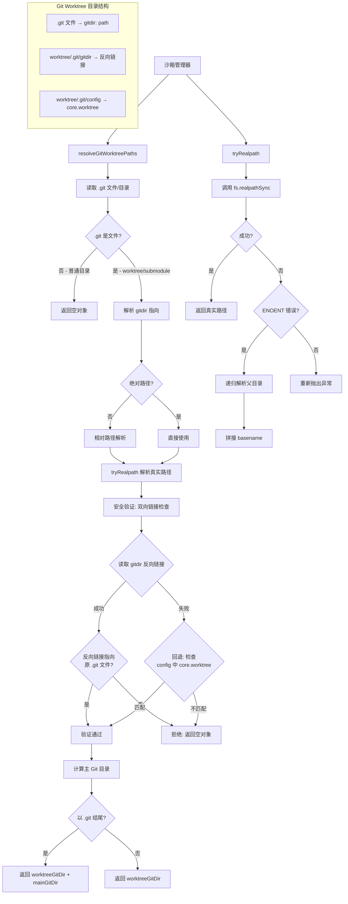

# fsUtils.ts

## 概述

`fsUtils.ts` 是沙箱系统中的**文件系统工具模块**，提供三个实用函数，主要用于安全地解析文件路径和处理 Git worktree（工作树）路径。该模块是沙箱路径配置的基础设施，确保沙箱在配置允许路径时能正确处理符号链接、不存在的路径以及 Git worktree/submodule 的特殊 `.git` 文件结构。

模块导出三个函数：
- `isErrnoException`: 类型守卫，判断异常是否为 Node.js 文件系统错误
- `tryRealpath`: 安全的真实路径解析（支持部分路径不存在）
- `resolveGitWorktreePaths`: 解析 Git worktree/submodule 的 Git 目录路径

## 架构图（Mermaid）



## 核心组件

### 1. `isErrnoException(e)` (导出)

**功能**: TypeScript 类型守卫函数，判断一个未知异常是否为 Node.js 的 `ErrnoException` 类型。

**参数**:
| 参数 | 类型 | 说明 |
|------|------|------|
| `e` | `unknown` | 捕获的异常对象 |

**返回值**: `e is NodeJS.ErrnoException` — 类型谓词，当返回 `true` 时 TypeScript 会将 `e` 的类型收窄为 `NodeJS.ErrnoException`。

**判定条件**: `e` 是 `Error` 实例且包含 `code` 属性。

### 2. `tryRealpath(p)` (导出)

**功能**: 安全地解析文件路径的真实路径（解析符号链接），即使路径的末端部分不存在也能正常工作。

**参数**:
| 参数 | 类型 | 说明 |
|------|------|------|
| `p` | `string` | 需要解析的文件路径 |

**处理流程**:
1. 尝试使用 `fs.realpathSync(p)` 直接解析
2. 若成功，返回解析后的真实路径
3. 若失败且错误码为 `ENOENT`（路径不存在）：
   - 获取父目录 `path.dirname(p)`
   - 检查父目录是否与自身相同（到达根目录，递归终止条件）
   - 递归调用 `tryRealpath(parentDir)` 解析父目录的真实路径
   - 将原路径的文件名 `path.basename(p)` 拼接到解析后的父目录
4. 若为其他错误类型，重新抛出异常

**典型场景**: 路径 `/real/symlinked_dir/nonexistent_file` 中，`symlinked_dir` 是符号链接指向 `/actual/dir`，但 `nonexistent_file` 尚不存在。`tryRealpath` 会递归解析存在的部分，返回 `/actual/dir/nonexistent_file`。

### 3. `resolveGitWorktreePaths(workspacePath)` (导出)

**功能**: 解析 Git worktree 或 submodule 的 Git 目录路径，用于沙箱路径白名单配置。

**参数**:
| 参数 | 类型 | 说明 |
|------|------|------|
| `workspacePath` | `string` | 工作区根路径 |

**返回值**:
```typescript
{
  worktreeGitDir?: string;  // worktree 的 .git 目录路径
  mainGitDir?: string;      // 主仓库的 .git 目录路径
}
```

**处理流程**:

1. **检测 `.git` 类型**: 读取 `workspacePath/.git`，判断是文件还是目录
   - 若为目录：普通 Git 仓库，返回空对象 `{}`
   - 若为文件：Git worktree 或 submodule

2. **解析 `gitdir` 指向**: 从 `.git` 文件中用正则 `/^gitdir:\s+(.+)$/m` 提取 `gitdir` 路径
   - 若为相对路径，相对于 `workspacePath` 解析为绝对路径
   - 使用 `tryRealpath` 解析符号链接

3. **安全验证（双向链接检查）**:
   - **主路径验证**: 读取 `worktreeGitDir/gitdir` 文件，验证其内容（反向链接）指向原 `.git` 文件
   - **回退验证（子模块场景）**: 若反向链接文件不存在，尝试读取 `worktreeGitDir/config`，检查 `core.worktree` 配置项是否指向工作区路径
   - 若两种验证都失败，返回空对象（拒绝）

4. **计算主 Git 目录**: worktree 的 Git 目录通常位于 `主仓库/.git/worktrees/<name>/`，因此主 Git 目录 = `dirname(dirname(worktreeGitDir))`
   - 仅当结果以 `.git` 结尾时才作为 `mainGitDir` 返回

## 依赖关系

### 内部依赖

无。

### 外部依赖

| 依赖包 | 导入项 | 用途 |
|--------|--------|------|
| `node:fs` | `fs` | 文件系统操作：`realpathSync`、`lstatSync`、`readFileSync` |
| `node:path` | `path` | 路径操作：`dirname`、`basename`、`join`、`resolve`、`isAbsolute` |

## 关键实现细节

1. **递归真实路径解析**: `tryRealpath` 的核心设计思路是"尽可能多地解析真实路径"。当完整路径不存在时，它不是简单地返回原路径或抛出错误，而是递归向上找到存在的祖先目录，解析该祖先的真实路径，然后拼接上不存在的尾部路径。这对于沙箱的路径白名单至关重要——即使目标文件尚未创建，也能正确解析其所在目录的符号链接。

2. **递归终止条件**: `tryRealpath` 通过 `parentDir === p` 检测到达文件系统根目录（`/` 或 Windows 的 `C:\`），避免无限递归。

3. **Git Worktree 的安全防御**: `resolveGitWorktreePaths` 实现了**双向链接验证**机制，这是防止沙箱逃逸的关键安全措施：
   - 攻击者可能在 `.git` 文件中写入恶意的 `gitdir` 路径，指向沙箱外的敏感目录
   - 双向验证确保 worktree 目录中存在指回原工作区的反向链接，只有真正的 Git worktree/submodule 才满足此条件
   - 即使反向链接文件不存在（子模块场景），也有 `config` 文件的回退验证

4. **Git Worktree 目录结构理解**:
   - 普通仓库：`.git` 是一个目录，包含所有 Git 对象和配置
   - Worktree：`.git` 是一个文件，内容为 `gitdir: /path/to/main-repo/.git/worktrees/<name>`
   - 子模块：`.git` 也是一个文件，内容为 `gitdir: /path/to/parent/.git/modules/<name>`
   - 主 Git 目录的计算：从 worktree Git 目录向上两级（跳过 `worktrees/<name>`）

5. **错误容忍设计**: 整个 `resolveGitWorktreePaths` 函数被包裹在 try-catch 中，对 `.git` 不存在、不可读等情况静默返回空对象。内部的安全验证也有独立的 try-catch，确保异常不会导致函数崩溃。

6. **`mainGitDir` 的条件返回**: 仅当计算出的主 Git 目录路径以 `.git` 结尾时才返回。这是一个额外的安全检查，防止错误地将非 Git 目录添加到沙箱白名单中。
