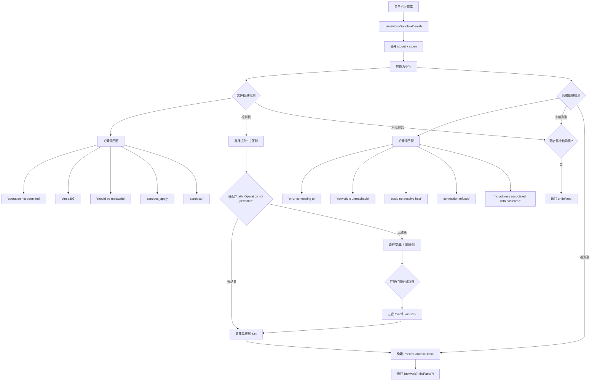

# sandboxDenialUtils.ts

## 概述

`sandboxDenialUtils.ts` 是沙箱系统中的**拒绝事件解析模块**，专门负责从命令执行结果中检测和解析沙箱拒绝（denial）事件。当命令在沙箱环境中执行被操作系统的安全机制阻止时，该模块能从输出和错误信息中识别出拒绝类型（文件访问拒绝或网络访问拒绝），并提取被拒绝访问的文件路径。

这些解析结果可用于向用户展示有意义的错误信息、自动调整沙箱策略、或提示用户授予额外权限。

模块导出一个核心函数：
- `parsePosixSandboxDenials`: 解析 POSIX 风格（macOS/Linux）的沙箱拒绝事件

## 架构图（Mermaid）



## 核心组件

### `parsePosixSandboxDenials(result)` (导出)

**功能**: 从 shell 命令执行结果中检测 POSIX 风格的沙箱拒绝事件，并提取拒绝详情。适用于 macOS（sandbox-exec/App Sandbox）和 Linux（seccomp/AppArmor）环境。

**参数**:
| 参数 | 类型 | 说明 |
|------|------|------|
| `result` | `ShellExecutionResult` | 命令执行结果对象，包含 `output`（stdout）和 `error`（Error 对象） |

**返回值**: `ParsedSandboxDenial | undefined`

```typescript
interface ParsedSandboxDenial {
  network?: boolean;     // 是否为网络拒绝
  filePaths?: string[];  // 被拒绝访问的文件路径列表
}
```

若未检测到任何拒绝事件，返回 `undefined`。

**处理流程**:

#### 第一步：合并输出并检测拒绝类型

将 `result.output`（stdout）与 `result.error?.message`（stderr）合并为一个字符串，转换为小写后进行关键词匹配。

**文件拒绝关键词** (5个):
| 关键词 | 来源/场景 |
|--------|-----------|
| `operation not permitted` | POSIX 标准错误信息，EPERM |
| `vim:e303` | Vim 编辑器无法创建交换文件的错误码 |
| `should be read/write` | 某些程序检测文件系统权限时的输出 |
| `sandbox_apply` | macOS sandbox-exec API 错误 |
| `sandbox: ` | macOS 沙箱系统日志前缀 |

**网络拒绝关键词** (5个):
| 关键词 | 来源/场景 |
|--------|-----------|
| `error connecting to` | 通用连接错误 |
| `network is unreachable` | ENETUNREACH 错误 |
| `could not resolve host` | DNS 解析失败 |
| `connection refused` | ECONNREFUSED 错误 |
| `no address associated with hostname` | DNS 无记录 |

#### 第二步：提取被拒绝的文件路径

使用两阶段正则提取策略：

**主正则（精确匹配）**:
```regex
/(?:^|\s)['"]?(\/[\w.-/]+)['"]?:\s*[Oo]peration not permitted/gi
```
匹配 `'/path/to/file': Operation not permitted` 格式的输出。

**回退正则（启发式匹配）**:
```regex
/(?:^|[\s"'[\]])(\/[a-zA-Z0-9_.-]+(?:\/[a-zA-Z0-9_.-]+)+)(?:$|[\s"'[\]:])/gi
```
当主正则无结果时启用，匹配输出中任意绝对路径。

**路径过滤**: 回退正则会排除 `/bin/` 和 `/usr/bin/` 开头的路径，因为这些是系统命令路径，不是被拒绝访问的目标。

#### 第三步：构建返回结果

```typescript
{
  network: isNetworkDenial || undefined,  // true 或 undefined
  filePaths: filePaths.size > 0 ? Array.from(filePaths) : undefined
}
```

注意：使用 `|| undefined` 确保 `network` 字段在非网络拒绝时为 `undefined` 而非 `false`。

## 依赖关系

### 内部依赖

| 依赖模块 | 导入项 | 用途 |
|----------|--------|------|
| `../../services/sandboxManager.js` | `ParsedSandboxDenial` (类型) | 沙箱拒绝事件的结构化类型定义 |
| `../../services/shellExecutionService.js` | `ShellExecutionResult` (类型) | 命令执行结果的类型定义 |

### 外部依赖

无。

## 关键实现细节

1. **大小写不敏感匹配**: 所有关键词匹配都在 `toLowerCase()` 转换后的合并输出上进行，避免因操作系统或程序输出大小写不一致导致漏检。但路径提取正则使用原始输出（保留大小写），确保提取的路径准确。

2. **双源输出合并**: 同时检查 `result.output`（stdout）和 `result.error?.message`（stderr），因为不同程序可能将错误信息输出到不同的流。合并时使用空格分隔。

3. **两阶段正则提取策略**:
   - 第一阶段使用精确正则，匹配标准的 "路径: Operation not permitted" 格式，准确率高
   - 第二阶段为启发式回退，在第一阶段无结果时尝试匹配任意绝对路径
   - 回退策略过滤了系统命令路径（`/bin/`、`/usr/bin/`），避免将命令本身误报为被拒绝的资源

4. **路径去重**: 使用 `Set<string>` 存储提取的路径，自动去重，避免同一路径因在 stdout 和 stderr 中重复出现而被多次报告。

5. **正则全局搜索的状态管理**: 使用 `while ((match = regex.exec(...)) !== null)` 模式进行全局搜索，这依赖正则的 `g` 标志和 `lastIndex` 状态。对 stdout 和 stderr 分别执行搜索。

6. **Vim 特殊处理**: 包含 `vim:e303` 错误码的检测，说明该模块考虑了 AI 代理可能调用 Vim 编辑文件的场景。E303 是 Vim 无法创建交换文件（通常在 `/tmp` 或文件所在目录）时的错误。

7. **最小化返回结构**: 返回对象中使用 `|| undefined` 和条件表达式确保不包含不必要的字段（如 `network: false` 或 `filePaths: []`），使消费方可以通过简单的 truthy 检查判断是否存在对应类型的拒绝。
