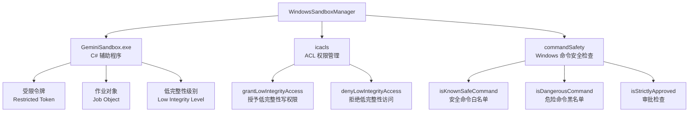
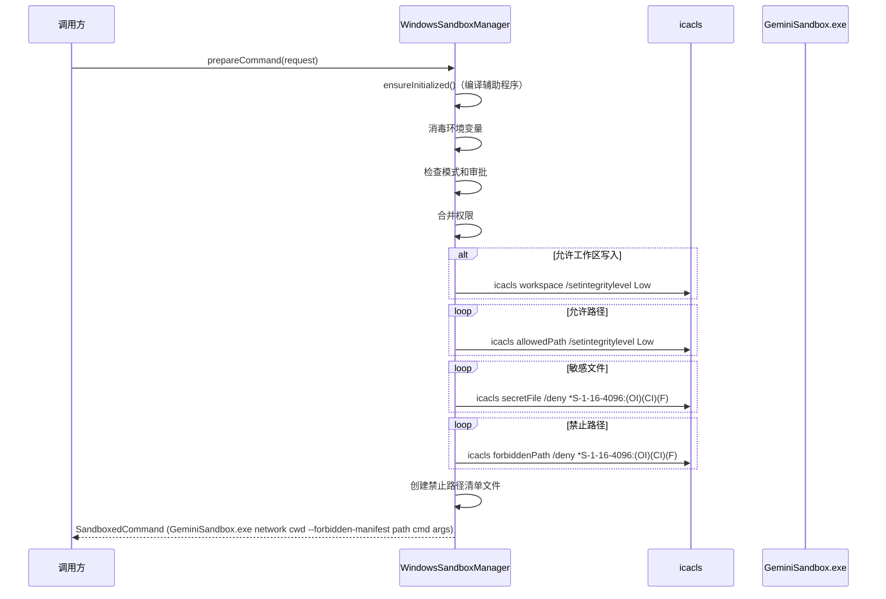

# windows

## 概述

`windows` 目录包含 Windows 平台的沙箱管理器实现。`WindowsSandboxManager` 使用 Windows 原生的**受限令牌 (Restricted Token)**、**作业对象 (Job Object)** 和**低完整性级别 (Low Integrity Level)** 机制实现进程隔离。它通过一个本地 C# 辅助程序 (`GeminiSandbox.exe`) 来创建和管理受限进程，并使用 `icacls` 命令控制文件系统访问权限。

## 目录结构

```
windows/
├── WindowsSandboxManager.ts      # Windows 沙箱管理器实现
├── WindowsSandboxManager.test.ts # 单元测试
├── commandSafety.ts              # Windows 特定的命令安全检查
└── commandSafety.test.ts         # 命令安全检查单元测试
```

## 架构图



## 核心组件

### WindowsSandboxManager

实现 `SandboxManager` 接口，使用 `GeminiSandbox.exe` 执行沙箱化命令。

**初始化流程：**
1. 检查 `GeminiSandbox.exe` 是否存在
2. 若不存在，尝试使用 `csc.exe`（.NET C# 编译器）从源码编译
3. 搜索多个 .NET Framework 版本路径

**命令准备流程 (`prepareCommand`)：**
1. 消毒环境变量
2. 检查读写模式和审批状态
3. 合并权限（持久化 + 临时）
4. 对工作区和允许路径授予低完整性写权限 (`icacls /setintegritylevel Low`)
5. 搜索并拒绝敏感文件的低完整性访问
6. 拒绝禁止路径的低完整性访问
7. 确保治理文件以中等完整性存在（写保护）
8. 创建禁止路径清单文件
9. 构建 `GeminiSandbox.exe` 命令

**ACL 管理：**
- `grantLowIntegrityAccess` - 使用 `icacls /setintegritylevel Low` 授予目录写权限
- `denyLowIntegrityAccess` - 使用 `icacls /deny *S-1-16-4096:(OI)(CI)(F)` 拒绝目录访问
- 缓存已处理的路径避免重复操作
- 拒绝 UNC 路径（防止凭证窃取/SSRF）
- 跳过系统目录（Windows、Program Files）

### commandSafety.ts（Windows 命令安全检查）

提供 Windows 特定的命令安全验证：

**`isKnownSafeCommand(args)`** - 安全命令白名单：
- Windows 原生命令：`dir`、`type`、`echo`、`cd`、`pwd`、`whoami`、`hostname` 等
- PowerShell cmdlet：`Get-ChildItem`、`Get-Content`、`Get-Location`、`Select-String` 等
- 只读 Git 操作：`status`、`log`、`diff`、`show`、`branch`
- 自动处理 `.exe` 后缀

**`isDangerousCommand(args)`** - 危险命令黑名单：
- 文件操作：`del`、`erase`、`rd`、`rmdir`
- 系统管理：`net`、`reg`、`sc`、`format`、`takeown`、`icacls`
- Shell 逃逸：`powershell`、`pwsh`、`cmd`
- PowerShell 破坏性操作：`Remove-Item`、`Stop-Process`、`Stop-Service`

**`isStrictlyApproved(command, args, approvedTools)`** - 审批检查：
- 解析管道和复合命令
- 验证每个子命令的根工具是否在批准列表中
- 大小写不敏感比较（Windows 特性）
- 自动去除 `.exe` 后缀

## 依赖关系

### 内部依赖

| 模块 | 用途 |
|------|------|
| `services/sandboxManager` | `SandboxManager` 接口、共享工具函数 |
| `services/environmentSanitization` | 环境变量消毒 |
| `policy/sandboxPolicyManager` | 持久化权限管理 |
| `sandbox/utils/commandUtils` | 验证沙箱覆盖权限 |
| `utils/shell-utils` | Shell 解析、命令名称提取 |
| `utils/debugLogger` | 调试日志 |
| `utils/errors` | 错误类型检查 |

### 外部依赖

| 包 | 用途 |
|---|------|
| `shell-quote` | Shell 命令解析 |
| `node:fs` | 文件系统操作 |
| `node:path` | 路径处理 |
| `node:os` | 系统信息和临时目录 |
| `node:url` | 文件 URL 转换 |

## 数据流


