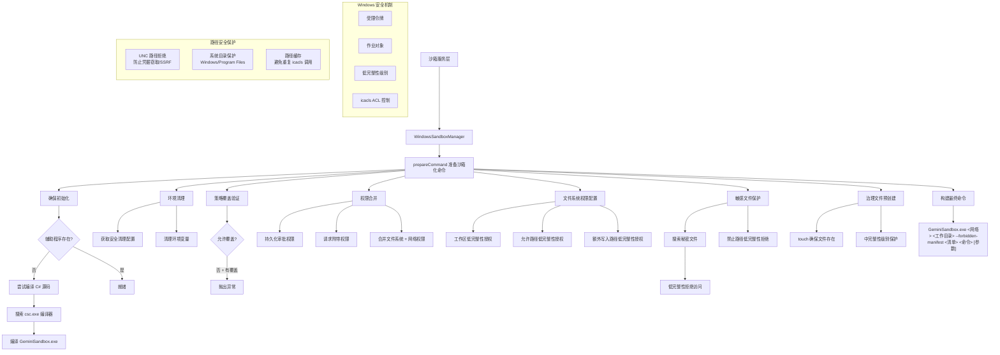

# WindowsSandboxManager.ts

## 概述

`WindowsSandboxManager.ts` 是 Gemini CLI 沙箱系统的 **Windows 平台实现模块**，实现了 `SandboxManager` 接口。它利用 Windows 特有的安全机制——**受限令牌（Restricted Tokens）**、**作业对象（Job Objects）** 和**低完整性级别（Low Integrity Level）**——来隔离子进程的执行环境。

该模块通过一个原生 C# 辅助程序 `GeminiSandbox.exe` 来执行实际的沙箱化操作，并使用 Windows `icacls` 命令来管理文件系统的完整性级别访问控制（Integrity Level ACL）。核心思路是：将沙箱化进程降低到"低完整性级别"运行，然后通过 `icacls` 授予工作区的低完整性访问权限，同时拒绝敏感文件的低完整性访问。

模块导出：
- `WindowsSandboxOptions` 接口：Windows 沙箱配置选项
- `WindowsSandboxManager` 类：Windows 沙箱管理器实现

## 架构图（Mermaid）



## 核心组件

### 1. `WindowsSandboxOptions` 接口 (导出)

继承自 `GlobalSandboxOptions`，扩展了 Windows 特有的配置选项。

```typescript
interface WindowsSandboxOptions extends GlobalSandboxOptions {
  modeConfig?: {
    readonly?: boolean;         // 是否为只读模式
    network?: boolean;          // 是否允许网络访问
    approvedTools?: string[];   // 审批通过的工具列表
    allowOverrides?: boolean;   // 是否允许策略覆盖
  };
  policyManager?: SandboxPolicyManager;  // 持久化审批策略管理器
}
```

### 2. `WindowsSandboxManager` 类 (导出)

实现 `SandboxManager` 接口，是 Windows 平台的沙箱管理器。

#### 私有属性

| 属性 | 类型 | 说明 |
|------|------|------|
| `helperPath` | `string` (readonly) | `GeminiSandbox.exe` 辅助程序的绝对路径 |
| `initialized` | `boolean` | 初始化状态标志 |
| `allowedCache` | `Set<string>` (readonly) | 已授权路径缓存，避免重复 `icacls` 调用 |
| `deniedCache` | `Set<string>` (readonly) | 已拒绝路径缓存，避免重复 `icacls` 调用 |
| `options` | `WindowsSandboxOptions` (readonly) | 构造时传入的配置 |

#### 构造函数

```typescript
constructor(options: WindowsSandboxOptions)
```
- 存储配置选项
- 计算辅助程序路径：`path.resolve(__dirname, 'GeminiSandbox.exe')`，即与本模块同目录

#### `isKnownSafeCommand(args)` (公开)

判断命令是否为已知安全命令。

**特殊逻辑**: 先检查命令根是否在 `approvedTools` 白名单中（大小写不敏感匹配），若不在再调用 `commandSafety.isKnownSafeCommand` 做通用判定。

#### `isDangerousCommand(args)` (公开)

直接委托给 `commandSafety.isDangerousCommand`。

#### `parseDenials(result)` (公开)

**当前未实现**，始终返回 `undefined`。标记为 TODO：需要实现 Windows 特有的沙箱拒绝解析。

#### `touch(filePath, isDirectory)` (私有)

确保文件或目录存在。

**处理逻辑**:
1. 使用 `fs.lstatSync` 检查路径是否存在（包括断开的符号链接）
2. 若不存在：
   - 目录：使用 `fs.mkdirSync({ recursive: true })` 递归创建
   - 文件：确保父目录存在后，使用 `fs.openSync('a')` + `fs.closeSync` 创建空文件

#### `ensureInitialized()` (私有, 异步)

确保沙箱辅助程序已就绪。

**处理流程**:
1. 若已初始化，直接返回
2. 若非 Windows 平台，标记已初始化后返回（跳过编译）
3. 检查 `GeminiSandbox.exe` 是否存在
4. 若不存在，尝试从 `GeminiSandbox.cs` 源码编译：
   - 依次尝试多个 C# 编译器路径：
     - `csc.exe`（PATH 中）
     - `%SystemRoot%\Microsoft.NET\Framework64\v4.0.30319\csc.exe`
     - `%SystemRoot%\Microsoft.NET\Framework\v4.0.30319\csc.exe`
     - `%SystemRoot%\Microsoft.NET\Framework64\v4.8\csc.exe`
     - `%SystemRoot%\Microsoft.NET\Framework\v4.8\csc.exe`
     - `%SystemRoot%\Microsoft.NET\Framework64\v3.5\csc.exe`
   - 使用 `spawnAsync(csc, ['/out:' + helperPath, sourcePath])` 编译
5. 标记已初始化

#### `prepareCommand(req)` (公开, 异步) -- 核心方法

准备沙箱化命令，是该类最复杂的方法。

**处理流程分为5个阶段**:

**阶段1: 初始化与环境准备**
- 调用 `ensureInitialized()` 确保辅助程序就绪
- 获取安全清理配置并清理环境变量
- 验证策略覆盖合法性
- 获取命令名称并查询持久化审批权限
- 合并所有权限来源（持久化权限 + 请求附带权限）

**阶段2: 文件系统权限配置（低完整性授权）**
- 若非只读模式或命令严格审批通过：对工作区授予低完整性写入访问
- 对所有 `allowedPaths` 授予低完整性访问
- 对所有额外写入路径授予低完整性访问

**阶段3: 敏感文件保护（低完整性拒绝）**
- 在工作区和允许路径中搜索秘密文件（`findSecretFiles`，深度3层）
- 对每个秘密文件调用 `denyLowIntegrityAccess` 拒绝访问
- 对所有 `forbiddenPaths` 拒绝低完整性访问

**阶段4: 治理文件保护**
- 遍历 `GOVERNANCE_FILES`（如 `.gitignore`、`LICENSE` 等）
- 使用 `touch` 确保这些文件在宿主上存在
- 由于是在沙箱启动前以"中完整性级别"创建的，低完整性进程无法写入

**阶段5: 构建最终命令**
- 创建临时目录，写入禁止路径清单文件
- 注册进程退出时的清理回调
- 构建命令行：`GeminiSandbox.exe <network:0|1> <cwd> --forbidden-manifest <path> <command> [args...]`
- 返回 `SandboxedCommand` 对象

#### `grantLowIntegrityAccess(targetPath)` (私有, 异步)

使用 `icacls` 授予路径低完整性级别访问权限。

**安全保护措施**:
1. **平台检查**: 非 Windows 直接返回
2. **路径解析**: 使用 `tryRealpath` 解析真实路径
3. **缓存检查**: 已授权路径跳过
4. **UNC 路径拒绝**: 阻止 `\\server\share` 格式路径（防止凭据窃取/SSRF），但允许 `\\?\` 和 `\\.\` 本地扩展路径
5. **系统目录保护**: 拒绝对 Windows、Program Files 等系统目录操作
6. **执行**: `icacls <path> /setintegritylevel Low`
7. **缓存更新**: 成功后添加到 `allowedCache`

#### `denyLowIntegrityAccess(targetPath)` (私有, 异步)

使用 `icacls` 拒绝低完整性级别进程对路径的访问。

**关键细节**:
- 使用 Windows 安全标识符 `*S-1-16-4096`（Low Mandatory Level SID）
- ACL 标志：`(OI)(CI)(F)` — 对象继承 + 容器继承 + 完全拒绝
- 不使用 `/T`（递归）标志以提升性能，依赖 `(OI)(CI)` 继承
- 路径不存在时静默跳过（`icacls` 不支持不存在的路径）
- 失败时抛出详细异常

#### `isSystemDirectory(resolvedPath)` (私有)

检查路径是否为 Windows 系统目录（大小写不敏感）。

保护的目录：
- `%SystemRoot%`（通常 `C:\Windows`）
- `%ProgramFiles%`（通常 `C:\Program Files`）
- `%ProgramFiles(x86)%`（通常 `C:\Program Files (x86)`）

## 依赖关系

### 内部依赖

| 依赖模块 | 导入项 | 用途 |
|----------|--------|------|
| `../../services/sandboxManager.js` | `SandboxManager`, `SandboxRequest`, `SandboxedCommand`, `GOVERNANCE_FILES`, `findSecretFiles`, `GlobalSandboxOptions`, `sanitizePaths`, `tryRealpath`, `SandboxPermissions`, `ParsedSandboxDenial` | 沙箱核心接口和工具函数 |
| `../../services/shellExecutionService.js` | `ShellExecutionResult` (类型) | 命令执行结果类型 |
| `../../services/environmentSanitization.js` | `sanitizeEnvironment`, `getSecureSanitizationConfig` | 环境变量安全清理 |
| `../../utils/debugLogger.js` | `debugLogger` | 调试日志输出 |
| `../../utils/shell-utils.js` | `spawnAsync`, `getCommandName` | 异步进程创建和命令名称提取 |
| `../../utils/errors.js` | `isNodeError` | Node.js 错误类型守卫 |
| `./commandSafety.js` | `isKnownSafeCommand`, `isDangerousCommand`, `isStrictlyApproved` | 命令安全性判定（Windows 本地版本） |
| `../../policy/sandboxPolicyManager.js` | `SandboxPolicyManager` (类型) | 持久化沙箱策略管理器 |
| `../utils/commandUtils.js` | `verifySandboxOverrides` | 策略覆盖验证 |

### 外部依赖

| 依赖包 | 导入项 | 用途 |
|--------|--------|------|
| `node:fs` | `fs` | 文件系统操作：检查文件存在、创建目录/文件、写入清单、清理临时文件 |
| `node:path` | `path` | 路径操作：拼接、解析、获取目录名和基础名 |
| `node:os` | `os` | 获取操作系统信息：平台判断、临时目录 |
| `node:url` | `fileURLToPath` | 将 ESM 模块 URL 转换为文件路径（获取 `__dirname`） |

### 系统依赖

| 依赖 | 用途 |
|------|------|
| `icacls.exe` | Windows 内置工具，用于修改文件/目录的完整性级别和访问控制列表 |
| `csc.exe` (.NET C# 编译器) | 用于从源码编译 `GeminiSandbox.exe` 辅助程序 |
| `GeminiSandbox.exe` / `GeminiSandbox.cs` | 原生 C# 沙箱辅助程序，负责创建受限令牌和低完整性进程 |

## 关键实现细节

1. **Windows 完整性级别安全模型**: Windows 从 Vista 开始引入强制完整性控制（MIC）。每个进程和对象都有一个完整性级别（Low、Medium、High、System）。低完整性进程默认无法写入中完整性或更高的对象。本模块利用此机制，将沙箱进程降低到"低完整性"运行，然后精确控制哪些路径允许低完整性访问。

2. **双向访问控制策略**:
   - **授予（Grant）**: 对工作区和允许路径使用 `icacls /setintegritylevel Low` 降低路径完整性级别，使低完整性进程可以访问
   - **拒绝（Deny）**: 对秘密文件和禁止路径使用 `icacls /deny *S-1-16-4096:(OI)(CI)(F)` 显式拒绝低完整性进程的全部访问权限
   - 拒绝规则优先于允许规则（Windows ACL 评估顺序），确保即使工作区被授予访问，其中的秘密文件仍然受保护

3. **治理文件的巧妙保护**: 通过在沙箱启动前以"中完整性级别"创建治理文件（如 `.gitignore`），利用 Windows 完整性级别的天然保护——低完整性进程无法修改中完整性对象——无需额外的 ACL 操作即可保护这些文件不被沙箱内进程篡改。

4. **UNC 路径安全**: 显式拒绝 `\\server\share` 格式的 UNC（Universal Naming Convention）路径，因为：
   - 访问 UNC 路径可能触发 NTLM 认证，导致凭据泄露
   - 攻击者可构造恶意 UNC 路径进行 SSRF 攻击
   - 但允许 `\\?\`（扩展长度路径）和 `\\.\`（设备路径），这些是本地路径前缀

5. **自动编译机制**: 若 `GeminiSandbox.exe` 不存在，模块会自动尝试从同目录的 `.cs` 源文件编译。它搜索多个 .NET Framework 版本的 `csc.exe` 编译器路径（v3.5、v4.0.30319、v4.8），兼容不同的 Windows 环境。

6. **路径缓存优化**: 使用 `allowedCache` 和 `deniedCache` 两个 Set 缓存已处理的路径，避免对同一路径重复调用 `icacls`（这是一个相对昂贵的系统调用）。

7. **清单文件机制**: 禁止路径列表通过临时文件（manifest）传递给辅助程序，而非命令行参数。这避免了 Windows 命令行长度限制（约 8191 个字符），允许传递大量禁止路径。临时文件在进程退出时自动清理。

8. **权限合并策略**: `prepareCommand` 会合并三个来源的权限：
   - 默认沙箱模式配置（`modeConfig`）
   - 持久化审批权限（`policyManager.getCommandPermissions`）
   - 请求附带的额外权限（`req.policy.additionalPermissions`）

   其中持久化审批和请求附带权限仅在 `allowOverrides` 为 `true` 时生效。

9. **`parseDenials` 未实现**: 与 macOS/Linux 的 `parsePosixSandboxDenials` 不同，Windows 版本的拒绝事件解析尚未实现。这意味着 Windows 上目前无法自动检测沙箱拒绝事件并提示用户授予权限。

10. **非 Windows 平台的优雅降级**: `grantLowIntegrityAccess` 和 `denyLowIntegrityAccess` 在非 Windows 平台上直接返回，`ensureInitialized` 也会跳过编译步骤，使得该模块在非 Windows 环境下可以被安全导入（用于测试等目的）。
