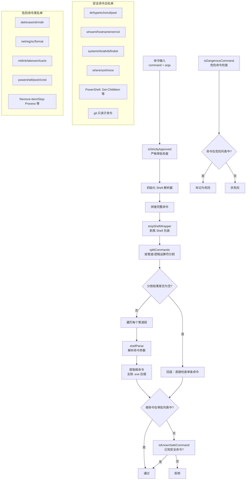

# commandSafety.ts

## 概述

`commandSafety.ts` 是 Gemini CLI 在 Windows 平台上的命令安全检查模块。它为沙箱环境提供三层命令安全验证机制：严格审批检查（`isStrictlyApproved`）、已知安全命令检查（`isKnownSafeCommand`）和危险命令检查（`isDangerousCommand`）。该模块的核心目标是防止 AI 生成的命令执行破坏性或危险的操作，同时允许只读和已审批的命令正常执行。

## 架构图（Mermaid）

## 核心组件

### 1. `isStrictlyApproved(command, args, approvedTools?)` 函数

**导出类型**: 公开导出

**功能**: 判断一个命令是否被严格审批允许执行。命令被允许的条件是：所有管道段中的每个根命令要么在 `approvedTools` 白名单中，要么是已知的安全只读命令。

**参数**:
| 参数 | 类型 | 说明 |
|------|------|------|
| `command` | `string` | 要执行的命令 |
| `args` | `string[]` | 命令参数数组 |
| `approvedTools` | `string[]` (可选) | 显式审批的工具名称列表（如 `['npm', 'git']`） |

**返回值**: `Promise<boolean>` - 是否被严格审批

**执行流程**:

1. 初始化 Shell 解析器（`initializeShellParsers`）
2. 将 `command` 和 `args` 拼接为完整命令字符串
3. 使用 `stripShellWrapper` 剥离外层 Shell 包装（如 `cmd /c`、`powershell -Command` 等）
4. 使用 `splitCommands` 按管道符 (`|`) 和逻辑运算符 (`&&`, `||`, `;`) 分割命令
5. **分割结果为空时的回退逻辑**: 直接检查原始命令是否在审批列表中或是已知安全命令
6. **正常流程**: 遍历每个管道段：
   - 用 `shellParse` 解析每段的参数
   - 提取根命令并转小写，去除 `.exe` 后缀
   - 检查根命令是否在 `approvedTools` 中（大小写不敏感）
   - 或检查是否为已知安全命令
7. 只有所有管道段都通过检查，才返回 `true`

### 2. `isKnownSafeCommand(args)` 函数

**导出类型**: 公开导出

**功能**: 检查一个 Windows 命令是否为已知的安全（只读）命令。

**参数**:
| 参数 | 类型 | 说明 |
|------|------|------|
| `args` | `string[]` | 命令参数数组（`args[0]` 为命令名） |

**返回值**: `boolean`

**安全命令白名单**:

| 类别 | 命令 |
|------|------|
| 文件系统浏览 | `dir`, `type`, `cd`, `pwd` |
| 系统信息 | `echo`, `whoami`, `hostname`, `ver`, `vol`, `systeminfo` |
| 文件属性/搜索 | `attrib`, `findstr`, `where` |
| 文本处理 | `sort`, `more` |
| PowerShell Cmdlet | `get-childitem`, `get-content`, `get-location`, `get-help`, `get-process`, `get-service`, `get-eventlog`, `select-string` |

**Git 特殊处理**: 对 `git` 命令，只允许以下只读子命令：
- `status`
- `log`
- `diff`
- `show`
- `branch`

### 3. `isDangerousCommand(args)` 函数

**导出类型**: 公开导出

**功能**: 检查一个 Windows 命令是否为显式危险命令。

**参数**:
| 参数 | 类型 | 说明 |
|------|------|------|
| `args` | `string[]` | 命令参数数组（`args[0]` 为命令名） |

**返回值**: `boolean`

**危险命令黑名单**:

| 类别 | 命令 | 说明 |
|------|------|------|
| 文件删除 | `del`, `erase` | 删除文件 |
| 目录删除 | `rd`, `rmdir` | 删除目录 |
| 网络管理 | `net` | 网络配置和管理 |
| 注册表 | `reg` | 注册表操作 |
| 服务控制 | `sc` | 服务管理 |
| 磁盘格式化 | `format` | 格式化磁盘 |
| 符号链接 | `mklink` | 创建符号链接 |
| 权限管理 | `takeown`, `icacls` | 文件所有权和权限修改 |
| Shell 逃逸 | `powershell`, `pwsh`, `cmd` | 防止通过嵌套 Shell 绕过安全检查 |
| PowerShell 破坏性 | `remove-item`, `stop-process`, `stop-service`, `set-item`, `new-item` | PowerShell 破坏性 Cmdlet |

## 依赖关系

### 内部依赖

| 依赖模块 | 导入项 | 用途 |
|---------|-------|------|
| `../../utils/shell-utils.js` | `extractStringFromParseEntry` | 从 shell-quote 解析结果中提取字符串 |
| `../../utils/shell-utils.js` | `initializeShellParsers` | 初始化 Shell 解析器 |
| `../../utils/shell-utils.js` | `splitCommands` | 按管道符和逻辑运算符分割命令字符串 |
| `../../utils/shell-utils.js` | `stripShellWrapper` | 剥离 Shell 包装层（如 `cmd /c`） |

### 外部依赖

| 依赖包 | 导入项 | 用途 |
|--------|-------|------|
| `shell-quote` | `parse` (别名 `shellParse`) | 将命令字符串解析为参数数组，处理引号、转义等 Shell 语法 |

## 关键实现细节

1. **大小写不敏感**: 所有命令比较都转换为小写进行，这是因为 Windows 命令系统本身就是大小写不敏感的。

2. **`.exe` 后缀处理**: 所有三个函数都会检查并去除命令的 `.exe` 后缀。这是因为 Windows 上同一个命令可能以 `git` 或 `git.exe` 两种形式出现。

3. **管道安全**: `isStrictlyApproved` 会分割管道命令并逐段检查。这意味着 `dir | findstr pattern` 会被允许（两段都是安全命令），但 `dir | del file` 会被拒绝（第二段是危险命令）。

4. **Shell 包装剥离**: 在分割命令前先调用 `stripShellWrapper` 剥离外层 Shell 包装。这是一个重要的安全措施，防止通过 `cmd /c "dangerous_command"` 或 `powershell -Command "dangerous_command"` 绕过安全检查。

5. **Shell 逃逸防护**: `powershell`、`pwsh` 和 `cmd` 本身被列为危险命令。这防止了通过启动嵌套 Shell 来绕过安全检查的攻击向量。

6. **回退机制**: 当 `splitCommands` 返回空数组时（可能是解析失败或非常简单的命令），会回退到直接检查原始命令，确保不会因为解析问题导致合法命令被拒绝。

7. **异步初始化**: `isStrictlyApproved` 是异步函数，因为需要等待 `initializeShellParsers()` 完成。Shell 解析器的初始化可能涉及加载 WASM 模块或其他异步操作。

8. **三层安全模型**:
   - **白名单层**: `approvedTools` 参数提供用户自定义的审批工具列表
   - **安全命令层**: `isKnownSafeCommand` 提供内置的只读命令白名单
   - **危险命令层**: `isDangerousCommand` 提供显式的危险命令黑名单

   这三层检查可以组合使用，为沙箱环境提供灵活而安全的命令执行策略。
