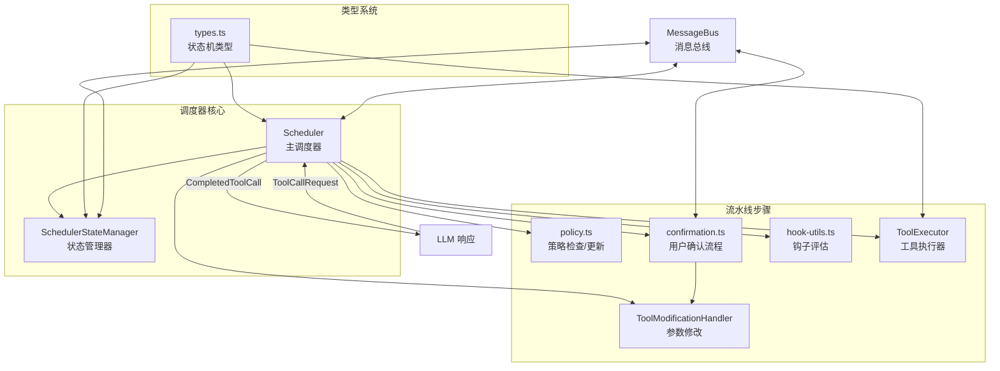
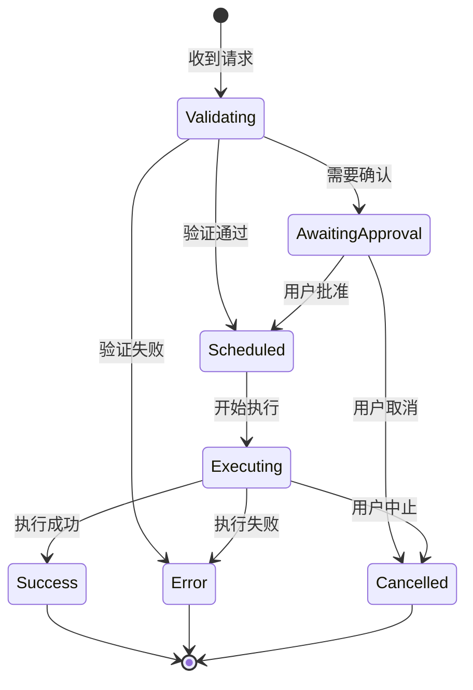
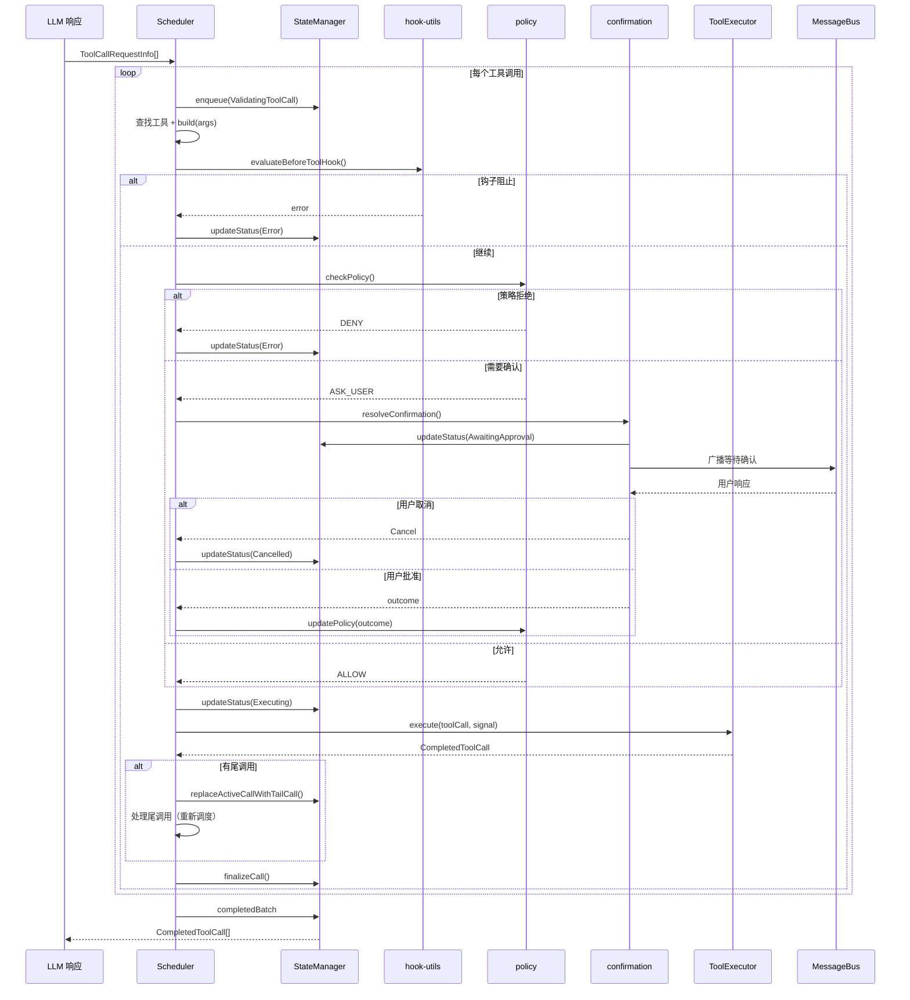

# scheduler

## 概述

`scheduler` 目录实现了 Gemini CLI 的**工具调用调度器（Scheduler）**，是一个事件驱动的工具执行编排引擎。它负责接收 LLM 返回的工具调用请求，通过策略检查、钩子评估、用户确认等流水线步骤，最终执行工具并收集结果。调度器支持并行/串行执行、取消操作、输出截断、尾调用链等高级特性。

## 目录结构

```
scheduler/
├── scheduler.ts          # Scheduler 主调度器（事件驱动编排引擎）
├── types.ts              # 核心类型定义（ToolCall 状态机、请求/响应类型）
├── state-manager.ts      # SchedulerStateManager 状态管理器（工具调用状态跟踪）
├── policy.ts             # 策略检查与更新（PolicyEngine 集成）
├── confirmation.ts       # 用户确认流程（确认循环、编辑器修改）
├── tool-executor.ts      # ToolExecutor 工具执行器（实际执行工具调用）
├── tool-modifier.ts      # ToolModificationHandler 工具参数修改处理
├── hook-utils.ts         # 钩子评估工具函数（BeforeTool 钩子处理）
└── *.test.ts             # 对应的测试文件
```

## 架构图



## 核心组件

### `types.ts` - 状态机与核心类型

#### 工具调用状态机 `CoreToolCallStatus`



#### 关键类型
- **`ToolCallRequestInfo`**: 工具调用请求，包含 `callId`、`name`、`args`、`isClientInitiated`、`prompt_id` 等
- **`ToolCallResponseInfo`**: 工具调用响应，包含 `responseParts`、`resultDisplay`、`error`、`errorType`
- **`ToolCall`**: 联合类型，覆盖所有状态的工具调用
  - `ValidatingToolCall`: 验证中
  - `ScheduledToolCall`: 已排队
  - `ExecutingToolCall`: 执行中（含 `liveOutput`、`pid`、进度信息）
  - `WaitingToolCall`: 等待审批（含 `confirmationDetails`、`correlationId`）
  - `SuccessfulToolCall`: 执行成功
  - `ErroredToolCall`: 执行出错
  - `CancelledToolCall`: 已取消
- **`CompletedToolCall`**: 终态联合（Success | Error | Cancelled）
- **`TailToolCallRequest`**: 尾调用请求（工具链式执行）

### `scheduler.ts` - 主调度器

`Scheduler` 是事件驱动的工具执行编排器：

**主要职责**:
1. **接收请求**: 接收一批 `ToolCallRequestInfo`
2. **验证阶段**: 查找工具 -> 构建 Invocation -> 评估 BeforeTool 钩子
3. **策略检查**: 调用 PolicyEngine 判断 ALLOW / DENY / ASK_USER
4. **确认流程**: 如需用户确认，进入确认循环
5. **执行工具**: 通过 ToolExecutor 实际执行
6. **结果处理**: 收集结果、处理尾调用、更新策略
7. **状态广播**: 通过 MessageBus 广播状态变更

**并行/串行控制**:
- 只读工具（Read、Search、Fetch 类）可以并行执行
- 需要确认的工具按队列串行处理
- 通过 `wait_for_previous` 参数控制依赖关系

**关键配置** (`SchedulerOptions`):
- `context: AgentLoopContext` - Agent 上下文
- `messageBus: MessageBus` - 消息总线
- `getPreferredEditor` - 获取用户首选编辑器
- `schedulerId` - 调度器标识
- `subagent` - 子代理标识
- `onWaitingForConfirmation` - 等待确认回调

### `state-manager.ts` - 状态管理器

`SchedulerStateManager` 管理工具调用的完整生命周期状态：

- **队列管理**: `enqueue()`、`dequeue()`、`peekQueue()`
- **状态转换**: `updateStatus()` 使用严格的状态机转换（类型安全的重载签名）
- **活跃调用**: `activeCalls` Map 追踪正在处理的调用
- **完成批次**: `_completedBatch` 收集已完成的调用
- **状态广播**: 每次状态变更通过 MessageBus 发布 `TOOL_CALLS_UPDATE` 事件
- **尾调用**: `replaceActiveCallWithTailCall()` 支持链式工具调用
- **批量取消**: `cancelAllQueued()` 取消所有排队中的调用

**转换辅助方法**:
- `toSuccess()` / `toError()` / `toCancelled()` - 终态转换
- `toAwaitingApproval()` - 等待审批转换
- `toScheduled()` / `toExecuting()` / `toValidating()` - 中间状态转换

### `policy.ts` - 策略检查与更新

**`checkPolicy()`**: 查询策略引擎决定工具执行权限
- 调用 `PolicyEngine.check()` 获取 ALLOW / DENY / ASK_USER 决策
- 客户端发起的工具调用（如 slash 命令）视为隐式确认，跳过 ASK_USER
- 非交互模式下 ASK_USER 抛出异常

**`updatePolicy()`**: 根据用户确认结果更新策略
- `ProceedAlways` + 编辑工具 -> 切换到 AUTO_EDIT 模式
- `ProceedAlwaysAndSave` -> 持久化策略规则（workspace 或 user 级别）
- MCP 工具特殊处理（支持服务器级别通配符 `mcp_server_*`）

**`getPolicyDenialError()`**: 格式化策略拒绝错误信息

### `confirmation.ts` - 用户确认流程

**`resolveConfirmation()`**: 管理交互式确认循环
1. 调用 `invocation.shouldConfirmExecute()` 获取确认详情
2. 通过钩子通知
3. 发布 `AwaitingApproval` 状态，等待用户通过 MessageBus 响应
4. 处理用户选择：
   - `ProceedOnce`: 一次性允许
   - `ModifyWithEditor`: 启动外部编辑器修改参数，然后重新显示确认
   - 内联修改（IDE payload）: 直接应用修改
   - `Cancel`: 取消执行

**`awaitConfirmation()`**: 监听 MessageBus 的确认响应，支持：
- MessageBus 响应（TUI 确认）
- IDE 确认（Promise 竞争）
- AbortSignal 取消

### `tool-executor.ts` - 工具执行器

`ToolExecutor` 负责实际的工具执行：
- 调用 `executeToolWithHooks()` 执行工具（含 AfterTool 钩子）
- **实时输出**: 通过 `liveOutputCallback` 流式推送输出
- **输出截断**: Shell 和 MCP 工具输出超过阈值时截断并保存到临时文件
- **执行 ID 回调**: Shell 工具的 PID 通过 `setExecutionIdCallback` 更新到状态
- **结果构造**: 根据执行结果创建 Success、Error 或 Cancelled 结果
- **遥测**: 通过 `runInDevTraceSpan` 记录 Trace

### `tool-modifier.ts` - 参数修改处理

`ToolModificationHandler` 处理用户对工具参数的修改：
- **`handleModifyWithEditor()`**: 通过外部编辑器（Vim 等）修改参数
- **`applyInlineModify()`**: 应用来自 IDE 或 TUI 的内联修改
- 依赖 `modifiable-tool.ts` 的 `ModifyContext` 接口

### `hook-utils.ts` - 钩子评估

`evaluateBeforeToolHook()`: 评估 BeforeTool 钩子的结果
- 返回 `'continue'` 继续执行，或 `'error'` 阻止执行
- 处理 `stopExecution`（停止整个 Agent）
- 处理 `block/deny` 决策
- 处理 `ask` 决策（强制用户确认）
- 处理工具输入修改（重建 Invocation）

## 依赖关系

### 内部依赖
- `config/config.ts` - 配置（策略引擎、审批模式、Shell 配置等）
- `config/agent-loop-context.ts` - Agent 上下文
- `tools/tools.ts` - DeclarativeTool、ToolInvocation、ToolResult 等
- `tools/tool-registry.ts` - 工具查找
- `tools/tool-error.ts` - 错误类型
- `tools/modifiable-tool.ts` - 可修改工具
- `tools/mcp-tool.ts` - MCP 工具
- `hooks/` - 钩子系统
- `policy/` - 策略引擎
- `confirmation-bus/` - 消息总线
- `telemetry/` - 遥测与追踪
- `core/coreToolHookTriggers.ts` - 工具执行与钩子触发

### 外部依赖
- `@google/genai` - Part 类型
- `node:events` - 事件监听（`on()` 异步迭代器）
- `node:crypto` - UUID 生成
- `diff` - 文本差异计算

## 数据流

### 完整的工具调用调度流程


