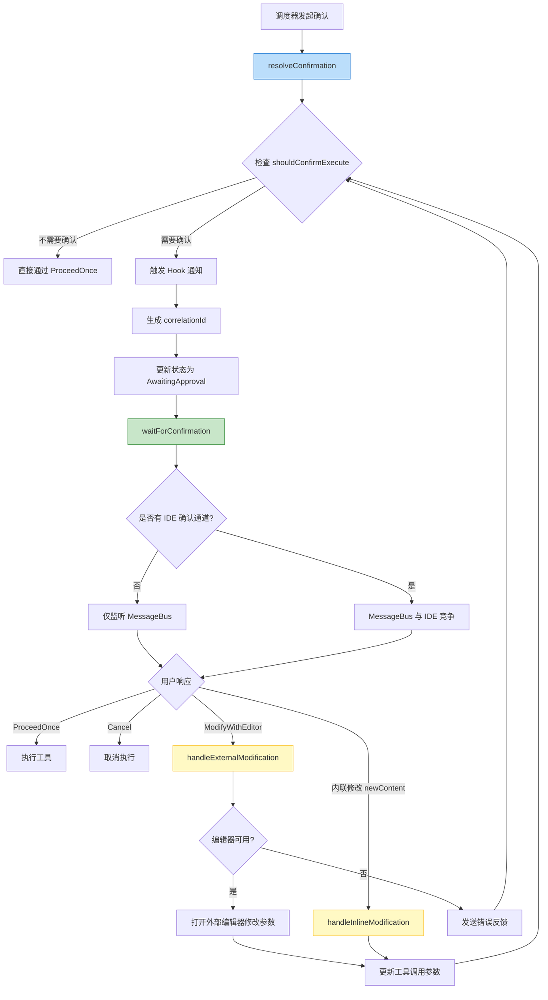
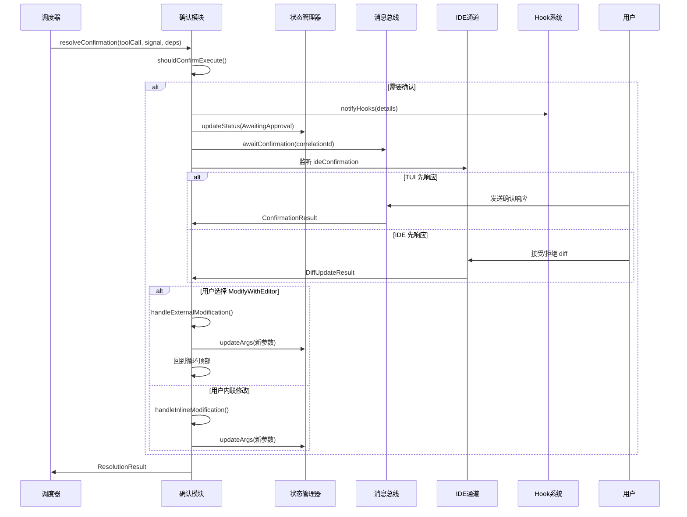

# confirmation.ts

## 概述

`confirmation.ts` 是调度器（Scheduler）中负责**工具调用确认流程**的核心模块。当 AI 模型请求执行某个需要用户确认的工具（如文件写入、shell 命令等）时，该模块管理从发起确认请求到用户最终决策之间的完整交互循环。

该模块的核心职责包括：

1. **确认等待**：通过 `MessageBus`（消息总线）监听用户的确认响应，支持通过 `AbortSignal` 取消等待。
2. **交互式修改循环**：用户可以在确认前通过外部编辑器（如 Vim）或内联编辑（如 IDE diff 视图）修改工具调用参数，修改后重新展示确认提示，形成"确认-修改-再确认"的循环。
3. **多通道竞争**：同时监听 TUI（终端用户界面）消息总线和 IDE 确认通道，谁先响应就采用谁的结果。
4. **Hook 通知**：在确认前触发 Hook 系统的工具通知事件。

## 架构图（Mermaid）





## 核心组件

### 1. 接口定义

#### `ConfirmationResult`

确认响应的内部表示，从消息总线或 IDE 通道获取。

| 字段 | 类型 | 说明 |
|------|------|------|
| `outcome` | `ToolConfirmationOutcome` | 用户决策：`ProceedOnce`、`Cancel`、`ModifyWithEditor` 等 |
| `payload` | `ToolConfirmationPayload` (可选) | 附加载荷，如内联修改的新内容 `{ newContent: string }` |

#### `ResolutionResult`

确认流程的最终返回结果。

| 字段 | 类型 | 说明 |
|------|------|------|
| `outcome` | `ToolConfirmationOutcome` | 最终决策结果 |
| `lastDetails` | `SerializableConfirmationDetails` (可选) | 最后一次展示的确认详情（可用于日志或 UI 记录） |

#### `ExternalModificationResult`（内部接口）

外部编辑器修改的返回结果。

| 字段 | 类型 | 说明 |
|------|------|------|
| `error` | `string` (可选) | 如果修改失败，返回错误消息 |

### 2. 核心函数

#### `resolveConfirmation(toolCall, signal, deps): Promise<ResolutionResult>`

**导出的主入口函数**，管理整个确认交互循环。

**参数**：

| 参数 | 类型 | 说明 |
|------|------|------|
| `toolCall` | `ValidatingToolCall` | 正在验证中的工具调用 |
| `signal` | `AbortSignal` | 取消信号 |
| `deps.config` | `Config` | 配置对象，用于获取 Hook 系统 |
| `deps.messageBus` | `MessageBus` | 消息总线，用于发送/接收确认消息 |
| `deps.state` | `SchedulerStateManager` | 调度器状态管理器 |
| `deps.modifier` | `ToolModificationHandler` | 工具修改处理器 |
| `deps.getPreferredEditor` | `() => EditorType \| undefined` | 获取用户偏好编辑器的函数 |
| `deps.schedulerId` | `string` | 调度器 ID |
| `deps.onWaitingForConfirmation` | `(waiting: boolean) => void` (可选) | 等待状态变更回调 |
| `deps.systemMessage` | `string` (可选) | 系统消息，附加到确认详情中 |
| `deps.forcedDecision` | `ForcedToolDecision` (可选) | 强制决策，跳过用户确认 |

**核心逻辑**（while 循环）：

1. 调用 `shouldConfirmExecute()` 判断是否需要确认。如果返回 `null`/`undefined`，直接 `ProceedOnce`。
2. 附加 `systemMessage`（如果有）。
3. 触发 Hook 通知 (`notifyHooks`)。
4. 生成唯一 `correlationId` 用于匹配响应。
5. 更新工具调用状态为 `AwaitingApproval`。
6. 等待用户响应 (`waitForConfirmation`)。
7. 如果工具定义了 `onConfirm` 回调，调用之。
8. 根据用户决策：
   - `ModifyWithEditor`：调用 `handleExternalModification`，回到循环顶部重新确认。
   - 内联修改（`payload` 包含 `newContent`）：调用 `handleInlineModification`，设置 `ProceedOnce`。
   - 其他：退出循环。

#### `awaitConfirmation(messageBus, correlationId, signal): Promise<ConfirmationResult>`

**内部函数**，通过 Node.js 的 `events.on()` 异步迭代器模式监听消息总线上的确认响应。

- 使用 `for await...of` 遍历 `TOOL_CONFIRMATION_RESPONSE` 事件。
- 只响应 `correlationId` 匹配的消息。
- 支持旧版 `confirmed` 布尔值到新版 `outcome` 枚举的**向后兼容映射**。
- 通过 `AbortSignal` 实现超时和取消。

#### `waitForConfirmation(messageBus, correlationId, signal, ideConfirmation?): Promise<ConfirmationResult>`

**内部函数**，实现 MessageBus 和 IDE 通道的**竞争等待**。

- 创建内部 `AbortController` (`raceController`) 用于取消落败的等待方。
- 将父级 `signal` 的 abort 事件传播到 `raceController`。
- 如果没有 `ideConfirmation`，直接等待 MessageBus。
- 如果有 `ideConfirmation`，使用 `Promise.race()` 竞争：
  - IDE 返回 `accepted` 映射为 `ProceedOnce`，`rejected` 映射为 `Cancel`。
  - IDE 如果有 `content`，将其包装为 `{ newContent }` 载荷。
  - IDE 出错时返回永不 resolve 的 Promise，让 MessageBus 继续等待。
- `finally` 块中清理事件监听器并 abort `raceController`。

#### `notifyHooks(deps, details): Promise<void>`

**内部函数**，触发 Hook 系统的工具通知事件。

- 检查 `config.getHookSystem()` 是否存在。
- 调用 `fireToolNotificationEvent`，传入确认详情。
- `onConfirm` 回调替换为空操作（no-op），因为 Hook 中不允许副作用。

#### `handleExternalModification(deps, toolCall, signal): Promise<ExternalModificationResult>`

**内部函数**，处理通过外部编辑器（如 Vim）修改工具调用参数。

1. 调用 `resolveEditorAsync` 获取可用编辑器。
2. 如果没有编辑器可用，返回 `{ error: NO_EDITOR_AVAILABLE_ERROR }`。
3. 调用 `modifier.handleModifyWithEditor` 打开编辑器让用户修改。
4. 如果有修改结果，使用 `toolCall.tool.build()` 构建新的调用实例，并通过 `state.updateArgs()` 更新状态。

#### `handleInlineModification(deps, toolCall, payload, signal): Promise<void>`

**内部函数**，处理通过内联方式（如 IDE diff 视图或 TUI 编辑）修改工具调用参数。

1. 调用 `modifier.applyInlineModify` 应用内联修改。
2. 如果有修改结果，构建新调用实例并更新状态。

## 依赖关系

### 内部依赖

| 模块 | 导入内容 | 用途 |
|------|---------|------|
| `../confirmation-bus/message-bus.js` | `MessageBus` | 消息总线类型，用于发布/订阅确认消息 |
| `../confirmation-bus/types.js` | `MessageBusType`, `ToolConfirmationResponse`, `SerializableConfirmationDetails` | 消息总线的事件类型和确认响应结构 |
| `../tools/tools.js` | `ToolConfirmationOutcome`, `ToolConfirmationPayload`, `ToolCallConfirmationDetails`, `ForcedToolDecision` | 工具确认相关的枚举和类型 |
| `./types.js` | `ValidatingToolCall`, `WaitingToolCall`, `CoreToolCallStatus` | 调度器内部的工具调用状态类型 |
| `../config/config.js` | `Config` | 配置对象类型，用于获取 Hook 系统 |
| `./state-manager.js` | `SchedulerStateManager` | 调度器状态管理器类型 |
| `./tool-modifier.js` | `ToolModificationHandler` | 工具参数修改处理器 |
| `../utils/editor.js` | `resolveEditorAsync`, `EditorType`, `NO_EDITOR_AVAILABLE_ERROR` | 外部编辑器解析工具 |
| `../ide/ide-client.js` | `DiffUpdateResult` | IDE 客户端的 diff 更新结果类型 |
| `../utils/debugLogger.js` | `debugLogger` | 调试日志工具 |
| `../utils/events.js` | `coreEvents` | 核心事件系统，用于发送错误反馈 |

### 外部依赖

| 包 | 导入内容 | 用途 |
|------|---------|------|
| `node:events` | `on` | Node.js 内置模块，用于将 EventEmitter 事件转为异步迭代器 |
| `node:crypto` | `randomUUID` | Node.js 内置模块，用于生成唯一的 correlationId |

## 关键实现细节

### 1. 确认循环机制

`resolveConfirmation` 使用 `while` 循环实现"确认-修改-再确认"模式：

```typescript
let outcome = ToolConfirmationOutcome.ModifyWithEditor;
while (outcome === ToolConfirmationOutcome.ModifyWithEditor) {
    // 1. 获取确认详情
    // 2. 等待用户响应
    // 3. 如果用户选择编辑，修改参数后继续循环
    // 4. 如果用户确认或取消，退出循环
}
```

初始值设为 `ModifyWithEditor` 确保至少进入一次循环。循环仅在用户选择"用编辑器修改"时继续，其他任何响应都会退出。

### 2. 竞争等待模式

`waitForConfirmation` 通过 `Promise.race` 实现 MessageBus 和 IDE 双通道竞争：

```
MessageBus (TUI)  ─┐
                    ├── Promise.race ──> 第一个响应获胜
IDE (diff 视图)   ─┘
```

关键的清理机制：
- 使用独立的 `raceController` (AbortController) 来取消落败方的监听。
- 父级 `signal` abort 时传播到 `raceController`。
- `finally` 块确保无论哪方获胜都正确清理。
- IDE 出错时返回永不 resolve 的 Promise，让 MessageBus 继续等待而不是整体失败。

### 3. correlationId 匹配机制

每次确认请求都生成唯一的 `correlationId`（UUID v4），确保：
- 多个并发确认请求不会互相干扰。
- 响应能精确匹配到对应的请求。
- 在编辑循环中，每轮都生成新的 `correlationId`。

### 4. 向后兼容的响应解析

```typescript
outcome: response.outcome ??
  (response.confirmed
    ? ToolConfirmationOutcome.ProceedOnce
    : ToolConfirmationOutcome.Cancel),
```

支持旧版使用布尔值 `confirmed` 的响应格式，优先使用新版的 `outcome` 枚举。这是一个迁移期的兼容处理。

### 5. Hook 系统的安全调用

在通知 Hook 系统时，`onConfirm` 回调被替换为空操作：

```typescript
onConfirm: async () => {},
```

这是因为 Hook 系统仅用于通知目的（如日志、监控），不允许通过回调产生副作用影响确认流程的实际结果。

### 6. 编辑器不可用的优雅降级

当用户选择 `ModifyWithEditor` 但没有可用编辑器时：
- `handleExternalModification` 返回 `{ error: NO_EDITOR_AVAILABLE_ERROR }`。
- 错误通过 `coreEvents.emitFeedback('error', ...)` 通知用户。
- 循环继续，重新展示确认提示（而不是崩溃或取消），用户可以选择其他操作。

### 7. AbortSignal 的分层管理

信号管理形成三层结构：
1. **顶层 signal**：由调度器传入，表示整个操作的取消。
2. **raceSignal**：由 `waitForConfirmation` 内部创建，用于竞争等待的取消。
3. **传播链**：顶层 abort → raceSignal abort → 清理所有监听器。

这确保了在任何层级取消时，所有相关的异步操作都能被正确清理，避免内存泄漏和"僵尸"监听器。
