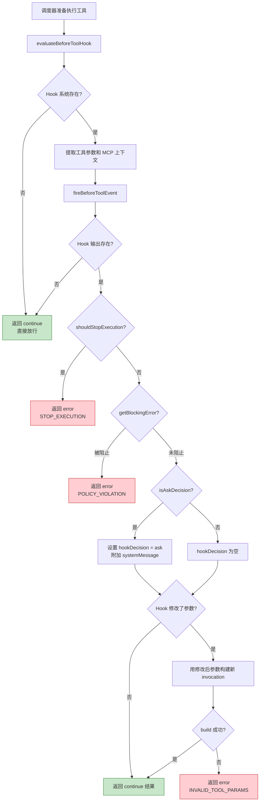
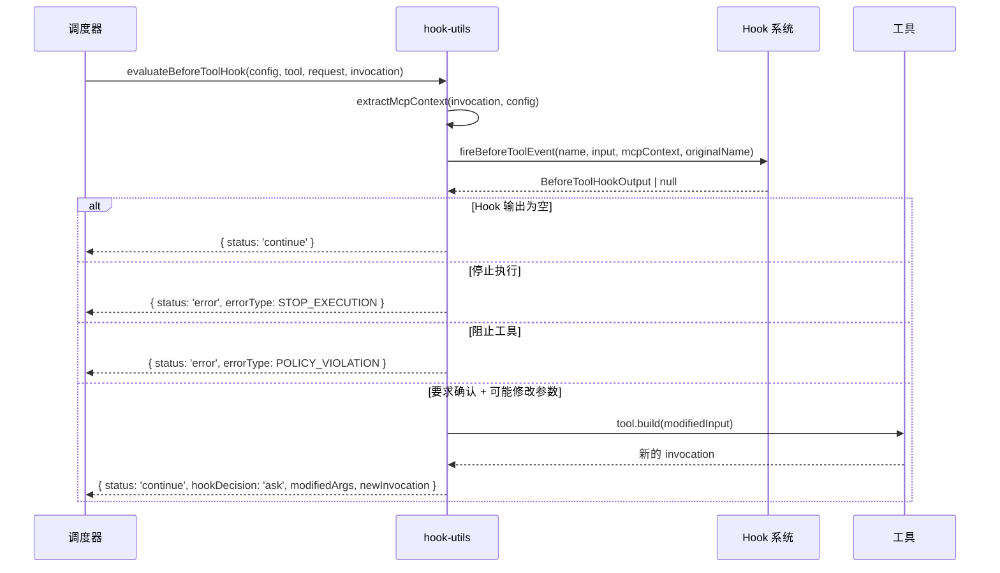

# hook-utils.ts

## 概述

`hook-utils.ts` 是调度器（Scheduler）中负责**工具调用前置 Hook 评估**的工具模块。它提供了 `evaluateBeforeToolHook` 函数，用于在工具实际执行前触发 Hook 系统的 `beforeTool` 事件，并根据 Hook 的输出决定后续的处理策略。

Hook 系统允许用户或扩展通过配置自定义的前置/后置钩子脚本，在工具执行前进行干预。该模块处理的前置 Hook 可以产生以下效果：

1. **放行** (`continue`)：允许工具正常执行。
2. **停止执行** (`STOP_EXECUTION`)：Hook 要求终止整个 Agent 执行流程。
3. **阻止工具** (`POLICY_VIOLATION`)：Hook 阻止当前工具的执行。
4. **要求确认** (`ask`)：Hook 要求在执行前增加用户确认步骤。
5. **修改参数**：Hook 修改工具调用的输入参数。

## 架构图（Mermaid）





## 核心组件

### 1. `HookEvaluationResult` 类型

Hook 评估结果的联合类型（Discriminated Union），使用 `status` 字段区分两种可能的结果。

#### 成功分支 (`status: 'continue'`)

| 字段 | 类型 | 说明 |
|------|------|------|
| `status` | `'continue'` | 标识为"继续执行"分支 |
| `hookDecision` | `'ask' \| 'block'` (可选) | Hook 的决策建议。`'ask'` 表示需要用户确认；`'block'` 表示建议阻止 |
| `hookSystemMessage` | `string` (可选) | Hook 附加的系统消息，显示在确认提示中 |
| `modifiedArgs` | `Record<string, unknown>` (可选) | Hook 修改后的工具参数 |
| `newInvocation` | `AnyToolInvocation` (可选) | 用修改后参数构建的新工具调用实例 |

#### 错误分支 (`status: 'error'`)

| 字段 | 类型 | 说明 |
|------|------|------|
| `status` | `'error'` | 标识为"错误"分支 |
| `error` | `Error` | 错误对象，包含描述性消息 |
| `errorType` | `ToolErrorType` | 错误类型枚举（`STOP_EXECUTION`、`POLICY_VIOLATION`、`INVALID_TOOL_PARAMS`） |

### 2. `evaluateBeforeToolHook` 函数

**导出的主函数**，评估工具调用前的 Hook 并返回评估结果。

**签名**：

```typescript
async function evaluateBeforeToolHook(
  config: Config,
  tool: AnyDeclarativeTool,
  request: ToolCallRequestInfo,
  invocation: AnyToolInvocation,
): Promise<HookEvaluationResult>
```

**参数**：

| 参数 | 类型 | 说明 |
|------|------|------|
| `config` | `Config` | 全局配置对象，用于获取 Hook 系统实例 |
| `tool` | `AnyDeclarativeTool` | 工具声明定义，提供 `build()` 方法用于重建 invocation |
| `request` | `ToolCallRequestInfo` | 工具调用请求信息，包含工具名称和原始请求名 |
| `invocation` | `AnyToolInvocation` | 当前的工具调用实例，包含参数 |

**执行流程**（按优先级从高到低）：

1. **无 Hook 系统**：直接返回 `{ status: 'continue' }`。
2. **触发 Hook 事件**：
   - 从 `invocation.params` 提取参数。
   - 调用 `extractMcpContext` 获取 MCP 上下文信息。
   - 调用 `hookSystem.fireBeforeToolEvent()`。
3. **无 Hook 输出**：返回 `{ status: 'continue' }`。
4. **停止执行检查** (`shouldStopExecution()`)：返回 `STOP_EXECUTION` 错误。
5. **阻止检查** (`getBlockingError()`)：返回 `POLICY_VIOLATION` 错误。
6. **确认决策检查** (`isAskDecision()`)：设置 `hookDecision = 'ask'` 和 `hookSystemMessage`。
7. **参数修改检查** (`getModifiedToolInput()`)：
   - 获取修改后的参数。
   - 使用 `tool.build(modifiedInput)` 构建新的 invocation。
   - 构建失败则返回 `INVALID_TOOL_PARAMS` 错误。
8. 返回最终的 `continue` 结果（可能附带决策、消息和修改后的参数/invocation）。

## 依赖关系

### 内部依赖

| 模块 | 导入内容 | 用途 |
|------|---------|------|
| `../config/config.js` | `Config` | 全局配置类型，用于获取 Hook 系统 (`config.getHookSystem()`) |
| `../tools/tools.js` | `AnyDeclarativeTool`, `AnyToolInvocation` | 工具声明和调用实例类型 |
| `./types.js` | `ToolCallRequestInfo` | 工具调用请求信息类型（包含 `name` 和 `originalRequestName`） |
| `../core/coreToolHookTriggers.js` | `extractMcpContext` | 从 invocation 和 config 中提取 MCP 上下文信息 |
| `../hooks/types.js` | `BeforeToolHookOutput` | Hook 输出类型，用于 `instanceof` 检查和获取修改后的工具输入 |
| `../tools/tool-error.js` | `ToolErrorType` | 工具错误类型枚举（`STOP_EXECUTION`、`POLICY_VIOLATION`、`INVALID_TOOL_PARAMS`） |

### 外部依赖

无。此模块不依赖任何外部第三方包或 Node.js 内置模块。

## 关键实现细节

### 1. 判断优先级链

Hook 输出的判断遵循严格的优先级链，确保更严重的决策优先处理：

```
停止执行 > 阻止工具 > 要求确认 > 修改参数 > 放行
```

- `shouldStopExecution()` 最优先，因为它影响整个 Agent 流程。
- `getBlockingError()` 次之，因为它阻止单个工具执行。
- `isAskDecision()` 和参数修改**不互斥**，可以同时存在（既修改参数又要求确认）。

### 2. 参数修改的验证机制

当 Hook 修改了工具参数时，不是直接使用修改后的参数，而是通过 `tool.build(modifiedInput)` 重新构建 invocation：

```typescript
try {
  newInvocation = tool.build(modifiedInput);
} catch (error) {
  return {
    status: 'error',
    error: new Error(`Tool parameter modification by hook failed validation: ...`),
    errorType: ToolErrorType.INVALID_TOOL_PARAMS,
  };
}
```

这确保了 Hook 修改后的参数仍然符合工具的参数校验规则。如果 `build()` 抛出异常（如参数类型不匹配、缺少必填字段等），则返回 `INVALID_TOOL_PARAMS` 错误，而不是让无效参数进入执行流程。

### 3. `instanceof` 检查的必要性

在检查参数修改时使用了 `instanceof BeforeToolHookOutput`：

```typescript
if (beforeOutput instanceof BeforeToolHookOutput) {
  const modifiedInput = beforeOutput.getModifiedToolInput();
  // ...
}
```

这是因为 `fireBeforeToolEvent` 的返回类型可能是更宽泛的接口类型，而 `getModifiedToolInput()` 方法仅在具体的 `BeforeToolHookOutput` 类上定义。`instanceof` 检查确保了类型安全。

### 4. MCP 上下文提取

`extractMcpContext(invocation, config)` 用于获取 MCP（Model Context Protocol）相关的上下文信息。对于通过 MCP 协议调用的远程工具，这个上下文可能包含 MCP 服务器名称、工具来源等信息，便于 Hook 根据工具来源做出更精确的决策。

### 5. 无副作用设计

该函数是**纯评估函数**，不修改任何传入参数的状态：
- 不修改 `invocation` 原始对象。
- 不修改 `request` 对象。
- 通过返回新的 `modifiedArgs` 和 `newInvocation` 来传递修改结果。
- 调用方负责决定是否应用这些修改。

### 6. 三种错误类型的语义

| 错误类型 | 触发条件 | 语义 |
|---------|---------|------|
| `STOP_EXECUTION` | Hook 调用 `shouldStopExecution()` 返回 `true` | 整个 Agent 应停止执行，通常表示严重问题 |
| `POLICY_VIOLATION` | Hook 的 `getBlockingError()` 返回阻止信息 | 当前工具违反了策略规则，应跳过但 Agent 可继续 |
| `INVALID_TOOL_PARAMS` | Hook 修改的参数导致 `tool.build()` 失败 | Hook 脚本的参数修改有误，是 Hook 自身的问题 |
