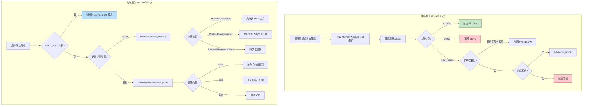
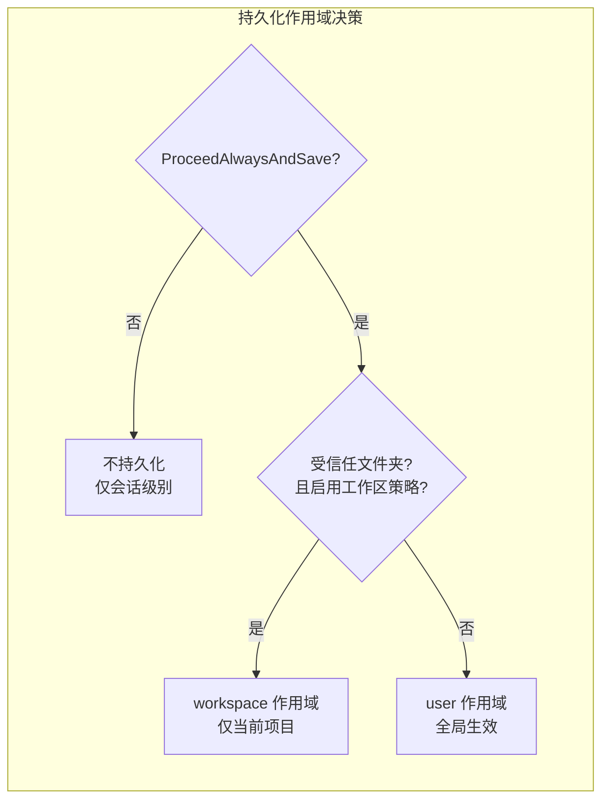

# policy.ts

## 概述

`policy.ts` 是调度器（Scheduler）中负责**工具调用策略评估与策略更新**的核心模块。它连接了策略引擎（Policy Engine）和用户确认流程，在工具执行的生命周期中承担两个关键职责：

1. **策略检查 (`checkPolicy`)**：在工具执行前查询策略引擎，判断该工具是否被允许执行、需要用户确认、还是被拒绝。
2. **策略更新 (`updatePolicy`)**：在用户完成确认后，根据用户的决策（如"始终允许"、"始终允许并保存"）更新策略规则，实现"记住我的选择"功能。

该模块还处理了特殊场景，包括：
- 客户端发起的工具调用自动跳过确认
- 非交互模式下的策略限制
- MCP 工具的特殊策略处理（按工具/按服务器粒度）
- 编辑工具触发的 `AUTO_EDIT` 模式切换
- 策略持久化的作用域选择（工作区 vs 用户级别）

## 架构图（Mermaid）





## 核心组件

### 1. `getPolicyDenialError(config, rule?)`

**导出的辅助函数**，格式化策略拒绝的错误信息。

**参数**：

| 参数 | 类型 | 说明 |
|------|------|------|
| `config` | `Config` | 全局配置对象（当前未使用，预留） |
| `rule` | `PolicyRule` (可选) | 匹配的策略规则，可能包含自定义的 `denyMessage` |

**返回值**：

| 字段 | 类型 | 说明 |
|------|------|------|
| `errorMessage` | `string` | 格式化的错误消息，如 `"Tool execution denied by policy. <自定义消息>"` |
| `errorType` | `ToolErrorType` | 固定为 `ToolErrorType.POLICY_VIOLATION` |

### 2. `checkPolicy(toolCall, config, subagent?): Promise<CheckResult>`

**导出的核心函数**，查询策略引擎判断工具是否可以执行。

**参数**：

| 参数 | 类型 | 说明 |
|------|------|------|
| `toolCall` | `ValidatingToolCall` | 正在验证中的工具调用 |
| `config` | `Config` | 全局配置对象 |
| `subagent` | `string` (可选) | 子代理名称，用于子代理隔离策略 |

**返回值**：`CheckResult`，包含 `decision`（`PolicyDecision` 枚举）和 `rule`（匹配的策略规则）。

**核心逻辑**：

1. **MCP 服务器名提取**：如果工具是 `DiscoveredMCPTool` 的实例，提取其 `serverName`。
2. **策略引擎查询**：调用 `config.getPolicyEngine().check()`，传入工具名、参数、服务器名、工具注解和子代理标识。
3. **客户端发起的隐式确认**：
   - 如果策略决策为 `ASK_USER`，且工具调用由客户端发起（如用户通过斜杠命令触发），且不需要额外权限，则自动升级为 `ALLOW`。
   - 这是因为客户端发起的操作已经隐含了用户的确认意图。
4. **非交互模式检查**：如果策略决策为 `ASK_USER` 但当前是非交互模式（如 CI/CD 环境），抛出错误。

### 3. `updatePolicy(tool, outcome, confirmationDetails, context, messageBus, toolInvocation?): Promise<void>`

**导出的核心函数**，根据用户的确认决策更新策略规则。

**参数**：

| 参数 | 类型 | 说明 |
|------|------|------|
| `tool` | `AnyDeclarativeTool` | 工具声明定义 |
| `outcome` | `ToolConfirmationOutcome` | 用户的确认结果枚举 |
| `confirmationDetails` | `SerializableConfirmationDetails` (可选) | 确认详情，包含类型和上下文信息 |
| `context` | `AgentLoopContext` | Agent 循环上下文 |
| `messageBus` | `MessageBus` | 消息总线，用于发布策略更新事件 |
| `toolInvocation` | `AnyToolInvocation` (可选) | 工具调用实例，提供自定义的策略更新选项 |

**处理流程**（按优先级）：

1. **AUTO_EDIT 模式转换**：如果是编辑工具且用户选择 `ProceedAlways`，切换全局审批模式为 `AUTO_EDIT`，直接返回。
2. **持久化作用域决策**：
   - 仅 `ProceedAlwaysAndSave` 触发持久化。
   - 优先选择 `workspace` 作用域（需要受信任文件夹 + 工作区策略目录）。
   - 否则使用 `user` 作用域。
3. **MCP 工具策略更新**：如果确认详情类型为 `'mcp'`，委托给 `handleMcpPolicyUpdate`。
4. **标准工具策略更新**：其他情况委托给 `handleStandardPolicyUpdate`。

### 4. `isAutoEditTransition(tool, outcome): boolean`（内部函数）

判断是否应该触发 AUTO_EDIT 模式转换。

- 条件：`outcome === ProceedAlways` **且** 工具名在 `EDIT_TOOL_NAMES` 集合中。
- 当用户对编辑类工具选择"始终允许"时，整个会话切换到 AUTO_EDIT 模式，后续所有编辑操作不再需要确认。

### 5. `handleStandardPolicyUpdate(...)`: Promise<void>（内部函数）

处理标准工具（Shell、编辑等）的策略更新。

- 仅在 `ProceedAlways` 或 `ProceedAlwaysAndSave` 时执行。
- **策略更新选项获取**：
  1. 优先使用 `toolInvocation.getPolicyUpdateOptions()` 返回的自定义选项。
  2. 对于 `exec` 类型（命令执行），使用 `confirmationDetails.rootCommands` 作为命令前缀。
  3. 对于 `edit` 类型（文件编辑），使用文件路径构建参数匹配模式（转为相对路径）。
- 通过 `messageBus.publish` 发布 `UPDATE_POLICY` 事件。

**发布的消息结构**：

```typescript
{
  type: MessageBusType.UPDATE_POLICY,
  toolName: string,
  persist: boolean,         // 是否持久化
  persistScope?: string,    // 持久化作用域
  commandPrefix?: string[], // 命令前缀（exec 类型）
  argsPattern?: object,     // 参数匹配模式（edit 类型）
}
```

### 6. `handleMcpPolicyUpdate(...)`: Promise<void>（内部函数）

处理 MCP 工具的策略更新，支持更细粒度的授权。

- 仅在以下 outcome 时执行：
  - `ProceedAlways`：始终允许当前 MCP 工具
  - `ProceedAlwaysTool`：始终允许当前 MCP 工具（显式）
  - `ProceedAlwaysServer`：始终允许该 MCP 服务器的所有工具
  - `ProceedAlwaysAndSave`：始终允许并持久化
- **服务器级别通配**：当 `outcome === ProceedAlwaysServer` 时，使用 `formatMcpToolName(serverName, '*')` 生成通配符工具名（如 `mcp_server_name/*`），允许该服务器的所有工具。
- 通过 `messageBus.publish` 发布 `UPDATE_POLICY` 事件，包含 `mcpName` 字段。

## 依赖关系

### 内部依赖

| 模块 | 导入内容 | 用途 |
|------|---------|------|
| `../tools/tool-error.js` | `ToolErrorType` | 工具错误类型枚举 |
| `../policy/types.js` | `ApprovalMode`, `PolicyDecision`, `CheckResult`, `PolicyRule` | 策略类型定义 |
| `../config/config.js` | `Config` | 全局配置类型 |
| `../confirmation-bus/message-bus.js` | `MessageBus` | 消息总线类型 |
| `../confirmation-bus/types.js` | `MessageBusType`, `SerializableConfirmationDetails` | 消息总线事件类型 |
| `../tools/tools.js` | `ToolConfirmationOutcome`, `AnyDeclarativeTool`, `AnyToolInvocation`, `PolicyUpdateOptions` | 工具和确认类型 |
| `../policy/utils.js` | `buildFilePathArgsPattern` | 从文件路径构建策略参数匹配模式 |
| `../utils/paths.js` | `makeRelative` | 将绝对路径转为相对路径 |
| `../tools/mcp-tool.js` | `DiscoveredMCPTool`, `formatMcpToolName` | MCP 工具类和名称格式化 |
| `../tools/tool-names.js` | `EDIT_TOOL_NAMES` | 编辑类工具名称集合 |
| `./types.js` | `ValidatingToolCall` | 验证中的工具调用类型 |
| `../config/agent-loop-context.js` | `AgentLoopContext` | Agent 循环上下文类型 |

### 外部依赖

无。此模块不依赖任何外部第三方包或 Node.js 内置模块。

## 关键实现细节

### 1. 客户端发起调用的隐式确认

```typescript
if (
  decision === PolicyDecision.ASK_USER &&
  toolCall.request.isClientInitiated &&
  !toolCall.request.args?.['additional_permissions']
) {
  return { decision: PolicyDecision.ALLOW, rule: result.rule };
}
```

当用户通过斜杠命令（如 `/edit`）主动发起工具调用时，被视为已经隐式确认。但如果工具请求包含 `additional_permissions` 参数（表示需要额外权限），则仍然需要显式确认。这在安全性和用户体验之间取得了平衡。

### 2. 持久化作用域的双层结构

策略持久化支持两个作用域：

| 作用域 | 条件 | 存储位置 | 影响范围 |
|--------|------|---------|---------|
| `workspace` | 受信任文件夹 + 工作区策略目录可用 | 工作区目录 | 仅当前项目 |
| `user` | 其他情况 | 用户目录 | 所有项目 |

优先使用 `workspace` 作用域，确保项目特定的策略不会泄漏到其他项目。

### 3. AUTO_EDIT 模式的特殊处理

编辑类工具（`EDIT_TOOL_NAMES` 集合中的工具）在用户选择"始终允许"时，不是简单地添加一条策略规则，而是将整个会话的审批模式切换为 `AUTO_EDIT`。这意味着：

- 后续所有编辑操作都不再需要确认（会话级别）。
- 这是一种**模式转换**而非**规则添加**。
- 注释标明这是一个临时方案，未来计划重构。

### 4. MCP 工具的多级授权粒度

MCP 工具提供了比标准工具更细粒度的授权选择：

| 粒度 | Outcome | 效果 |
|------|---------|------|
| 单次 | `ProceedOnce` | 仅本次允许 |
| 工具级别 | `ProceedAlways` / `ProceedAlwaysTool` | 始终允许该特定 MCP 工具 |
| 服务器级别 | `ProceedAlwaysServer` | 始终允许该 MCP 服务器的所有工具（使用通配符 `*`） |
| 持久化 | `ProceedAlwaysAndSave` | 始终允许并保存到磁盘 |

服务器级别通配通过 `formatMcpToolName(serverName, '*')` 实现，生成如 `mcp__serverName__*` 的通配符模式。

### 5. 标准工具策略更新的参数匹配

标准工具的策略更新不是简单的"允许工具 X"，而是**带参数约束的允许**：

- **exec 类型**（Shell 命令）：使用 `rootCommands`（命令前缀），如允许所有以 `npm` 开头的命令。
- **edit 类型**（文件编辑）：使用 `buildFilePathArgsPattern(filePath)` 构建文件路径匹配模式，且将文件路径转为相对路径以增强可移植性。
- **自定义选项**：`toolInvocation.getPolicyUpdateOptions()` 允许工具自身定义策略更新逻辑，优先级最高。

### 6. 消息总线的异步策略更新

策略更新通过 `messageBus.publish` 发布 `UPDATE_POLICY` 事件，而不是直接修改策略引擎。这种**事件驱动**的设计：
- 解耦了策略评估模块和策略持久化模块。
- 允许多个监听者响应策略更新事件（如 UI 更新、日志记录等）。
- 确保策略更新的原子性和一致性由事件处理器保证。

### 7. 非交互模式的严格限制

在 CI/CD 等非交互环境中，如果策略引擎返回 `ASK_USER`，直接抛出错误而不是默认允许或拒绝。这迫使用户在非交互场景中通过配置明确指定策略，避免安全风险。
