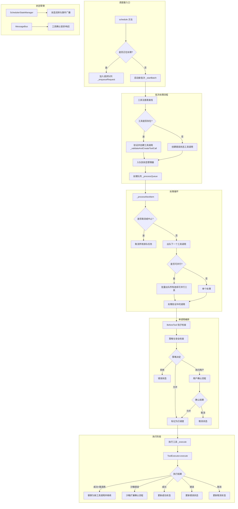
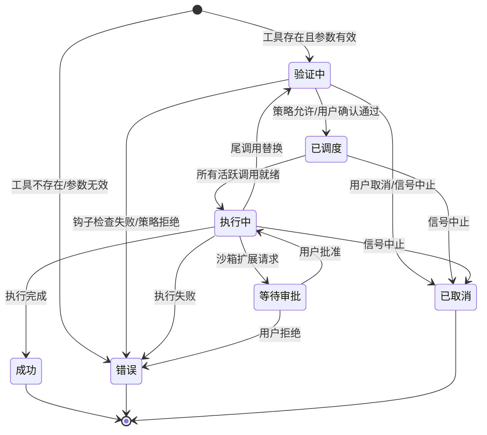

# scheduler.ts

## 概述

`Scheduler` 是 Gemini CLI 核心调度器，作为**事件驱动的工具执行编排器**（Event-Driven Orchestrator for Tool Execution），负责协调工具调用的完整生命周期。它管理工具调用从接收请求、验证、策略检查、用户确认、执行到最终完成的全过程。

调度器采用**队列 + 状态机**的架构模式：
- 外部请求通过 `schedule()` 方法进入，如果当前有批次正在处理则排队等待
- 内部通过 `SchedulerStateManager` 管理每个工具调用的状态流转
- 支持工具调用的并行执行和串行执行（通过 `wait_for_previous` 参数控制）

## 架构图（Mermaid）



### 工具调用状态流转图



## 核心组件

### 1. `SchedulerQueueItem` 接口

```typescript
interface SchedulerQueueItem {
  requests: ToolCallRequestInfo[];
  signal: AbortSignal;
  resolve: (results: CompletedToolCall[]) => void;
  reject: (reason?: Error) => void;
}
```

调度器内部请求队列的元素类型。当调度器正在处理一个批次时，新到的请求会被包装成 `SchedulerQueueItem` 放入 `requestQueue` 中等待。每个队列项包含一组工具调用请求、中止信号以及 Promise 的 resolve/reject 回调。

### 2. `SchedulerOptions` 接口

```typescript
export interface SchedulerOptions {
  context: AgentLoopContext;        // Agent 循环上下文，包含配置、工具注册表等
  messageBus?: MessageBus;          // 消息总线，用于确认流程通信
  getPreferredEditor: () => EditorType | undefined;  // 获取首选编辑器
  schedulerId: string;              // 调度器唯一标识
  subagent?: string;                // 子代理名称（可选）
  parentCallId?: string;            // 父调用 ID（可选，用于子代理场景）
  onWaitingForConfirmation?: (waiting: boolean) => void;  // 等待确认状态回调
}
```

调度器构造参数。`schedulerId` 用于标识调度器实例，`subagent` 和 `parentCallId` 用于子代理隔离场景。

### 3. `createErrorResponse` 辅助函数

```typescript
const createErrorResponse = (
  request: ToolCallRequestInfo,
  error: Error,
  errorType: ToolErrorType | undefined,
): ToolCallResponseInfo => ({...})
```

生成标准化的错误响应对象，包含 `functionResponse` 格式以便返回给 LLM。

### 4. `Scheduler` 类

#### 静态属性

| 属性 | 类型 | 说明 |
|------|------|------|
| `subscribedMessageBuses` | `WeakSet<MessageBus>` | 跟踪已注册监听器的 MessageBus 实例，防止重复注册 |

#### 实例属性

| 属性 | 类型 | 说明 |
|------|------|------|
| `state` | `SchedulerStateManager` | 状态管理器，管理所有工具调用的状态和生命周期 |
| `executor` | `ToolExecutor` | 工具执行器，负责实际的工具执行 |
| `modifier` | `ToolModificationHandler` | 工具修改处理器，用于确认流程中的参数修改 |
| `config` | `Config` | 配置对象 |
| `context` | `AgentLoopContext` | Agent 循环上下文 |
| `messageBus` | `MessageBus` | 消息总线 |
| `getPreferredEditor` | `() => EditorType \| undefined` | 首选编辑器获取函数 |
| `schedulerId` | `string` | 调度器 ID |
| `subagent` | `string?` | 子代理名称 |
| `parentCallId` | `string?` | 父调用 ID |
| `onWaitingForConfirmation` | `(waiting: boolean) => void` | 等待确认回调 |
| `isProcessing` | `boolean` | 是否正在处理批次 |
| `isCancelling` | `boolean` | 是否正在取消 |
| `requestQueue` | `SchedulerQueueItem[]` | 请求队列 |

#### 核心方法

##### `constructor(options: SchedulerOptions)`
初始化调度器，创建状态管理器、工具执行器和修改处理器实例。设置 MessageBus 监听器和 MCP 进度事件监听器。

##### `dispose(): void`
清理资源，移除 MCP 进度事件监听器。

##### `schedule(request, signal): Promise<CompletedToolCall[]>`
**主入口方法**。接受单个或多个工具调用请求，返回完成的工具调用结果。内部使用 `runInDevTraceSpan` 进行遥测追踪。如果当前正在处理则排队，否则启动新批次。

##### `cancelAll(): void`
取消所有工具调用。清空请求队列（reject 所有等待的 Promise），将所有活跃调用标记为已取消，取消所有排队的调用。使用 `isCancelling` 标志防止重入。

##### `_startBatch(requests, signal): Promise<CompletedToolCall[]>`
**Phase 1: 批次启动**。将请求映射为 `ToolCall` 对象（验证中或错误状态），入队到状态管理器，然后开始处理循环。处理完成后清理状态并处理请求队列中的下一个请求。

##### `_processQueue(signal): Promise<void>`
**Phase 2: 处理循环**。持续循环直到队列为空且无活跃调用。

##### `_processNextItem(signal): Promise<boolean>`
处理循环的核心方法，每次迭代包含三个步骤：
1. **处理所有验证中的调用**（策略检查、用户确认）- 并行处理
2. **执行所有已调度的调用** - 仅在所有活跃调用都就绪时执行，并行执行
3. **终结所有终态调用** - 从活跃列表移到完成列表

如果没有进展但有活跃调用在等待外部事件（审批、执行中），则通过 `queueMicrotask` 让出事件循环。

##### `_isParallelizable(request): boolean`
判断工具调用是否可并行。通过检查参数中的 `wait_for_previous` 布尔值决定，默认为可并行（true）。

##### `_processToolCall(toolCall, signal): Promise<void>`
**Phase 3: 单调用编排**。完整流程：
1. 执行 BeforeTool 钩子
2. 应用钩子可能的参数修改
3. 策略检查（checkPolicy）
4. 如果需要用户确认，进入确认流程（resolveConfirmation）
5. 更新策略（如果用户做出了选择）
6. 处理取消（级联取消整个批次）
7. 标记为已调度

##### `_execute(toolCall, signal): Promise<boolean>`
执行工具并记录结果。处理三种特殊情况：
1. **尾调用（Tail Call）**：执行完成后产生了新的工具调用请求，替换当前调用继续处理
2. **沙箱错误**：工具需要额外沙箱权限，触发沙箱扩展确认流程
3. **普通结果**：更新成功/错误/取消状态

返回 `true` 表示添加了新的工具调用（尾调用场景），循环应继续。

##### `_processNextInRequestQueue()`
批次处理完成后，从请求队列取出下一个请求并调度。

## 依赖关系

### 内部依赖

| 模块 | 导入内容 | 用途 |
|------|----------|------|
| `../config/config.js` | `Config` 类型 | 配置管理 |
| `../config/agent-loop-context.js` | `AgentLoopContext` 类型 | Agent 循环上下文 |
| `../confirmation-bus/message-bus.js` | `MessageBus` 类型 | 消息总线接口 |
| `./state-manager.js` | `SchedulerStateManager` | 工具调用状态管理 |
| `./confirmation.js` | `resolveConfirmation` | 用户确认流程 |
| `./policy.js` | `checkPolicy`, `updatePolicy`, `getPolicyDenialError` | 策略检查与更新 |
| `./hook-utils.js` | `evaluateBeforeToolHook` | BeforeTool 钩子评估 |
| `./tool-executor.js` | `ToolExecutor` | 工具实际执行 |
| `./tool-modifier.js` | `ToolModificationHandler` | 工具参数修改 |
| `./types.js` | 多种工具调用类型和状态枚举 | 类型定义 |
| `../tools/tool-error.js` | `ToolErrorType` | 错误类型枚举 |
| `../policy/types.js` | `PolicyDecision`, `ApprovalMode` | 策略决策类型 |
| `../tools/tools.js` | `ToolConfirmationOutcome`, `AnyDeclarativeTool` | 工具确认结果和声明式工具类型 |
| `../utils/tool-utils.js` | `getToolSuggestion` | 工具名建议（用于工具未找到时） |
| `../telemetry/trace.js` | `runInDevTraceSpan` | 开发环境遥测追踪 |
| `../telemetry/loggers.js` | `logToolCall` | 工具调用日志 |
| `../telemetry/types.js` | `ToolCallEvent` | 遥测事件类型 |
| `../utils/editor.js` | `EditorType` 类型 | 编辑器类型 |
| `../confirmation-bus/types.js` | `MessageBusType`, 确认相关类型 | 消息总线类型定义 |
| `../utils/toolCallContext.js` | `runWithToolCallContext` | 工具调用上下文管理 |
| `../utils/events.js` | `coreEvents`, `CoreEvent`, `McpProgressPayload` | 核心事件系统 |
| `../telemetry/constants.js` | `GeminiCliOperation` | 遥测操作常量 |

### 外部依赖

无直接的第三方外部依赖。所有依赖均为项目内部模块。使用了 Node.js 内置的 `crypto.randomUUID()` API。

## 关键实现细节

### 1. 请求队列机制

调度器同一时间只处理一个批次（由 `isProcessing` 标志控制）。新到的请求如果发现调度器忙碌，会通过 `_enqueueRequest` 包装成带有 Promise 回调的队列项，放入 `requestQueue` 等待。当前批次完成后，`_processNextInRequestQueue` 会自动取出并调度下一个。

队列中的请求支持中止：如果 AbortSignal 触发，会从队列中移除该请求并 reject 其 Promise。

### 2. 并行执行策略

调度器支持工具调用的批量并行执行。在 `_processNextItem` 中：
- 如果出队的第一个工具调用可并行（`_isParallelizable` 返回 true），则会连续出队所有相邻的可并行工具调用
- 可并行性通过工具参数中的 `wait_for_previous` 布尔字段控制，默认可并行
- 验证阶段（策略检查、确认）使用 `Promise.all` 并行处理
- 执行阶段也使用 `Promise.all` 并行执行，但要求所有活跃调用都处于就绪状态（已调度或终态）

### 3. 三阶段处理流程

每次 `_processNextItem` 迭代包含三个有序步骤：
1. **验证阶段**：处理所有 `Validating` 状态的调用（策略检查、钩子、用户确认）
2. **执行阶段**：当所有活跃调用就绪后，执行所有 `Scheduled` 状态的调用
3. **终结阶段**：将所有终态（Success/Error/Cancelled）的调用从活跃列表移到完成列表

### 4. 尾调用机制（Tail Call）

工具执行完成后可能产生新的工具调用请求（`tailToolCallRequest`）。这种情况下：
- 记录中间工具调用的遥测日志
- 使用原始 `callId` 和 `originalRequestName` 创建新的请求
- 通过 `state.replaceActiveCallWithTailCall` 替换当前调用
- 处理循环继续处理新的工具调用

### 5. 沙箱扩展处理

当工具执行因沙箱权限不足而失败时（`sandbox_expansion_required` 错误类型）：
- 解析错误信息获取需要的额外权限
- 修改工具调用参数添加 `additional_permissions`
- 触发用户确认流程询问是否扩展沙箱权限
- 用户批准后重新执行工具，用户拒绝则返回错误

### 6. MessageBus 去重

使用静态 `WeakSet<MessageBus>` 跟踪已订阅的 MessageBus 实例，防止在多个 Scheduler 实例共享同一 MessageBus 时重复注册监听器。当前实现中，监听器对所有工具确认请求返回"未确认"（`confirmed: false`）并标记需要用户确认（`requiresUserConfirmation: true`）。

### 7. MCP 进度处理

通过监听 `CoreEvent.McpProgress` 事件，实时更新执行中的工具调用进度信息，包括进度消息、百分比和进度值。仅在工具调用处于 `Executing` 状态时处理进度更新。

### 8. 防卡死机制

`_processNextItem` 在每次迭代中检测是否有进展（状态变化或终结完成）。如果没有进展但有调用在等待外部事件（审批或执行中），通过 `queueMicrotask` 让出事件循环允许外部事件到达。如果既没有进展也没有等待外部事件，则判定为卡住状态并终止循环。

### 9. 取消级联

用户在确认流程中选择取消时，不仅取消当前工具调用，还会级联取消队列中所有排队的工具调用（`state.cancelAllQueued`）。`cancelAll` 方法则是完全取消，清空请求队列和所有活跃/排队调用。
