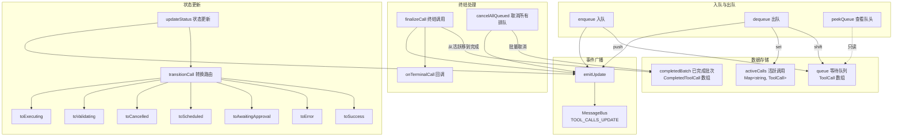
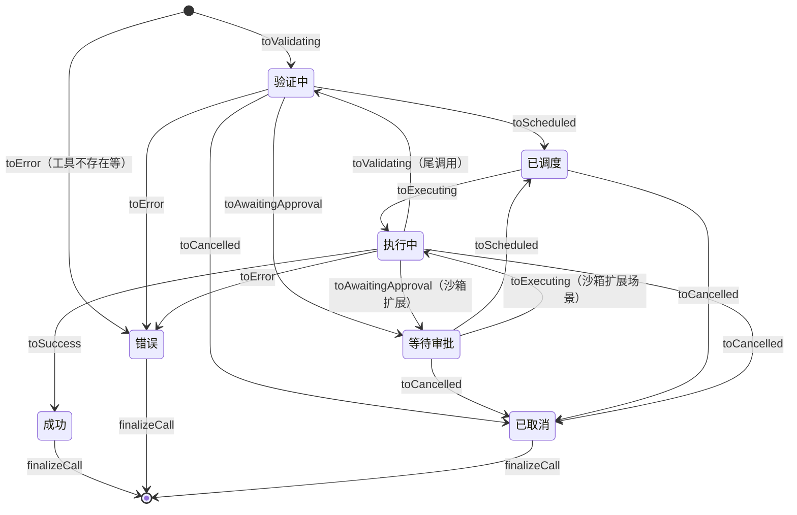

# state-manager.ts

## 概述

`SchedulerStateManager` 是调度器的**状态管理核心**，负责管理所有工具调用的生命周期状态。它维护三个集合：等待队列（queue）、活跃调用（activeCalls）和已完成批次（completedBatch），并通过 MessageBus 将每次状态变更广播给外部订阅者。

该类实现了一个**类型安全的状态机**，使用 TypeScript 方法重载确保每种状态转换都携带正确的附加数据类型。所有状态转换都通过 `transitionCall` 方法路由到对应的转换助手函数，保证状态流转的一致性和安全性。

## 架构图（Mermaid）



### 状态转换详细图



## 核心组件

### 1. `TerminalCallHandler` 类型

```typescript
export type TerminalCallHandler = (call: CompletedToolCall) => void;
```

工具调用到达终态（成功/错误/取消）时触发的回调函数类型。在 `Scheduler` 中用于日志记录（`logToolCall`）。

### 2. `SchedulerStateManager` 类

#### 构造参数

| 参数 | 类型 | 默认值 | 说明 |
|------|------|--------|------|
| `messageBus` | `MessageBus` | 必填 | 消息总线，用于广播状态更新事件 |
| `schedulerId` | `string` | `ROOT_SCHEDULER_ID` | 调度器标识符 |
| `onTerminalCall` | `TerminalCallHandler` | `undefined` | 工具调用到达终态时的回调 |

#### 私有数据结构

| 属性 | 类型 | 说明 |
|------|------|------|
| `activeCalls` | `Map<string, ToolCall>` | 当前正在处理的工具调用，key 为 callId |
| `queue` | `ToolCall[]` | 等待处理的工具调用队列（FIFO） |
| `_completedBatch` | `CompletedToolCall[]` | 当前批次已完成的工具调用 |

#### 公共方法

##### `addToolCalls(calls: ToolCall[]): void`
`enqueue` 的别名方法，将工具调用添加到队列。

##### `getToolCall(callId: string): ToolCall | undefined`
按 callId 查找工具调用，依次在活跃调用、队列、已完成批次中查找。

##### `enqueue(calls: ToolCall[]): void`
将一组工具调用添加到等待队列尾部，并广播更新事件。

##### `dequeue(): ToolCall | undefined`
从队列头部取出工具调用，移入活跃调用 Map 中，并广播更新事件。返回取出的调用或 `undefined`。

##### `peekQueue(): ToolCall | undefined`
查看队列头部的工具调用但不取出。

##### `isActive: boolean`（getter）
是否有活跃的工具调用。

##### `allActiveCalls: ToolCall[]`（getter）
获取所有活跃工具调用的数组副本。

##### `activeCallCount: number`（getter）
活跃工具调用数量。

##### `queueLength: number`（getter）
队列长度。

##### `firstActiveCall: ToolCall | undefined`（getter）
获取第一个活跃的工具调用。

##### `updateStatus(callId, status, data?): void`
**核心方法**。使用 TypeScript 方法重载提供类型安全的状态更新。不同状态需要不同类型的附加数据：

| 目标状态 | 附加数据类型 | 说明 |
|----------|-------------|------|
| `Success` | `ToolCallResponseInfo` | 工具执行成功的响应 |
| `Error` | `ToolCallResponseInfo` | 工具执行失败的响应 |
| `AwaitingApproval` | `ToolCallConfirmationDetails` 或 `{correlationId, confirmationDetails}` | 确认详情（支持遗留和事件驱动两种格式） |
| `Cancelled` | `string` 或 `ToolCallResponseInfo` | 取消原因字符串或包含响应的取消 |
| `Executing` | `Partial<ExecutingToolCall>?` | 可选的执行中状态补丁（liveOutput、pid、progress等） |
| `Scheduled` / `Validating` | 无 | 无需附加数据 |

##### `finalizeCall(callId: string): void`
将终态的工具调用从活跃列表移到已完成批次。触发 `onTerminalCall` 回调并广播更新。

##### `updateArgs(callId, newArgs, newInvocation): void`
更新活跃工具调用的参数和调用对象。错误状态的调用不可更新。

##### `setOutcome(callId, outcome): void`
设置工具调用的确认结果（用户选择的操作）。

##### `replaceActiveCallWithTailCall(callId, nextCall): void`
**尾调用支持**。将当前活跃调用替换为新的工具调用，新调用被放到队列头部（`unshift`）以便立即处理。原调用直接从活跃列表中删除（不进入已完成列表）。

##### `cancelAllQueued(reason: string): void`
取消队列中所有等待的工具调用。已处于错误状态的调用直接移到完成列表，其余调用通过 `toCancelled` 转换为取消状态后移到完成列表。

##### `getSnapshot(): ToolCall[]`
获取所有工具调用的快照，包含已完成、活跃和排队的所有调用。

##### `clearBatch(): void`
清空已完成批次。

##### `completedBatch: CompletedToolCall[]`（getter）
获取已完成批次的浅拷贝。

#### 私有方法

##### `emitUpdate(): void`
获取当前状态快照并通过 MessageBus 发布 `TOOL_CALLS_UPDATE` 事件。使用 fire-and-forget 模式（`void` 忽略 Promise）。

##### `isTerminalCall(call): boolean`
判断工具调用是否处于终态（Success / Error / Cancelled）。

##### `transitionCall(call, newStatus, auxiliaryData?): ToolCall`
**状态转换路由器**。使用 switch 语句根据目标状态分发到对应的转换助手方法。验证附加数据类型的正确性，类型不匹配时抛出异常。使用 `never` 类型进行穷举检查确保覆盖所有状态。

##### `validateHasToolAndInvocation(call, targetStatus): void`
类型断言方法。验证工具调用具有 `tool` 和 `invocation` 属性，这是许多状态转换的前置条件。不满足时抛出异常。

##### 转换助手方法

| 方法 | 输入 | 输出 | 说明 |
|------|------|------|------|
| `toSuccess` | `ToolCall + ToolCallResponseInfo` | `SuccessfulToolCall` | 计算 `durationMs`，保留 `outcome`、`approvalMode` |
| `toError` | `ToolCall + ToolCallResponseInfo` | `ErroredToolCall` | `tool` 可选（工具不存在场景） |
| `toAwaitingApproval` | `ToolCall + data` | `WaitingToolCall` | 支持事件驱动和遗留两种确认数据格式 |
| `toScheduled` | `ToolCall` | `ScheduledToolCall` | 标记为已调度 |
| `toCancelled` | `ToolCall + reason/response` | `CancelledToolCall` | 处理编辑类工具的 diff 显示保留 |
| `toValidating` | `ToolCall` | `ValidatingToolCall` | 重新标记为验证中 |
| `toExecuting` | `ToolCall + patch?` | `ExecutingToolCall` | 合并执行中数据（liveOutput、pid、progress等） |

## 依赖关系

### 内部依赖

| 模块 | 导入内容 | 用途 |
|------|----------|------|
| `./types.js` | `CoreToolCallStatus`, `ROOT_SCHEDULER_ID`, 多种 ToolCall 类型 | 状态枚举和类型定义 |
| `../tools/tools.js` | `ToolConfirmationOutcome`, `ToolResultDisplay`, `AnyToolInvocation`, `ToolCallConfirmationDetails`, `AnyDeclarativeTool` | 工具相关类型 |
| `../confirmation-bus/message-bus.js` | `MessageBus` 类型 | 消息总线接口 |
| `../confirmation-bus/types.js` | `MessageBusType`, `SerializableConfirmationDetails` | 消息类型和可序列化确认详情 |
| `../utils/tool-utils.js` | `isToolCallResponseInfo` | 类型守卫函数 |
| `../tools/diffOptions.js` | `getDiffStatFromPatch` | 从 patch 字符串派生 diff 统计信息 |

### 外部依赖

无第三方外部依赖。

## 关键实现细节

### 1. 三层数据存储架构

状态管理器维护三个有序集合，工具调用在其中单向流转：

```
queue（等待队列） → activeCalls（活跃调用 Map） → completedBatch（已完成批次）
```

- **queue**：FIFO 数组，`enqueue` 在尾部添加，`dequeue` 从头部取出
- **activeCalls**：`Map<string, ToolCall>`，支持按 callId O(1) 查找和更新
- **completedBatch**：追加数组，存储终态调用

### 2. 类型安全的状态转换

`updateStatus` 使用 TypeScript **方法重载**实现类型安全：

```typescript
updateStatus(callId: string, status: CoreToolCallStatus.Success, data: ToolCallResponseInfo): void;
updateStatus(callId: string, status: CoreToolCallStatus.Error, data: ToolCallResponseInfo): void;
// ... 每种状态一个重载签名
```

调用者必须为每种目标状态提供正确类型的附加数据，编译期即可捕获类型错误。`transitionCall` 内部再做运行时验证作为双重保障。

### 3. 取消时保留编辑差异信息

`toCancelled` 方法中有特殊逻辑：如果被取消的工具调用处于等待审批状态且确认详情类型为 `edit`（文件编辑），会从确认详情中提取 `fileDiff`、`fileName`、`filePath`、`originalContent`、`newContent` 等信息，保存为 `resultDisplay`。这确保即使用户取消了编辑操作，前端仍可显示被取消的编辑差异。

同样，如果取消的是执行中的调用且有 `liveOutput`，也会保留已有的输出。

### 4. 尾调用替换机制

`replaceActiveCallWithTailCall` 方法实现了工具调用的"尾调用替换"：
- 从活跃列表直接删除旧调用（**不**进入已完成列表，因为中间结果由 Scheduler 单独记录日志）
- 新调用通过 `unshift` 放到队列最前面，确保下一次 `dequeue` 立即取到

### 5. 执行中状态的增量更新

`toExecuting` 方法支持增量更新（partial patch），允许在执行过程中逐步更新：
- `liveOutput`：实时输出内容
- `pid`：进程 ID
- `progressMessage`：进度消息
- `progressPercent`：进度百分比
- `progress`：进度值
- `progressTotal`：进度总量

每次更新都会合并已有值，仅覆盖 patch 中提供的字段。

### 6. 事件广播的 Fire-and-Forget 模式

`emitUpdate` 方法使用 `void` 前缀忽略 `messageBus.publish` 返回的 Promise，采用"发射即遗忘"模式。这意味着状态更新的广播不会阻塞状态管理器的后续操作，错误处理由 MessageBus 内部负责。

### 7. `getSnapshot` 的快照顺序

快照方法返回的数组顺序为：已完成的调用在前，活跃调用在中，排队调用在后。这个顺序对应了工具调用的时间线，方便 UI 按时间展示。
