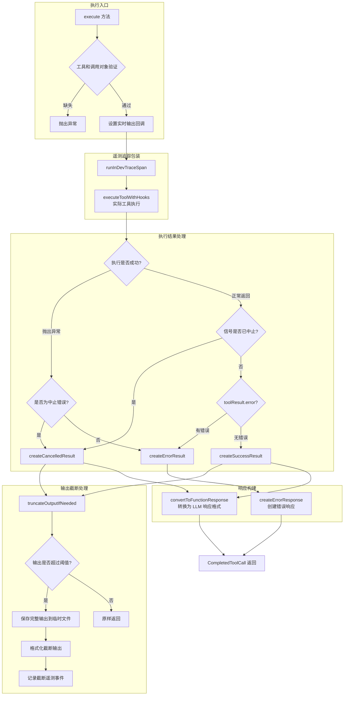
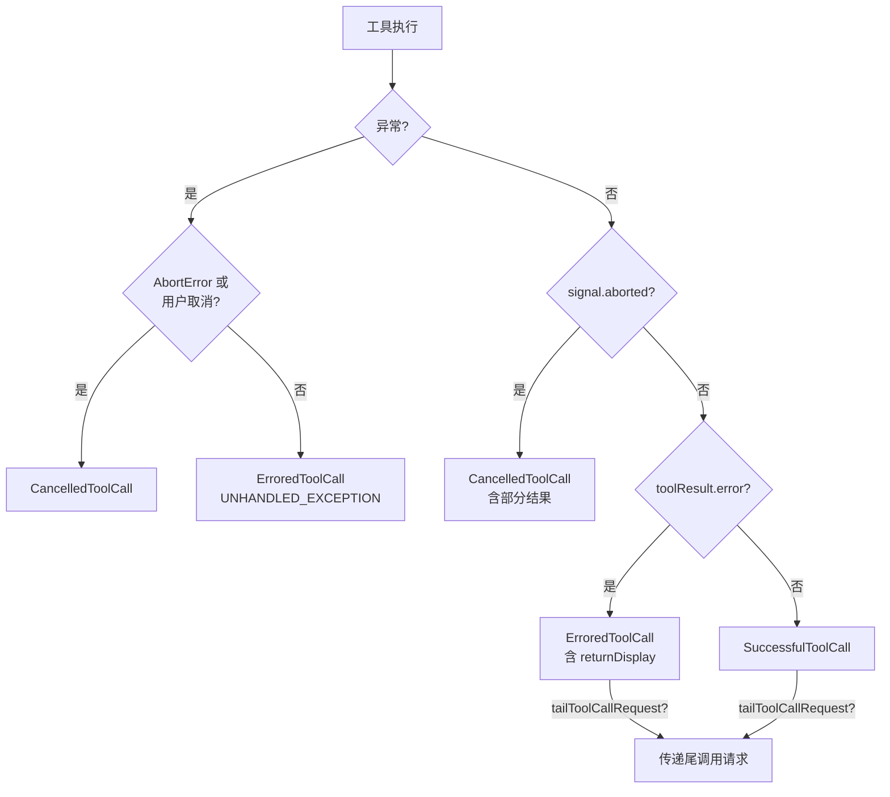

# tool-executor.ts

## 概述

`ToolExecutor` 是调度器的**工具执行引擎**，负责工具调用的实际执行并将执行结果转换为标准化的 `CompletedToolCall` 对象。它处理工具执行的完整生命周期，包括：

- 调用工具（通过 `executeToolWithHooks`）
- 处理实时输出流（Live Output）
- 输出截断与持久化（超大输出存储到临时文件）
- 钩子修改参数的提示注入
- 执行结果的标准化转换（成功/错误/取消）
- 尾调用请求（Tail Call）的传递
- 遥测追踪（telemetry tracing）

## 架构图（Mermaid）



### 结果类型决策图



## 核心组件

### 1. `ToolExecutionContext` 接口

```typescript
export interface ToolExecutionContext {
  call: ToolCall;                                              // 要执行的工具调用
  signal: AbortSignal;                                         // 中止信号
  outputUpdateHandler?: (callId: string, output: ToolLiveOutput) => void;  // 实时输出更新回调
  onUpdateToolCall: (updatedCall: ToolCall) => void;           // 工具调用状态更新回调
}
```

工具执行上下文，封装了执行一个工具调用所需的所有信息。

- `call`：待执行的工具调用对象
- `signal`：AbortSignal，用于取消执行
- `outputUpdateHandler`：可选回调，用于实时输出流式更新（如 shell 命令的标准输出）
- `onUpdateToolCall`：回调函数，用于通知调用方工具调用状态发生变化（如 pid 更新）

### 2. `ToolExecutor` 类

#### 构造参数

| 参数 | 类型 | 说明 |
|------|------|------|
| `context` | `AgentLoopContext` | Agent 循环上下文，包含配置、存储等 |

#### 核心方法

##### `execute(context: ToolExecutionContext): Promise<CompletedToolCall>`

**主执行方法**。执行流程：

1. **验证**：检查工具调用是否具有 `tool` 和 `invocation` 属性
2. **配置实时输出**：如果工具支持 `canUpdateOutput` 且提供了 `outputUpdateHandler`，创建实时输出回调
3. **获取 Shell 执行配置**：从配置中获取 shell 执行参数
4. **遥测追踪**：通过 `runInDevTraceSpan` 包装整个执行过程
5. **设置 PID 回调**：创建 `setExecutionIdCallback`，当工具获得进程 ID 时更新执行中调用的状态
6. **执行工具**：通过 `executeToolWithHooks` 执行（跳过 BeforeTool 钩子，因为调度器已在验证阶段执行过）
7. **钩子修改通知**：如果参数被钩子修改过（`inputModifiedByHook`），在 LLM 内容中追加系统提示
8. **结果处理**：根据执行结果和信号状态，创建对应的 CompletedToolCall

##### `truncateOutputIfNeeded(call, content): Promise<{truncatedContent, outputFile?}>`

**输出截断处理**。处理两种场景：

1. **Shell 工具的字符串输出**：如果输出长度超过配置阈值（`getTruncateToolOutputThreshold()`），将完整输出保存到项目临时目录，返回截断后的内容
2. **MCP 工具的 Part 数组输出**：如果是 `DiscoveredMCPTool` 且输出为单元素 Part 数组，检查文本内容是否超过阈值，处理逻辑类似

截断时会记录遥测事件 `ToolOutputTruncatedEvent`。

##### `createCancelledResult(call, reason, toolResult?): Promise<CancelledToolCall>`

创建取消结果。如果提供了 `toolResult`（工具在取消前已产生部分输出），会：
- 对输出进行截断处理
- 转换为 functionResponse 格式
- 在响应中注入取消错误信息
- 保留 `returnDisplay` 用于 UI 展示

##### `createSuccessResult(call, toolResult): Promise<SuccessfulToolCall>`

创建成功结果：
- 对 LLM 内容进行截断处理
- 通过 `convertToFunctionResponse` 转换为标准响应格式
- 传递 `tailToolCallRequest`（如果工具返回了尾调用请求）
- 计算 `durationMs`（基于 `startTime`）

##### `createErrorResult(call, error, errorType?, returnDisplay?, tailToolCallRequest?): ErroredToolCall`

创建错误结果：
- 使用 `createErrorResponse` 生成标准化错误响应
- 支持自定义 `returnDisplay` 覆盖默认的错误消息展示
- 传递 `tailToolCallRequest`（即使出错也可能有尾调用，如沙箱扩展场景）

##### `createErrorResponse(request, error, errorType, returnDisplay?): ToolCallResponseInfo`

创建标准化的错误响应信息对象，包含 `functionResponse` 格式以便返回给 LLM。

## 依赖关系

### 内部依赖

| 模块 | 导入内容 | 用途 |
|------|----------|------|
| `../index.js` | `ToolErrorType`, `ToolOutputTruncatedEvent`, `logToolOutputTruncated`, `runInDevTraceSpan`, 多种类型 | 核心类型和工具函数（barrel import） |
| `../utils/errors.js` | `isAbortError` | 判断是否为中止错误 |
| `../tools/tool-names.js` | `SHELL_TOOL_NAME` | Shell 工具名称常量 |
| `../tools/mcp-tool.js` | `DiscoveredMCPTool` | MCP 工具类型（用于截断检查） |
| `../core/coreToolHookTriggers.js` | `executeToolWithHooks` | 带钩子的工具执行函数 |
| `../utils/fileUtils.js` | `saveTruncatedToolOutput`, `formatTruncatedToolOutput` | 截断输出的保存和格式化 |
| `../utils/generateContentResponseUtilities.js` | `convertToFunctionResponse` | 将工具输出转换为 LLM 响应格式 |
| `./types.js` | `CoreToolCallStatus`, 多种 ToolCall 类型 | 状态枚举和类型定义 |
| `@google/genai` | `PartListUnion`, `Part` 类型 | Gemini API 的 Part 类型 |
| `../telemetry/constants.js` | `GeminiCliOperation`, 遥测常量 | 遥测属性常量 |

### 外部依赖

| 包 | 用途 |
|----|------|
| `@google/genai` | Gemini API 类型定义（`PartListUnion`, `Part`） |

## 关键实现细节

### 1. 跳过 BeforeTool 钩子

`executeToolWithHooks` 的第9个参数 `skipBeforeHook` 设为 `true`。这是因为 BeforeTool 钩子已经在 `Scheduler._processToolCall` 的验证阶段（Phase 3）通过 `evaluateBeforeToolHook` 执行过了，避免重复执行。

### 2. 输出截断策略

截断功能仅针对两类工具生效：
- **Shell 工具**（`SHELL_TOOL_NAME`）：直接处理字符串输出
- **MCP 工具**（`DiscoveredMCPTool`）：处理单元素 Part 数组中的文本

截断阈值通过 `config.getTruncateToolOutputThreshold()` 获取。截断时：
1. 完整输出保存到项目临时目录（`config.storage.getProjectTempDir()`）
2. 截断后的内容包含指向完整输出文件的引用
3. 记录遥测事件，包含原始长度、截断长度和阈值

### 3. 钩子参数修改的 LLM 提示

如果工具参数被 BeforeTool 钩子修改过（`request.inputModifiedByHook === true`），执行完成后会在 LLM 内容中追加系统消息：

```
[System] Tool input parameters were modified by a hook before execution.
```

支持三种 `llmContent` 格式的追加：
- `string`：直接拼接
- `Part[]`（数组）：push 新的 text Part
- 单个 `Part` 对象：转换为数组后追加

### 4. 取消时保留部分输出

当信号中止但工具已产生部分结果时（`toolResult` 参数不为空），取消结果会：
- 保留已有的工具输出（经截断处理）
- 在 functionResponse 中注入取消错误信息
- 保留 `returnDisplay` 以便 UI 展示部分结果

这确保用户能看到取消前工具已完成的输出，而不是完全丢失。

### 5. PID 回调机制

通过 `setExecutionIdCallback` 回调，当工具（如 shell 命令）获得进程 ID 时，会创建一个 `ExecutingToolCall` 对象并通过 `onUpdateToolCall` 通知调度器。调度器利用此信息更新状态管理器中的 pid 字段，使前端可以显示正在运行的进程信息。

### 6. 尾调用传递

成功结果和错误结果都支持 `tailToolCallRequest` 的传递。这是一种工具链接机制：工具执行完成后可以返回一个新的工具调用请求，调度器会自动将其替换为新的工具调用继续处理。典型场景：
- 文件编辑工具可能返回一个确认工具调用
- 沙箱扩展失败时返回带有额外权限请求的新调用

### 7. 遥测集成

每次工具执行都通过 `runInDevTraceSpan` 创建一个遥测 span，包含：
- 操作类型：`GeminiCliOperation.ToolCall`
- 工具名称、调用 ID、工具描述等属性
- 输入（request）和输出（completedToolCall）元数据
- 异常信息（如果执行失败）
