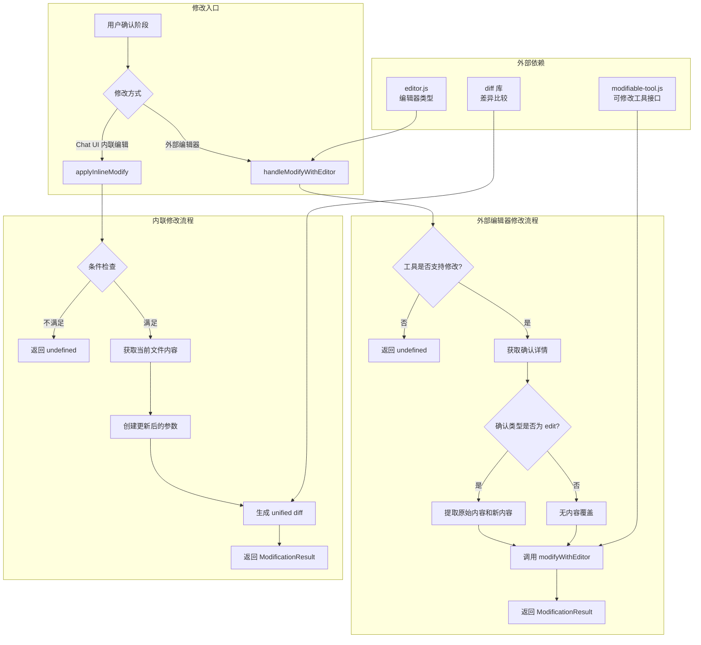
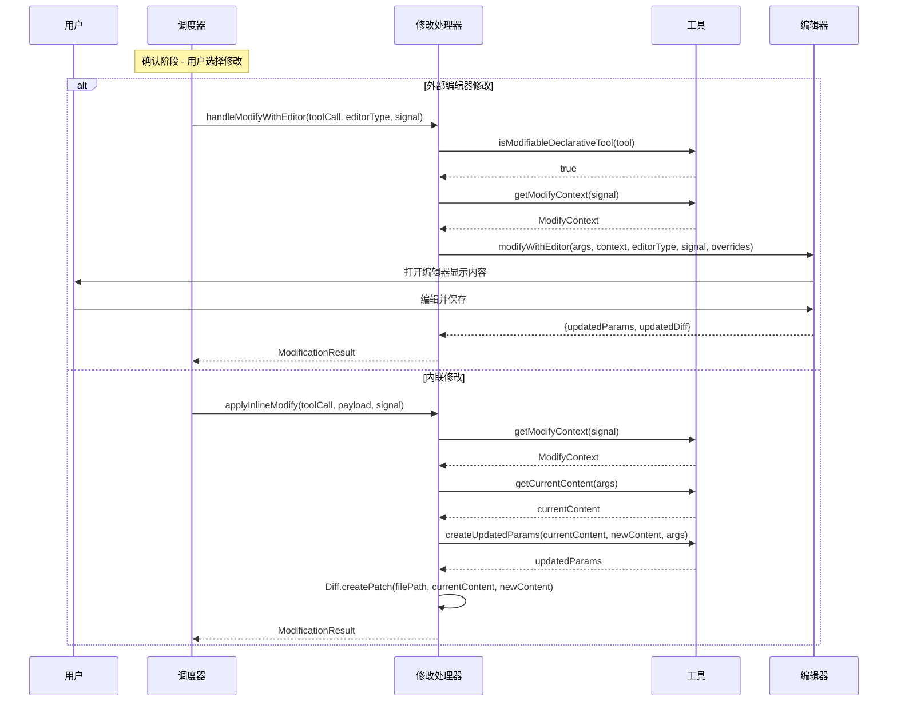

# tool-modifier.ts

## 概述

`ToolModificationHandler` 是调度器的**工具参数修改处理器**，负责在用户确认阶段对工具调用的参数进行修改。它提供两种修改方式：

1. **外部编辑器修改**（Modify with Editor）：启动外部编辑器（如 VS Code、Vim）让用户直接编辑工具参数
2. **内联修改**（Inline Modify）：接受来自 Chat UI 的内容更新，直接应用用户在界面中编辑的新内容

该处理器主要用于文件编辑类工具，允许用户在确认执行前查看并修改 AI 提出的编辑内容。

## 架构图（Mermaid）



### 修改流程详细图



## 核心组件

### 1. `ModificationResult` 接口

```typescript
export interface ModificationResult {
  updatedParams: Record<string, unknown>;   // 修改后的工具调用参数
  updatedDiff?: string;                     // 修改后的 unified diff（可选）
}
```

工具参数修改的返回结果类型。`updatedParams` 包含了新的参数对象，可直接替换原始的 `request.args`。`updatedDiff` 是可选的差异描述，用于在 UI 中展示修改的变化。

### 2. `ToolModificationHandler` 类

无构造参数，轻量级的处理器类。

#### 方法

##### `handleModifyWithEditor(toolCall, editorType, signal): Promise<ModificationResult | undefined>`

**外部编辑器修改流程**。

**参数：**
| 参数 | 类型 | 说明 |
|------|------|------|
| `toolCall` | `WaitingToolCall` | 处于等待审批状态的工具调用 |
| `editorType` | `EditorType` | 编辑器类型（如 VS Code、Vim 等） |
| `signal` | `AbortSignal` | 中止信号 |

**执行流程：**
1. 检查工具是否实现了 `ModifiableDeclarativeTool` 接口（通过 `isModifiableDeclarativeTool`）
2. 如果不支持修改，返回 `undefined`
3. 从工具获取 `ModifyContext`
4. 如果确认详情类型为 `edit`，提取 `originalContent` 和 `newContent` 作为内容覆盖
5. 调用 `modifyWithEditor` 启动外部编辑器
6. 返回包含更新后参数和 diff 的结果

**返回值：** `ModificationResult` 或 `undefined`（工具不支持修改时）

##### `applyInlineModify(toolCall, payload, signal): Promise<ModificationResult | undefined>`

**内联修改流程**。处理来自 Chat UI 的用户编辑。

**参数：**
| 参数 | 类型 | 说明 |
|------|------|------|
| `toolCall` | `WaitingToolCall` | 处于等待审批状态的工具调用 |
| `payload` | `ToolConfirmationPayload` | 用户确认的有效负载，包含 `newContent` |
| `signal` | `AbortSignal` | 中止信号 |

**执行流程：**
1. 前置条件检查：确认详情类型必须为 `edit`，payload 必须包含 `newContent`，工具必须支持修改
2. 任一条件不满足则返回 `undefined`
3. 从工具获取 `ModifyContext`
4. 通过 `getCurrentContent` 获取当前文件内容
5. 通过 `createUpdatedParams` 使用当前内容和用户新内容创建更新后的参数
6. 使用 `Diff.createPatch` 生成 unified diff（标签为 "Current" vs "Proposed"）
7. 返回包含更新后参数和 diff 的结果

**返回值：** `ModificationResult` 或 `undefined`（条件不满足时）

## 依赖关系

### 内部依赖

| 模块 | 导入内容 | 用途 |
|------|----------|------|
| `../utils/editor.js` | `EditorType` 类型 | 编辑器类型定义 |
| `../tools/modifiable-tool.js` | `isModifiableDeclarativeTool`, `modifyWithEditor`, `ModifyContext` 类型 | 可修改工具的接口检查、编辑器修改函数和修改上下文 |
| `../tools/tools.js` | `ToolConfirmationPayload` 类型 | 确认有效负载类型 |
| `./types.js` | `WaitingToolCall` 类型 | 等待审批状态的工具调用类型 |

### 外部依赖

| 包 | 用途 |
|----|------|
| `diff` | 生成 unified diff（`Diff.createPatch`），用于比较文件修改前后的差异 |

## 关键实现细节

### 1. 可修改工具接口检查

两个方法都通过 `isModifiableDeclarativeTool` 进行运行时类型检查，确保工具实现了 `ModifiableDeclarativeTool` 接口。不支持修改的工具会直接返回 `undefined`，由调用方决定后续处理。

这种设计使得修改功能是可选的，不是所有工具都需要支持参数修改。

### 2. 编辑类工具的特殊处理

外部编辑器修改中，对 `edit` 类型的确认详情有特殊处理：提取 `originalContent`（当前文件内容）和 `newContent`（AI 提出的新内容）作为 `contentOverrides` 传递给 `modifyWithEditor`。这使得编辑器能够直接展示文件编辑的上下文，而不仅仅是原始参数。

### 3. 内联修改的 Diff 生成

`applyInlineModify` 使用 `diff` 库的 `createPatch` 方法生成 unified diff 格式：
- 文件名从 `modifyContext.getFilePath(args)` 获取
- 旧内容标签为 "Current"，新内容标签为 "Proposed"
- 生成的 diff 保存在 `updatedDiff` 字段中，用于 UI 展示

### 4. ModifyContext 的作用

`ModifyContext` 是工具提供的修改上下文对象，包含：
- `getCurrentContent(args)`：获取当前文件内容
- `createUpdatedParams(currentContent, newContent, args)`：根据新旧内容创建更新后的工具参数
- `getFilePath(args)`：获取文件路径

这种设计将"如何修改参数"的逻辑委托给了工具本身，修改处理器只负责协调编辑流程。

### 5. 轻量级无状态设计

`ToolModificationHandler` 类没有任何实例状态，不需要构造参数。它是纯粹的行为类，所有必要的上下文通过方法参数传入。这使得它易于测试和复用。
