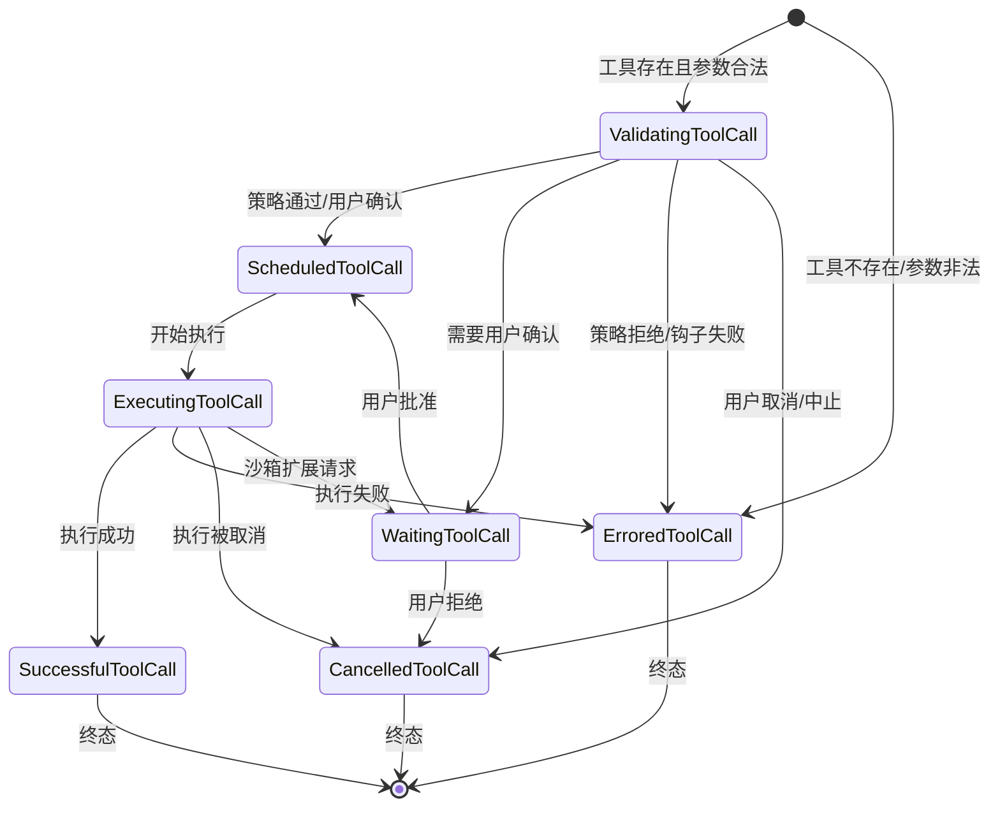
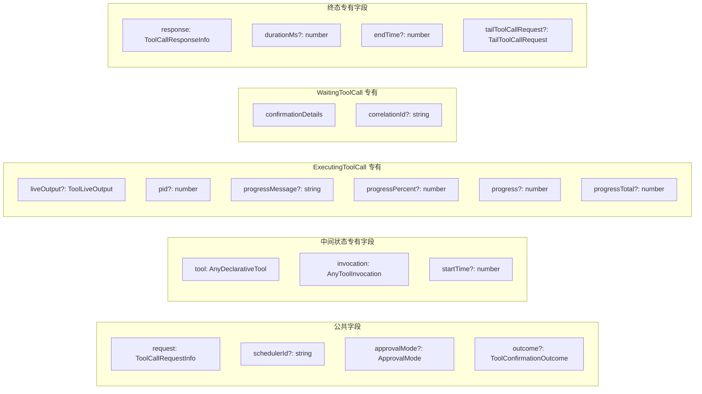

# types.ts

## 概述

`types.ts` 是调度器模块的**类型定义文件**，定义了工具调用状态机的完整类型系统。它包含：

- **状态枚举** `CoreToolCallStatus`：工具调用的7种内部状态
- **请求/响应接口**：`ToolCallRequestInfo` 和 `ToolCallResponseInfo`
- **状态类型**：每种状态对应一个专用的工具调用类型（使用可辨识联合模式）
- **联合类型**：`ToolCall`（所有状态）和 `CompletedToolCall`（终态）
- **处理器类型**：确认、输出更新、完成回调等函数类型

这些类型构成了调度器模块的核心类型基础，被 `scheduler.ts`、`state-manager.ts`、`tool-executor.ts` 等模块广泛使用。

## 架构图（Mermaid）

```mermaid
graph TB
    subgraph 状态枚举
        CSE[CoreToolCallStatus]
        CSE --> V[Validating 验证中]
        CSE --> SC[Scheduled 已调度]
        CSE --> EX[Executing 执行中]
        CSE --> AA[AwaitingApproval 等待审批]
        CSE --> SU[Success 成功]
        CSE --> ER[Error 错误]
        CSE --> CA[Cancelled 已取消]
    end

    subgraph 工具调用类型（可辨识联合）
        V --> VTC[ValidatingToolCall]
        SC --> SCTC[ScheduledToolCall]
        EX --> EXTC[ExecutingToolCall]
        AA --> WTC[WaitingToolCall]
        SU --> SUTC[SuccessfulToolCall]
        ER --> ERTC[ErroredToolCall]
        CA --> CATC[CancelledToolCall]
    end

    subgraph 联合类型
        TC[ToolCall 联合] --> VTC
        TC --> SCTC
        TC --> EXTC
        TC --> WTC
        TC --> SUTC
        TC --> ERTC
        TC --> CATC

        CTC[CompletedToolCall 终态联合] --> SUTC
        CTC --> ERTC
        CTC --> CATC
    end

    subgraph 请求与响应
        TCRI[ToolCallRequestInfo<br/>请求信息] --> TC
        TCRESPI[ToolCallResponseInfo<br/>响应信息] --> SUTC
        TCRESPI --> ERTC
        TCRESPI --> CATC
    end

    subgraph 尾调用
        TTCR[TailToolCallRequest<br/>尾调用请求] --> SUTC
        TTCR --> ERTC
        TTCR --> EXTC
    end
```

### 工具调用状态流转图



### 各类型所含字段对比图



## 核心组件

### 1. 常量

```typescript
export const ROOT_SCHEDULER_ID = 'root';
```

根调度器的默认 ID。在 `SchedulerStateManager` 构造函数中作为 `schedulerId` 的默认值。

### 2. `CoreToolCallStatus` 枚举

```typescript
export enum CoreToolCallStatus {
  Validating = 'validating',       // 正在验证（策略检查、钩子评估、用户确认）
  Scheduled = 'scheduled',         // 已调度，等待执行
  Error = 'error',                 // 执行出错（终态）
  Success = 'success',             // 执行成功（终态）
  Executing = 'executing',         // 正在执行
  Cancelled = 'cancelled',         // 已取消（终态）
  AwaitingApproval = 'awaiting_approval',  // 等待用户审批
}
```

工具调用状态机的7种内部状态。终态为 `Error`、`Success`、`Cancelled`。

### 3. `ToolCallRequestInfo` 接口

```typescript
export interface ToolCallRequestInfo {
  callId: string;                                    // 调用唯一标识
  name: string;                                      // 工具名称
  args: Record<string, unknown>;                     // 工具调用参数
  originalRequestName?: string;                      // 原始请求工具名（尾调用场景）
  originalRequestArgs?: Record<string, unknown>;     // 原始请求参数（尾调用场景）
  isClientInitiated: boolean;                        // 是否由客户端发起
  prompt_id: string;                                 // 关联的提示 ID
  checkpoint?: string;                               // 检查点标识
  traceId?: string;                                  // 遥测追踪 ID
  parentCallId?: string;                             // 父调用 ID（子代理场景）
  schedulerId?: string;                              // 调度器 ID
  inputModifiedByHook?: boolean;                     // 参数是否被钩子修改过
  forcedAsk?: boolean;                               // 是否强制要求用户确认
}
```

工具调用请求信息。`originalRequestName` 和 `originalRequestArgs` 用于尾调用场景，确保最终响应和日志中保留原始的工具名和参数。`inputModifiedByHook` 标记参数是否被 BeforeTool 钩子修改过，执行器会据此在 LLM 内容中追加提示。

### 4. `ToolCallResponseInfo` 接口

```typescript
export interface ToolCallResponseInfo {
  callId: string;                                    // 调用唯一标识
  responseParts: Part[];                             // 返回给 LLM 的响应部分
  resultDisplay: ToolResultDisplay | undefined;      // UI 展示内容
  error: Error | undefined;                          // 错误对象
  errorType: ToolErrorType | undefined;              // 错误类型
  outputFile?: string | undefined;                   // 截断输出保存的文件路径
  contentLength?: number;                            // 内容长度
  data?: Record<string, unknown>;                    // 可选的结构化数据负载
}
```

工具调用响应信息。`responseParts` 包含 `functionResponse` 格式的 Part 数组，用于返回给 Gemini API。`resultDisplay` 是面向 UI 的展示内容，可以是字符串或结构化对象。`outputFile` 指向截断后完整输出的存储路径。

### 5. `TailToolCallRequest` 接口

```typescript
export interface TailToolCallRequest {
  name: string;                          // 后续工具名称
  args: Record<string, unknown>;         // 后续工具参数
}
```

尾调用请求。当工具执行完成后需要立即执行另一个工具时使用。

### 6. 状态类型定义

#### `ValidatingToolCall` - 验证中

| 字段 | 类型 | 必填 | 说明 |
|------|------|------|------|
| `status` | `CoreToolCallStatus.Validating` | 是 | 状态标识 |
| `request` | `ToolCallRequestInfo` | 是 | 请求信息 |
| `tool` | `AnyDeclarativeTool` | 是 | 工具实例 |
| `invocation` | `AnyToolInvocation` | 是 | 工具调用对象 |
| `startTime` | `number` | 否 | 开始时间戳 |
| `outcome` | `ToolConfirmationOutcome` | 否 | 确认结果 |
| `schedulerId` | `string` | 否 | 调度器 ID |
| `approvalMode` | `ApprovalMode` | 否 | 审批模式 |

工具已通过参数构建（`tool.build`），正在进行策略检查和用户确认。

#### `ScheduledToolCall` - 已调度

与 `ValidatingToolCall` 字段完全相同，仅 `status` 不同。表示工具已通过所有检查，等待执行。

#### `ExecutingToolCall` - 执行中

在 `ScheduledToolCall` 基础上增加了执行时特有的字段：

| 额外字段 | 类型 | 说明 |
|----------|------|------|
| `liveOutput` | `ToolLiveOutput` | 实时输出（如 shell 命令的标准输出流） |
| `progressMessage` | `string` | MCP 进度消息 |
| `progressPercent` | `number` | 进度百分比（0-100） |
| `progress` | `number` | 当前进度值 |
| `progressTotal` | `number` | 总进度值 |
| `pid` | `number` | 进程 ID |
| `tailToolCallRequest` | `TailToolCallRequest` | 尾调用请求 |

#### `WaitingToolCall` - 等待审批

| 额外字段 | 类型 | 说明 |
|----------|------|------|
| `confirmationDetails` | `ToolCallConfirmationDetails \| SerializableConfirmationDetails` | 确认详情（支持遗留和新格式） |
| `correlationId` | `string` | 事件驱动审批的关联 ID |

`confirmationDetails` 支持两种格式：遗留的 `ToolCallConfirmationDetails`（带回调）和新的 `SerializableConfirmationDetails`（可序列化）。代码中标注了 TODO，迁移完成后将统一为 `SerializableConfirmationDetails`。

#### `SuccessfulToolCall` - 成功（终态）

| 额外字段 | 类型 | 说明 |
|----------|------|------|
| `response` | `ToolCallResponseInfo` | 响应信息（必填） |
| `durationMs` | `number` | 执行耗时（毫秒） |
| `startTime` | `number` | 开始时间戳 |
| `endTime` | `number` | 结束时间戳 |
| `tailToolCallRequest` | `TailToolCallRequest` | 尾调用请求 |

#### `ErroredToolCall` - 错误（终态）

| 额外字段 | 类型 | 说明 |
|----------|------|------|
| `response` | `ToolCallResponseInfo` | 响应信息（必填） |
| `tool` | `AnyDeclarativeTool` | 工具实例（**可选**，工具不存在时无此字段） |
| `durationMs` | `number` | 执行耗时 |
| `startTime` | `number` | 开始时间戳 |
| `endTime` | `number` | 结束时间戳 |
| `tailToolCallRequest` | `TailToolCallRequest` | 尾调用请求 |

注意：`ErroredToolCall` 是唯一 `tool` 字段可选的终态类型，因为工具不存在时也会产生错误状态。

#### `CancelledToolCall` - 已取消（终态）

| 额外字段 | 类型 | 说明 |
|----------|------|------|
| `response` | `ToolCallResponseInfo` | 响应信息（必填） |
| `tool` | `AnyDeclarativeTool` | 工具实例（必填） |
| `invocation` | `AnyToolInvocation` | 调用对象（必填） |
| `durationMs` | `number` | 执行耗时 |
| `startTime` | `number` | 开始时间戳 |
| `endTime` | `number` | 结束时间戳 |

### 7. 联合类型

#### `Status`

```typescript
export type Status = ToolCall['status'];
```

从 `ToolCall` 联合类型中提取的状态字符串联合类型，等价于 `CoreToolCallStatus` 枚举的值联合。

#### `ToolCall`

```typescript
export type ToolCall =
  | ValidatingToolCall
  | ScheduledToolCall
  | ErroredToolCall
  | SuccessfulToolCall
  | ExecutingToolCall
  | CancelledToolCall
  | WaitingToolCall;
```

所有7种状态的工具调用类型的**可辨识联合**（Discriminated Union），以 `status` 字段为辨识器。

#### `CompletedToolCall`

```typescript
export type CompletedToolCall =
  | SuccessfulToolCall
  | CancelledToolCall
  | ErroredToolCall;
```

3种终态的工具调用类型联合。调度器的 `schedule()` 方法返回此类型的数组。

### 8. 处理器函数类型

```typescript
export type ConfirmHandler = (toolCall: WaitingToolCall) => Promise<ToolConfirmationOutcome>;
```
确认处理器：接收等待审批的工具调用，返回确认结果。

```typescript
export type OutputUpdateHandler = (toolCallId: string, outputChunk: ToolLiveOutput) => void;
```
输出更新处理器：接收工具调用 ID 和实时输出块。

```typescript
export type AllToolCallsCompleteHandler = (completedToolCalls: CompletedToolCall[]) => Promise<void>;
```
全部完成处理器：所有工具调用完成时触发的异步回调。

```typescript
export type ToolCallsUpdateHandler = (toolCalls: ToolCall[]) => void;
```
工具调用更新处理器：工具调用列表发生变化时触发的回调。

## 依赖关系

### 内部依赖

| 模块 | 导入内容 | 用途 |
|------|----------|------|
| `../tools/tools.js` | `AnyDeclarativeTool`, `AnyToolInvocation`, `ToolCallConfirmationDetails`, `ToolConfirmationOutcome`, `ToolResultDisplay`, `ToolLiveOutput` | 工具相关类型 |
| `../tools/tool-error.js` | `ToolErrorType` 类型 | 错误类型枚举 |
| `../confirmation-bus/types.js` | `SerializableConfirmationDetails` 类型 | 可序列化的确认详情 |
| `../policy/types.js` | `ApprovalMode` 类型 | 审批模式类型 |

### 外部依赖

| 包 | 用途 |
|----|------|
| `@google/genai` | `Part` 类型，Gemini API 的内容部分类型 |

## 关键实现细节

### 1. 可辨识联合模式（Discriminated Union）

所有工具调用类型都以 `status` 字段作为辨识器，这使得 TypeScript 编译器能在 `switch` 或 `if` 语句中自动收窄类型。例如：

```typescript
if (call.status === CoreToolCallStatus.Executing) {
  // TypeScript 自动推断 call 为 ExecutingToolCall
  console.log(call.pid);  // 合法访问
}
```

### 2. 终态 vs 中间态的字段差异

- **终态**（Success/Error/Cancelled）必有 `response: ToolCallResponseInfo`、`durationMs`
- **中间态**（Validating/Scheduled/Executing/AwaitingApproval）必有 `tool` 和 `invocation`（WaitingToolCall 还必有 `confirmationDetails`）
- **ErroredToolCall** 是唯一 `tool` 可选的类型，因为工具不存在时也需要返回错误

### 3. 尾调用请求的存在范围

`tailToolCallRequest` 字段出现在 `SuccessfulToolCall`、`ErroredToolCall` 和 `ExecutingToolCall` 中。这意味着：
- 成功执行的工具可以请求执行后续工具
- 失败的工具也可以请求后续工具（如沙箱扩展场景）
- 执行中的工具可以预设尾调用请求

### 4. 确认详情的双格式支持

`WaitingToolCall.confirmationDetails` 支持两种格式：
- `ToolCallConfirmationDetails`：遗留格式，可能包含回调函数，不可序列化
- `SerializableConfirmationDetails`：新格式，纯数据，可序列化

代码中标注了 TODO，表明正在从遗留格式迁移到新格式。`correlationId` 字段也标注为迁移完成后将变为必填。

### 5. 原始请求信息保留

`ToolCallRequestInfo` 中的 `originalRequestName` 和 `originalRequestArgs` 字段专门为尾调用场景设计。当工具 A 执行完后链接到工具 B 时：
- `name` 和 `args` 更新为工具 B 的信息
- `originalRequestName` 和 `originalRequestArgs` 保持为工具 A 的信息
- 这确保最终返回给 LLM 的响应使用原始工具名，对 LLM 透明

### 6. 执行进度追踪

`ExecutingToolCall` 包含完整的进度追踪字段：
- `progressMessage`：文本描述当前进度
- `progressPercent`：0-100 的百分比
- `progress` 和 `progressTotal`：原始进度值和总量

这些字段主要用于 MCP 工具的进度报告，由 `Scheduler` 的 `handleMcpProgress` 方法更新。

### 7. 处理器类型的用途

这些处理器类型定义了调度器与外部组件的交互契约：
- `ConfirmHandler`：用于需要用户确认的场景
- `OutputUpdateHandler`：用于实时输出流式展示（如 shell 命令执行过程）
- `AllToolCallsCompleteHandler`：用于批次完成后的后处理
- `ToolCallsUpdateHandler`：用于 UI 实时更新工具调用状态列表
