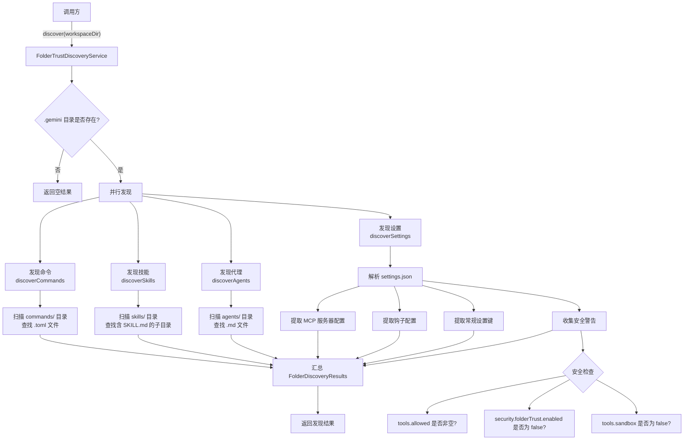

# FolderTrustDiscoveryService.ts

## 概述

`FolderTrustDiscoveryService` 是一个**安全的、只读的**文件夹信任发现服务。它的核心职责是在用户信任某个工作区目录**之前**，扫描该目录中的 `.gemini` 配置文件夹，发现其中定义的各类配置项（命令、MCP 服务器、钩子、技能、代理、设置），并收集潜在的**安全警告**信息。

该服务完全使用静态方法，无需实例化即可调用。它不会修改任何文件，仅执行读取和分析操作。

## 架构图（Mermaid）

## 核心组件

### 1. `FolderDiscoveryResults` 接口

发现结果的数据结构，包含以下字段：

| 字段 | 类型 | 描述 |
|---|---|---|
| `commands` | `string[]` | 发现的自定义命令名称列表（从 `.toml` 文件提取） |
| `mcps` | `string[]` | 发现的 MCP（Model Context Protocol）服务器名称列表 |
| `hooks` | `string[]` | 发现的钩子命令列表 |
| `skills` | `string[]` | 发现的技能名称列表 |
| `agents` | `string[]` | 发现的代理名称列表 |
| `settings` | `string[]` | 发现的设置键名列表（排除 `mcpServers`、`hooks`、`$schema`） |
| `securityWarnings` | `string[]` | 安全警告信息列表 |
| `discoveryErrors` | `string[]` | 发现过程中的错误信息列表 |

### 2. `FolderTrustDiscoveryService` 类

完全由静态方法组成的服务类。

#### 公共方法

- **`discover(workspaceDir: string): Promise<FolderDiscoveryResults>`**
  - 入口方法。接收工作区目录路径，返回发现结果。
  - 首先检查 `.gemini` 目录是否存在，不存在则直接返回空结果。
  - 使用 `Promise.all` **并行**执行四个发现任务：命令、技能、代理、设置。

#### 私有方法

- **`discoverCommands(geminiDir, results)`** -- 扫描 `commands/` 子目录，递归查找所有 `.toml` 文件，将文件名（不含扩展名）作为命令名称。
- **`discoverSkills(geminiDir, results)`** -- 扫描 `skills/` 子目录，查找包含 `SKILL.md` 文件的子目录，将目录名作为技能名称。
- **`discoverAgents(geminiDir, results)`** -- 扫描 `agents/` 子目录，查找非下划线开头的 `.md` 文件，将文件名（不含扩展名）作为代理名称。若发现代理，会添加安全警告。
- **`discoverSettings(geminiDir, results)`** -- 解析 `settings.json` 文件：
  - 使用 `strip-json-comments` 去除 JSON 注释后解析。
  - 提取顶层键作为设置项（排除 `mcpServers`、`hooks`、`$schema`）。
  - 提取 `mcpServers` 下的服务器名称。
  - 提取 `hooks` 下的所有 `command` 字段，使用 `Set` 去重。
  - 调用 `collectSecurityWarnings` 收集安全警告。
- **`collectSecurityWarnings(settings)`** -- 检查三种安全敏感配置：
  1. `tools.allowed` 数组非空 -- 项目自动批准了某些工具。
  2. `security.folderTrust.enabled` 为 `false` -- 项目试图禁用文件夹信任。
  3. `tools.sandbox` 为 `false` -- 项目禁用了安全沙箱。
- **`isRecord(val)`** -- 类型守卫，判断值是否为非数组的普通对象。
- **`exists(filePath)`** -- 安全地检查文件/目录是否存在，使用 `fs.stat`，遇到 `ENOENT` 返回 `false`，其他错误向上抛出。

## 依赖关系

### 内部依赖

| 模块路径 | 导入项 | 用途 |
|---|---|---|
| `../utils/paths.js` | `GEMINI_DIR` | 获取 `.gemini` 目录名称常量 |
| `../utils/debugLogger.js` | `debugLogger` | 调试日志输出（settings 格式错误时使用） |
| `../utils/errors.js` | `isNodeError` | 判断错误是否为 Node.js 系统错误（用于检测 `ENOENT`） |

### 外部依赖

| 包名 | 用途 |
|---|---|
| `node:fs/promises` | 异步文件系统操作（`readdir`、`readFile`、`stat`） |
| `node:path` | 路径拼接与处理（`join`、`basename`） |
| `strip-json-comments` | 去除 JSON 文件中的注释，允许 `settings.json` 包含注释 |

## 关键实现细节

1. **只读安全设计**：整个服务不会写入或修改任何文件，仅执行 `stat`、`readdir`、`readFile` 操作。这确保了在用户信任文件夹之前不会产生副作用。

2. **并行发现机制**：`discover` 方法使用 `Promise.all` 同时执行四个发现任务（命令、技能、代理、设置），提高了 I/O 密集型操作的效率。

3. **容错处理**：每个发现方法内部都有 `try-catch`，单个发现任务失败不会影响其他任务。错误信息被收集到 `discoveryErrors` 数组中，而非直接抛出。

4. **安全警告系统**：服务会主动检测可能的安全风险配置：
   - 自动批准工具（`tools.allowed`）
   - 禁用文件夹信任（`security.folderTrust.enabled = false`）
   - 禁用沙箱（`tools.sandbox = false`）
   - 存在自定义代理（`agents/` 目录中有 `.md` 文件）

5. **JSON 注释支持**：`settings.json` 的解析使用了 `strip-json-comments`，允许用户在配置文件中使用 `//` 或 `/* */` 风格的注释。

6. **代理文件过滤**：以下划线 `_` 开头的 `.md` 文件会被忽略，这是一种约定，允许用户将某些代理文件标记为"隐藏"或"草稿"。

7. **钩子去重**：使用 `Set` 对钩子命令进行去重，即使多个事件注册了相同的命令，结果中也只会出现一次。

8. **存在性检查**：`exists` 方法使用 `fs.stat` 而非 `fs.access`，能够同时处理文件和目录的存在性检查。对于 `ENOENT` 错误返回 `false`，对于其他错误（如权限不足）则向上抛出，避免静默忽略严重问题。
