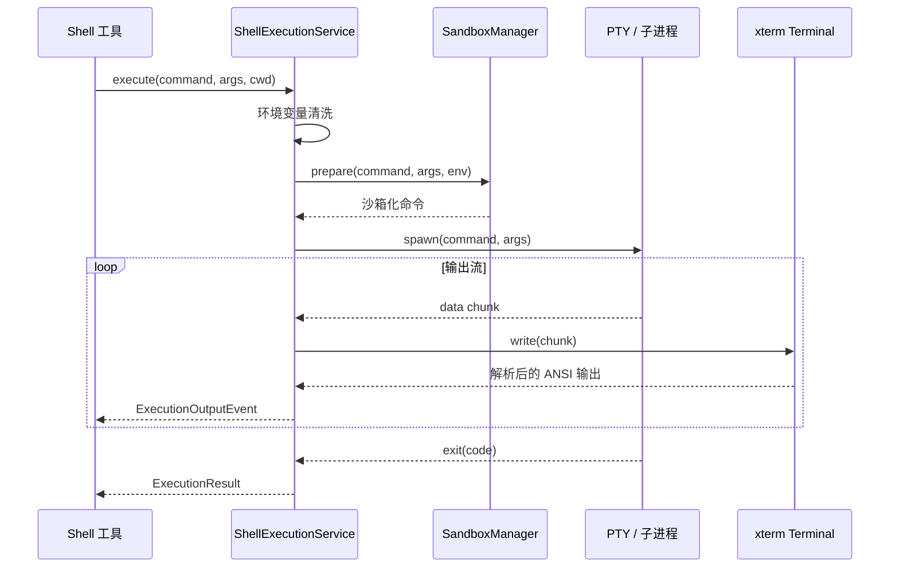
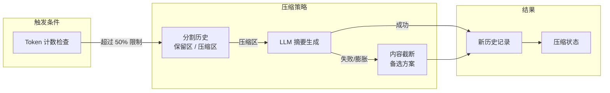

# services (服务层)

## 概述

`services/` 目录包含了 Gemini CLI 的**基础设施服务层**，提供了文件系统操作、Shell 命令执行、Git 版本控制、沙箱安全、聊天会话管理、模型配置等核心服务。这些服务被工具 (Tools)、Agent 执行器和核心运行时广泛依赖，是连接 AI 能力与系统操作的桥梁层。

## 目录结构

```
services/
├── shellExecutionService.ts          # Shell 命令执行服务（PTY/子进程）
├── executionLifecycleService.ts      # 执行生命周期管理
├── sandboxManager.ts                 # 沙箱管理器（安全执行）
├── sandboxManagerFactory.ts          # 沙箱管理器工厂
├── sandboxedFileSystemService.ts     # 沙箱化文件系统服务
├── fileSystemService.ts              # 标准文件系统服务接口
├── fileDiscoveryService.ts           # 文件发现服务
├── gitService.ts                     # Git 服务（影子仓库/检查点）
├── worktreeService.ts                # Git Worktree 服务
├── contextManager.ts                 # 上下文管理器（记忆发现与加载）
├── modelConfigService.ts             # 模型配置服务
├── chatRecordingService.ts           # 聊天录制服务（会话持久化）
├── chatCompressionService.ts         # 聊天压缩服务（上下文窗口管理）
├── loopDetectionService.ts           # 循环检测服务
├── sessionSummaryService.ts          # 会话摘要服务
├── sessionSummaryUtils.ts            # 会话摘要工具函数
├── FolderTrustDiscoveryService.ts    # 目录信任发现服务
├── keychainService.ts                # 密钥链服务
├── keychainTypes.ts                  # 密钥链类型
├── fileKeychain.ts                   # 基于文件的密钥链实现
├── trackerService.ts                 # 任务追踪服务
├── trackerTypes.ts                   # 任务追踪类型
├── toolOutputMaskingService.ts       # 工具输出掩码服务
├── environmentSanitization.ts        # 环境变量清洗
└── *.test.ts                         # 单元测试
```

## 架构图

```mermaid
graph TB
    subgraph 消费者
        TOOLS[内置工具]
        AGENT[Agent 执行器]
        CORE[核心运行时]
        CONFIG[配置系统]
    end

    subgraph services 服务层
        subgraph 执行服务
            SHELL[ShellExecutionService<br/>Shell 执行]
            EXEC_LIFE[ExecutionLifecycleService<br/>执行生命周期]
            SANDBOX[SandboxManager<br/>沙箱管理]
            ENV_CLEAN[环境变量清洗]
        end

        subgraph 文件服务
            FS[FileSystemService<br/>文件系统接口]
            SAND_FS[SandboxedFileSystemService<br/>沙箱文件系统]
            FILE_DISC[FileDiscoveryService<br/>文件发现]
            FOLDER_TRUST[FolderTrustDiscoveryService<br/>目录信任]
        end

        subgraph 版本控制
            GIT[GitService<br/>Git 影子仓库]
            WORKTREE[WorktreeService<br/>Worktree 管理]
        end

        subgraph 会话管理
            RECORDING[ChatRecordingService<br/>聊天录制]
            COMPRESS[ChatCompressionService<br/>聊天压缩]
            LOOP[LoopDetectionService<br/>循环检测]
            SUMMARY[SessionSummaryService<br/>会话摘要]
        end

        subgraph 配置与安全
            MODEL_CFG[ModelConfigService<br/>模型配置]
            CONTEXT[ContextManager<br/>上下文管理]
            KEYCHAIN[KeychainService<br/>密钥链]
            MASK[ToolOutputMaskingService<br/>输出掩码]
        end

        subgraph 追踪
            TRACKER[TrackerService<br/>任务追踪]
        end
    end

    TOOLS --> SHELL
    TOOLS --> FS
    TOOLS --> GIT
    AGENT --> SANDBOX
    AGENT --> COMPRESS
    AGENT --> LOOP
    CORE --> RECORDING
    CORE --> MODEL_CFG
    CONFIG --> CONTEXT
    CONFIG --> FOLDER_TRUST

    SHELL --> EXEC_LIFE
    SHELL --> SANDBOX
    SHELL --> ENV_CLEAN
    SAND_FS --> FS
    SAND_FS --> SANDBOX
```



## 核心组件

### ShellExecutionService (shellExecutionService.ts)

Shell 命令执行服务，是 `shell` 工具的底层引擎：

**执行模式**：
- **PTY 模式** (`@lydell/node-pty`): 伪终端执行，支持完整的终端交互（颜色、光标控制等）
- **备选 PTY** (`node-pty`): 标准 node-pty 实现
- **子进程模式** (`child_process`): 当 PTY 不可用时的降级方案

**核心功能**：
- 通过 `@xterm/headless` 解析终端 ANSI 输出
- 环境变量清洗（移除敏感信息）
- 设置 `GEMINI_CLI` 环境标识
- 支持沙箱执行（`SandboxManager` 集成）
- 最大输出缓冲 16MB
- 进程组管理和安全终止

### ExecutionLifecycleService (executionLifecycleService.ts)

执行生命周期的统一管理：

```typescript
interface ExecutionResult {
  output: string;
  exitCode: number | null;
  signal: number | null;
  error: Error | null;
  aborted: boolean;
  pid: number | undefined;
  executionMethod: ExecutionMethod;  // 'lydell-node-pty' | 'node-pty' | 'child_process' | ...
}
```

提供 `ExecutionHandle`（包含 `pid` 和 `result` Promise）和 `ExecutionOutputEvent` 流式事件接口。

### SandboxManager (sandboxManager.ts)

安全沙箱管理器，控制命令执行的权限边界：

```typescript
interface SandboxPermissions {
  fileSystem?: { read?: string[]; write?: string[] };
  network?: boolean;
}

interface ExecutionPolicy {
  allowedPaths?: string[];
  forbiddenPaths?: string[];
  networkAccess?: boolean;
  sanitizationConfig?: EnvironmentSanitizationConfig;
}
```

**实现**：
- `NoopSandboxManager`: 无沙箱（透传执行）
- macOS 沙箱: 基于 `sandbox-exec` 的 Seatbelt 配置
- Windows 沙箱: 基于 Windows Sandbox 机制
- 命令安全性分类: `isKnownSafeCommand()` / `isDangerousCommand()`

### FileSystemService (fileSystemService.ts)

文件系统操作的抽象接口：

```typescript
interface FileSystemService {
  readTextFile(filePath: string): Promise<string>;
  writeTextFile(filePath: string, content: string): Promise<void>;
}
```

- `StandardFileSystemService`: 直接使用 `node:fs` 的标准实现
- `SandboxedFileSystemService`: 通过沙箱权限检查的安全实现

### GitService (gitService.ts)

基于影子 Git 仓库的版本控制服务：

- **影子仓库**: 在项目的 `.gemini/history` 目录创建独立 Git 仓库
- **检查点**: 自动创建文件快照用于 `/restore` 命令
- **初始化**: 验证 Git 可用性、设置影子仓库
- 使用 `simple-git` 库进行 Git 操作

### ContextManager (contextManager.ts)

上下文管理器，负责记忆文件的发现和加载：

**记忆来源**（按优先级）：
1. **全局记忆**: `~/.gemini/GEMINI.md` 等全局配置
2. **扩展记忆**: 来自已安装扩展的记忆文件
3. **项目记忆**: `.gemini/GEMINI.md` 等项目级记忆（需信任检查）

**功能**：
- `refresh()`: 重新扫描并加载所有记忆路径
- 基于文件身份去重（避免重复加载）
- 支持分类：全局/扩展/项目
- 通过 `coreEvents` 发送记忆变更通知

### ModelConfigService (modelConfigService.ts)

模型配置管理服务，提供灵活的配置分层体系：

```typescript
interface ModelConfigKey {
  model: string;          // 模型名或别名
  overrideScope?: string; // 覆盖范围（如 Agent 名称）
  isRetry?: boolean;      // 是否重试场景
  isChatModel?: boolean;  // 是否主聊天模型
}
```

**配置层次**：
- **模型定义** (`ModelDefinition`): 模型特性描述（thinking、multimodal 等）
- **模型别名** (`ModelConfigAlias`): 配置继承和组合
- **模型覆盖** (`ModelConfigOverride`): 按条件覆盖配置
- **模型解析** (`ModelResolution`): `auto` 模型到具体模型的映射

### ChatRecordingService (chatRecordingService.ts)

聊天会话持久化服务：

- 记录完整的消息历史（用户消息、模型响应、工具调用）
- 序列化 Token 使用量统计
- 保存会话元数据（思考摘要、工具调用状态等）
- 支持会话恢复
- 磁盘空间满时优雅降级

### ChatCompressionService (chatCompressionService.ts)

聊天历史压缩服务，解决 Token 限制问题：

**压缩策略**：
- 当历史 Token 数超过模型限制的 50% 时触发
- 保留最近 30% 的历史不压缩
- 对较早的历史进行 LLM 摘要压缩
- 压缩失败时退回到内容截断策略
- 工具输出的 Token 预算控制

**压缩状态**：
```typescript
enum CompressionStatus {
  NOT_NEEDED,
  COMPRESSED,
  COMPRESSION_FAILED_INFLATED_TOKEN_COUNT,
  CONTENT_TRUNCATED,
}
```

### LoopDetectionService (loopDetectionService.ts)

检测 Agent 循环行为的服务：

- **工具调用循环**: 检测连续相同工具调用模式（阈值: 5 次）
- **内容循环**: 检测重复输出内容（阈值: 10 次）
- **LLM 循环检查**: 当简单检测不足时，使用 LLM 分析最近 20 轮对话
- 通过 hash 比较优化性能

### 其他服务

| 服务 | 说明 |
|------|------|
| `FolderTrustDiscoveryService` | 发现和管理目录信任状态 |
| `KeychainService` | 系统密钥链/文件密钥链的凭据存储 |
| `TrackerService` | TODO/任务追踪管理 |
| `ToolOutputMaskingService` | 在发送给模型前掩码敏感信息 |
| `SessionSummaryService` | 会话结束时生成摘要 |
| `WorktreeService` | Git Worktree 管理 |

## 依赖关系

### 内部依赖

| 依赖模块 | 用途 |
|---------|------|
| `config/` | `Config`, `Storage`, `AgentLoopContext`, 模型常量 |
| `core/` | `GeminiChat`, `ContentGenerator`, `Turn` 事件类型, `tokenLimits` |
| `scheduler/` | `ToolCallRequestInfo` 类型 |
| `tools/` | 工具结果类型 |
| `utils/` | 错误处理、Shell 工具、文件工具、记忆发现、Token 计算 |
| `telemetry/` | 遥测日志 |
| `hooks/` | 压缩前钩子 |
| `sandbox/` | macOS/Windows 沙箱实现 |

### 外部依赖

| 依赖 | 用途 |
|------|------|
| `@lydell/node-pty` / `node-pty` | 伪终端 (PTY) 支持 |
| `@xterm/headless` | 终端输出解析 |
| `simple-git` | Git 操作 |
| `@google/genai` | Content/Part 类型、Token 计算 |
| `keytar` (可选) | 系统密钥链访问 |

## 数据流

### Shell 命令执行流程



### 聊天压缩流程


