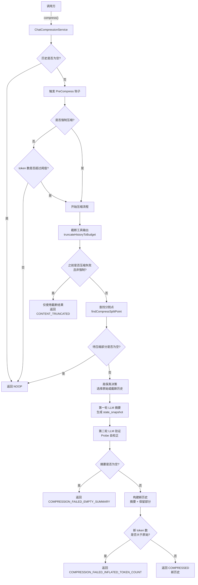
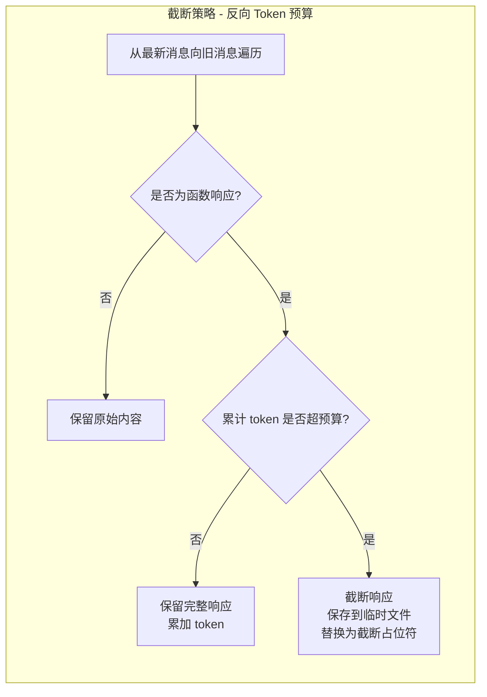

# chatCompressionService.ts

## 概述

`chatCompressionService` 是聊天历史压缩服务，负责在对话 token 数量超过模型限制的一定比例时，自动或手动对聊天历史进行压缩。压缩的核心策略是：将较早的历史对话通过 LLM 摘要为 `<state_snapshot>`，同时保留最近的对话内容，从而在有限的 token 预算内维持对话的连贯性和上下文完整性。

该模块包含三个主要部分：
1. **分割点查找**（`findCompressSplitPoint`）-- 确定哪些历史需要压缩、哪些保留。
2. **工具输出截断**（`truncateHistoryToBudget`）-- 对大型函数响应进行反向 token 预算截断。
3. **压缩服务类**（`ChatCompressionService`）-- 编排整个压缩流程，包括 LLM 摘要和验证。

## 架构图（Mermaid）

## 核心组件

### 1. 常量

| 常量名 | 值 | 描述 |
|---|---|---|
| `DEFAULT_COMPRESSION_TOKEN_THRESHOLD` | `0.5` | 默认压缩触发阈值（模型 token 限制的 50%） |
| `COMPRESSION_PRESERVE_THRESHOLD` | `0.3` | 保留最近 30% 的历史，压缩前 70% |
| `COMPRESSION_FUNCTION_RESPONSE_TOKEN_BUDGET` | `50,000` | 函数响应 token 的总预算上限 |

### 2. `findCompressSplitPoint(contents, fraction)` 函数

**导出函数**，用于确定压缩的分割点。

- **参数**：`contents` 为聊天历史内容数组，`fraction` 为 0~1 之间的比例值。
- **逻辑**：
  1. 计算每条消息的字符数，累加到目标字符数（`totalCharCount * fraction`）。
  2. 只在 `user` 角色且**不含函数响应**的位置设定分割点，确保不在工具调用中途切断。
  3. 当累计字符数超过目标值时，返回当前的分割点索引。
  4. 若找不到目标之后的分割点，检查最后一条消息是否是无函数调用的 `model` 消息；若是，可以压缩全部；否则回退到最后一个有效分割点。
- **返回值**：分割点索引，表示"从此索引开始保留"。

### 3. `modelStringToModelConfigAlias(model)` 函数

将模型字符串映射为压缩专用的配置别名。支持的映射：

| 模型常量 | 别名 |
|---|---|
| `PREVIEW_GEMINI_MODEL` / `PREVIEW_GEMINI_3_1_MODEL` | `chat-compression-3-pro` |
| `PREVIEW_GEMINI_FLASH_MODEL` | `chat-compression-3-flash` |
| `PREVIEW_GEMINI_3_1_FLASH_LITE_MODEL` | `chat-compression-3.1-flash-lite` |
| `DEFAULT_GEMINI_MODEL` | `chat-compression-2.5-pro` |
| `DEFAULT_GEMINI_FLASH_MODEL` | `chat-compression-2.5-flash` |
| `DEFAULT_GEMINI_FLASH_LITE_MODEL` | `chat-compression-2.5-flash-lite` |
| 其他 | `chat-compression-default` |

### 4. `truncateHistoryToBudget(history, config)` 函数

**私有异步函数**，实现"反向 Token 预算"策略：

1. 从**最新消息**向**旧消息**反向遍历。
2. 对每个函数响应（`functionResponse`）计算 token 数。
3. 在预算（50,000 tokens）内的函数响应保留原样。
4. 超出预算后的大型函数响应：
   - 将完整输出保存到临时文件。
   - 替换为截断后的占位符文本（保留最后 30 行）。
5. 非函数响应部分始终保留。
6. 若截断失败，保留原始内容（容错）。

### 5. `ChatCompressionService` 类

#### `compress()` 方法

核心压缩方法，编排完整的压缩流程：

**参数**：

| 参数 | 类型 | 描述 |
|---|---|---|
| `chat` | `GeminiChat` | 当前聊天实例 |
| `promptId` | `string` | 提示标识符 |
| `force` | `boolean` | 是否强制压缩 |
| `model` | `string` | 当前使用的模型名称 |
| `config` | `Config` | 配置对象 |
| `hasFailedCompressionAttempt` | `boolean` | 之前是否有失败的压缩尝试 |
| `abortSignal` | `AbortSignal?` | 可选的中止信号 |

**返回值**：`{ newHistory: Content[] | null, info: ChatCompressionInfo }`

**流程**：

1. **空历史检查** -- 如果历史为空，返回 NOOP。
2. **PreCompress 钩子** -- 触发压缩前钩子事件（区分手动/自动触发）。
3. **阈值检查** -- 非强制模式下，当前 token 数未超过 `阈值 * 模型限制` 时返回 NOOP。
4. **截断工具输出** -- 调用 `truncateHistoryToBudget` 处理大型函数响应。
5. **失败回退** -- 若之前压缩失败且非强制，仅返回截断结果。
6. **查找分割点** -- 使用 `findCompressSplitPoint` 确定压缩边界（`1 - 0.3 = 0.7` 的比例）。
7. **高保真决策** -- 如果原始待压缩历史的 token 数在模型限制内，使用原始历史进行摘要（更高质量）；否则使用截断后的历史。
8. **第一轮 LLM 摘要** -- 将待压缩历史发送给 LLM，生成 `<state_snapshot>`。若历史中已存在旧的 snapshot，指示 LLM 整合更新。
9. **第二轮 Probe 验证** -- 让 LLM 自我审查摘要，检查是否遗漏了关键技术细节、文件路径、工具结果或用户约束。
10. **空摘要检查** -- 若最终摘要为空，返回 `COMPRESSION_FAILED_EMPTY_SUMMARY`。
11. **构建新历史** -- 将摘要作为 user 消息 + 模型确认 + 保留的最近历史组成新对话。
12. **膨胀检查** -- 若新 token 数反而大于原始数，返回 `COMPRESSION_FAILED_INFLATED_TOKEN_COUNT`。
13. **成功返回** -- 返回新历史和 `COMPRESSED` 状态。

## 依赖关系

### 内部依赖

| 模块路径 | 导入项 | 用途 |
|---|---|---|
| `@google/genai` | `Content` | 聊天内容类型定义 |
| `../config/config.js` | `Config` | 配置对象类型 |
| `../core/geminiChat.js` | `GeminiChat` | 聊天实例类型 |
| `../core/turn.js` | `ChatCompressionInfo`, `CompressionStatus` | 压缩信息和状态枚举 |
| `../core/tokenLimits.js` | `tokenLimit` | 获取模型的 token 限制 |
| `../core/prompts.js` | `getCompressionPrompt` | 获取压缩用的系统提示词 |
| `../utils/partUtils.js` | `getResponseText` | 从 LLM 响应中提取文本 |
| `../telemetry/loggers.js` | `logChatCompression` | 记录压缩遥测日志 |
| `../telemetry/types.js` | `makeChatCompressionEvent`, `LlmRole` | 遥测事件构造和角色枚举 |
| `../utils/fileUtils.js` | `saveTruncatedToolOutput`, `formatTruncatedToolOutput` | 保存和格式化截断的工具输出 |
| `../utils/debugLogger.js` | `debugLogger` | 调试日志 |
| `../utils/environmentContext.js` | `getInitialChatHistory` | 构建初始聊天历史（含系统上下文） |
| `../utils/tokenCalculation.js` | `calculateRequestTokenCount`, `estimateTokenCountSync` | token 数量计算（精确和估算） |
| `../config/models.js` | 多个模型常量 | 模型名称到压缩配置的映射 |
| `../hooks/types.js` | `PreCompressTrigger` | 压缩前钩子触发类型枚举 |

### 外部依赖

无直接的外部第三方依赖（均通过内部模块间接引用）。

## 关键实现细节

1. **两阶段 LLM 摘要 + 验证**：压缩不是简单地截断历史，而是通过两轮 LLM 调用实现：第一轮生成摘要 snapshot，第二轮让 LLM 自我审查并修正遗漏。这种 "Probe 验证"机制显著提高了摘要的完整性。

2. **反向 Token 预算截断**：`truncateHistoryToBudget` 从最新消息向旧消息遍历，优先保留最近的工具输出完整性。超出 50,000 token 预算后，旧的大型工具响应被截断并保存到临时文件，用户仍可通过文件路径查看完整内容。

3. **高保真决策**：在选择发送给摘要 LLM 的历史时，优先使用未截断的原始历史（更高质量），只有当原始历史超过模型 token 限制时才降级为截断版本。

4. **分割点安全性**：`findCompressSplitPoint` 确保分割点只出现在 `user` 角色的非函数响应消息处，避免在工具调用-响应对中间切断，保证对话结构的完整性。

5. **增量快照更新**：如果历史中已包含之前的 `<state_snapshot>`，新的摘要会指示 LLM 整合旧快照信息并更新，而非从零开始，避免信息丢失。

6. **压缩失败回退**：当之前的摘要尝试失败时（且非强制模式），服务不再尝试 LLM 摘要，而是仅依赖工具输出截断来减少 token 数。这避免了重复失败带来的额外成本。

7. **膨胀检测**：压缩后会检查新 token 数是否反而增加（可能因为摘要过长），若发生膨胀则放弃本次压缩，返回失败状态。

8. **钩子系统集成**：压缩前会触发 `PreCompress` 钩子事件，允许外部逻辑在压缩发生之前执行自定义操作。

9. **遥测日志**：压缩前后的 token 数量都会被记录到遥测系统，用于监控和分析压缩效果。

10. **容错设计**：工具输出截断过程中若保存临时文件失败，会保留原始内容而非丢弃数据，确保对话完整性不受影响。
