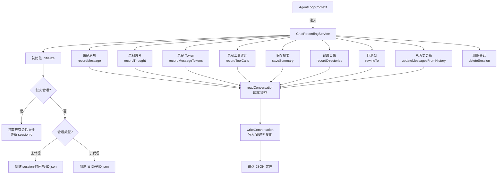
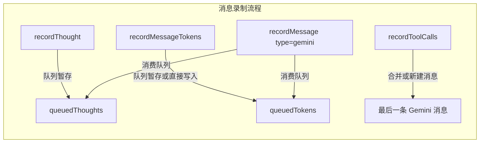

# chatRecordingService.ts

## 概述

`chatRecordingService` 是聊天对话录制服务，负责将整个对话过程**持久化到磁盘**。它捕获并记录以下信息：

- 所有用户和助手（Gemini）的消息
- 工具调用及其执行结果
- Token 使用统计（输入、输出、缓存、思考、工具、总量）
- 助手的思考过程（thoughts）

会话文件以 JSON 格式存储在 `~/.gemini/tmp/<project_hash>/chats/` 目录下。该服务支持**新建会话**和**恢复已有会话**，支持**主代理**和**子代理**两种会话类型，并提供会话删除、回退（rewind）和历史同步功能。

## 架构图（Mermaid）

## 核心组件

### 1. 类型定义与接口

#### `TokensSummary` 接口

| 字段 | 类型 | 描述 |
|---|---|---|
| `input` | `number` | 提示 token 数 |
| `output` | `number` | 候选 token 数 |
| `cached` | `number` | 缓存内容 token 数 |
| `thoughts` | `number?` | 思考 token 数 |
| `tool` | `number?` | 工具使用提示 token 数 |
| `total` | `number` | 总 token 数 |

#### `BaseMessageRecord` 接口

所有消息的基础字段：`id`（UUID）、`timestamp`（ISO 时间戳）、`content`（消息内容）、`displayContent`（可选的显示内容）。

#### `ToolCallRecord` 接口

工具调用记录，包含 `id`、`name`、`args`、`result`、`status`、`timestamp`、以及 UI 展示字段（`displayName`、`description`、`resultDisplay`、`renderOutputAsMarkdown`）。

#### `ConversationRecordExtra` 联合类型

区分消息类型：
- `user | info | error | warning` -- 简单类型，无额外字段。
- `gemini` -- Gemini 助手消息，附带 `toolCalls`、`thoughts`、`tokens`、`model`。

#### `MessageRecord` 类型

`BaseMessageRecord & ConversationRecordExtra` 的交叉类型。

#### `ConversationRecord` 接口

完整的会话记录结构：

| 字段 | 类型 | 描述 |
|---|---|---|
| `sessionId` | `string` | 会话唯一标识 |
| `projectHash` | `string` | 项目哈希 |
| `startTime` | `string` | 会话开始时间 |
| `lastUpdated` | `string` | 最后更新时间 |
| `messages` | `MessageRecord[]` | 消息列表 |
| `summary` | `string?` | 会话摘要 |
| `directories` | `string[]?` | 通过 `/dir add` 添加的工作区目录 |
| `kind` | `'main' \| 'subagent'?` | 会话类型 |

#### `ResumedSessionData` 接口

恢复会话所需数据：`conversation`（会话记录）和 `filePath`（文件路径）。

### 2. `ChatRecordingService` 类

#### 私有属性

| 属性 | 类型 | 描述 |
|---|---|---|
| `conversationFile` | `string \| null` | 当前会话文件路径，`null` 表示录制已禁用 |
| `cachedLastConvData` | `string \| null` | 上次写入的 JSON 字符串缓存（用于跳过无变化的写入） |
| `cachedConversation` | `ConversationRecord \| null` | 内存中的会话对象缓存 |
| `sessionId` | `string` | 当前会话 ID |
| `projectHash` | `string` | 项目哈希 |
| `kind` | `'main' \| 'subagent'?` | 会话类型 |
| `queuedThoughts` | `Array<ThoughtSummary & {timestamp}>` | 暂存的思考队列 |
| `queuedTokens` | `TokensSummary \| null` | 暂存的 token 信息 |
| `context` | `AgentLoopContext` | 代理循环上下文 |

#### 公共方法

- **`initialize(resumedSessionData?, kind?)`** -- 初始化服务。恢复模式读取已有文件；新建模式在 chats 目录下创建新的 JSON 文件。子代理的文件嵌套在父会话 ID 目录下。磁盘满（ENOSPC）时优雅降级，禁用录制但不中断对话。

- **`recordMessage({model, type, content, displayContent})`** -- 录制一条消息。对于 `gemini` 类型的消息，会将队列中暂存的 thoughts 和 tokens 一并附加到消息上。

- **`recordThought(thought)`** -- 将思考摘要暂存到 `queuedThoughts` 队列，等待下一条 Gemini 消息消费。

- **`recordMessageTokens(respUsageMetadata)`** -- 记录 token 使用信息。如果最后一条 Gemini 消息尚无 token 信息则直接写入，否则暂存到 `queuedTokens`。

- **`recordToolCalls(model, toolCalls)`** -- 录制工具调用。从 ToolRegistry 获取工具元数据进行丰富。若最后一条消息不是 Gemini 消息或有暂存的 thoughts，则创建新的空 Gemini 消息；否则更新（合并）已有工具调用或追加新工具调用。

- **`saveSummary(summary)`** -- 保存会话摘要。优雅降级，失败不抛出。

- **`recordDirectories(directories)`** -- 记录通过 `/dir add` 添加的工作区目录。优雅降级。

- **`getConversation()`** -- 获取当前会话数据。

- **`getConversationFilePath()`** -- 获取会话文件路径。

- **`deleteSession(sessionIdOrBasename)`** -- 异步删除会话。通过 `deriveShortId` 提取 8 字符短 ID，查找匹配的文件并删除会话及其关联的工件（日志、工具输出、子代理目录）。

- **`rewindTo(messageId)`** -- 回退到指定消息 ID 之前的状态，移除该 ID 及之后的所有消息。

- **`updateMessagesFromHistory(history)`** -- 根据 API Content 数组更新磁盘上的会话记录。用于持久化历史中的变更（如工具结果掩码）。构建 `partsMap`（callId -> Part[]）进行高效查找和更新。

#### 私有方法

- **`readConversation()`** -- 读取会话，优先返回缓存。缓存未命中时从磁盘读取。文件损坏或不存在时返回空会话。注意：返回的是**缓存引用**，修改后需调用 `writeConversation` 持久化。

- **`writeConversation(conversation, options?)`** -- 写入会话到磁盘。优化点：消息列表为空时（除非 `allowEmpty`）不写入；JSON 内容未变化时跳过写入。ENOSPC 时优雅降级。

- **`updateConversation(updateFn)`** -- 读取→修改→写入的便捷封装。

- **`deriveShortId(sessionIdOrBasename)`** -- 从各种格式（sessionId、文件名、basename）提取 8 字符短 ID。

- **`getMatchingSessionFiles(chatsDir, shortId)`** -- 查找匹配 `session-*-<shortId>.json` 模式的文件。

- **`deleteSessionAndArtifacts(chatsDir, file, tempDir)`** -- 删除单个会话文件及其关联工件，委托给 `sessionOperations` 工具函数。

## 依赖关系

### 内部依赖

| 模块路径 | 导入项 | 用途 |
|---|---|---|
| `../scheduler/types.js` | `Status` | 工具调用状态类型 |
| `../utils/thoughtUtils.js` | `ThoughtSummary` | 思考摘要类型 |
| `../utils/paths.js` | `getProjectHash` | 计算项目哈希 |
| `../utils/fileUtils.js` | `sanitizeFilenamePart` | 安全化文件名部分 |
| `../utils/sessionOperations.js` | `deleteSessionArtifactsAsync`, `deleteSubagentSessionDirAndArtifactsAsync` | 删除会话关联工件 |
| `../utils/debugLogger.js` | `debugLogger` | 调试日志 |
| `../tools/tools.js` | `ToolResultDisplay` | 工具结果展示类型 |
| `../config/agent-loop-context.js` | `AgentLoopContext` | 代理循环上下文类型 |

### 外部依赖

| 包名 | 用途 |
|---|---|
| `@google/genai` | `Content`, `Part`, `PartListUnion`, `GenerateContentResponseUsageMetadata` 类型 |
| `node:path` | 路径处理 |
| `node:fs` | 同步文件读写 (`readFileSync`, `writeFileSync`, `mkdirSync`, `readdirSync`) 及异步操作 |
| `node:crypto` | `randomUUID` 生成消息唯一 ID |

## 关键实现细节

1. **内存缓存 + 脏数据跳过**：`readConversation` 使用内存缓存避免重复读取磁盘；`writeConversation` 比较序列化后的 JSON 字符串，内容无变化时跳过写入，减少 I/O 操作。

2. **思考与 Token 的队列暂存机制**：思考（thoughts）和 Token 信息可能在消息创建之前到达。服务使用 `queuedThoughts` 和 `queuedTokens` 暂存这些数据，在下一条 Gemini 消息录制时一并消费。这解决了异步事件到达顺序不确定的问题。

3. **ENOSPC 优雅降级**：在 `initialize` 和 `writeConversation` 中都处理了磁盘空间不足错误。当磁盘满时，将 `conversationFile` 置为 `null` 以禁用所有后续录制操作，但不中断对话。所有公共录制方法在 `conversationFile` 为 `null` 时提前返回。

4. **子代理文件组织**：子代理的会话文件嵌套在父会话 ID 命名的子目录下（`chats/<parentSessionId>/<subagentSessionId>.json`），文件名格式也不同（不含时间戳前缀）。

5. **工具调用合并逻辑**：`recordToolCalls` 使用智能合并策略 -- 已有工具调用通过 ID 匹配并合并（保留旧的 thoughts 等数据），新工具调用则追加。若最后一条消息不是 Gemini 类型或有新的暂存思考，则创建全新的 Gemini 消息。

6. **会话删除的完整清理**：删除会话时不仅删除 JSON 文件，还通过 `deleteSessionArtifactsAsync` 和 `deleteSubagentSessionDirAndArtifactsAsync` 清理关联的日志、工具输出、子代理目录等工件。

7. **回退（Rewind）功能**：`rewindTo` 通过消息 ID 定位并截断消息列表，支持 `allowEmpty: true` 允许写入空消息列表，实现对话回退。

8. **历史同步**：`updateMessagesFromHistory` 构建 `callId -> Part[]` 映射表，高效地将 API 级别的历史变更（如工具结果掩码）同步回磁盘上的会话记录。

9. **文件名安全化**：使用 `sanitizeFilenamePart` 处理 sessionId 和 parentSessionId，防止路径穿越等安全问题。无效的 sanitized ID 会直接抛出错误。

10. **会话恢复**：恢复会话时重用已有文件路径和会话数据，清除内存缓存以确保后续读取的一致性。
