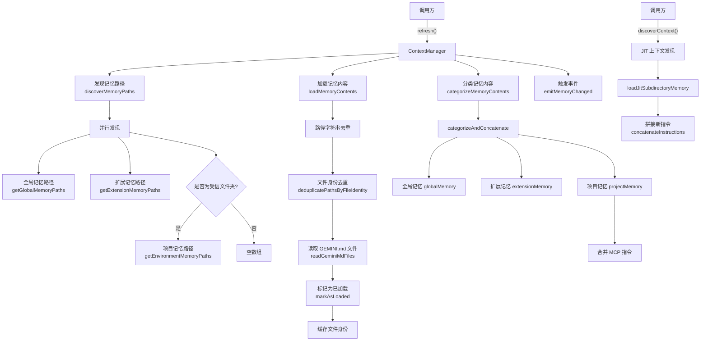
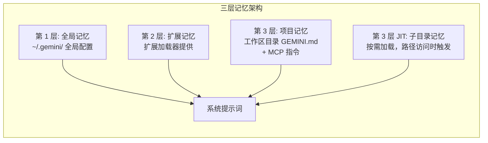

# contextManager.ts

## 概述

`ContextManager` 是上下文管理器服务，负责**发现、加载、分类和管理**三层记忆上下文（全局记忆、扩展记忆、项目记忆），并支持按需（JIT, Just-In-Time）动态发现子目录级别的上下文。

它的核心职责是从各种来源（全局 `.gemini` 配置、扩展、项目工作区目录下的 `GEMINI.md` 文件）读取记忆指令内容，并将其分类存储，供系统提示词构建时使用。该管理器维护已加载路径的去重集合，避免重复加载相同内容。

## 架构图（Mermaid）

## 核心组件

### 1. `ContextManager` 类

#### 私有属性

| 属性 | 类型 | 描述 |
|---|---|---|
| `loadedPaths` | `Set<string>` | 已加载的文件路径集合（去重用） |
| `loadedFileIdentities` | `Set<string>` | 已加载的文件身份集合（处理大小写不敏感文件系统） |
| `config` | `Config` | 配置对象 |
| `globalMemory` | `string` | 全局记忆内容 |
| `extensionMemory` | `string` | 扩展记忆内容 |
| `projectMemory` | `string` | 项目记忆内容（包含 MCP 指令） |

#### 公共方法

##### `refresh(): Promise<void>`

刷新所有记忆。完整流程：
1. 清空 `loadedPaths` 和 `loadedFileIdentities`。
2. 发现记忆路径（`discoverMemoryPaths`）。
3. 加载记忆内容（`loadMemoryContents`）。
4. 分类记忆内容（`categorizeMemoryContents`）。
5. 触发 `MemoryChanged` 事件。

##### `discoverContext(accessedPath, trustedRoots): Promise<string>`

**JIT（即时）上下文发现**。当代理访问某个路径时，从该路径向上遍历到项目根目录，发现并加载沿途的 `GEMINI.md` 文件。

- 仅在受信文件夹中生效。
- 使用 `loadedPaths` 和 `loadedFileIdentities` 避免重复加载。
- 将新发现的文件标记为已加载并缓存其文件身份。
- 返回拼接后的指令字符串。

##### `getGlobalMemory(): string`

返回全局记忆内容。

##### `getExtensionMemory(): string`

返回扩展记忆内容。

##### `getEnvironmentMemory(): string`

返回项目记忆内容（包含 MCP 指令）。

##### `getLoadedPaths(): ReadonlySet<string>`

返回已加载路径的只读集合。

#### 私有方法

##### `discoverMemoryPaths()`

并行发现三个来源的记忆路径：
- **全局路径** -- 通过 `getGlobalMemoryPaths()` 获取。
- **扩展路径** -- 通过 `getExtensionMemoryPaths(extensionLoader)` 获取。
- **项目路径** -- 仅在受信文件夹中，通过 `getEnvironmentMemoryPaths(directories)` 获取；不受信则返回空数组。

##### `loadMemoryContents(paths)`

加载所有记忆文件内容：
1. 合并三个来源的路径并进行字符串级去重。
2. 通过 `deduplicatePathsByFileIdentity` 进行文件身份级去重（处理大小写不敏感文件系统）。
3. 使用 `readGeminiMdFiles` 批量读取文件内容。
4. 将成功读取的文件标记为已加载。
5. 缓存文件身份到 `loadedFileIdentities`。
6. 返回 `filePath -> GeminiFileContent` 的 Map。

##### `categorizeMemoryContents(paths, contentsMap)`

将加载的内容分类到三个记忆槽：
1. 调用 `categorizeAndConcatenate` 按路径来源分类并拼接内容。
2. 全局和扩展记忆直接赋值。
3. 项目记忆还需合并 MCP 客户端管理器提供的 MCP 指令。
4. 非受信文件夹的项目记忆设为空字符串。

##### `markAsLoaded(paths)`

将路径列表添加到 `loadedPaths` 集合。

##### `emitMemoryChanged()`

通过 `coreEvents` 触发 `MemoryChanged` 事件，携带已加载文件数量。

## 依赖关系

### 内部依赖

| 模块路径 | 导入项 | 用途 |
|---|---|---|
| `../utils/memoryDiscovery.js` | `loadJitSubdirectoryMemory`, `concatenateInstructions`, `getGlobalMemoryPaths`, `getExtensionMemoryPaths`, `getEnvironmentMemoryPaths`, `readGeminiMdFiles`, `categorizeAndConcatenate`, `GeminiFileContent`, `deduplicatePathsByFileIdentity` | 记忆发现和读取的核心工具函数 |
| `../config/config.js` | `Config` | 配置对象类型 |
| `../utils/events.js` | `coreEvents`, `CoreEvent` | 核心事件发射器和事件枚举 |

### 外部依赖

无直接的外部第三方依赖。所有功能通过内部模块间接实现。

## 关键实现细节

1. **三层记忆架构**：
   - **第 1 层：全局记忆** -- 来自用户全局 `~/.gemini/` 配置，适用于所有项目。
   - **第 2 层：扩展记忆** -- 来自扩展加载器，由已安装的扩展提供。
   - **第 3 层：项目记忆** -- 来自工作区目录中的 `GEMINI.md` 文件，仅在受信文件夹中加载。额外合并 MCP 指令。
   - **第 3 层 JIT：子目录记忆** -- 按需加载，当代理访问某个路径时触发，从访问路径向上遍历发现 `GEMINI.md`。

2. **双重去重机制**：
   - **字符串级去重** -- 使用 `Set` 对路径字符串去重，处理三个来源中可能重复的路径。
   - **文件身份级去重** -- 使用 `deduplicatePathsByFileIdentity` 处理大小写不敏感文件系统（如 macOS HFS+）上的路径别名问题。

3. **信任检查**：项目记忆和 JIT 上下文发现都受到 `config.isTrustedFolder()` 的保护。非受信文件夹中，项目级别的记忆被完全禁用，防止不受信的代码库注入指令。

4. **JIT 上下文发现的增量性**：`discoverContext` 使用 `loadedPaths` 和 `loadedFileIdentities` 跳过已加载的文件，确保同一文件不会被重复注入上下文。新发现的文件会被标记并缓存身份。

5. **MCP 指令合并**：项目记忆不仅包含 `GEMINI.md` 文件的内容，还合并了 MCP 客户端管理器提供的工具使用指令，确保 LLM 了解可用的 MCP 工具。

6. **事件驱动通知**：记忆刷新完成后通过 `CoreEvent.MemoryChanged` 事件通知其他组件，携带已加载文件数量信息。

7. **并行路径发现**：`discoverMemoryPaths` 使用 `Promise.all` 并行发现三个来源的路径，优化 I/O 性能。

8. **导入格式支持**：`readGeminiMdFiles` 接收 `config.getImportFormat()` 参数，支持不同的文件内容导入格式。
