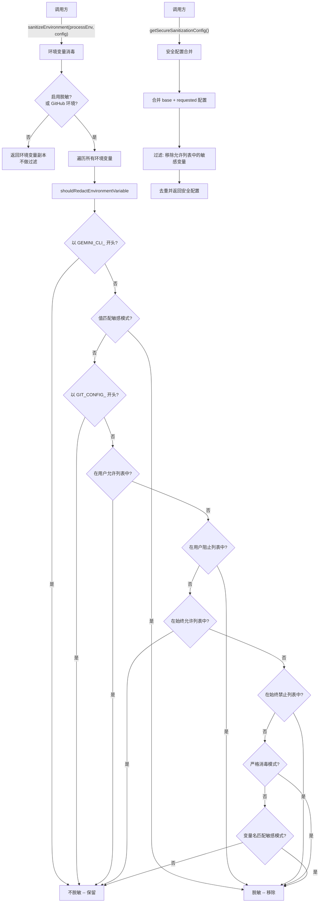

# environmentSanitization.ts

## 概述

`environmentSanitization` 是环境变量消毒（脱敏）服务，负责在将进程环境变量传递给 LLM 或外部工具之前，**过滤和移除敏感信息**。它通过多层安全规则判断每个环境变量是否应该被脱敏（redact），包括：始终允许的变量白名单、始终禁止的变量黑名单、敏感变量名模式匹配、敏感值模式匹配（如私钥、API Key、JWT Token 等），以及用户自定义的允许/阻止列表。

该模块在 GitHub Actions 等 CI 环境中会启用**严格消毒模式**，默认脱敏所有未明确允许的变量。

## 架构图（Mermaid）

## 核心组件

### 1. `EnvironmentSanitizationConfig` 类型

消毒配置结构：

| 字段 | 类型 | 描述 |
|---|---|---|
| `allowedEnvironmentVariables` | `string[]` | 用户自定义的允许变量名列表 |
| `blockedEnvironmentVariables` | `string[]` | 用户自定义的阻止变量名列表 |
| `enableEnvironmentVariableRedaction` | `boolean` | 是否启用环境变量脱敏 |

### 2. `sanitizeEnvironment(processEnv, config)` 函数

**主入口函数**。对进程环境变量进行消毒过滤。

- 如果未启用脱敏且不是严格消毒模式，直接返回环境变量的浅拷贝。
- 否则遍历所有环境变量，通过 `shouldRedactEnvironmentVariable` 判断是否应脱敏。
- 返回过滤后的环境变量对象（仅包含未被脱敏的变量）。

**严格消毒模式触发条件**：存在 `GITHUB_SHA` 环境变量，或 `SURFACE` 等于 `'Github'`。

### 3. `ALWAYS_ALLOWED_ENVIRONMENT_VARIABLES` 常量

始终允许的环境变量白名单（`ReadonlySet<string>`）：

| 类别 | 变量名 |
|---|---|
| 跨平台 | `PATH` |
| Windows | `SYSTEMROOT`, `COMSPEC`, `PATHEXT`, `WINDIR`, `TEMP`, `TMP`, `USERPROFILE`, `SYSTEMDRIVE` |
| Unix/Linux/macOS | `HOME`, `LANG`, `SHELL`, `TMPDIR`, `USER`, `LOGNAME` |
| 终端能力 | `TERM`, `COLORTERM` |
| GitHub Actions | `ADDITIONAL_CONTEXT`, `AVAILABLE_LABELS`, `BRANCH_NAME`, `DESCRIPTION`, `EVENT_NAME`, `GITHUB_ENV`, `IS_PULL_REQUEST`, `ISSUES_TO_TRIAGE`, `ISSUE_BODY`, `ISSUE_NUMBER`, `ISSUE_TITLE`, `PULL_REQUEST_NUMBER`, `REPOSITORY`, `TITLE`, `TRIGGERING_ACTOR` |

### 4. `NEVER_ALLOWED_ENVIRONMENT_VARIABLES` 常量

始终禁止的环境变量黑名单（`ReadonlySet<string>`）：

包含 `CLIENT_ID`、`DB_URI`、`CONNECTION_STRING`、`AWS_DEFAULT_REGION`、`AZURE_CLIENT_ID`、`AZURE_TENANT_ID`、`SLACK_WEBHOOK_URL`、`TWILIO_ACCOUNT_SID`、`DATABASE_URL`、`GOOGLE_CLOUD_PROJECT`、`GOOGLE_CLOUD_ACCOUNT`、`FIREBASE_PROJECT_ID`。

### 5. `NEVER_ALLOWED_NAME_PATTERNS` 常量

敏感变量名的正则模式数组（不区分大小写）：

| 模式 | 匹配内容 |
|---|---|
| `/TOKEN/i` | 包含 "TOKEN" 的变量名 |
| `/SECRET/i` | 包含 "SECRET" 的变量名 |
| `/PASSWORD/i` | 包含 "PASSWORD" 的变量名 |
| `/PASSWD/i` | 包含 "PASSWD" 的变量名 |
| `/KEY/i` | 包含 "KEY" 的变量名 |
| `/AUTH/i` | 包含 "AUTH" 的变量名 |
| `/CREDENTIAL/i` | 包含 "CREDENTIAL" 的变量名 |
| `/CREDS/i` | 包含 "CREDS" 的变量名 |
| `/PRIVATE/i` | 包含 "PRIVATE" 的变量名 |
| `/CERT/i` | 包含 "CERT" 的变量名 |

### 6. `NEVER_ALLOWED_VALUE_PATTERNS` 常量

敏感变量值的正则模式数组（不区分大小写）：

| 模式 | 匹配内容 |
|---|---|
| `-----BEGIN (RSA\|OPENSSH\|EC\|PGP) PRIVATE KEY-----` | 私钥头部 |
| `-----BEGIN CERTIFICATE-----` | 证书头部 |
| `(https?\|ftp\|smtp)://用户:密码@` | URL 中嵌入的凭据 |
| `(ghp\|gho\|ghu\|ghs\|ghr\|github_pat)_...` | GitHub 各类 Token |
| `AIzaSy...` | Google API Key |
| `AKIA...` | AWS Access Key ID |
| `eyJ...` | JWT / OAuth Token |
| `(s\|r)k_(live\|test)_...` | Stripe API Key |
| `xox[abpr]-...` | Slack Token |

### 7. `shouldRedactEnvironmentVariable(key, value, ...)` 函数

**私有函数**，核心判断逻辑。按优先级顺序评估是否应脱敏：

1. **`GEMINI_CLI_` 前缀** -- 永不脱敏（Gemini CLI 内部变量）。
2. **值模式匹配** -- 如果值匹配 `NEVER_ALLOWED_VALUE_PATTERNS` 中的任何模式，**脱敏**。
3. **`GIT_CONFIG_` 前缀** -- 永不脱敏（Git 配置变量）。
4. **用户允许列表** -- 在 `allowedSet` 中则**不脱敏**。
5. **用户阻止列表** -- 在 `blockedSet` 中则**脱敏**。
6. **始终允许列表** -- 在 `ALWAYS_ALLOWED_ENVIRONMENT_VARIABLES` 中则**不脱敏**。
7. **始终禁止列表** -- 在 `NEVER_ALLOWED_ENVIRONMENT_VARIABLES` 中则**脱敏**。
8. **严格消毒模式** -- 如果启用严格模式，所有未明确允许的变量都**脱敏**。
9. **名称模式匹配** -- 如果变量名匹配 `NEVER_ALLOWED_NAME_PATTERNS`，**脱敏**。
10. **默认** -- **不脱敏**。

### 8. `getSecureSanitizationConfig(requestedConfig, baseConfig)` 函数

**导出函数**，合并并验证消毒配置。

- 合并 `baseConfig` 和 `requestedConfig` 的允许/阻止列表。
- **安全过滤**：从合并后的允许列表中移除匹配 `NEVER_ALLOWED_ENVIRONMENT_VARIABLES` 或 `NEVER_ALLOWED_NAME_PATTERNS` 的变量，防止请求方绕过安全限制。
- 对允许列表和阻止列表进行去重。
- `enableEnvironmentVariableRedaction` 的优先级：`requestedConfig > baseConfig > false`。

## 依赖关系

### 内部依赖

无内部依赖。该模块是独立的纯函数模块。

### 外部依赖

无外部依赖。该模块仅使用 TypeScript 原生类型和正则表达式。

## 关键实现细节

1. **多层安全防线**：消毒逻辑采用多层优先级判断，从最高优先级的 `GEMINI_CLI_` 前缀豁免到最低优先级的默认通过，构建了严密的安全过滤链。每个环境变量都要通过全部检查点。

2. **值级别检测**：除了变量名检查外，还对变量值进行正则匹配，能够检测到变量名不敏感但值中包含私钥、API Key、JWT Token、数据库 URL 凭据等敏感内容的情况。这是至关重要的安全层，因为用户可能将敏感值存储在非标准名称的变量中。

3. **值检查优先于名称白名单**：在判断流程中，`NEVER_ALLOWED_VALUE_PATTERNS` 的检查在用户允许列表之前执行。这意味着即使用户明确允许了某个变量，如果其值匹配敏感模式（如包含私钥），该变量仍会被脱敏。但 `GEMINI_CLI_` 前缀的变量是唯一例外，它们在值检查之前就被豁免。

4. **GitHub Actions 严格模式**：在 CI/CD 环境中（通过 `GITHUB_SHA` 或 `SURFACE=Github` 检测），启用严格消毒模式，默认脱敏所有未在白名单中的变量。这是因为 CI 环境中通常包含大量敏感的构建和部署凭据。

5. **大小写不敏感**：变量名和值在比较前都转换为大写，确保在不同操作系统上一致的行为（Windows 环境变量不区分大小写）。

6. **安全配置合并的防绕过机制**：`getSecureSanitizationConfig` 在合并配置时，会从允许列表中过滤掉所有匹配敏感模式的变量名。这防止了恶意请求通过 `requestedConfig` 将敏感变量添加到允许列表中。

7. **纯函数设计**：`sanitizeEnvironment` 不修改传入的 `processEnv`，而是返回一个新的过滤后对象。`shouldRedactEnvironmentVariable` 是纯函数，便于测试和推理。

8. **`GIT_CONFIG_` 豁免**：Git 配置相关的环境变量被豁免，因为这些变量对 Git 操作至关重要，且通常不包含敏感信息（它们是 Git 行为配置，而非凭据）。

9. **正则表达式安全**：`NEVER_ALLOWED_VALUE_PATTERNS` 中的正则表达式都设置了合理的长度限制（如 `{1,1024}`、`{0,10240}`），防止 ReDoS（正则表达式拒绝服务）攻击。

10. **GitHub Actions 专用白名单**：`ALWAYS_ALLOWED_ENVIRONMENT_VARIABLES` 中包含了多个 GitHub Actions 特有的变量（如 `ISSUE_TITLE`、`PULL_REQUEST_NUMBER` 等），使得 Gemini CLI 在 CI 工作流中能够正常获取 PR/Issue 上下文信息。
