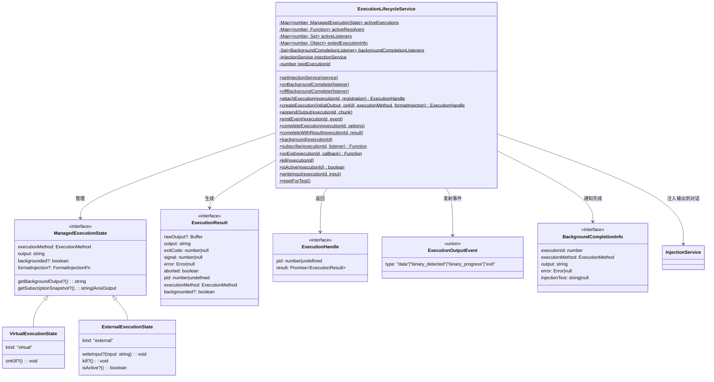
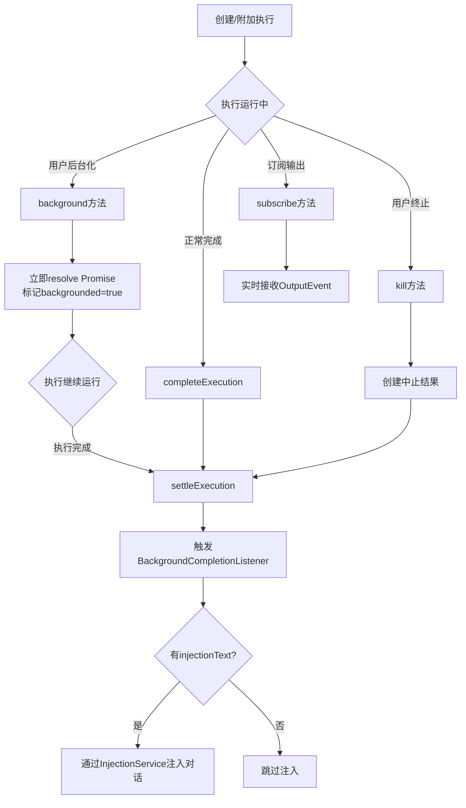

# executionLifecycleService.ts

## 概述

`ExecutionLifecycleService` 是一个**中央执行生命周期管理服务**，负责跨 Shell 和工具的执行任务的后台化（backgrounding）生命周期管理。它以纯静态类的形式实现，提供执行的创建、附加、输出追加、后台化、订阅、完成和终止等全流程管理能力。

该服务的核心场景是：当 CLI 工具执行长时间运行的命令时，用户可以将其"后台化"——即让命令继续在后台运行，同时释放前台交互。当后台任务完成后，服务会通过监听器通知上层，并可选地将输出注入回模型对话中。

## 架构图（Mermaid）

## 核心组件

### 1. 类型定义

#### ExecutionMethod（执行方法枚举）
定义了5种执行方法：
- `'lydell-node-pty'`：通过 lydell fork 的 node-pty 执行
- `'node-pty'`：通过原版 node-pty 执行
- `'child_process'`：通过 Node.js child_process 执行
- `'remote_agent'`：通过远程代理执行
- `'none'`：虚拟执行（无实际进程）

#### ExecutionResult（执行结果）
执行完成后的完整结果，包含：
- `rawOutput`：原始 Buffer 输出
- `output`：字符串形式的输出
- `exitCode`：进程退出码
- `signal`：信号码
- `error`：错误对象
- `aborted`：是否被中止
- `pid`：进程 ID 或执行 ID
- `executionMethod`：使用的执行方法
- `backgrounded`：是否被后台化

#### ExecutionHandle（执行句柄）
创建执行后返回的句柄，包含 `pid` 和一个 `Promise<ExecutionResult>`，调用方可通过该 Promise 等待执行完成。

#### ExecutionOutputEvent（输出事件）
使用联合类型定义了4种事件：
- `data`：普通数据输出（支持字符串和 AnsiOutput）
- `binary_detected`：检测到二进制输出
- `binary_progress`：二进制传输进度
- `exit`：执行退出，携带 exitCode 和 signal

#### FormatInjectionFn（注入格式化函数）
回调函数，由执行创建者提供，控制后台执行完成后输出如何被格式化并重新注入到模型对话中。返回 `null` 表示跳过注入。

#### BackgroundCompletionInfo（后台完成信息）
当后台化的执行结束时发射的载荷，包含执行ID、方法、输出、错误信息和预格式化的注入文本。

### 2. 执行状态管理

#### VirtualExecutionState（虚拟执行状态）
`kind: 'virtual'`，由服务内部创建的虚拟执行，不对应真实外部进程。支持 `onKill` 回调。

#### ExternalExecutionState（外部执行状态）
`kind: 'external'`，由外部（如 node-pty、child_process）注册的真实执行。支持 `writeInput`、`kill`、`isActive` 等外部控制方法。

### 3. ExecutionLifecycleService 类

#### 静态属性
| 属性 | 类型 | 说明 |
|------|------|------|
| `EXIT_INFO_TTL_MS` | `number` | 退出信息的 TTL，固定为 5 分钟 |
| `nextExecutionId` | `number` | 执行 ID 计数器，从 2,000,000,000 开始 |
| `activeExecutions` | `Map<number, ManagedExecutionState>` | 活跃执行映射表 |
| `activeResolvers` | `Map<number, Function>` | 等待 resolve 的 Promise 解析器 |
| `activeListeners` | `Map<number, Set<Function>>` | 输出事件监听器集合 |
| `exitedExecutionInfo` | `Map<number, Object>` | 已退出执行的退出信息缓存 |
| `backgroundCompletionListeners` | `Set<BackgroundCompletionListener>` | 后台完成监听器集合 |
| `injectionService` | `InjectionService \| null` | 注入服务单例 |

#### 核心方法

**创建与附加**
- `createExecution(initialOutput, onKill, executionMethod, formatInjection)`: 创建虚拟执行，分配唯一 ID，自动设置 `getBackgroundOutput` 和 `getSubscriptionSnapshot` 闭包指向当前状态。
- `attachExecution(executionId, registration)`: 将已有的外部执行（如 pty 进程）附加到管理体系中。如果 ID 已存在则抛出错误。

**输出管理**
- `appendOutput(executionId, chunk)`: 追加输出到执行状态，并向订阅者发射 `data` 事件。
- `emitEvent(executionId, event)`: 向指定执行的所有监听器广播事件。

**生命周期控制**
- `background(executionId)`: 将执行后台化——立即 resolve 对应的 Promise（返回当前输出 + `backgrounded: true`），删除 resolver，标记执行为已后台化。执行本身继续运行。
- `completeExecution(executionId, options)`: 完成执行，构建 `ExecutionResult` 并调用 `settleExecution`。
- `completeWithResult(executionId, result)`: 直接用给定的 `ExecutionResult` 结算执行。
- `kill(executionId)`: 终止执行——对虚拟执行调用 `onKill`，对外部执行调用 `kill`，然后以中止状态（exitCode=130）结算。

**结算核心** (`settleExecution`)
1. 如果执行被后台化且未被中止，触发 `BackgroundCompletionListener`。
2. 如果有 `formatInjection` 函数，调用它生成注入文本。
3. 如果有注入文本且 `injectionService` 已连接，直接注入到模型对话。
4. resolve 挂起的 Promise。
5. 发射 `exit` 事件。
6. 清理所有监听器和状态。
7. 缓存退出信息（TTL 5 分钟）。

**订阅与监听**
- `subscribe(executionId, listener)`: 订阅执行的输出事件，立即发送当前快照（如有），返回取消订阅函数。
- `onExit(executionId, callback)`: 监听执行退出事件。如果执行已退出（在缓存中），立即回调。
- `onBackgroundComplete(listener)` / `offBackgroundComplete(listener)`: 注册/注销后台完成全局监听器。

**状态查询**
- `isActive(executionId)`: 判断执行是否活跃。对虚拟执行直接返回 true；对外部执行调用其 `isActive` 方法；对不在管理中的非虚拟 ID，尝试 `process.kill(pid, 0)` 探测。

**输入**
- `writeInput(executionId, input)`: 向外部执行写入输入数据。

**测试支持**
- `resetForTest()`: 清空所有状态，用于隔离单元测试。

## 依赖关系

### 内部依赖
| 模块 | 说明 |
|------|------|
| `../config/injectionService.js` | `InjectionService` 类型——用于将后台完成的输出注入回模型对话 |
| `../utils/terminalSerializer.js` | `AnsiOutput` 类型——终端 ANSI 序列化输出的结构化表示 |
| `../utils/debugLogger.js` | `debugLogger`——调试日志工具，用于记录后台完成监听器的异常 |

### 外部依赖
无直接的第三方外部依赖。使用了 Node.js 内置的：
- `Buffer`：用于将字符串输出转为原始字节
- `setTimeout`：用于设置退出信息的 TTL 定时清理（调用 `.unref()` 避免阻止进程退出）
- `Promise`：用于创建异步执行结果
- `process.kill(pid, 0)`：用于探测进程是否仍然活跃

## 关键实现细节

### 1. 执行 ID 分配策略
虚拟执行的 ID 从 `2,000,000,000`（`NON_PROCESS_EXECUTION_ID_START`）开始递增分配，这样可以与真实进程的 PID（通常远小于此值）区分开来。`isActive` 方法利用这个阈值判断：对于大于阈值的 ID，不会尝试 `process.kill` 探测。

### 2. 后台化的两阶段设计
后台化并不终止执行，而是：
- **第一阶段**（`background`）：立即 resolve 等待的 Promise，让调用方继续执行。Promise 的结果中 `backgrounded: true`，exitCode 为 null。
- **第二阶段**（执行实际完成时）：通过 `settleExecution` 触发后台完成监听器和注入服务，但此时原始 resolver 已被删除，不会重复 resolve。

### 3. 退出信息缓存与 TTL
执行完成后，退出信息会被缓存 5 分钟。这使得 `onExit` 方法在执行已经完成之后仍然能够获取退出信息，避免了竞态条件。缓存使用 `setTimeout(...).unref()` 清理，不会阻止 Node.js 进程退出。

### 4. 订阅快照机制
`subscribe` 方法在注册监听器后会立即发送当前输出快照（通过 `getSubscriptionSnapshot` 或直接读取 `output`），确保新订阅者不会错过已有的输出内容。

### 5. 全静态类设计
整个服务以静态属性和静态方法实现，没有实例化的概念。这意味着全局只有一份状态，所有组件共享同一个执行管理上下文。`resetForTest` 方法提供了测试隔离的手段。

### 6. 注入服务集成
通过 `setInjectionService` 方法延迟绑定 `InjectionService`。当后台化执行完成时，如果执行创建者提供了 `formatInjection` 函数并且返回了非 null 的文本，且注入服务已绑定，则自动将输出作为 `'background_completion'` 类型注入到模型对话中，无需经过 UI 层。

### 7. 终止执行的退出码
被 `kill` 终止的执行使用退出码 `130`，这与 Unix 系统中 `SIGINT`（Ctrl+C）导致的退出码一致（128 + 2 = 130），表达"被用户中断"的语义。
