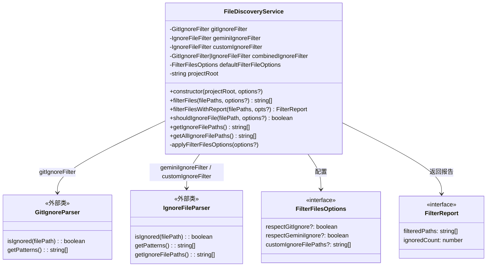
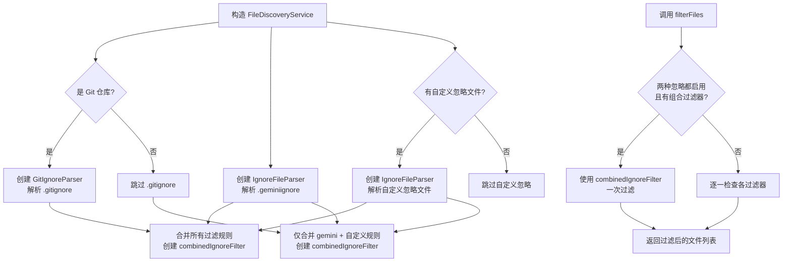

# fileDiscoveryService.ts

## 概述

`FileDiscoveryService` 是一个**文件发现与过滤服务**，负责根据多种忽略规则（`.gitignore`、`.geminiignore` 及自定义忽略文件）对文件路径列表进行过滤。它在项目初始化时解析各类忽略文件，构建组合过滤器，随后提供高效的文件过滤和查询能力。

该服务的核心目的是确保 Gemini CLI 在处理文件时（如上下文收集、代码分析等场景）自动排除被忽略的文件，同时支持灵活配置，允许分别开启或关闭不同类型的忽略规则。

## 架构图（Mermaid）

## 核心组件

### 1. FilterFilesOptions 接口

过滤文件的选项配置：

| 属性 | 类型 | 默认值 | 说明 |
|------|------|--------|------|
| `respectGitIgnore` | `boolean` | `true` | 是否尊重 `.gitignore` 规则 |
| `respectGeminiIgnore` | `boolean` | `true` | 是否尊重 `.geminiignore` 规则 |
| `customIgnoreFilePaths` | `string[]` | `[]` | 自定义忽略文件路径列表 |

### 2. FilterReport 接口

过滤报告，包含：
- `filteredPaths`：过滤后保留的文件路径列表
- `ignoredCount`：被忽略的文件数量

### 3. FileDiscoveryService 类

#### 私有属性

| 属性 | 类型 | 说明 |
|------|------|------|
| `gitIgnoreFilter` | `GitIgnoreFilter \| null` | Git 忽略过滤器，非 Git 仓库时为 null |
| `geminiIgnoreFilter` | `IgnoreFileFilter \| null` | Gemini 忽略过滤器 |
| `customIgnoreFilter` | `IgnoreFileFilter \| null` | 自定义忽略过滤器 |
| `combinedIgnoreFilter` | `GitIgnoreFilter \| IgnoreFileFilter \| null` | 合并后的组合过滤器 |
| `defaultFilterFileOptions` | `FilterFilesOptions` | 默认过滤选项 |
| `projectRoot` | `string` | 项目根目录的绝对路径 |

#### 构造函数

`constructor(projectRoot: string, options?: FilterFilesOptions)`

1. 将 `projectRoot` 解析为绝对路径。
2. 应用传入的过滤选项。
3. 检测是否为 Git 仓库，若是则创建 `GitIgnoreParser`。
4. 创建 `IgnoreFileParser` 解析 `.geminiignore`。
5. 如果有自定义忽略文件路径，创建对应的 `IgnoreFileParser`。
6. 创建组合过滤器：
   - **Git 仓库**：使用 `GitIgnoreParser` 并传入 gemini + 自定义 patterns 作为额外模式。
   - **非 Git 仓库**：使用 `IgnoreFileParser` 合并 gemini + 自定义 patterns。

#### 公开方法

##### `filterFiles(filePaths: string[], options?: FilterFilesOptions): string[]`
核心过滤方法。过滤逻辑：
- 如果 `respectGitIgnore` 和 `respectGeminiIgnore` 都为 true 且有组合过滤器，使用组合过滤器一次性判断（性能最优路径）。
- 否则逐一检查各个过滤器：自定义忽略过滤器始终生效；Git 忽略和 Gemini 忽略根据选项决定。

##### `filterFilesWithReport(filePaths: string[], opts?: FilterFilesOptions): FilterReport`
在 `filterFiles` 基础上额外返回被忽略的文件计数。

##### `shouldIgnoreFile(filePath: string, options?: FilterFilesOptions): boolean`
判断单个文件是否应被忽略。内部复用 `filterFiles` 方法，检查过滤结果是否为空。

##### `getIgnoreFilePaths(): string[]`
返回正在使用的忽略文件路径列表（不包含 `.gitignore`），包括 `.geminiignore` 和自定义忽略文件。

##### `getAllIgnoreFilePaths(): string[]`
返回所有忽略文件路径，包括 `.gitignore`（如果存在且启用）。

## 依赖关系

### 内部依赖

| 模块 | 导入内容 | 说明 |
|------|----------|------|
| `../utils/gitIgnoreParser.js` | `GitIgnoreParser`, `GitIgnoreFilter` | Git 忽略规则解析器及其过滤接口 |
| `../utils/ignoreFileParser.js` | `IgnoreFileParser`, `IgnoreFileFilter` | 通用忽略文件解析器及其过滤接口 |
| `../utils/gitUtils.js` | `isGitRepository` | 判断指定目录是否为 Git 仓库的工具函数 |
| `../config/constants.js` | `GEMINI_IGNORE_FILE_NAME` | Gemini 忽略文件的文件名常量（即 `.geminiignore`） |

### 外部依赖

| 模块 | 说明 |
|------|------|
| `node:fs` | Node.js 文件系统模块，用于检测 `.gitignore` 文件是否存在 |
| `node:path` | Node.js 路径模块，用于路径解析 (`resolve`) 和拼接 (`join`) |

## 关键实现细节

### 1. 组合过滤器的优化策略

服务在构造时预先创建一个组合过滤器 `combinedIgnoreFilter`，将 `.gitignore`、`.geminiignore` 和自定义忽略规则合并在一起。当两种主要忽略规则都启用时（这是最常见的场景），`filterFiles` 方法直接使用组合过滤器进行一次判断，避免多次解析和匹配，提升过滤性能。

### 2. 自定义忽略规则的优先级

在合并 patterns 时，自定义 patterns 被放置在 gemini patterns 之后（`[...geminiPatterns, ...customPatterns]`），注释明确指出这是为了确保自定义规则可以覆盖（overwrite）gemini 规则。在 gitignore 语法中，后出现的规则优先级更高。

### 3. Git 仓库与非 Git 仓库的差异处理

- **Git 仓库**：组合过滤器使用 `GitIgnoreParser`，它能同时处理 `.gitignore` 文件和额外传入的 patterns。
- **非 Git 仓库**：组合过滤器使用 `IgnoreFileParser`，第三个参数 `true` 表示直接使用传入的 patterns 列表（而非文件路径）。

### 4. 自定义忽略过滤器始终生效

在 `filterFiles` 的回退路径（非组合过滤器路径）中，无论 `respectGitIgnore` 和 `respectGeminiIgnore` 如何设置，`customIgnoreFilter` 始终会被检查，确保自定义忽略规则不会被意外绕过。

### 5. 路径标准化

构造函数使用 `path.resolve(projectRoot)` 将传入的项目根目录标准化为绝对路径，确保后续所有路径操作的一致性。
