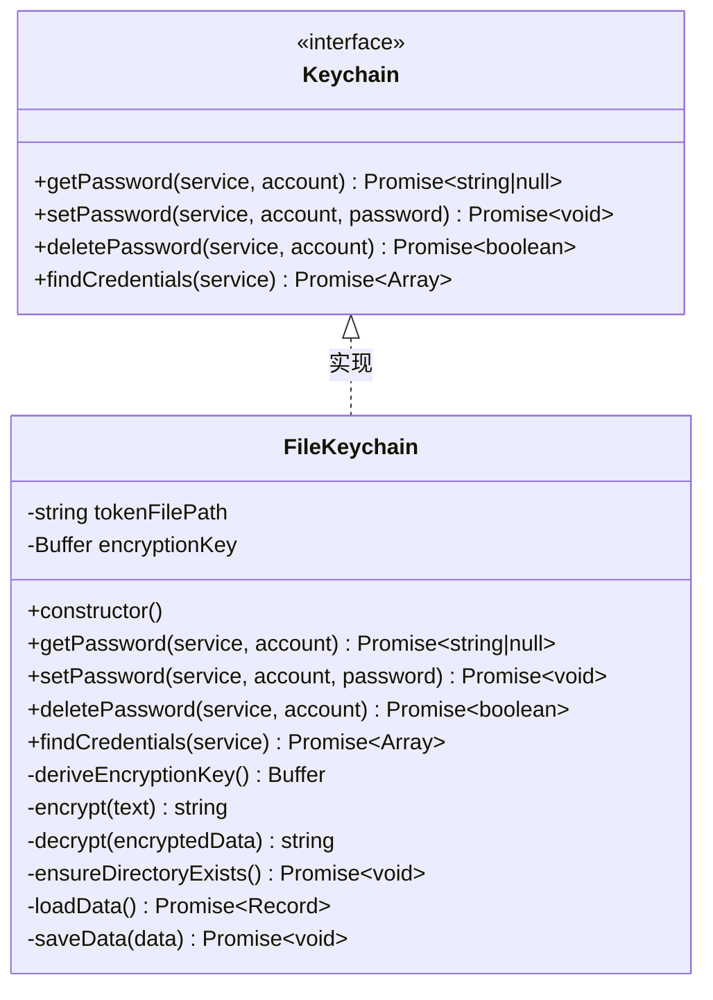
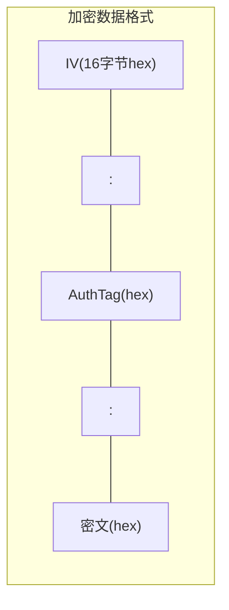

# fileKeychain.ts

## 概述

`FileKeychain` 是一个**基于文件的加密凭据存储服务**，实现了 `Keychain` 接口。它提供了一套类似操作系统密钥链（Keychain）的 API，但底层使用本地加密 JSON 文件来存储凭据，作为系统原生密钥链不可用时的后备方案。

凭据使用 AES-256-GCM 对称加密算法进行加密，密钥通过 `scrypt` 算法从机器特征信息（主机名 + 用户名）派生，确保凭据绑定到特定机器和用户。加密后的凭据存储在用户主目录下的 `.gemini/gemini-credentials.json` 文件中。

## 架构图（Mermaid）

```mermaid
flowchart TD
    subgraph 初始化
        A[构造 FileKeychain] --> B[计算配置目录路径<br/>~/.gemini/gemini-credentials.json]
        A --> C[派生加密密钥]
        C --> D[使用 scrypt 算法<br/>密码: gemini-cli-oauth<br/>盐值: 主机名-用户名-gemini-cli]
    end

    subgraph 读取凭据
        E[getPassword / findCredentials] --> F[读取加密文件]
        F --> G{文件存在?}
        G -->|否| H[返回空数据]
        G -->|是| I[AES-256-GCM 解密]
        I --> J{解密成功?}
        J -->|是| K[JSON.parse 解析]
        J -->|否| L[抛出凭据损坏错误]
        K --> M[返回对应凭据]
    end

    subgraph 写入凭据
        N[setPassword] --> O[加载现有数据]
        O --> P[更新目标键值]
        P --> Q[JSON.stringify 序列化]
        Q --> R[AES-256-GCM 加密]
        R --> S[确保目录存在<br/>权限 0o700]
        S --> T[写入文件<br/>权限 0o600]
    end

    subgraph 删除凭据
        U[deletePassword] --> V[加载现有数据]
        V --> W{凭据存在?}
        W -->|否| X[返回 false]
        W -->|是| Y[删除目标键值]
        Y --> Z{service 下无其他凭据?}
        Z -->|是| AA[删除整个 service 条目]
        AA --> AB{整个数据为空?}
        AB -->|是| AC[删除文件]
        AB -->|否| AD[保存更新后的数据]
        Z -->|否| AD
        AC --> AE[返回 true]
        AD --> AE
    end
```







## 核心组件

### 1. FileKeychain 类

#### 私有属性

| 属性 | 类型 | 说明 |
|------|------|------|
| `tokenFilePath` | `string` (readonly) | 凭据文件完整路径：`~/.gemini/gemini-credentials.json` |
| `encryptionKey` | `Buffer` (readonly) | 32 字节 AES-256 加密密钥，构造时通过 scrypt 派生 |

#### 构造函数

```typescript
constructor()
```

1. 通过 `homedir()` 和 `GEMINI_DIR` 常量拼接出配置目录路径。
2. 设置 `tokenFilePath` 为配置目录下的 `gemini-credentials.json`。
3. 调用 `deriveEncryptionKey()` 派生加密密钥。

#### 私有方法

##### `deriveEncryptionKey(): Buffer`
密钥派生方法：
- **密码**：固定字符串 `'gemini-cli-oauth'`
- **盐值**：`{hostname}-{username}-gemini-cli`（基于机器特征的盐值）
- **算法**：`crypto.scryptSync`，输出 32 字节密钥
- 由于盐值包含主机名和用户名，不同机器/用户会派生出不同的密钥，凭据文件不可跨机器或跨用户使用。

##### `encrypt(text: string): string`
加密方法：
1. 生成 16 字节随机 IV（初始化向量）。
2. 使用 AES-256-GCM 算法创建 cipher。
3. 加密输入文本。
4. 获取认证标签（authTag）。
5. 输出格式：`{iv_hex}:{authTag_hex}:{ciphertext_hex}`。

##### `decrypt(encryptedData: string): string`
解密方法：
1. 按 `:` 分割输入字符串，期望3个部分。
2. 解析 IV、authTag 和密文。
3. 使用 AES-256-GCM 解密并验证完整性。
4. 格式不合法时抛出错误。

##### `ensureDirectoryExists(): Promise<void>`
确保凭据文件所在目录存在，使用 `mkdir` 递归创建，权限为 `0o700`（仅所有者可读写执行）。

##### `loadData(): Promise<Record<string, Record<string, string>>>`
加载并解密凭据数据：
- 文件不存在（`ENOENT`）时返回空对象 `{}`。
- 解密失败（格式无效或认证失败）时抛出描述性错误，指引用户删除损坏的凭据文件。
- 返回的数据结构为：`{ [service]: { [account]: password } }`。

##### `saveData(data: Record<string, Record<string, string>>): Promise<void>`
序列化、加密并写入凭据数据：
1. 确保目录存在。
2. JSON 序列化（带 2 空格缩进，但加密后不可读）。
3. 加密。
4. 写入文件，权限 `0o600`（仅所有者可读写）。

#### 公开方法（Keychain 接口实现）

##### `getPassword(service: string, account: string): Promise<string | null>`
获取指定服务和账户的密码。不存在时返回 `null`。

##### `setPassword(service: string, account: string, password: string): Promise<void>`
设置（创建或更新）指定服务和账户的密码。如果 service 不存在，先创建空对象再赋值。

##### `deletePassword(service: string, account: string): Promise<boolean>`
删除指定服务和账户的密码：
- 凭据不存在返回 `false`。
- 删除后如果 service 下无其他凭据，清除整个 service 条目。
- 如果整个数据为空，直接删除凭据文件（而非写入空文件）。
- 删除成功返回 `true`。

##### `findCredentials(service: string): Promise<Array<{ account: string; password: string }>>`
查找指定服务下所有凭据，返回 `{ account, password }` 数组。

## 依赖关系

### 内部依赖

| 模块 | 导入内容 | 说明 |
|------|----------|------|
| `./keychainTypes.js` | `Keychain` 接口 | 密钥链抽象接口定义 |
| `../utils/paths.js` | `GEMINI_DIR`, `homedir` | Gemini 配置目录名常量和用户主目录获取函数 |

### 外部依赖

| 模块 | 说明 |
|------|------|
| `node:fs` (promises) | Node.js 异步文件系统 API——读取、写入、删除文件和创建目录 |
| `node:path` | 路径拼接 (`join`) 和目录名提取 (`dirname`) |
| `node:os` | 获取主机名 (`hostname`) 和用户信息 (`userInfo`) 用于盐值生成 |
| `node:crypto` | 加密核心——`scryptSync` 密钥派生、`randomBytes` IV 生成、`createCipheriv`/`createDecipheriv` AES-256-GCM 加解密 |

## 关键实现细节

### 1. 加密方案：AES-256-GCM

选择 AES-256-GCM 是因为它同时提供**加密**和**认证**（Authenticated Encryption with Associated Data, AEAD）：
- 加密确保凭据的机密性。
- GCM 的认证标签（authTag）确保完整性——任何篡改都会导致解密失败。
- 每次加密使用随机 IV，确保相同明文加密后的密文不同。

### 2. 密钥派生策略

使用 `scrypt` 从固定密码和机器特征盐值派生密钥。这意味着：
- **安全性有限**：密码是硬编码的 `'gemini-cli-oauth'`，安全性依赖于盐值的不可预测性。这不是密码学意义上的强安全，而是为了**在没有操作系统密钥链时提供基本保护**。
- **机器绑定**：凭据文件不可在不同机器之间迁移，因为盐值包含主机名和用户名。
- **确定性**：同一机器同一用户总是生成相同的密钥，无需额外存储密钥。

### 3. 文件权限安全

- 目录权限 `0o700`：仅文件所有者可访问配置目录。
- 文件权限 `0o600`：仅文件所有者可读写凭据文件。
- 这在 Unix 系统上提供了基本的文件级访问控制。

### 4. 数据清理策略

`deletePassword` 方法实现了逐级清理：
- 删除特定 account 的密码。
- 如果 service 下无剩余 account，删除整个 service 条目。
- 如果所有数据都被清空，直接删除文件（而不是写入空的加密数据）。
- 删除文件时处理 `ENOENT` 错误（竞态条件下文件可能已被删除）。

### 5. 凭据损坏检测

`loadData` 方法能检测两类损坏情况：
- 加密数据格式无效（非 `iv:authTag:ciphertext` 格式）。
- GCM 认证失败（`'Unsupported state or unable to authenticate data'`），说明数据被篡改或密钥不匹配。

两种情况都会给用户抛出友好的错误信息，建议删除或重命名损坏的凭据文件。

### 6. 数据存储格式

内存中的数据结构为两层嵌套的 Record：
```json
{
  "service-name-1": {
    "account-1": "password-1",
    "account-2": "password-2"
  },
  "service-name-2": {
    "account-3": "password-3"
  }
}
```
整个结构作为一个整体被加密/解密，每次操作（get/set/delete）都需要加载和（可能）保存完整数据。
