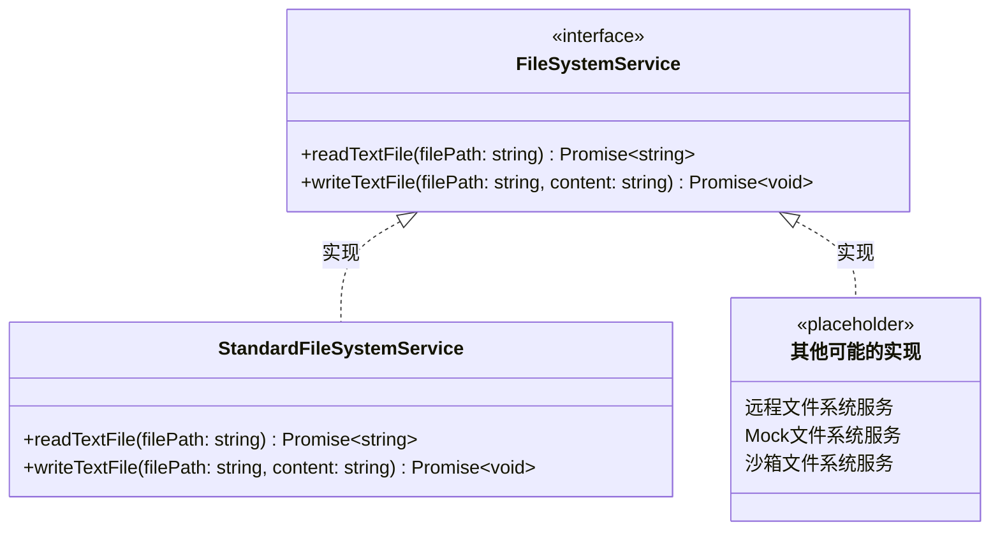
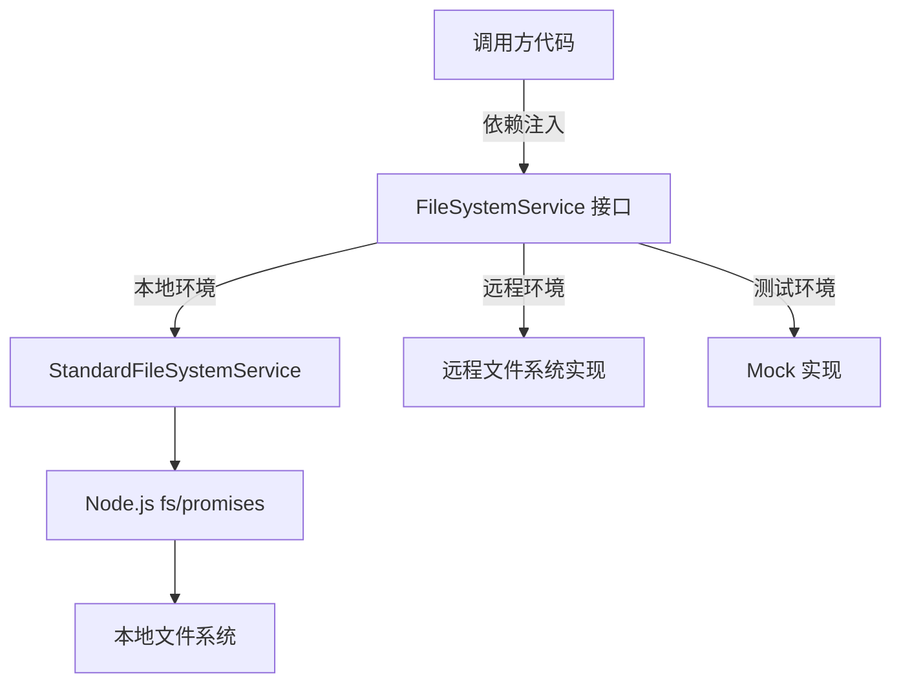

# fileSystemService.ts

## 概述

`fileSystemService.ts` 定义了一个**文件系统操作的抽象接口**（`FileSystemService`）及其**标准实现**（`StandardFileSystemService`）。该模块采用经典的**策略模式 / 依赖注入**设计，将文件读写操作抽象为接口，使得不同的执行环境（本地文件系统、远程代理、测试 Mock 等）可以提供不同的实现。

接口非常简洁，仅包含两个方法：读取文本文件和写入文本文件。标准实现直接委托给 Node.js 的 `fs/promises` API。

## 架构图（Mermaid）

## 核心组件

### 1. FileSystemService 接口

定义了文件系统操作的抽象契约，包含两个方法：

| 方法 | 参数 | 返回值 | 说明 |
|------|------|--------|------|
| `readTextFile` | `filePath: string` | `Promise<string>` | 读取文件的文本内容并返回字符串 |
| `writeTextFile` | `filePath: string`, `content: string` | `Promise<void>` | 将文本内容写入指定路径的文件 |

该接口的设计特点：
- **仅关注文本文件**：方法名明确包含 "Text"，不处理二进制数据。
- **异步设计**：所有方法返回 Promise，适配不同的 I/O 后端（本地、远程、内存等）。
- **最小化抽象**：只抽象最基本的读/写操作，不包含目录操作、文件删除、权限管理等。

### 2. StandardFileSystemService 类

`FileSystemService` 接口的标准本地实现：

#### `readTextFile(filePath: string): Promise<string>`
直接调用 `fs.readFile(filePath, 'utf-8')`，以 UTF-8 编码读取文件内容并返回字符串。

#### `writeTextFile(filePath: string, content: string): Promise<void>`
直接调用 `fs.writeFile(filePath, content, 'utf-8')`，以 UTF-8 编码将内容写入文件。如果文件不存在则创建，已存在则覆盖。

## 依赖关系

### 内部依赖

无内部依赖。该模块是一个独立的基础设施层组件。

### 外部依赖

| 模块 | 说明 |
|------|------|
| `node:fs/promises` | Node.js 异步文件系统 API，提供 `readFile` 和 `writeFile` 方法 |

## 关键实现细节

### 1. 策略模式 / 依赖注入设计

该模块的核心价值不在于实现复杂的文件操作，而在于**提供抽象层**。通过定义 `FileSystemService` 接口：
- 上层业务代码只依赖接口，不依赖具体实现。
- 测试时可以轻松注入 Mock 实现，无需真正操作文件系统。
- 远程执行场景下可以替换为通过网络请求进行文件操作的实现。
- 沙箱环境下可以替换为受限的文件操作实现。

### 2. 编码约定

`StandardFileSystemService` 硬编码使用 UTF-8 编码，这是现代文本文件的通用编码标准。不支持其他编码格式，这简化了接口但限制了适用范围——仅适用于文本文件。

### 3. 模块简洁性

整个文件仅 42 行代码，是项目中最精简的服务之一。它遵循了**接口隔离原则**（ISP）——只暴露调用方真正需要的操作，而不是包装整个 `fs` 模块的所有功能。

### 4. 错误处理

`StandardFileSystemService` 不进行额外的错误处理，直接将 `fs/promises` 抛出的原生错误传播给调用方。这包括：
- `ENOENT`：文件不存在（读取时）
- `EACCES`：权限不足
- `EISDIR`：路径是目录而非文件
- 其他 Node.js 文件系统错误

错误处理的责任留给上层调用代码。
