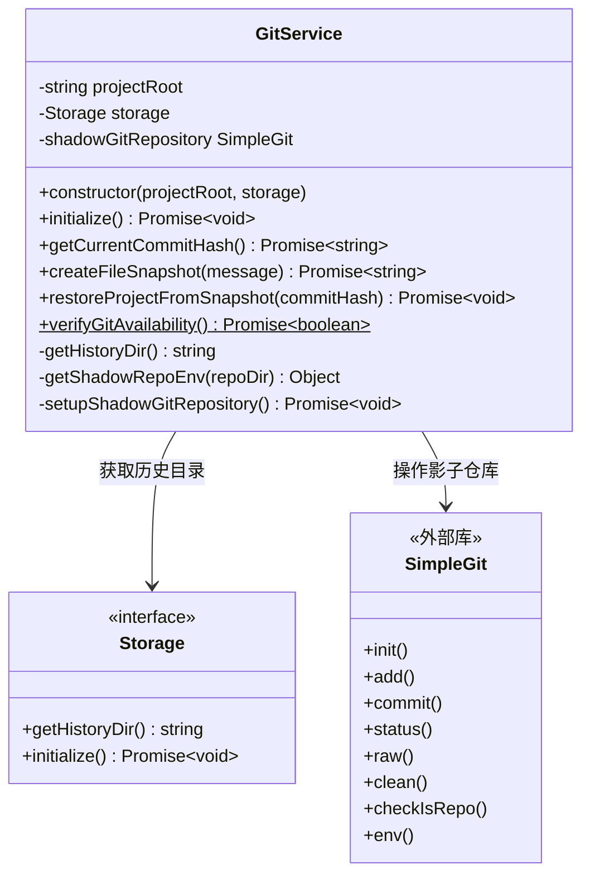
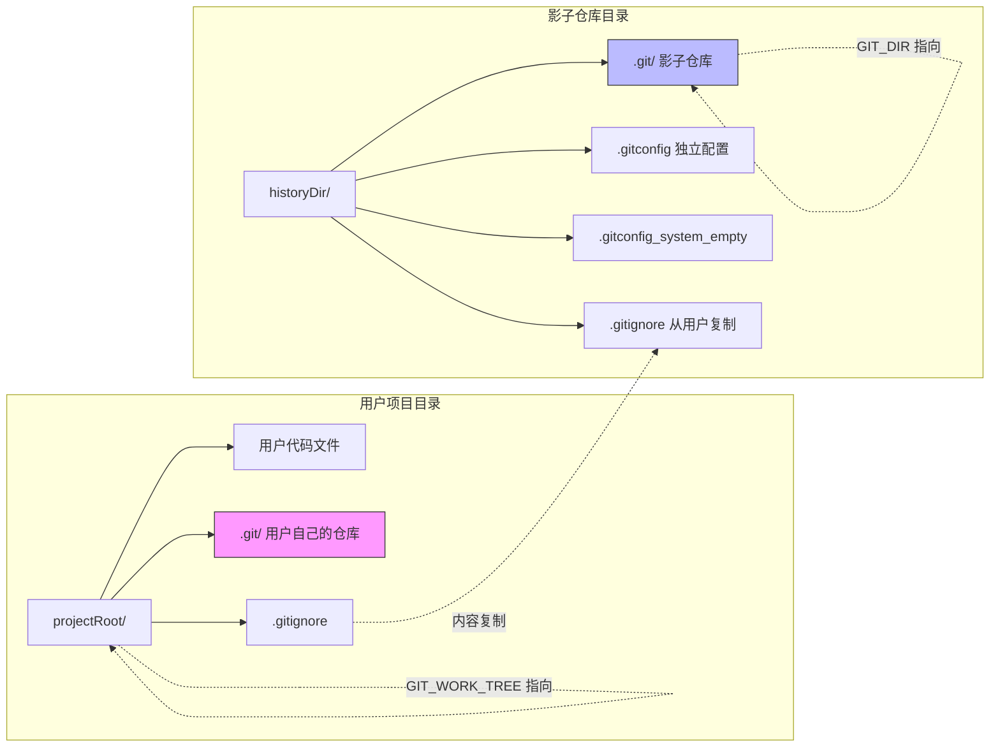

# gitService.ts

## 概述

`GitService` 是一个**基于影子 Git 仓库（Shadow Git Repository）的项目检查点服务**。它在项目的历史目录中创建和管理一个独立的隐藏 Git 仓库，用于为项目文件创建快照（snapshot）和恢复功能，实现"检查点"（Checkpointing）机制。

该服务的核心思路是：不干扰用户自己的 Git 仓库，而是通过 `GIT_DIR` 和 `GIT_WORK_TREE` 环境变量创建一个完全独立的影子仓库，该仓库拥有自己的 `.git` 目录、`.gitconfig`、`.gitignore`，但工作区指向用户的项目根目录。这样可以在不影响用户 Git 操作的前提下，对项目状态进行版本化管理。

## 架构图（Mermaid）

```mermaid
flowchart TD
    subgraph 初始化流程
        A[initialize] --> B[检验 Git 可用性]
        B -->|不可用| C[抛出错误]
        B -->|可用| D[初始化存储]
        D --> E[setupShadowGitRepository]

        E --> F[创建历史目录]
        F --> G[写入独立 .gitconfig<br/>name: Gemini CLI<br/>email: gemini-cli@google.com<br/>gpgsign: false]
        G --> H[写入空 system .gitconfig]
        H --> I{是否已是仓库?}
        I -->|否| J[git init --initial-branch main]
        J --> K[创建空初始提交]
        I -->|是| L[跳过初始化]
        K --> M[复制用户 .gitignore 到影子仓库]
        L --> M
    end

    subgraph 创建快照
        N[createFileSnapshot] --> O[git add .]
        O --> P[git status]
        P -->|无变更| Q[返回当前 HEAD hash]
        P -->|有变更| R[git commit --no-verify]
        R --> S[返回新提交 hash]
    end

    subgraph 恢复快照
        T[restoreProjectFromSnapshot] --> U[git restore --source commitHash .]
        U --> V[git clean -f -d<br/>删除未跟踪文件]
    end
```







## 核心组件

### 1. GitService 类

#### 私有属性

| 属性 | 类型 | 说明 |
|------|------|------|
| `projectRoot` | `string` | 项目根目录绝对路径 |
| `storage` | `Storage` | 存储服务，提供历史目录路径和初始化能力 |

#### 构造函数

```typescript
constructor(projectRoot: string, storage: Storage)
```
将 `projectRoot` 解析为绝对路径，保存 `storage` 引用。

#### 静态方法

##### `verifyGitAvailability(): Promise<boolean>`
通过执行 `git --version` 命令检测系统中是否安装了 Git。成功返回 `true`，异常返回 `false`。

#### 私有方法

##### `getHistoryDir(): string`
委托给 `storage.getHistoryDir()` 获取历史目录路径。

##### `getShadowRepoEnv(repoDir: string)`
生成影子仓库所需的环境变量：
- `GIT_CONFIG_GLOBAL`：指向影子仓库自己的 `.gitconfig`，避免继承用户的全局 Git 配置。
- `GIT_CONFIG_SYSTEM`：指向一个空文件，避免继承系统级 Git 配置。

##### `setupShadowGitRepository(): Promise<void>`
影子仓库的完整初始化流程：

1. **创建目录**：递归创建历史目录。
2. **写入独立 gitconfig**：
   - `user.name = Gemini CLI`
   - `user.email = gemini-cli@google.com`
   - `commit.gpgsign = false`（禁用 GPG 签名）
3. **写入空系统配置**：确保不继承系统级配置。
4. **检测是否已初始化**：使用 `checkIsRepo(IS_REPO_ROOT)` 检查。
   - 如果 `checkIsRepo` 失败（某些 Git 版本兼容性问题），记录调试日志并假设未初始化。
5. **未初始化时**：
   - `git init --initial-branch main`
   - 创建一个空的初始提交（`Initial commit`）
6. **复制 .gitignore**：将用户项目的 `.gitignore` 内容复制到影子仓库，确保影子仓库遵循相同的忽略规则。如果用户没有 `.gitignore`，则写入空内容。

##### `shadowGitRepository` (getter)
返回一个配置好的 `SimpleGit` 实例：
- 基础目录：`projectRoot`（工作区）
- 环境变量：
  - `GIT_DIR`：指向影子仓库的 `.git` 目录
  - `GIT_WORK_TREE`：指向项目根目录
  - 加上 `getShadowRepoEnv` 返回的全局/系统配置覆盖

这个 getter 每次调用都创建新的 `SimpleGit` 实例。

#### 公开方法

##### `initialize(): Promise<void>`
服务初始化入口：
1. 验证 Git 可用性（不可用则抛出友好错误）。
2. 初始化存储。
3. 设置影子 Git 仓库（失败则抛出友好错误）。

##### `getCurrentCommitHash(): Promise<string>`
获取影子仓库当前 HEAD 的完整提交 hash。使用 `git rev-parse HEAD`。

##### `createFileSnapshot(message: string): Promise<string>`
创建项目文件快照：
1. `git add .`——暂存所有变更。
2. `git status`——检查是否有变更。
3. 无变更时直接返回当前 HEAD hash（幂等操作）。
4. 有变更时执行 `git commit --no-verify`（跳过 hooks）并返回新提交 hash。
5. 失败时抛出描述性错误。

##### `restoreProjectFromSnapshot(commitHash: string): Promise<void>`
从快照恢复项目：
1. `git restore --source {commitHash} .`——从指定提交恢复所有文件。
2. `git clean -f -d`——删除快照后引入的未跟踪文件和目录。

## 依赖关系

### 内部依赖

| 模块 | 导入内容 | 说明 |
|------|----------|------|
| `../utils/errors.js` | `isNodeError` | 类型守卫函数，用于安全判断 Node.js 错误类型 |
| `../utils/shell-utils.js` | `spawnAsync` | 异步执行 shell 命令，用于验证 Git 可用性 |
| `../config/storage.js` | `Storage` 接口 | 存储抽象，提供历史目录路径 |
| `../utils/debugLogger.js` | `debugLogger` | 调试日志工具 |

### 外部依赖

| 模块 | 说明 |
|------|------|
| `node:fs/promises` | Node.js 异步文件系统 API，用于目录创建、文件读写 |
| `node:path` | 路径操作工具 |
| `simple-git` | 第三方 Git 操作库，提供 `simpleGit` 工厂函数、`CheckRepoActions` 枚举和 `SimpleGit` 类型。封装了 Git 命令行操作为 Promise 风格的 API |

## 关键实现细节

### 1. 影子仓库隔离设计

影子仓库与用户自己的 Git 仓库完全隔离：
- **独立的 `.git` 目录**：存储在历史目录中而非项目根目录下。
- **独立的 Git 配置**：通过 `GIT_CONFIG_GLOBAL` 和 `GIT_CONFIG_SYSTEM` 环境变量覆盖，防止继承用户的全局/系统 Git 配置（如用户名、邮箱、GPG 签名设置）。
- **共享工作区**：通过 `GIT_WORK_TREE` 指向项目根目录，影子仓库可以跟踪项目文件的变更而不需要文件复制。

### 2. .gitignore 同步

影子仓库会复制用户项目的 `.gitignore` 文件，确保影子仓库不会跟踪用户原本就忽略的文件（如 `node_modules`、构建产物等）。这避免了不必要的文件被包含在快照中。

### 3. 幂等快照创建

`createFileSnapshot` 在没有变更时不会创建新提交，而是返回当前 HEAD hash。这确保了多次对相同状态创建快照不会产生空提交或冗余提交。

### 4. --no-verify 跳过 Hooks

快照提交使用 `--no-verify` 标志，跳过所有 Git hooks（如 pre-commit、commit-msg 等）。这是合理的，因为影子仓库的提交是自动化的内部操作，不应受到用户项目的 hook 规则约束。

### 5. 恢复操作的彻底性

`restoreProjectFromSnapshot` 不仅恢复已跟踪文件（`git restore`），还会清除快照之后引入的未跟踪文件和目录（`git clean -f -d`）。这确保恢复后的项目状态与快照时完全一致。

### 6. Git 版本兼容性处理

`setupShadowGitRepository` 中的 `checkIsRepo` 调用被 try-catch 包裹，因为某些 Git 版本（如 macOS 的 Git 2.39.5）在此操作上可能失败。失败时记录调试日志并假设仓库未初始化，进行重新初始化。

### 7. 错误信息的用户友好性

所有关键错误都提供了清晰的用户引导：
- Git 不可用时提示安装 Git 或禁用检查点功能。
- 初始化失败时提示检查 Git 是否正常工作或禁用检查点功能。
- 快照创建失败时明确告知检查点功能可能不正常。
