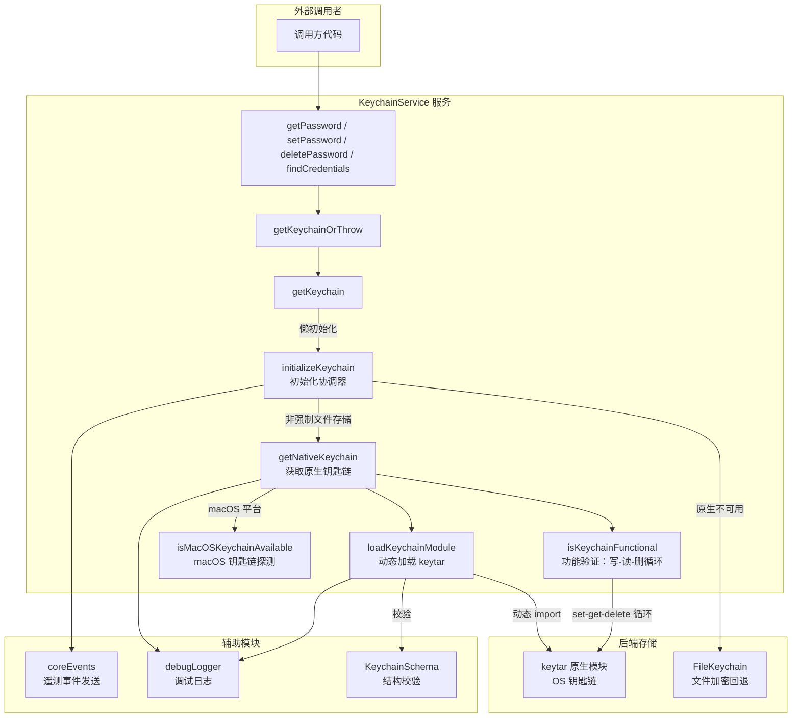

# keychainService.ts

## 概述

`KeychainService` 是一个用于与操作系统级别安全存储（如 macOS Keychain、Linux Secret Service 等）交互的服务类。它提供了对密码/密钥的增删改查操作，并内置了多层容错机制：

1. **优先使用原生 OS 钥匙链**（通过 `keytar` 模块）
2. **macOS 特殊检测**：通过 `security` CLI 命令探测默认钥匙链是否存在，避免阻塞式弹窗
3. **文件加密回退**：当原生钥匙链不可用时，自动降级到 `FileKeychain` 文件加密存储
4. **环境变量强制切换**：通过 `GEMINI_FORCE_FILE_STORAGE=true` 可强制使用文件存储后端

该服务采用单例初始化模式（通过 `initializationPromise`），确保在并发调用场景下只执行一次初始化流程。

## 架构图（Mermaid）



## 核心组件

### 类：`KeychainService`

#### 构造函数

| 参数 | 类型 | 说明 |
|------|------|------|
| `serviceName` | `string` (readonly) | 在 OS 钥匙链中的应用唯一标识符，用于隔离不同应用的密钥空间 |

#### 公有方法

| 方法 | 返回值 | 说明 |
|------|--------|------|
| `isAvailable()` | `Promise<boolean>` | 检查钥匙链（原生或回退）是否可用 |
| `isUsingFileFallback()` | `Promise<boolean>` | 判断当前是否使用 `FileKeychain` 文件加密回退方案 |
| `getPassword(account)` | `Promise<string \| null>` | 获取指定账户的密钥，不存在则返回 `null` |
| `setPassword(account, value)` | `Promise<void>` | 存储指定账户的密钥 |
| `deletePassword(account)` | `Promise<boolean>` | 删除指定账户的密钥，返回是否成功 |
| `findCredentials()` | `Promise<Array<{account, password}>>` | 列出当前服务名下所有账户及其密钥 |

#### 私有方法

| 方法 | 说明 |
|------|------|
| `getKeychainOrThrow()` | 获取钥匙链实例，不可用时抛出 `Error('Keychain is not available')` |
| `getKeychain()` | 懒初始化入口，利用 `initializationPromise` 缓存保证只初始化一次 |
| `initializeKeychain()` | 初始化协调器：判断是否强制文件存储 -> 尝试原生 -> 回退 FileKeychain |
| `getNativeKeychain()` | 加载并验证原生钥匙链，macOS 下会先探测默认钥匙链 |
| `loadKeychainModule()` | 动态 `import('keytar')`，通过 `KeychainSchema.safeParse` 做结构校验 |
| `isKeychainFunctional(keychain)` | 通过 set-get-delete 测试循环验证钥匙链是否真正可用 |
| `isMacOSKeychainAvailable()` | macOS 专用：调用 `security default-keychain` 命令检测默认钥匙链路径是否存在 |

#### 私有属性

| 属性 | 类型 | 说明 |
|------|------|------|
| `initializationPromise` | `Promise<Keychain \| null> \| undefined` | 缓存初始化 Promise，防止竞态条件 |

### 导出常量

| 常量 | 值 | 说明 |
|------|-----|------|
| `FORCE_FILE_STORAGE_ENV_VAR` | `'GEMINI_FORCE_FILE_STORAGE'` | 环境变量名，设为 `'true'` 时强制使用文件存储后端 |

## 依赖关系

### 内部依赖

| 模块 | 导入内容 | 说明 |
|------|----------|------|
| `../utils/events.js` | `coreEvents` | 核心事件总线，用于发送遥测事件 |
| `../telemetry/types.js` | `KeychainAvailabilityEvent` | 钥匙链可用性遥测事件类型 |
| `../utils/debugLogger.js` | `debugLogger` | 调试日志工具 |
| `./keychainTypes.js` | `Keychain`（类型）、`KeychainSchema`、`KEYCHAIN_TEST_PREFIX` | 钥匙链接口定义、Zod 校验 Schema、测试前缀常量 |
| `../utils/markdownUtils.js` | `isRecord` | 用于判断动态 import 结果是否为 Record 对象 |
| `./fileKeychain.js` | `FileKeychain` | 文件加密回退存储实现 |

### 外部依赖

| 模块 | 导入内容 | 说明 |
|------|----------|------|
| `node:crypto` | `crypto` | 用于生成随机测试账户名（`randomBytes`） |
| `node:fs` | `fs` | 用于检查 macOS 钥匙链文件路径是否存在（`existsSync`） |
| `node:os` | `os` | 用于检测操作系统平台（`platform()`） |
| `node:child_process` | `spawnSync` | 用于同步执行 `security default-keychain` 命令 |
| `keytar` | （动态导入） | 原生 OS 钥匙链绑定模块，运行时通过 `import('keytar')` 加载 |

## 关键实现细节

### 1. 懒初始化与防竞态

```typescript
private getKeychain(): Promise<Keychain | null> {
    return (this.initializationPromise ??= this.initializeKeychain());
}
```

使用 `??=`（空值合并赋值）运算符，确保 `initializeKeychain()` 只被调用一次。即使多个调用者并发访问，也只会产生同一个 Promise，后续调用直接复用已缓存的结果。

### 2. 三层钥匙链选择策略

初始化流程按以下优先级选择后端：

1. **环境变量强制**：若 `GEMINI_FORCE_FILE_STORAGE === 'true'`，直接跳过原生钥匙链
2. **原生 OS 钥匙链**：动态加载 `keytar` 模块 -> 结构校验 -> macOS 探测 -> 功能验证
3. **FileKeychain 回退**：以上均失败时，使用加密文件存储

### 3. macOS 钥匙链探测机制

在 macOS 上直接调用 `keytar` 可能触发阻塞式系统弹窗（如"创建钥匙链"对话框）。为避免此问题，服务先通过 `spawnSync` 执行 `security default-keychain` 命令进行非侵入式探测：

```typescript
private isMacOSKeychainAvailable(): boolean {
    const result = spawnSync('security', ['default-keychain'], {
        encoding: 'utf8',
        stdio: ['ignore', 'pipe', 'ignore'],  // 仅捕获 stdout，忽略 stderr
    });
    // ... 解析输出路径，验证文件是否存在
}
```

该方法会：
- 执行 `security default-keychain` 获取默认钥匙链路径
- 解析输出中双引号包裹的路径字符串
- 通过 `fs.existsSync` 验证路径是否真实存在

### 4. 功能性验证（Smoke Test）

`isKeychainFunctional` 方法通过完整的"写入-读取-删除"循环验证钥匙链是否真正可用：

```typescript
private async isKeychainFunctional(keychain: Keychain): Promise<boolean> {
    const testAccount = `${KEYCHAIN_TEST_PREFIX}${crypto.randomBytes(8).toString('hex')}`;
    const testPassword = 'test';
    await keychain.setPassword(this.serviceName, testAccount, testPassword);
    const retrieved = await keychain.getPassword(this.serviceName, testAccount);
    const deleted = await keychain.deletePassword(this.serviceName, testAccount);
    return deleted && retrieved === testPassword;
}
```

- 使用 `KEYCHAIN_TEST_PREFIX` + 随机 hex 字符串作为测试账户名，避免与真实数据冲突
- 验证写入的值能被正确读回，且能被成功删除

### 5. 动态模块加载与结构校验

`loadKeychainModule` 使用动态 `import()` 加载 `keytar`，这样如果该原生模块未安装或无法编译，不会导致整个应用启动失败。加载后通过 `KeychainSchema.safeParse` 对模块结构进行 Zod 校验，确保导出的对象包含所需的 `getPassword`、`setPassword`、`deletePassword`、`findCredentials` 方法。

### 6. 错误处理策略

- 所有原生钥匙链相关的错误被捕获后仅记录日志（使用 `debugLogger`），不会向上抛出
- 错误日志刻意只提取 `error.message`，避免暴露可能包含的个人身份信息（PII）
- 公有方法（`getPassword` 等）通过 `getKeychainOrThrow` 在钥匙链完全不可用时才抛出明确错误

### 7. 遥测事件

初始化完成后，通过 `coreEvents.emitTelemetryKeychainAvailability` 发送遥测事件，上报原生钥匙链是否可用，便于后续分析用户环境分布。
