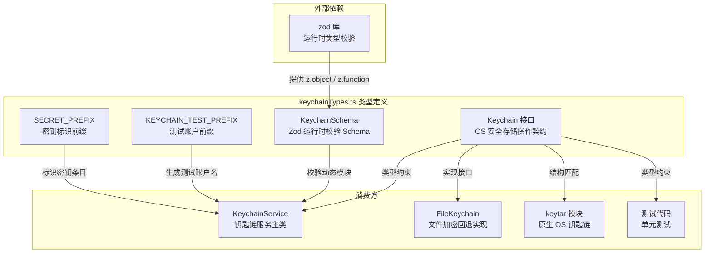

# keychainTypes.ts

## 概述

`keychainTypes.ts` 是钥匙链服务的类型定义文件，提供了三个核心要素：

1. **`Keychain` 接口**：定义了操作系统级安全存储的标准操作方法契约
2. **`KeychainSchema`**：用于运行时结构校验的 Zod Schema，确保动态加载的模块（如 `keytar`）符合 `Keychain` 接口
3. **常量前缀**：用于测试标识和密钥标识的字符串前缀

该文件是钥匙链子系统的"契约层"，被 `KeychainService`、`FileKeychain` 等多个实现和消费方引用，起到类型安全和运行时校验的双重保障作用。

## 架构图（Mermaid）



## 核心组件

### 接口：`Keychain`

定义了操作系统级安全存储必须实现的四个方法。方法命名刻意与 `keytar` 库保持一致，以支持动态加载后的结构校验。

| 方法 | 参数 | 返回值 | 说明 |
|------|------|--------|------|
| `getPassword` | `service: string, account: string` | `Promise<string \| null>` | 获取指定服务/账户下的密码，不存在返回 `null` |
| `setPassword` | `service: string, account: string, password: string` | `Promise<void>` | 存储密码到指定服务/账户 |
| `deletePassword` | `service: string, account: string` | `Promise<boolean>` | 删除指定密码，返回是否成功 |
| `findCredentials` | `service: string` | `Promise<Array<{account: string; password: string}>>` | 列出指定服务下的所有账户及密码 |

### Schema：`KeychainSchema`

```typescript
export const KeychainSchema = z.object({
  getPassword: z.function(),
  setPassword: z.function(),
  deletePassword: z.function(),
  findCredentials: z.function(),
});
```

使用 Zod 定义的运行时校验 Schema。其作用是在动态 `import('keytar')` 后，验证导入的模块是否包含所需的四个函数方法。`z.function()` 校验器会检查对应属性是否为函数类型。

这是 TypeScript 接口的运行时镜像——TypeScript 的 `Keychain` 接口只在编译时起作用，而 `KeychainSchema` 则在运行时提供结构验证能力，两者配合实现了"编译时 + 运行时"的双重类型安全。

### 常量

| 常量 | 值 | 说明 |
|------|-----|------|
| `KEYCHAIN_TEST_PREFIX` | `'__keychain_test__'` | 功能验证测试中生成临时测试账户的前缀。`KeychainService.isKeychainFunctional` 使用此前缀创建测试条目，完成 set-get-delete 循环验证后清除 |
| `SECRET_PREFIX` | `'__secret__'` | 密钥条目的标识前缀，用于区分普通存储条目和密钥/密码条目 |

## 依赖关系

### 内部依赖

无。此文件是纯类型/常量定义文件，不依赖项目内其他模块。

### 外部依赖

| 模块 | 导入内容 | 说明 |
|------|----------|------|
| `zod` | `z` | 运行时类型校验库，用于定义 `KeychainSchema` |

## 关键实现细节

### 1. 接口与 Schema 的对偶设计

`Keychain` 接口和 `KeychainSchema` 形成了经典的"编译时/运行时对偶"：

- **`Keychain` 接口**（编译时）：TypeScript 类型系统在开发和编译阶段确保实现类（如 `FileKeychain`）包含所有必需方法
- **`KeychainSchema`**（运行时）：Zod Schema 在动态加载第三方模块时校验其结构，因为 TypeScript 类型信息在运行时已被擦除

这种设计在处理动态 `import()` 场景下尤为重要——`keytar` 是一个原生 Node.js 模块，可能未安装、编译失败或版本不兼容，此时运行时校验是唯一能发现问题的手段。

### 2. 方法命名与 keytar 对齐

接口注释明确指出：方法名必须与底层库（如 `keytar`）保持一致。这是因为 `KeychainService.loadKeychainModule` 直接将 `keytar` 模块的导出对象用 `KeychainSchema.safeParse` 校验后当作 `Keychain` 使用，不做任何方法名映射或适配。

### 3. 常量前缀的职责分离

两个常量前缀服务于不同目的：

- `KEYCHAIN_TEST_PREFIX`（`__keychain_test__`）：仅用于 `isKeychainFunctional` 中的 smoke test，测试完后立即清除，不应出现在正式存储中
- `SECRET_PREFIX`（`__secret__`）：用于标记正式的密钥/密码条目，帮助在 `findCredentials` 结果中区分不同类型的存储条目

### 4. 文件定位与设计原则

此文件被单独抽取（而非内联在 `keychainService.ts` 中），遵循了"接口与实现分离"原则：

- `keychainTypes.ts` -> 契约定义（接口 + Schema + 常量）
- `keychainService.ts` -> 服务逻辑（初始化、探测、回退）
- `fileKeychain.ts` -> 文件存储实现

这使得添加新的钥匙链后端实现时，只需引用 `keychainTypes.ts` 即可，无需依赖整个服务类。
