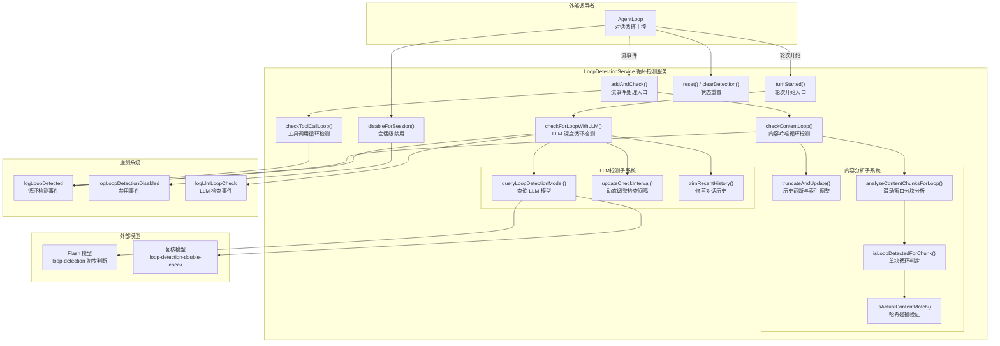
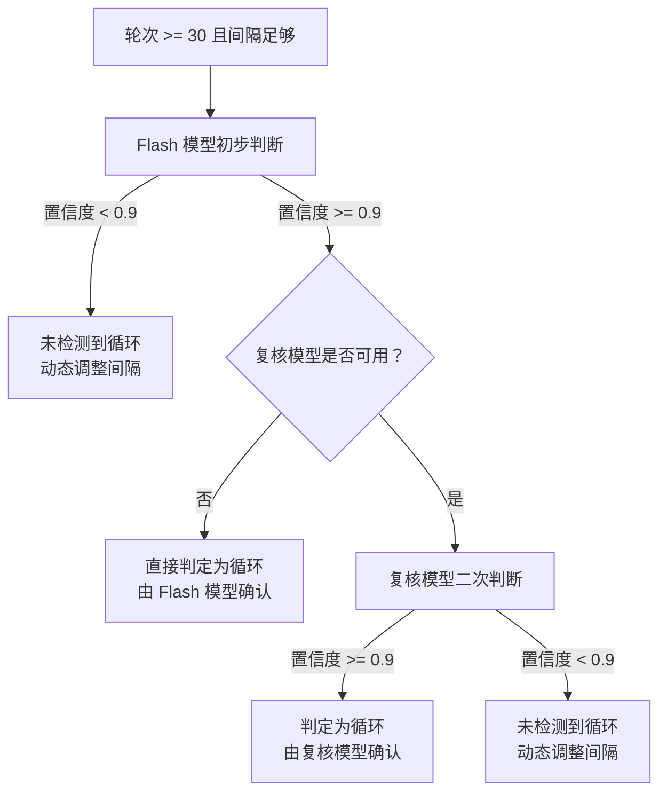

# loopDetectionService.ts

## 概述

`LoopDetectionService` 是一个用于检测和防止 AI 对话陷入无限循环的服务。它监控三种不同类型的循环模式：

1. **工具调用循环（Tool Call Loop）**：检测模型连续使用相同参数调用相同工具的情况
2. **内容吟唱循环（Content Chanting Loop）**：检测模型在流式输出中不断重复相同文本片段的情况
3. **LLM 检测循环（LLM-Detected Loop）**：在对话轮次较多时，调用另一个 LLM 模型来分析对话历史，判断是否陷入了"看似有变化但无实质进展"的复杂循环

该服务采用多层检测策略，从快速的哈希比对（工具调用和内容循环）到深度的 LLM 语义分析（LLM 检测循环），确保在不同场景下都能有效识别循环行为。LLM 检测还内置了"双重确认"机制（先用 Flash 模型初步判断，再用更强模型复核），以降低误判率。

## 架构图（Mermaid）



## 核心组件

### 接口：`LoopDetectionResult`

循环检测的返回结果。

| 字段 | 类型 | 说明 |
|------|------|------|
| `count` | `number` | 检测到的循环次数，`0` 表示未检测到循环 |
| `type` | `LoopType?` | 循环类型枚举（可选） |
| `detail` | `string?` | 循环详情描述（可选） |
| `confirmedByModel` | `string?` | 确认循环的模型名称（仅 LLM 检测时有值） |

### 类：`LoopDetectionService`

#### 构造函数

| 参数 | 类型 | 说明 |
|------|------|------|
| `context` | `AgentLoopContext` | 代理循环上下文，提供配置、Gemini 客户端等依赖 |

#### 公有方法

| 方法 | 参数 | 返回值 | 说明 |
|------|------|--------|------|
| `addAndCheck(event)` | `ServerGeminiStreamEvent` | `LoopDetectionResult` | 处理流事件并检查工具调用/内容循环 |
| `turnStarted(signal)` | `AbortSignal` | `Promise<LoopDetectionResult>` | 轮次开始时调用，触发 LLM 级循环检查 |
| `disableForSession()` | 无 | `void` | 禁用当前会话的循环检测 |
| `reset(promptId, userPrompt?)` | `string, string?` | `void` | 重置所有循环检测状态（新提示词开始时调用） |
| `clearDetection()` | 无 | `void` | 清除循环检测标志，允许恢复轮次继续执行 |

#### 私有方法

| 方法 | 说明 |
|------|------|
| `getToolCallKey(toolCall)` | 将工具名 + 参数序列化后 SHA-256 哈希，生成唯一标识 |
| `checkToolCallLoop(toolCall)` | 比较连续工具调用的哈希，达到阈值则判定循环 |
| `checkContentLoop(content)` | 内容循环检测主入口，处理 Markdown 元素过滤和代码块跳过 |
| `truncateAndUpdate()` | 截断过长的内容历史，调整所有已记录的索引位置 |
| `analyzeContentChunksForLoop()` | 滑动窗口分块分析内容重复模式 |
| `isLoopDetectedForChunk(chunk, hash)` | 判定单个内容块是否构成循环 |
| `isActualContentMatch(chunk, index)` | 验证哈希相同的块内容是否真正相同（防碰撞） |
| `checkForLoopWithLLM(signal)` | LLM 双重确认循环检测 |
| `queryLoopDetectionModel(model, contents, signal)` | 调用指定 LLM 模型进行循环分析 |
| `updateCheckInterval(confidence)` | 根据置信度动态调整 LLM 检查间隔 |
| `trimRecentHistory(history)` | 修剪对话历史，移除孤立的函数调用/响应 |
| `resetToolCallCount()` | 重置工具调用计数器 |
| `resetContentTracking(resetHistory?)` | 重置内容跟踪状态 |
| `resetLlmCheckTracking()` | 重置 LLM 检查跟踪状态 |

#### 私有属性

| 属性 | 类型 | 说明 |
|------|------|------|
| `context` | `AgentLoopContext` | 代理循环上下文（只读） |
| `promptId` | `string` | 当前提示词 ID |
| `userPrompt` | `string` | 当前用户提示词文本 |
| `lastToolCallKey` | `string \| null` | 上一次工具调用的哈希键 |
| `toolCallRepetitionCount` | `number` | 连续相同工具调用的计数 |
| `streamContentHistory` | `string` | 流式内容累积历史 |
| `contentStats` | `Map<string, number[]>` | 内容块哈希 -> 出现位置索引列表 |
| `lastContentIndex` | `number` | 内容分析的当前滑动窗口位置 |
| `loopDetected` | `boolean` | 是否已检测到循环 |
| `detectedCount` | `number` | 累计检测到的循环次数 |
| `lastLoopDetail` | `string?` | 最后一次循环的详情描述 |
| `lastLoopType` | `LoopType?` | 最后一次循环的类型 |
| `inCodeBlock` | `boolean` | 当前是否处于代码块内（用于跳过代码块内容检测） |
| `turnsInCurrentPrompt` | `number` | 当前提示词中已进行的轮次数 |
| `llmCheckInterval` | `number` | LLM 检查的动态间隔 |
| `lastCheckTurn` | `number` | 上次 LLM 检查的轮次号 |
| `disabledForSession` | `boolean` | 会话级禁用标志 |

### 常量配置

| 常量 | 值 | 说明 |
|------|-----|------|
| `TOOL_CALL_LOOP_THRESHOLD` | `5` | 连续相同工具调用达到此次数判定为循环 |
| `CONTENT_LOOP_THRESHOLD` | `10` | 相同内容块出现此次数判定为内容循环 |
| `CONTENT_CHUNK_SIZE` | `50` | 内容分块大小（字符数） |
| `MAX_HISTORY_LENGTH` | `5000` | 内容历史最大长度，超出后截断 |
| `LLM_LOOP_CHECK_HISTORY_COUNT` | `20` | LLM 检查时包含的最近对话轮次数 |
| `LLM_CHECK_AFTER_TURNS` | `30` | 单个提示词中经过此轮次后才启用 LLM 检查 |
| `DEFAULT_LLM_CHECK_INTERVAL` | `10` | LLM 检查的默认间隔（轮次） |
| `MIN_LLM_CHECK_INTERVAL` | `5` | LLM 检查的最小间隔（高置信度时加速检查） |
| `MAX_LLM_CHECK_INTERVAL` | `15` | LLM 检查的最大间隔（低置信度时减速检查） |
| `LLM_CONFIDENCE_THRESHOLD` | `0.9` | LLM 判定为循环的置信度阈值 |
| `DOUBLE_CHECK_MODEL_ALIAS` | `'loop-detection-double-check'` | 复核模型的配置别名 |

## 依赖关系

### 内部依赖

| 模块 | 导入内容 | 说明 |
|------|----------|------|
| `../core/turn.js` | `GeminiEventType`, `ServerGeminiStreamEvent` | 流事件类型定义 |
| `../telemetry/loggers.js` | `logLoopDetected`, `logLoopDetectionDisabled`, `logLlmLoopCheck` | 遥测日志记录函数 |
| `../telemetry/types.js` | `LoopDetectedEvent`, `LoopDetectionDisabledEvent`, `LoopType`, `LlmLoopCheckEvent`, `LlmRole` | 遥测事件类型和枚举 |
| `../utils/messageInspectors.js` | `isFunctionCall`, `isFunctionResponse` | 消息类型判断工具函数 |
| `../utils/debugLogger.js` | `debugLogger` | 调试日志工具 |
| `../config/agent-loop-context.js` | `AgentLoopContext`（类型） | 代理循环上下文类型 |

### 外部依赖

| 模块 | 导入内容 | 说明 |
|------|----------|------|
| `@google/genai` | `Content`（类型） | Google Generative AI SDK 的内容类型 |
| `node:crypto` | `createHash` | 用于 SHA-256 哈希计算 |

## 关键实现细节

### 1. 三层循环检测策略

该服务实现了从简单到复杂的三层检测：

**第一层：工具调用循环检测（实时、O(1)）**
```typescript
private checkToolCallLoop(toolCall: { name: string; args: object }): boolean {
    const key = this.getToolCallKey(toolCall);  // SHA-256(name + JSON(args))
    if (this.lastToolCallKey === key) {
        this.toolCallRepetitionCount++;
    } else {
        this.lastToolCallKey = key;
        this.toolCallRepetitionCount = 1;
    }
    return this.toolCallRepetitionCount >= TOOL_CALL_LOOP_THRESHOLD;  // >= 5
}
```
将工具名和参数序列化后做 SHA-256 哈希，比较连续调用的哈希值。达到 5 次连续重复即判定循环。

**第二层：内容吟唱循环检测（实时、滑动窗口）**
使用固定大小（50 字符）的滑动窗口分析流式文本。通过哈希索引表追踪每个文本块的出现位置，当同一块在短距离内出现 10 次以上时判定为循环。

**第三层：LLM 语义循环检测（周期性、深度分析）**
在对话轮次达到 30 次后启动，每隔若干轮次调用一次。使用专门的系统提示词引导 LLM 分析对话历史，输出结构化的 JSON 结果（分析说明 + 置信度分数）。

### 2. 内容循环检测算法详解

内容循环检测采用"分块哈希 + 滑动窗口 + 周期验证"三步法：

**步骤 1：Markdown 元素过滤**
```typescript
// 检测代码围栏、表格、列表、标题、引用块、分隔线
// 发现这些元素时重置追踪状态，避免跨元素边界的误判
```

**步骤 2：代码块跳过**
通过追踪 ` ``` ` 的奇偶数来判断是否处于代码块内，代码块内的内容不参与循环检测（因为重复代码结构是常见且合理的）。

**步骤 3：历史截断**
```typescript
private truncateAndUpdate(): void {
    // 当历史超过 5000 字符时，从开头截断
    // 同时调整 contentStats 中所有存储的位置索引
}
```

**步骤 4：滑动窗口分块哈希**
每次从 `lastContentIndex` 位置取 50 字符的块，计算 SHA-256 哈希，记录到 `contentStats` Map 中。

**步骤 5：循环判定**
当同一哈希出现 >= 10 次时，检查最近 10 次出现的平均间距是否 <= 250（`CONTENT_CHUNK_SIZE * 5`）。还需验证"周期文本"（两次出现之间的内容）的唯一数量不超过阈值（`CONTENT_LOOP_THRESHOLD / 2 = 5`），以区分"真循环"和"有共同前缀的不同列表项"。

### 3. LLM 双重确认机制



1. 先用 Flash 模型（快速、低成本）进行初步判断
2. 若 Flash 模型置信度 >= 0.9，再用更强的复核模型进行二次确认
3. 仅当两个模型都高度确信时才最终判定为循环
4. 若复核模型不可用（如 API 限流），则仅凭 Flash 模型的结果判定

### 4. 动态 LLM 检查间隔

```typescript
private updateCheckInterval(unproductive_state_confidence: number): void {
    this.llmCheckInterval = Math.round(
        MIN_LLM_CHECK_INTERVAL +
        (MAX_LLM_CHECK_INTERVAL - MIN_LLM_CHECK_INTERVAL) *
        (1 - unproductive_state_confidence),
    );
}
```

间隔与置信度呈反比关系：
- 置信度高（接近 1.0）-> 间隔短（接近 5 轮）-> 更频繁检查
- 置信度低（接近 0.0）-> 间隔长（接近 15 轮）-> 减少不必要的检查

这种自适应策略在资源消耗和检测灵敏度之间取得平衡。

### 5. LLM 循环检测系统提示词设计

系统提示词 `LOOP_DETECTION_SYSTEM_PROMPT` 经过精心设计，包含：

- **循环定义**：需要同时满足"5 次以上重复模式"和"无净进展"两个条件
- **具体模式**：交替循环、语义重复、停滞推理
- **反例**：跨文件批量操作、增量编辑、顺序处理、变体重试——这些看似重复但实际有进展的行为不应判定为循环
- **参数分析要求**：强调比较工具调用的参数（文件路径、行号、搜索词等），而非仅看工具名
- **用户请求上下文**：提供原始用户请求，帮助区分批量任务和真正的循环

### 6. 对话历史修剪

```typescript
private trimRecentHistory(history: Content[]): Content[] {
    // 移除尾部孤立的函数调用（缺少响应）
    while (history.length > 0 && isFunctionCall(history[history.length - 1])) {
        history.pop();
    }
    // 移除头部孤立的函数响应（缺少调用）
    while (history.length > 0 && isFunctionResponse(history[0])) {
        history.shift();
    }
    return history;
}
```

LLM API 要求函数调用和函数响应成对出现。截取最近 20 轮历史时可能截断这些配对，此方法确保发送给 LLM 的历史格式合法。

### 7. 状态管理：reset 与 clearDetection 的区别

- `reset(promptId, userPrompt?)` —— 完全重置所有状态，在新一轮用户提示词开始时调用
- `clearDetection()` —— 仅清除 `loopDetected` 标志，保留 `detectedCount`。用于在检测到循环后给模型一次"恢复"机会——如果恢复轮次成功解决了问题，对话可以继续；如果再次陷入循环，`detectedCount` 会变为 2，系统可据此采取更强的干预措施
