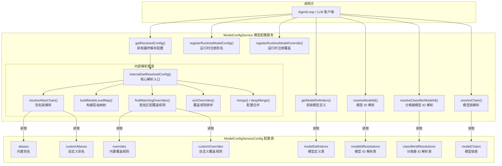

# modelConfigService.ts

## 概述

`ModelConfigService` 是模型配置的核心服务，负责管理和解析 Gemini 模型的配置体系。它实现了一套完整的"别名 -> 继承链 -> 覆盖规则 -> 最终配置"的解析管道（Resolution Pipeline），使得模型配置具备高度的灵活性和可扩展性。

核心能力包括：

1. **别名链解析（Alias Chain Resolution）**：支持别名继承（`extends`），从根到叶逐级合并配置
2. **覆盖规则匹配（Override Matching）**：支持按模型名、作用域（`overrideScope`）、重试状态等多维度匹配覆盖规则
3. **分层优先级（Leveled Precedence）**：覆盖规则按"层级 -> 特异度 -> 配置顺序"三维排序后依次应用
4. **模型 ID 解析（Model ID Resolution）**：支持根据运行时上下文（如是否使用 Gemini 3.1、是否有自定义工具等）将抽象模型名解析为具体模型 ID
5. **模型链解析（Chain Resolution）**：支持模型降级/重试链的配置和上下文感知解析
6. **运行时注册**：支持在运行时动态注册别名和覆盖规则
7. **深度合并（Deep Merge）**：对 `generateContentConfig` 进行递归对象合并，数组则直接覆盖

该文件同时也是模型配置类型系统的定义中心，导出了大量的接口和类型供整个项目使用。

## 架构图（Mermaid）



## 核心组件

### 接口定义

#### `ModelConfigKey`（模型配置键）

用于查询模型配置时的复合键。

| 字段 | 类型 | 必需 | 说明 |
|------|------|------|------|
| `model` | `string` | 是 | 模型名或别名 |
| `overrideScope` | `string?` | 否 | 覆盖作用域（如子代理名），限制覆盖规则的生效范围 |
| `isRetry` | `boolean?` | 否 | 是否处于重试场景，允许为重试指定不同配置（如更高温度） |
| `isChatModel` | `boolean?` | 否 | 是否来自主交互聊天模型，启用 `chat-base` 默认回退 |

#### `ModelConfig`（模型配置）

单个模型配置单元。

| 字段 | 类型 | 说明 |
|------|------|------|
| `model` | `string?` | 模型名/ID |
| `generateContentConfig` | `GenerateContentConfig?` | Gemini API 的内容生成配置 |

#### `ModelConfigOverride`（覆盖规则）

| 字段 | 类型 | 说明 |
|------|------|------|
| `match` | `{model?, overrideScope?, isRetry?}` | 匹配条件 |
| `modelConfig` | `ModelConfig` | 匹配后要应用的配置 |

#### `ModelConfigAlias`（别名）

| 字段 | 类型 | 说明 |
|------|------|------|
| `extends` | `string?` | 父别名，形成继承链 |
| `modelConfig` | `ModelConfig` | 该别名自身的配置 |

#### `ModelDefinition`（模型定义）

| 字段 | 类型 | 说明 |
|------|------|------|
| `displayName` | `string?` | 显示名称 |
| `tier` | `string?` | 模型层级：`'pro'` / `'flash'` / `'flash-lite'` / `'custom'` / `'auto'` |
| `family` | `string?` | 模型家族：如 `'gemini-3'`、`'gemini-2'` |
| `isPreview` | `boolean?` | 是否为预览版模型 |
| `isVisible` | `boolean?` | 是否在对话框中可见 |
| `dialogDescription` | `string?` | 对话框中的简短描述 |
| `features` | `{thinking?, multimodalToolUse?}?` | 模型能力特性 |

#### `ModelResolution`（模型解析规则）

| 字段 | 类型 | 说明 |
|------|------|------|
| `default` | `string` | 无条件匹配时的默认模型 ID |
| `contexts` | `Array<{condition, target}>?` | 条件-目标映射列表 |

#### `ResolutionContext`（解析上下文）

| 字段 | 类型 | 说明 |
|------|------|------|
| `useGemini3_1` | `boolean?` | 是否使用 Gemini 3.1 |
| `useGemini3_1FlashLite` | `boolean?` | 是否使用 Gemini 3.1 Flash Lite |
| `useCustomTools` | `boolean?` | 是否使用自定义工具 |
| `hasAccessToPreview` | `boolean?` | 是否有预览版访问权限 |
| `requestedModel` | `string?` | 请求的模型名（用于 `requestedModels` 匹配） |

#### `ResolutionCondition`（解析条件）

与 `ResolutionContext` 类似，但 `requestedModels` 是列表形式，支持匹配多个模型名。

#### `ModelConfigServiceConfig`（服务配置）

| 字段 | 类型 | 说明 |
|------|------|------|
| `aliases` | `Record<string, ModelConfigAlias>?` | 内置别名映射 |
| `customAliases` | `Record<string, ModelConfigAlias>?` | 自定义别名映射 |
| `overrides` | `ModelConfigOverride[]?` | 内置覆盖规则列表 |
| `customOverrides` | `ModelConfigOverride[]?` | 自定义覆盖规则列表 |
| `modelDefinitions` | `Record<string, ModelDefinition>?` | 模型定义表 |
| `modelIdResolutions` | `Record<string, ModelResolution>?` | 模型 ID 解析表 |
| `classifierIdResolutions` | `Record<string, ModelResolution>?` | 分类器 ID 解析表 |
| `modelChains` | `Record<string, ModelPolicy[]>?` | 模型链（降级/重试策略） |

#### `ResolvedModelConfig`（最终解析配置）

使用品牌类型（Branded Type）`_brand: unique symbol` 确保只有通过 `getResolvedConfig` 方法产生的配置对象才能被传递给需要 `ResolvedModelConfig` 类型的函数。

| 字段 | 类型 | 说明 |
|------|------|------|
| `model` | `string` | 最终解析出的具体模型名 |
| `generateContentConfig` | `GenerateContentConfig` | 最终合并后的生成配置 |

### 类：`ModelConfigService`

#### 构造函数

| 参数 | 类型 | 说明 |
|------|------|------|
| `config` | `ModelConfigServiceConfig` (readonly) | 服务配置对象 |

#### 公有方法

| 方法 | 参数 | 返回值 | 说明 |
|------|------|--------|------|
| `getModelDefinition(modelId)` | `string` | `ModelDefinition \| undefined` | 获取模型定义，未知非 Gemini 模型返回隐式 custom 定义 |
| `getModelDefinitions()` | 无 | `Record<string, ModelDefinition>` | 获取所有模型定义 |
| `resolveModelId(requestedName, context?)` | `string, ResolutionContext?` | `string` | 根据上下文解析模型名到具体 ID |
| `resolveClassifierModelId(tier, requestedModel, context?)` | `string, string, ResolutionContext?` | `string` | 解析分类器模型 ID |
| `getModelChain(chainName)` | `string` | `ModelPolicy[] \| undefined` | 获取原始模型链模板 |
| `resolveChain(chainName, context?)` | `string, ResolutionContext?` | `ModelPolicy[] \| undefined` | 获取并解析模型链中所有模型 ID |
| `registerRuntimeModelConfig(aliasName, alias)` | `string, ModelConfigAlias` | `void` | 运行时注册新别名 |
| `registerRuntimeModelOverride(override)` | `ModelConfigOverride` | `void` | 运行时注册新覆盖规则 |
| `getResolvedConfig(context)` | `ModelConfigKey` | `ResolvedModelConfig` | 获取最终解析配置（公有入口） |

#### 静态方法

| 方法 | 说明 |
|------|------|
| `isObject(item)` | 判断值是否为普通对象（非数组、非 null） |
| `merge(base, override)` | 合并两个 `ModelConfig`，override 的 model 优先 |
| `deepMerge(config1, config2)` | 深度合并两个 `GenerateContentConfig` |

#### 私有方法

| 方法 | 说明 |
|------|------|
| `internalGetResolvedConfig(context)` | 核心解析管道：别名链 -> 层级映射 -> 匹配覆盖 -> 排序 -> 合并 |
| `resolveAliasChain(requestedModel, allAliases, isChatModel?)` | 解析别名继承链，从根到叶合并配置 |
| `buildModelLevelMap(aliasChain, baseModel)` | 构建模型名/别名到层级的映射 |
| `findMatchingOverrides(overrides, context, modelToLevel)` | 查找所有匹配的覆盖规则 |
| `sortOverrides(matches)` | 按层级 -> 特异度 -> 配置顺序排序 |
| `matches(condition, context)` | 判断解析条件是否与当前上下文匹配 |
| `genericDeepMerge(...objects)` | 通用递归深度合并（仅合并对象，数组直接覆盖） |

### 常量

| 常量 | 值 | 说明 |
|------|-----|------|
| `MAX_ALIAS_CHAIN_DEPTH` | `100` | 别名继承链最大深度，防止无限循环 |

## 依赖关系

### 内部依赖

| 模块 | 导入内容 | 说明 |
|------|----------|------|
| `../availability/modelPolicy.js` | `ModelPolicy`（类型） | 模型策略/降级链中的策略定义 |

### 外部依赖

| 模块 | 导入内容 | 说明 |
|------|----------|------|
| `@google/genai` | `GenerateContentConfig`（类型） | Google Generative AI SDK 的内容生成配置类型 |

## 关键实现细节

### 1. 配置解析管道（Resolution Pipeline）

`internalGetResolvedConfig` 实现了一条四阶段管道：

```
输入 ModelConfigKey
    │
    ▼
阶段1: resolveAliasChain()
    │  解析别名继承链 A -> B -> C -> baseModel
    │  从根(C)到叶(A)逐级合并 ModelConfig
    │
    ▼
阶段2: buildModelLevelMap()
    │  为每个别名/模型分配层级号
    │  baseModel = Level 0, C = Level 1, B = Level 2, A = Level 3
    │
    ▼
阶段3: findMatchingOverrides() + sortOverrides()
    │  遍历所有覆盖规则，匹配条件
    │  按 (层级 ASC, 特异度 ASC, 配置顺序 ASC) 排序
    │
    ▼
阶段4: 依次 merge()
    │  将排序后的覆盖规则逐个合并到基础配置上
    │
    ▼
输出 ResolvedModelConfig
```

### 2. 别名继承链解析

```typescript
// 示例别名配置:
// "fast-chat": { extends: "chat-base", modelConfig: { generateContentConfig: { temperature: 0.8 } } }
// "chat-base": { modelConfig: { model: "gemini-2.5-pro", generateContentConfig: { temperature: 0.5, maxOutputTokens: 4096 } } }

// 解析 "fast-chat" 的过程:
// 1. 构建链: fast-chat -> chat-base (叶到根)
// 2. 反转为根到叶: chat-base -> fast-chat
// 3. 从根开始合并:
//    {} + chat-base = { model: "gemini-2.5-pro", temperature: 0.5, maxOutputTokens: 4096 }
//    + fast-chat = { model: "gemini-2.5-pro", temperature: 0.8, maxOutputTokens: 4096 }
```

关键保护：
- `visited` Set 防止循环依赖（`A -> B -> A`）
- `MAX_ALIAS_CHAIN_DEPTH = 100` 防止过深继承链
- 未知别名会抛出明确错误

### 3. 覆盖规则的三维排序

覆盖规则通过三个维度进行稳定排序：

```typescript
matches.sort((a, b) => {
    if (a.level !== b.level) return a.level - b.level;        // 1. 层级：广泛 -> 具体
    if (a.specificity !== b.specificity) return a.specificity - b.specificity;  // 2. 特异度：少条件 -> 多条件
    return a.index - b.index;                                  // 3. 配置顺序：先定义 -> 后定义
});
```

- **层级（Level）**：Level 0（全局/模型名）< Level 1（根别名）< ... < Level N（叶别名）。越深的别名覆盖力越强。
- **特异度（Specificity）**：匹配条件数量。`{model: "x"}` < `{model: "x", isRetry: true}`。条件越多越精确。
- **配置顺序（Index）**：在配置数组中的位置。后定义的优先。

### 4. overrideScope 的 "core" 特殊处理

```typescript
if (key === 'overrideScope' && value === 'core') {
    return context.overrideScope === 'core' || !context.overrideScope;
}
```

当覆盖规则的作用域为 `'core'` 时，它会匹配两种场景：
1. 请求方明确声明 `overrideScope: 'core'`
2. 请求方未指定作用域（`undefined`）

这使得 `core` 作用域的覆盖规则成为一种"默认覆盖"，只要请求方没有声明自己属于其他作用域，就会生效。

### 5. isChatModel 的回退机制

```typescript
if (isChatModel) {
    const fallbackAlias = 'chat-base';
    if (allAliases[fallbackAlias]) {
        const fallbackResolution = this.resolveAliasChain(fallbackAlias, allAliases);
        return {
            aliasChain: [...fallbackResolution.aliasChain, requestedModel],
            baseModel: requestedModel,
            resolvedConfig: fallbackResolution.resolvedConfig,
        };
    }
}
```

当一个未知的模型名被标记为 `isChatModel: true` 时，服务会将其视为"继承自 `chat-base` 的自定义模型"。这样自定义模型也能获得聊天模型的默认配置（如温度、安全设置等），同时保留自己的模型 ID。

### 6. 深度合并策略

```typescript
// 对象：递归深度合并
// 数组：直接覆盖（override 完全替换 base）
// 基本类型：override 值优先
```

设计决策：数组不进行合并，而是直接覆盖。原因是如果深度合并数组，用户将无法完全替换基础配置中的数组（如 `safetySettings`），只能追加或修改元素。

### 7. 品牌类型（Branded Type）

```typescript
export type ResolvedModelConfig = _ResolvedModelConfig & {
    readonly _brand: unique symbol;
};
```

使用 TypeScript 的品牌类型模式，确保 `ResolvedModelConfig` 只能通过 `getResolvedConfig` 方法创建，防止开发者绕过配置解析管道直接构造配置对象。这是一种编译时类型安全保障。

### 8. 配置源的优先级合并

```typescript
const allAliases = {
    ...aliases,          // 内置别名（最低优先级）
    ...customAliases,    // 自定义别名
    ...this.runtimeAliases,  // 运行时注册别名（最高优先级）
};

const allOverrides = [
    ...overrides,            // 内置覆盖
    ...customOverrides,      // 自定义覆盖
    ...this.runtimeOverrides,  // 运行时覆盖
];
```

对于别名：后面的 spread 覆盖前面的同名键（运行时 > 自定义 > 内置）。
对于覆盖规则：列表拼接后通过 index 排序确保后面的配置在同等层级/特异度下胜出。

### 9. 未知模型的隐式定义

```typescript
getModelDefinition(modelId: string): ModelDefinition | undefined {
    const definition = this.config.modelDefinitions?.[modelId];
    if (definition) return definition;
    // 非 Gemini 前缀的模型返回隐式 custom 定义
    if (!modelId.startsWith('gemini-')) {
        return { tier: 'custom', family: 'custom', features: {} };
    }
    return undefined;
}
```

这使得第三方模型（如通过 API 代理使用的模型）无需在配置中显式注册，即可正常使用。
