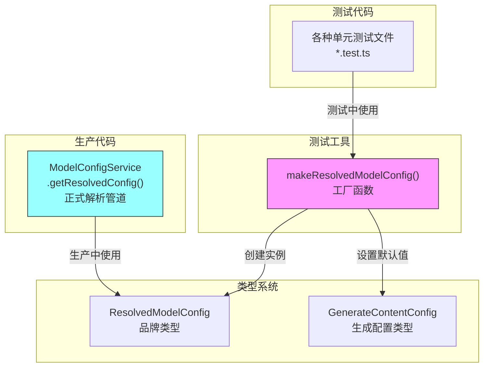

# modelConfigServiceTestUtils.ts

## 概述

`modelConfigServiceTestUtils.ts` 是模型配置服务的测试工具文件，提供了用于单元测试的工厂函数 `makeResolvedModelConfig`。该函数能够快速创建 `ResolvedModelConfig` 类型的实例，绕过 `ModelConfigService.getResolvedConfig()` 的完整解析管道，方便在测试中直接构造所需的模型配置对象。

由于 `ResolvedModelConfig` 使用了品牌类型（Branded Type，通过 `_brand: unique symbol` 实现），正常情况下无法通过字面量对象直接创建。此工具函数通过 `as ResolvedModelConfig` 类型断言绕过这一限制，是测试代码中唯一合法的"快捷通道"。

## 架构图（Mermaid）



## 核心组件

### 函数：`makeResolvedModelConfig`

一个导出的箭头函数（工厂函数），用于在测试中快速创建 `ResolvedModelConfig` 对象。

#### 签名

```typescript
export const makeResolvedModelConfig = (
  model: string,
  overrides: Partial<ResolvedModelConfig['generateContentConfig']> = {},
): ResolvedModelConfig
```

#### 参数

| 参数 | 类型 | 默认值 | 说明 |
|------|------|--------|------|
| `model` | `string` | （必需） | 模型名称/ID，如 `'gemini-2.5-pro'` |
| `overrides` | `Partial<GenerateContentConfig>` | `{}` | 可选的配置覆盖项，会与默认值合并 |

#### 返回值

返回一个 `ResolvedModelConfig` 类型的对象，包含：

| 字段 | 值 | 说明 |
|------|-----|------|
| `model` | 传入的 `model` 参数 | 模型名称 |
| `generateContentConfig.temperature` | `0`（默认） | 温度设为 0，确保测试输出确定性 |
| `generateContentConfig.topP` | `1`（默认） | Top-P 设为 1，不做概率截断 |
| 其他字段 | 由 `overrides` 提供 | 通过展开运算符合并 |

#### 使用示例

```typescript
// 最简用法：仅指定模型名
const config = makeResolvedModelConfig('gemini-2.5-pro');
// => { model: 'gemini-2.5-pro', generateContentConfig: { temperature: 0, topP: 1 } }

// 覆盖默认值
const config = makeResolvedModelConfig('gemini-2.5-flash', { temperature: 0.7, maxOutputTokens: 2048 });
// => { model: 'gemini-2.5-flash', generateContentConfig: { temperature: 0.7, topP: 1, maxOutputTokens: 2048 } }
```

## 依赖关系

### 内部依赖

| 模块 | 导入内容 | 说明 |
|------|----------|------|
| `../services/modelConfigService.js` | `ResolvedModelConfig`（类型） | 最终解析后的模型配置品牌类型 |

### 外部依赖

无。

## 关键实现细节

### 1. 绕过品牌类型的类型断言

```typescript
// eslint-disable-next-line @typescript-eslint/no-unsafe-type-assertion
({
    model,
    generateContentConfig: {
        temperature: 0,
        topP: 1,
        ...overrides,
    },
}) as ResolvedModelConfig;
```

`ResolvedModelConfig` 在 `modelConfigService.ts` 中定义为品牌类型：

```typescript
export type ResolvedModelConfig = _ResolvedModelConfig & {
    readonly _brand: unique symbol;
};
```

这意味着普通对象字面量无法赋值给 `ResolvedModelConfig` 类型——即使结构完全匹配，因为 `_brand` 是 `unique symbol`，无法从外部构造。

该测试工具通过 `as ResolvedModelConfig` 类型断言显式绕过了这一限制。ESLint 规则 `@typescript-eslint/no-unsafe-type-assertion` 被注释禁用，表明这是一个刻意的设计决策。

### 2. 测试友好的默认值选择

- **`temperature: 0`**：确保 LLM 输出具有最大确定性，使测试结果可重复
- **`topP: 1`**：不做 Top-P 采样截断，保持完整的概率分布

这两个默认值组合是 LLM 测试中的常见实践——最大化输出的可预测性，避免随机性导致的测试不稳定。

### 3. 文件定位与命名约定

文件名为 `modelConfigServiceTestUtils.ts`（而非 `modelConfigService.test.ts`），遵循"测试工具文件"的命名模式：

- `*.test.ts` —— 实际的测试文件（包含 `describe`/`it` 等测试用例）
- `*TestUtils.ts` —— 测试工具文件（提供工厂函数、mock 辅助等，被多个测试文件共享）

该文件放在 `src/services/` 目录下而非 `__tests__/` 目录，说明它被设计为可以被整个项目的测试代码共享引用。

### 4. Partial 类型的灵活覆盖

```typescript
overrides: Partial<ResolvedModelConfig['generateContentConfig']> = {}
```

使用 `Partial<T>` 使得调用者可以只覆盖需要的字段，其余字段保留默认值。通过 `...overrides` 展开运算符，覆盖值会替换同名默认值，同时保留未覆盖的字段。
