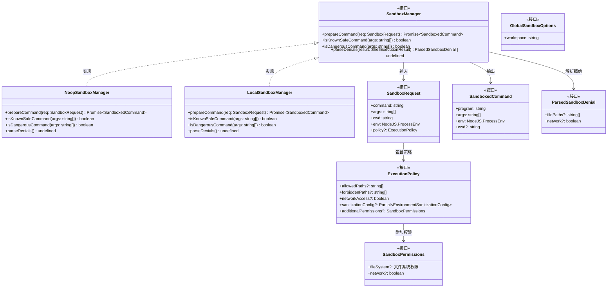
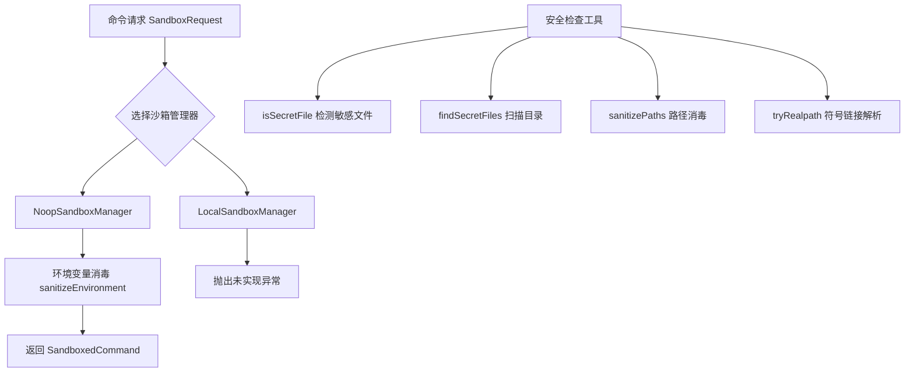

# sandboxManager.ts

## 概述

`sandboxManager.ts` 是 Gemini CLI 沙箱系统的核心定义文件，位于 `packages/core/src/services/` 目录下。该文件定义了沙箱管理器的所有接口（`SandboxManager`、`SandboxPermissions`、`ExecutionPolicy`、`GlobalSandboxOptions`、`SandboxRequest`、`SandboxedCommand`、`ParsedSandboxDenial`），并提供了两个具体实现类（`NoopSandboxManager` 和 `LocalSandboxManager`）。

此外，该文件还提供了一系列安全相关的工具函数和常量，用于治理文件（governance files）保护、敏感文件检测、路径消毒和符号链接解析等功能。

## 架构图（Mermaid）

## 核心组件

### 1. 接口定义

#### `SandboxPermissions`
定义沙箱的权限结构，包括：
- `fileSystem`：文件系统权限，细分为 `read`（可读路径列表）和 `write`（可写路径列表）。
- `network`：是否允许网络访问。

#### `ExecutionPolicy`
安全边界和权限策略，应用于特定的沙箱执行环境：
- `allowedPaths`：额外授予完全读写权限的绝对路径列表。
- `forbiddenPaths`：显式拒绝读写的绝对路径列表（优先于允许列表）。
- `networkAccess`：是否允许网络访问。
- `sanitizationConfig`：环境变量清洗的配置规则。
- `additionalPermissions`：附加的细粒度权限。

#### `GlobalSandboxOptions`
沙箱管理器的全局初始化配置：
- `workspace`：沙箱锚定的主工作区路径，该目录被授予完全读写权限。

#### `SandboxRequest`
准备在沙箱中运行命令的请求结构：
- `command`：要执行的程序名。
- `args`：程序参数列表。
- `cwd`：工作目录。
- `env`：传递给程序的环境变量。
- `policy`：本次请求使用的执行策略（可选）。

#### `SandboxedCommand`
已为沙箱执行做好准备的命令结构：
- `program`：最终要执行的程序或包装程序。
- `args`：最终参数列表。
- `env`：已消毒的环境变量。
- `cwd`：工作目录（可选）。

#### `ParsedSandboxDenial`
沙箱拒绝事件的结构化解析结果：
- `filePaths`：被阻止访问的文件路径列表。
- `network`：是否为网络访问拒绝。

#### `SandboxManager`（核心接口）
沙箱管理器的主接口，定义了四个方法：
- `prepareCommand(req)`：准备命令以在沙箱中运行，包括环境消毒。
- `isKnownSafeCommand(args)`：判断命令是否已知安全。
- `isDangerousCommand(args)`：判断命令是否明确已知为危险。
- `parseDenials(result)`：解析命令输出以检测沙箱拒绝事件。

### 2. 常量

#### `GOVERNANCE_FILES`
治理文件列表，表示仓库的"宪法"文件，在任何沙箱中应被写保护：
- `.gitignore`（文件）
- `.geminiignore`（文件）
- `.git`（目录）

#### `SECRET_FILES`
敏感文件模式列表，在沙箱中应被完全隐藏（拒绝读写）：
- `.env`（精确匹配）
- `.env.*`（前缀匹配，如 `.env.local`、`.env.production`）

### 3. 实现类

#### `NoopSandboxManager`
无操作沙箱管理器，静默地将命令直通传递，但仍然执行环境变量消毒。适用于不需要真实沙箱化的场景。
- `prepareCommand`：调用 `getSecureSanitizationConfig` 获取消毒配置，然后通过 `sanitizeEnvironment` 清洗环境变量，原样返回命令和参数。
- `isKnownSafeCommand`：根据操作系统平台（Windows 或 macOS/Linux）委托给相应平台的安全命令检查函数。
- `isDangerousCommand`：同理，委托给平台对应的危险命令检查函数。
- `parseDenials`：始终返回 `undefined`（无拒绝解析能力）。

#### `LocalSandboxManager`
本地沙箱管理器，目前尚未实现完整的沙箱功能：
- `prepareCommand`：直接抛出 `Error('Tool sandboxing is not yet implemented.')`。
- `isKnownSafeCommand`：始终返回 `false`。
- `isDangerousCommand`：始终返回 `false`。
- `parseDenials`：始终返回 `undefined`。

### 4. 工具函数

#### `isSecretFile(fileName: string): boolean`
检查给定文件名是否匹配任何敏感文件模式。支持通配符 `*` 后缀匹配（如 `.env.*` 匹配 `.env.local`）。

#### `getSecretFileFindArgs(): string[]`
返回 Linux `find` 命令所需的参数数组，用于查找敏感文件。生成类似 `( -name .env -o -name .env.* )` 的参数。

#### `findSecretFiles(baseDir: string, maxDepth = 1): Promise<string[]>`
在指定目录中递归查找所有敏感文件：
- 默认浅层扫描（深度 1）以优化性能。
- 跳过常见的不需要扫描的目录：`node_modules`、`.git`、`.venv`、`__pycache__`、`dist`、`build`、`.next`、`.idea`、`.vscode`。
- 使用 `isSecretFile` 函数匹配文件名。
- 静默忽略读取错误。

#### `sanitizePaths(paths?: string[]): string[] | undefined`
对路径数组进行消毒处理：
- 要求所有路径为绝对路径，否则抛出错误。
- 使用 `path.normalize` 规范化路径。
- 在 Windows 上进行大小写不敏感的去重。
- 使用 `Map` 保持路径的原始大小写同时基于规范化后的 key 去重。

#### `tryRealpath(p: string): Promise<string>`
安全地解析符号链接，防止沙箱逃逸：
- 调用 `fs.realpath` 解析符号链接。
- 如果文件不存在（`ENOENT`），递归解析父目录并拼接文件名。
- 如果到达文件系统根目录（`parentDir === p`），返回原始路径。
- 其他错误（如 `EACCES`）直接重新抛出。

## 依赖关系

### 内部依赖

| 模块路径 | 导入内容 | 用途 |
|---------|---------|-----|
| `../sandbox/utils/commandSafety.js` | `isKnownSafeCommand`（别名 `isMacSafeCommand`）、`isDangerousCommand`（别名 `isMacDangerousCommand`） | macOS/Linux 平台的命令安全检查 |
| `../sandbox/windows/commandSafety.js` | `isKnownSafeCommand`（别名 `isWindowsSafeCommand`）、`isDangerousCommand`（别名 `isWindowsDangerousCommand`） | Windows 平台的命令安全检查 |
| `../utils/errors.js` | `isNodeError` | Node.js 错误类型判断 |
| `./environmentSanitization.js` | `sanitizeEnvironment`、`getSecureSanitizationConfig`、`EnvironmentSanitizationConfig`（类型） | 环境变量消毒 |
| `./shellExecutionService.js` | `ShellExecutionResult`（类型） | Shell 执行结果类型 |
| `./sandboxManagerFactory.js` | `createSandboxManager` | 沙箱管理器工厂函数（重新导出） |

### 外部依赖

| 模块 | 导入内容 | 用途 |
|------|---------|-----|
| `node:fs/promises` | `fs` | 异步文件系统操作（读取目录、解析真实路径） |
| `node:os` | `os` | 获取操作系统平台信息（`os.platform()`） |
| `node:path` | `path` | 路径操作（`isAbsolute`、`normalize`、`join`、`dirname`、`basename`） |

## 关键实现细节

### 1. 平台自适应命令安全检查
`NoopSandboxManager` 的 `isKnownSafeCommand` 和 `isDangerousCommand` 方法在运行时通过 `os.platform()` 检测操作系统，分别委托给 macOS/Linux 或 Windows 的命令安全检查实现。这种策略模式使得安全规则能够根据不同平台的命令行生态进行定制。

### 2. 分层安全策略
安全模型采用分层设计：
- **环境变量层**：通过 `sanitizeEnvironment` 清洗敏感环境变量（如 API 密钥、令牌）。
- **文件系统层**：通过 `GOVERNANCE_FILES` 和 `SECRET_FILES` 定义保护列表。
- **执行策略层**：通过 `ExecutionPolicy` 提供每次执行的细粒度控制。
- **权限层**：通过 `SandboxPermissions` 提供细粒度的文件系统和网络权限。

### 3. 符号链接安全处理
`tryRealpath` 函数递归解析符号链接，对于不存在的路径（`ENOENT`），不是直接失败，而是递归解析其父目录。这确保了即使目标路径尚未创建，也能正确地防止通过符号链接的沙箱逃逸攻击。

### 4. 路径去重的跨平台处理
`sanitizePaths` 在 Windows 上使用小写化后的路径作为 Map 的 key 来处理 Windows 文件系统的大小写不敏感特性，但保留原始路径的大小写信息。

### 5. 敏感文件扫描优化
`findSecretFiles` 通过默认深度限制（`maxDepth = 1`）和跳过已知不需要扫描的目录（如 `node_modules`、`.git`）来优化性能，避免在大型项目中进行不必要的深度扫描。

### 6. NoopSandboxManager 的设计意图
`NoopSandboxManager` 并非完全"无操作" -- 它仍然执行环境变量消毒，确保即使在无沙箱模式下也不会泄露敏感的环境变量。这体现了"纵深防御"的安全设计理念。

### 7. LocalSandboxManager 是占位实现
`LocalSandboxManager` 的 `prepareCommand` 直接抛出异常，说明本地沙箱功能尚在开发中。其 `isKnownSafeCommand` 和 `isDangerousCommand` 均返回 `false`，表示保守策略 -- 在没有实现完整沙箱化之前，不做任何安全判断。

### 8. 重新导出工厂函数
文件末尾通过 `export { createSandboxManager } from './sandboxManagerFactory.js'` 重新导出工厂函数，使消费者可以从单一入口点（`sandboxManager.js`）同时获取接口定义和创建函数。
