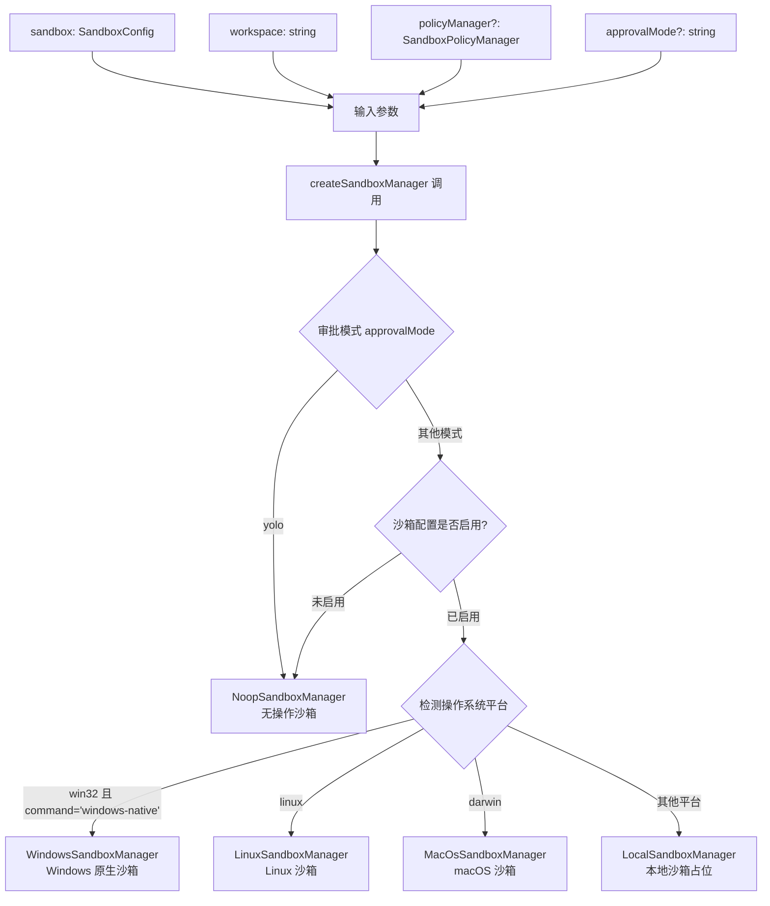
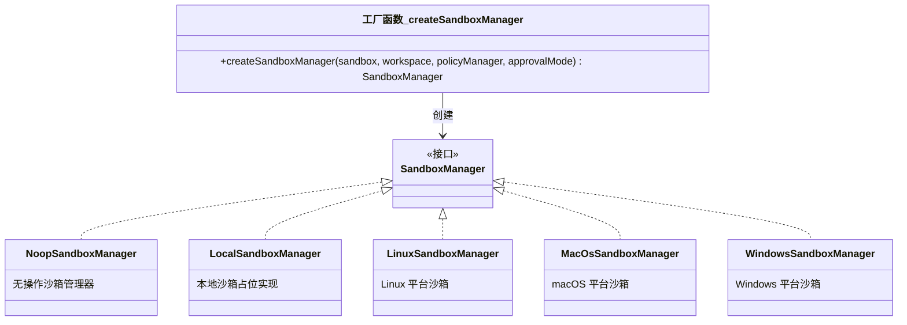

# sandboxManagerFactory.ts

## 概述

`sandboxManagerFactory.ts` 是沙箱管理器的工厂模块，位于 `packages/core/src/services/` 目录下。该文件只导出一个工厂函数 `createSandboxManager`，根据配置参数、操作系统平台以及审批模式（approval mode）动态选择并创建合适的 `SandboxManager` 实例。

这是一个典型的工厂模式实现，将沙箱管理器的创建逻辑集中在一处，使调用方无需关心具体的平台实现细节。

## 架构图（Mermaid）





## 核心组件

### `createSandboxManager` 工厂函数

**函数签名：**
```typescript
function createSandboxManager(
  sandbox: SandboxConfig | undefined,
  workspace: string,
  policyManager?: SandboxPolicyManager,
  approvalMode?: string,
): SandboxManager
```

**参数说明：**

| 参数 | 类型 | 必填 | 说明 |
|------|------|------|------|
| `sandbox` | `SandboxConfig \| undefined` | 否 | 沙箱配置对象，包含 `enabled` 和 `command` 等字段 |
| `workspace` | `string` | 是 | 工作区的绝对路径，沙箱锚定到此目录 |
| `policyManager` | `SandboxPolicyManager` | 否 | 沙箱策略管理器，用于获取模式配置 |
| `approvalMode` | `string` | 否 | 审批模式名称（如 `"yolo"` 等） |

**决策逻辑（按优先级顺序）：**

1. **YOLO 模式**：如果 `approvalMode === 'yolo'`，直接返回 `NoopSandboxManager`，跳过所有沙箱化。这是一个快捷路径，适用于用户明确信任所有操作的场景。

2. **获取模式配置**：如果同时提供了 `policyManager` 和 `approvalMode`，则调用 `policyManager.getModeConfig(approvalMode)` 获取该模式下的配置信息 `modeConfig`。

3. **沙箱启用判断**：检查 `sandbox?.enabled` 是否为 `true`：
   - **Windows 平台**（`os.platform() === 'win32'`）：额外要求 `sandbox.command === 'windows-native'`，创建 `WindowsSandboxManager`。
   - **Linux 平台**（`os.platform() === 'linux'`）：创建 `LinuxSandboxManager`。
   - **macOS 平台**（`os.platform() === 'darwin'`）：创建 `MacOsSandboxManager`。
   - **其他平台**：回退到 `LocalSandboxManager`（尚未实现完整功能）。

4. **沙箱未启用**：返回 `NoopSandboxManager`，仅执行环境变量消毒。

**平台沙箱管理器的初始化参数：**
所有平台级沙箱管理器（Windows、Linux、macOS）均接收相同的构造参数：
```typescript
{
  workspace,     // 工作区路径
  modeConfig,    // 模式配置（来自策略管理器）
  policyManager, // 策略管理器实例
}
```

## 依赖关系

### 内部依赖

| 模块路径 | 导入内容 | 用途 |
|---------|---------|-----|
| `./sandboxManager.js` | `SandboxManager`（类型）、`NoopSandboxManager`、`LocalSandboxManager` | 沙箱管理器接口和基础实现 |
| `../sandbox/linux/LinuxSandboxManager.js` | `LinuxSandboxManager` | Linux 平台沙箱管理器 |
| `../sandbox/macos/MacOsSandboxManager.js` | `MacOsSandboxManager` | macOS 平台沙箱管理器 |
| `../sandbox/windows/WindowsSandboxManager.js` | `WindowsSandboxManager` | Windows 平台沙箱管理器 |
| `../config/config.js` | `SandboxConfig`（类型） | 沙箱配置类型定义 |
| `../policy/sandboxPolicyManager.js` | `SandboxPolicyManager`（类型） | 沙箱策略管理器类型定义 |

### 外部依赖

| 模块 | 导入内容 | 用途 |
|------|---------|-----|
| `node:os` | `os` | 获取操作系统平台信息（`os.platform()`），用于决定创建哪种沙箱管理器 |

## 关键实现细节

### 1. YOLO 模式的快速短路
当 `approvalMode` 为 `'yolo'` 时，工厂函数在任何其他逻辑之前就直接返回 `NoopSandboxManager`。这意味着即使沙箱配置为启用状态，YOLO 模式也会绕过沙箱化。这是一种"完全信任"的开发模式。

### 2. Windows 平台的双重条件检查
Windows 平台不仅需要 `sandbox.enabled === true`，还需要 `sandbox.command === 'windows-native'`。这说明 Windows 上的沙箱实现依赖于特定的原生命令方式，如果配置中未指定使用原生方式，将回退到 `LocalSandboxManager`。

### 3. 优雅降级策略
当沙箱启用但当前平台不属于 Windows/Linux/macOS 三者之一时，工厂函数不会抛出错误，而是降级为 `LocalSandboxManager`。虽然 `LocalSandboxManager` 的 `prepareCommand` 方法会抛出异常，但这种延迟失败（lazy failure）的策略避免了在应用启动时因不支持的平台而崩溃。

### 4. 策略管理器的可选性
`policyManager` 和 `approvalMode` 都是可选参数。当二者都不提供时，`modeConfig` 为 `undefined`，平台沙箱管理器将使用默认配置运行。这确保了工厂函数在最小配置下也能正常工作。

### 5. 模块重新导出链
该工厂函数通过 `sandboxManager.ts` 末尾的 `export { createSandboxManager } from './sandboxManagerFactory.js'` 被重新导出，形成 `sandboxManagerFactory.ts -> sandboxManager.ts` 的导出链，使外部消费者可以从 `sandboxManager` 模块统一获取所有沙箱相关的类型、类和工厂函数。
