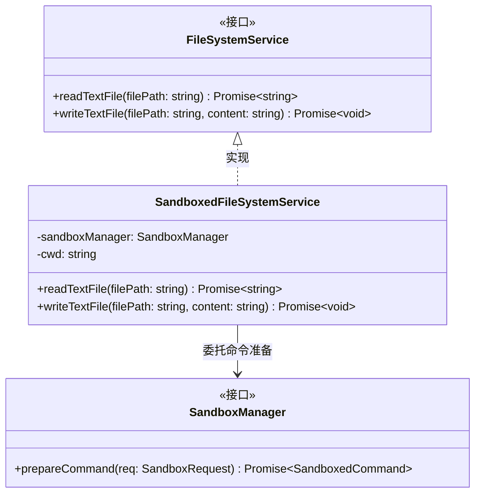
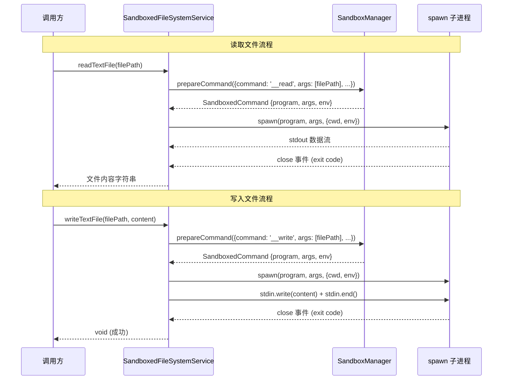

# sandboxedFileSystemService.ts

## 概述

`sandboxedFileSystemService.ts` 位于 `packages/core/src/services/` 目录下，实现了 `FileSystemService` 接口的沙箱化版本。该类 `SandboxedFileSystemService` 不直接调用 Node.js 的文件系统 API，而是通过 `SandboxManager` 将文件读写操作转化为沙箱化的子进程命令执行。

其核心思想是：文件的读取和写入都通过 `spawn` 创建的子进程完成，子进程在沙箱环境中运行，从而确保文件操作受到沙箱策略的约束和保护。

## 架构图（Mermaid）





## 核心组件

### `SandboxedFileSystemService` 类

实现了 `FileSystemService` 接口，通过沙箱化子进程执行文件操作。

#### 构造函数

```typescript
constructor(
  private sandboxManager: SandboxManager,
  private cwd: string,
)
```

| 参数 | 类型 | 说明 |
|------|------|------|
| `sandboxManager` | `SandboxManager` | 沙箱管理器实例，负责准备沙箱化命令 |
| `cwd` | `string` | 工作目录，所有子进程都在此目录中运行 |

#### `readTextFile(filePath: string): Promise<string>`

沙箱化的文件读取方法：

1. **命令准备**：调用 `sandboxManager.prepareCommand`，传入特殊命令 `'__read'` 和文件路径作为参数。
2. **子进程执行**：使用 `spawn` 创建子进程，参数为沙箱管理器返回的 `program`、`args` 和 `env`。
3. **数据收集**：
   - 通过 `stdout` 的 `data` 事件逐块收集文件内容。
   - 通过 `stderr` 的 `data` 事件收集错误信息。
4. **结果处理**：
   - `close` 事件：如果退出码为 0，resolve 文件内容；否则 reject 并附带错误详情。
   - `error` 事件：如果 spawn 本身失败（如程序不存在），reject 并附带错误信息。

#### `writeTextFile(filePath: string, content: string): Promise<void>`

沙箱化的文件写入方法：

1. **命令准备**：调用 `sandboxManager.prepareCommand`，传入特殊命令 `'__write'` 和文件路径作为参数。
2. **子进程执行**：使用 `spawn` 创建子进程。
3. **数据传输**：
   - 通过 `stdin.write(content)` 将内容写入子进程的标准输入。
   - 调用 `stdin.end()` 关闭输入流。
4. **EPIPE 错误处理**：监听 `stdin` 的 `error` 事件，静默忽略 `EPIPE` 错误（管道断裂），因为这种错误会被 `close`/`error` 事件捕获。非 EPIPE 错误通过 `debugLogger` 记录。
5. **结果处理**：与 `readTextFile` 相同的 `close` 和 `error` 事件处理逻辑。

## 依赖关系

### 内部依赖

| 模块路径 | 导入内容 | 用途 |
|---------|---------|-----|
| `./fileSystemService.js` | `FileSystemService`（类型） | 文件系统服务接口定义，本类实现该接口 |
| `./sandboxManager.js` | `SandboxManager`（类型） | 沙箱管理器接口，用于准备沙箱化命令 |
| `../utils/debugLogger.js` | `debugLogger` | 调试日志工具，用于记录非 EPIPE 的 stdin 错误 |
| `../utils/errors.js` | `isNodeError` | Node.js 错误类型判断，用于识别 EPIPE 错误 |

### 外部依赖

| 模块 | 导入内容 | 用途 |
|------|---------|-----|
| `node:child_process` | `spawn` | 创建子进程，在沙箱环境中执行文件读写操作 |

## 关键实现细节

### 1. 虚拟命令协议 `__read` 和 `__write`
该类使用特殊的命令名 `'__read'` 和 `'__write'` 作为 `SandboxRequest` 的 `command` 字段。这些不是真正的系统命令，而是一种内部协议 -- 沙箱管理器会识别这些虚拟命令并将其转换为在沙箱中执行的实际读写操作。具体的转换逻辑由各平台的 `SandboxManager` 实现负责。

### 2. 流式处理设计
代码中有注释说明选择 `spawn` 而非其他方法（如 `exec`）是因为需要"流式传输大文件内容"（streaming large file contents）。这种设计：
- **读取**：`stdout` 的 `data` 事件以流的方式接收数据，避免一次性将整个大文件加载到内存。
- **写入**：通过 `stdin.write` + `stdin.end` 的方式流式写入内容。

### 3. EPIPE 错误的静默处理
写入操作中对 `stdin` 的 `EPIPE` 错误进行了特殊处理：
- `EPIPE` 表示管道另一端（子进程）已关闭，这通常意味着子进程已提前退出。
- 由于 `close` 和 `error` 事件监听器会捕获这种情况并正确报告错误，因此 `EPIPE` 在 `stdin` 层面被静默忽略，避免重复报错。
- 非 `EPIPE` 错误仍然通过 `debugLogger.error` 记录，便于调试。

### 4. 错误信息格式化
所有错误信息都遵循一致的格式：
- spawn 失败：`Sandbox Error: Failed to spawn {operation} for '{filePath}': {message}`
- 命令执行失败：`Sandbox Error: {operation} failed for '{filePath}'. Exit code {code}. Details: {stderr}`

这种一致性有助于日志分析和问题排查。

### 5. 环境变量传递
调用 `prepareCommand` 时，环境变量使用的是 `process.env`（当前进程的完整环境变量）。沙箱管理器在 `prepareCommand` 内部会对这些环境变量进行消毒处理，确保敏感变量不会泄露到子进程中。

### 6. Promise 包装模式
两个方法都将基于事件的 `spawn` 操作包装在 `Promise` 中，使调用方能够使用 `async/await` 语法。Promise 在以下情况下被解析：
- `close` 事件且退出码为 0：resolve
- `close` 事件且退出码非 0：reject
- `error` 事件：reject
