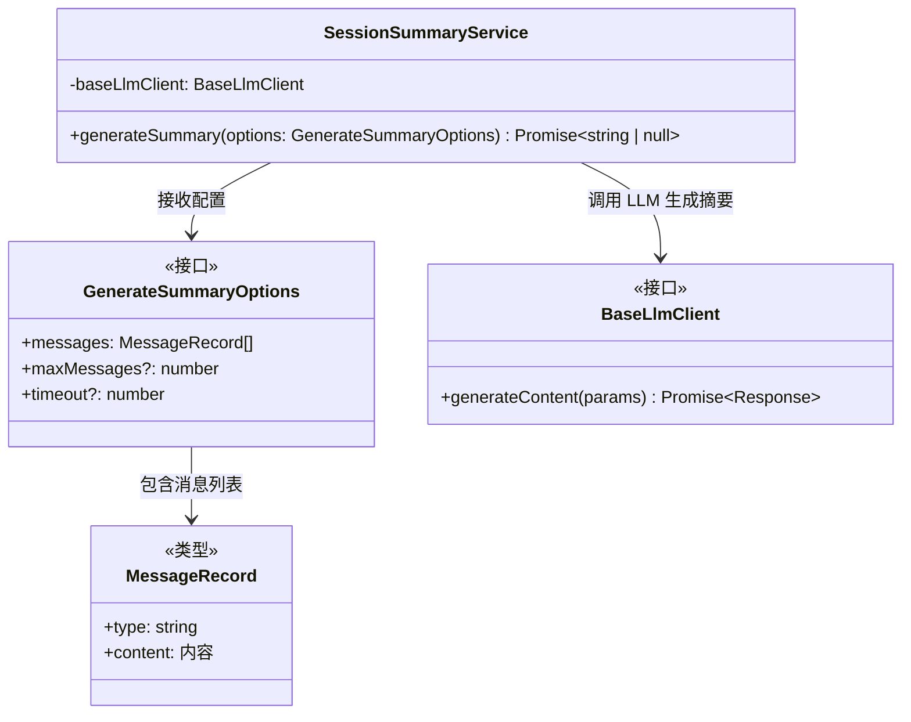
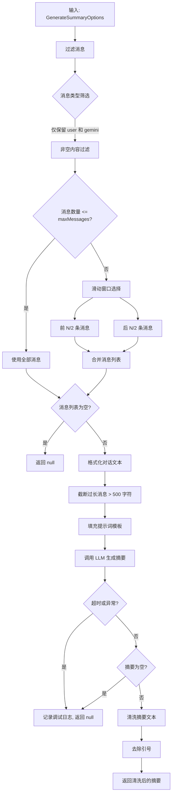

# sessionSummaryService.ts

## 概述

`sessionSummaryService.ts` 位于 `packages/core/src/services/` 目录下，提供了 `SessionSummaryService` 类，用于使用 AI 生成聊天会话的摘要。该服务通过 Gemini Flash Lite 模型（配置键 `summarizer-default`）生成简洁的、聚焦于用户意图的单行摘要（不超过 80 个字符）。

核心设计理念是**优雅降级** -- 摘要生成失败时不会抛出异常，而是返回 `null`，确保摘要功能的失败不会影响主业务流程。

## 架构图（Mermaid）





## 核心组件

### 常量定义

| 常量名 | 值 | 说明 |
|--------|-----|------|
| `DEFAULT_MAX_MESSAGES` | `20` | 默认最大处理消息数 |
| `DEFAULT_TIMEOUT_MS` | `5000` | 默认超时时间（5 秒） |
| `MAX_MESSAGE_LENGTH` | `500` | 单条消息最大长度，超出部分截断 |

### `SUMMARY_PROMPT` 提示词模板

预定义的提示词模板，指导 LLM 生成摘要：
- 要求用一句话（最多 80 个字符）总结用户的主要意图或目标。
- 聚焦于用户试图完成的任务。
- 提供了 5 个示例摘要作为 few-shot 引导：
  - "Add dark mode to the app"
  - "Fix authentication bug in login flow"
  - "Understand how the API routing works"
  - "Refactor database connection logic"
  - "Debug memory leak in production"
- 使用 `{conversation}` 占位符插入格式化后的对话内容。

### `GenerateSummaryOptions` 接口

```typescript
interface GenerateSummaryOptions {
  messages: MessageRecord[];   // 聊天消息记录列表
  maxMessages?: number;        // 最大处理消息数（默认 20）
  timeout?: number;            // 超时时间毫秒数（默认 5000）
}
```

### `SessionSummaryService` 类

#### 构造函数

```typescript
constructor(private readonly baseLlmClient: BaseLlmClient)
```

接收一个 `BaseLlmClient` 实例，用于调用 LLM 服务。

#### `generateSummary(options: GenerateSummaryOptions): Promise<string | null>`

生成聊天会话的单行摘要，核心流程如下：

**第一步：消息过滤**
- 过滤掉非 `user` 和非 `gemini` 类型的消息（排除系统消息如 `info`、`error`、`warning`）。
- 过滤掉内容为空（trim 后长度为 0）的消息。
- 使用 `partListUnionToString` 将消息内容转换为字符串。

**第二步：滑动窗口消息选择**
- 如果过滤后的消息数不超过 `maxMessages`，使用全部消息。
- 如果超过，则采用"首尾滑动窗口"策略：
  - 前半部分窗口大小：`Math.ceil(maxMessages / 2)`
  - 后半部分窗口大小：`Math.floor(maxMessages / 2)`
  - 取前 N 条 + 后 N 条消息合并。
- 这种策略确保既捕获了对话的起始上下文，又包含了最近的交互内容。

**第三步：格式化对话文本**
- 将每条消息格式化为 `{Role}: {Content}` 的形式。
  - `user` 类型 -> `"User"`
  - 其他类型 -> `"Assistant"`
- 每条消息内容超过 500 字符时截断并添加 `"..."`。
- 消息之间用双换行符 `\n\n` 分隔。

**第四步：调用 LLM**
- 创建 `AbortController` 并设置超时定时器。
- 构建 `Content[]` 数组作为 LLM 的输入。
- 调用 `baseLlmClient.generateContent`，传入：
  - `modelConfigKey`: `{ model: 'summarizer-default' }` -- 使用摘要专用模型。
  - `contents`: 对话内容。
  - `abortSignal`: 超时中止信号。
  - `promptId`: `'session-summary-generation'` -- 提示词标识。
  - `role`: `LlmRole.UTILITY_SUMMARIZER` -- LLM 角色标识。

**第五步：摘要清洗**
- 使用 `getResponseText` 提取响应文本。
- 如果为空则返回 `null`。
- 清洗处理：
  1. 将换行符替换为空格。
  2. 规范化多余空白字符。
  3. 两端去空格。
  4. 去除首尾引号（`"` 或 `'`），因为模型有时会自动添加引号。

**错误处理：**
- `AbortError`（超时）：记录调试日志，返回 `null`。
- 其他异常：记录调试日志，返回 `null`。
- 确保 `clearTimeout` 在 `finally` 块中执行，防止定时器泄漏。

## 依赖关系

### 内部依赖

| 模块路径 | 导入内容 | 用途 |
|---------|---------|-----|
| `./chatRecordingService.js` | `MessageRecord`（类型） | 聊天消息记录类型定义 |
| `../core/baseLlmClient.js` | `BaseLlmClient`（类型） | LLM 客户端基础接口 |
| `../core/geminiRequest.js` | `partListUnionToString` | 将消息部件列表转换为纯文本字符串 |
| `../utils/debugLogger.js` | `debugLogger` | 调试日志工具 |
| `../utils/partUtils.js` | `getResponseText` | 从 LLM 响应中提取文本内容 |
| `../telemetry/types.js` | `LlmRole` | LLM 角色枚举（`UTILITY_SUMMARIZER`） |

### 外部依赖

| 模块 | 导入内容 | 用途 |
|------|---------|-----|
| `@google/genai` | `Content`（类型） | Google AI SDK 的内容类型定义，用于构建 LLM 请求 |

## 关键实现细节

### 1. 滑动窗口策略的设计考量
滑动窗口策略（首尾各取一半）是对长对话的智能采样：
- 前半部分消息包含用户最初的意图和需求描述，这对理解"用户想做什么"至关重要。
- 后半部分消息包含最近的交互，可能包含意图的演变和最终的目标。
- 中间部分（通常是实现细节和调试过程）被跳过，不影响高层意图的理解。

### 2. 5 秒超时的设计选择
默认超时仅 5 秒，这是一个非常激进的超时设置，反映了摘要生成的非关键性质 -- 宁可放弃摘要，也不让用户等待。使用 `AbortController` + `setTimeout` 实现超时机制。

### 3. 优雅降级模式
整个 `generateSummary` 方法被 `try-catch` 包裹，所有异常路径都返回 `null` 而不是抛出错误。日志仅通过 `debugLogger.debug` 记录，不会向用户暴露错误。这种设计确保摘要功能完全是"尽力而为"（best-effort），不影响核心用户体验。

### 4. 消息截断防护
单条消息被截断到 500 字符以避免超出 LLM 的 token 限制。结合最多 20 条消息的限制，最大输入量约为 20 * 500 = 10,000 字符，这在大多数 LLM 的上下文窗口内是安全的。

### 5. 模型配置键 `summarizer-default`
使用 `{ model: 'summarizer-default' }` 作为模型配置键，表明摘要使用的是专门的轻量级模型（如 Gemini Flash Lite），而不是主对话模型。这是成本和延迟优化的体现。

### 6. 引号清除后处理
LLM 有时会在摘要文本两端添加引号（`"` 或 `'`），代码使用正则表达式 `/^["']|["']$/g` 将其移除，确保返回的摘要是干净的纯文本。
