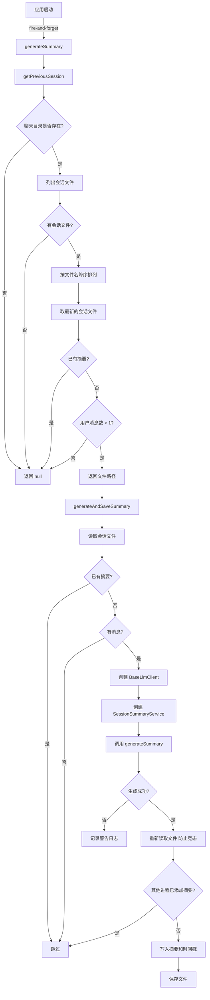
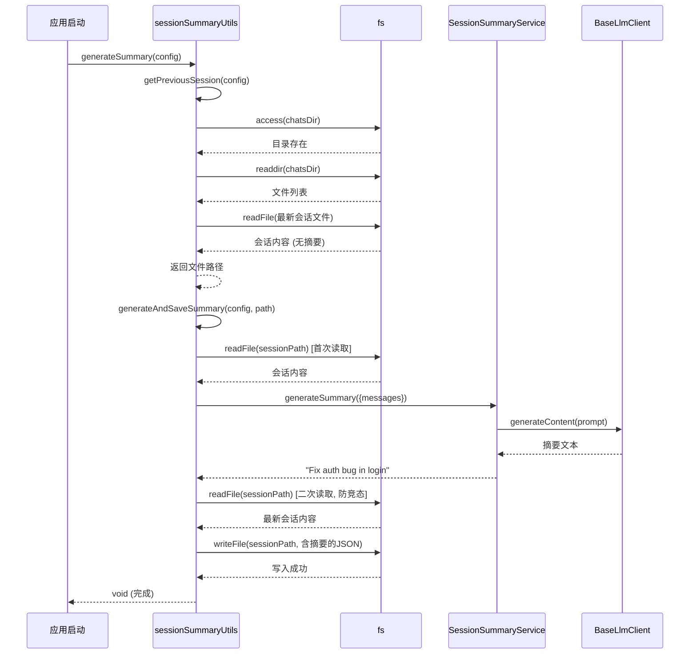

# sessionSummaryUtils.ts

## 概述

`sessionSummaryUtils.ts` 位于 `packages/core/src/services/` 目录下，是会话摘要功能的工具模块。它提供了两个导出函数（`getPreviousSession` 和 `generateSummary`）和一个内部函数（`generateAndSaveSummary`），负责查找需要生成摘要的历史会话文件，并调用 `SessionSummaryService` 生成摘要后持久化回文件。

该模块的设计目标是作为启动时的"发射即忘"（fire-and-forget）任务运行，在后台为上一次会话生成摘要，不阻塞主流程。

## 架构图（Mermaid）





## 核心组件

### 常量

| 常量名 | 值 | 说明 |
|--------|-----|------|
| `MIN_MESSAGES_FOR_SUMMARY` | `1` | 最少用户消息数阈值，会话中用户消息数必须大于此值才会生成摘要 |

### 函数详解

#### 1. `generateAndSaveSummary(config, sessionPath)` -- 内部函数

**签名：**
```typescript
async function generateAndSaveSummary(
  config: Config,
  sessionPath: string,
): Promise<void>
```

**职责**：为指定的会话文件生成 AI 摘要并保存回文件。

**详细流程：**

1. **读取会话文件**：使用 `fs.readFile` 读取 JSON 格式的会话文件，解析为 `ConversationRecord` 对象。

2. **前置检查**：
   - 如果 `conversation.summary` 已存在，跳过（避免重复生成）。
   - 如果 `conversation.messages` 为空，跳过。

3. **初始化服务链**：
   - 从 `config.getContentGenerator()` 获取内容生成器。如果不可用，跳过。
   - 创建 `BaseLlmClient` 实例。
   - 创建 `SessionSummaryService` 实例。

4. **生成摘要**：调用 `summaryService.generateSummary({ messages })`。

5. **竞态条件处理**（关键设计）：
   - 在写入之前**重新读取**文件内容（`freshContent`）。
   - 检查是否有其他进程在此期间已经添加了摘要。
   - 如果仍然没有摘要，才将新摘要写入。

6. **写入文件**：
   - 设置 `freshConversation.summary` 为生成的摘要。
   - 更新 `freshConversation.lastUpdated` 为当前 ISO 时间戳。
   - 使用 `JSON.stringify(freshConversation, null, 2)` 格式化写入（2 空格缩进）。

#### 2. `getPreviousSession(config)` -- 导出函数

**签名：**
```typescript
export async function getPreviousSession(
  config: Config,
): Promise<string | null>
```

**职责**：查找最近创建的、需要摘要的会话文件。

**详细流程：**

1. **确定聊天目录**：通过 `config.storage.getProjectTempDir()` + `'chats'` 拼接路径。

2. **目录存在性检查**：使用 `fs.access(chatsDir)` 检查目录是否存在，不存在则返回 `null`。

3. **列出会话文件**：
   - 使用 `fs.readdir` 列出所有文件。
   - 过滤出以 `SESSION_FILE_PREFIX` 开头且以 `.json` 结尾的文件。

4. **排序获取最新文件**：
   - 按文件名降序排列（`b.localeCompare(a)`）。
   - 文件名格式为 `session-YYYY-MM-DDTHH-MM-XXXXXXXX.json`，因此字符串排序等同于时间排序。
   - 取第一个（最新）文件。

5. **资格检查**：
   - 读取文件内容并解析为 `ConversationRecord`。
   - 如果已有摘要，返回 `null`。
   - 统计 `type === 'user'` 的消息数量，如果不超过 `MIN_MESSAGES_FOR_SUMMARY`（1），返回 `null`。
   - 只有用户消息数大于 1 的无摘要会话才返回文件路径。

6. **错误处理**：所有异常都被捕获并记录调试日志，返回 `null`。

#### 3. `generateSummary(config)` -- 导出函数（入口）

**签名：**
```typescript
export async function generateSummary(config: Config): Promise<void>
```

**职责**：顶层入口函数，设计为在应用启动时以 fire-and-forget 方式调用。

**流程：**
1. 调用 `getPreviousSession(config)` 获取需要摘要的会话路径。
2. 如果路径存在，调用 `generateAndSaveSummary(config, sessionPath)`。
3. 所有异常被捕获并通过 `debugLogger.warn` 记录，不向上层抛出。

## 依赖关系

### 内部依赖

| 模块路径 | 导入内容 | 用途 |
|---------|---------|-----|
| `../config/config.js` | `Config`（类型） | 应用配置接口，用于获取存储路径和内容生成器 |
| `./sessionSummaryService.js` | `SessionSummaryService` | 会话摘要生成服务 |
| `../core/baseLlmClient.js` | `BaseLlmClient` | LLM 基础客户端，用于创建摘要服务的依赖 |
| `../utils/debugLogger.js` | `debugLogger` | 调试日志工具 |
| `./chatRecordingService.js` | `SESSION_FILE_PREFIX`（常量）、`ConversationRecord`（类型） | 会话文件前缀常量和对话记录类型 |

### 外部依赖

| 模块 | 导入内容 | 用途 |
|------|---------|-----|
| `node:fs/promises` | `fs` | 异步文件操作（`readFile`、`writeFile`、`readdir`、`access`） |
| `node:path` | `path` | 路径拼接（`path.join`） |

## 关键实现细节

### 1. 竞态条件防护（Read-Before-Write 模式）
`generateAndSaveSummary` 在写入摘要之前会**重新读取**会话文件，检查是否有其他进程在摘要生成期间已经写入了摘要。这是一种乐观并发控制策略：
- 第一次读取：获取消息内容用于生成摘要（可能耗时数秒）。
- 第二次读取：在写入前获取文件最新状态，防止覆盖其他进程的更新。
- 虽然不是原子操作（存在极小的 TOCTOU 窗口），但对于摘要这种非关键数据已经足够。

### 2. Fire-and-Forget 设计模式
`generateSummary` 被设计为启动时的后台任务：
- 不返回有意义的结果（`Promise<void>`）。
- 所有异常被内部捕获，不影响调用方。
- 文档中明确注释了这一设计意图：_"This is designed to be called fire-and-forget on startup."_

### 3. 文件名排序即时间排序
会话文件的命名格式为 `session-YYYY-MM-DDTHH-MM-XXXXXXXX.json`，其中时间部分按照 ISO 8601 格式编码。这种命名约定使得简单的字符串降序排序（`localeCompare`）即可得到按创建时间从新到旧的顺序，无需解析时间戳。

### 4. 最少消息数阈值
`MIN_MESSAGES_FOR_SUMMARY` 设为 1，意味着只有超过 1 条用户消息（即至少 2 条）的会话才会生成摘要。单条用户消息的会话通常太短，不值得生成摘要（可能只是一次快速测试或误操作）。

### 5. 服务链的懒初始化
`BaseLlmClient` 和 `SessionSummaryService` 在 `generateAndSaveSummary` 内部按需创建，而不是在模块加载时初始化。这避免了在不需要摘要生成时（如会话已有摘要或无消息）浪费资源。

### 6. 时间戳更新
写入摘要时同步更新 `lastUpdated` 字段为 `new Date().toISOString()`，确保文件的最后更新时间反映摘要的添加时间。

### 7. 仅处理最近一个会话
`getPreviousSession` 只检查最近创建的一个会话文件，不会批量处理所有历史会话。这是性能和资源消耗的权衡 -- 每次启动只花费一个 LLM 调用的成本。

### 8. 多层防御性检查
摘要是否已存在的检查出现在三个地方：
1. `getPreviousSession` 中（初步筛选）。
2. `generateAndSaveSummary` 首次读取后（二次确认）。
3. `generateAndSaveSummary` 第二次读取后（竞态防护）。
这种多层检查确保了在各种并发场景下都不会重复生成摘要。
