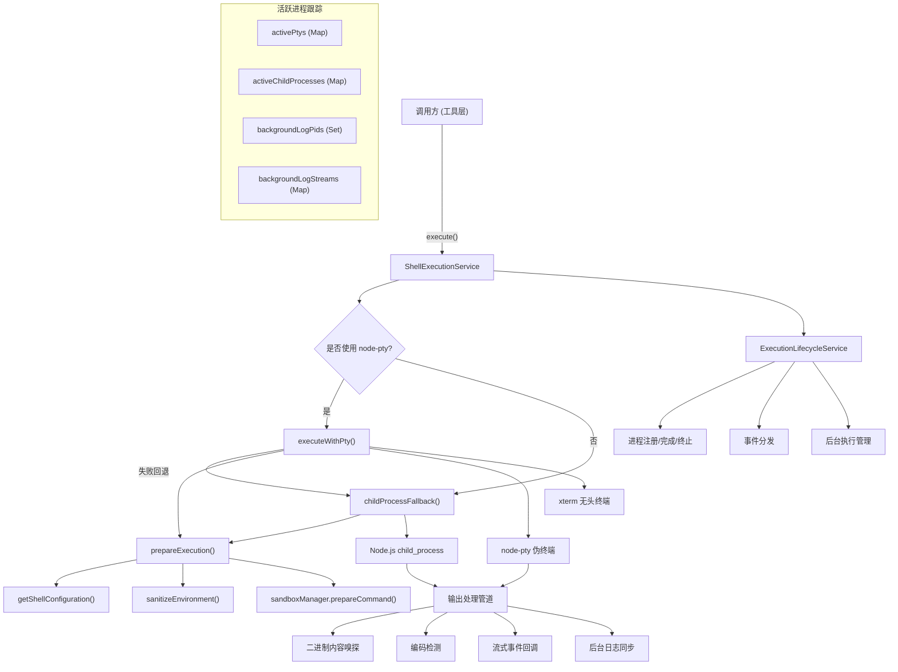

# shellExecutionService.ts

## 概述

`ShellExecutionService` 是 Gemini CLI 核心模块中的 **Shell 命令执行服务**，提供了一个集中化的、跨平台的 Shell 命令执行引擎。它支持两种执行模式：**node-pty 伪终端模式**和 **child_process 子进程回退模式**，能够进行实时流式输出、二进制检测、沙箱隔离、后台进程管理等高级功能。

该服务是 Gemini CLI 工具执行层的核心基础设施，所有通过 CLI 发起的 Shell 命令最终都通过此服务执行。

## 架构图（Mermaid）



## 核心组件

### 1. ShellExecutionService 类（静态类）

整个服务以静态类的形式实现，所有方法和状态都是静态的，作为全局单例运行。

#### 静态属性

| 属性 | 类型 | 说明 |
|---|---|---|
| `activePtys` | `Map<number, ActivePty>` | 存储所有活跃的 PTY 进程，以 PID 为键 |
| `activeChildProcesses` | `Map<number, ActiveChildProcess>` | 存储所有活跃的子进程，以 PID 为键 |
| `backgroundLogPids` | `Set<number>` | 记录已移入后台运行的进程 PID |
| `backgroundLogStreams` | `Map<number, fs.WriteStream>` | 后台进程的日志写入流 |

#### 核心方法

##### `execute()` - 主入口方法

```typescript
static async execute(
  commandToExecute: string,
  cwd: string,
  onOutputEvent: (event: ShellOutputEvent) => void,
  abortSignal: AbortSignal,
  shouldUseNodePty: boolean,
  shellExecutionConfig: ShellExecutionConfig,
): Promise<ShellExecutionHandle>
```

执行流程：
1. 如果 `shouldUseNodePty` 为 `true`，先尝试获取 PTY 实现
2. 调用 `executeWithPty()` 尝试 PTY 模式执行
3. 若 PTY 模式失败，自动回退到 `childProcessFallback()`
4. 返回 `ShellExecutionHandle`（包含 `pid` 和 `result` Promise）

##### `prepareExecution()` - 执行准备

统一的命令准备逻辑，PTY 和子进程模式共用：

1. **Shell 配置解析**：通过 `getShellConfiguration()` 获取系统默认 Shell
2. **Windows 严格沙箱特殊处理**：在 Windows 严格沙箱模式下强制使用 `cmd.exe`
3. **可执行文件解析**：通过 `resolveExecutable()` 获取完整路径
4. **Bash 安全防护**：通过 `ensurePromptvarsDisabled()` 禁用危险的 bash shopt 选项（`promptvars`, `nullglob`, `extglob`, `nocaseglob`, `dotglob`）
5. **环境变量清洗**：通过 `sanitizeEnvironment()` 过滤敏感环境变量
6. **Git 交互禁用**（非交互模式）：设置 `GIT_TERMINAL_PROMPT=0`、`GIT_ASKPASS=''` 等，防止 Git 弹出认证提示
7. **沙箱命令包装**：通过 `sandboxManager.prepareCommand()` 应用沙箱策略

##### `executeWithPty()` - PTY 模式执行

使用 `node-pty` 创建伪终端执行命令，配合 `@xterm/headless` 无头终端进行输出渲染：

- 创建指定大小的 PTY（默认 80x30）
- 创建对应的 xterm 无头终端，scrollback 限制为 300,000 行
- 输出通过 **渲染节流机制**（68ms 间隔）进行批量渲染
- 支持 ANSI 颜色输出的序列化（通过 `serializeTerminalToObject()`）
- 使用 Promise 链（`processingChain`）保证数据块的顺序处理

##### `childProcessFallback()` - 子进程回退模式

使用 Node.js `child_process.spawn()` 执行命令：

- stdio 配置为 `['ignore', 'pipe', 'pipe']`（忽略 stdin，管道 stdout/stderr）
- 在非 Windows 系统上使用 `detached: true` 创建独立进程组
- 输出缓冲区上限 16MB，超出后截断并添加警告信息
- stdout 和 stderr 合并处理

##### `background()` - 后台化进程

将正在运行的进程移入后台：

1. 创建日志文件（存储在 `<globalTempDir>/background-processes/background-<pid>.log`）
2. 将当前输出写入日志文件
3. 后续输出实时同步到日志文件
4. 调用 `ExecutionLifecycleService.background()` 解除前台阻塞

##### `resizePty()` - 调整终端大小

调整 PTY 和无头终端的列数和行数，调整后强制发出新的输出状态事件。处理了 PTY 已退出时的竞态条件。

##### `scrollPty()` - 滚动终端

滚动指定 PTY 的无头终端，支持向上/向下滚动指定行数。

##### `kill()` - 终止进程

终止指定 PID 的进程，清理日志流，从活跃映射中移除。

### 2. 辅助函数

#### `ensurePromptvarsDisabled()`

为 bash 命令添加 `shopt -u` 前缀，禁用以下可能导致安全问题或意外行为的选项：
- `promptvars` - 防止提示符变量扩展
- `nullglob` - 防止无匹配时 glob 扩展为空
- `extglob` - 防止扩展 glob 模式
- `nocaseglob` - 防止大小写不敏感 glob
- `dotglob` - 防止 glob 匹配隐藏文件

#### `findLastContentLine()`

在终端缓冲区中从后向前搜索最后一行有内容的行号，用于裁剪尾部空行。

#### `getFullBufferText()`

从 xterm 无头终端缓冲区中提取完整文本，正确处理行包装（wrapped lines）。

#### `writeBufferToLogStream()`

将终端缓冲区内容写入日志流（用于后台进程日志），去除 ANSI 转义码。

### 3. 输出处理管道

#### 二进制内容嗅探

- 收集前 4096 字节的数据块
- 使用 `isBinary()` 函数检测内容是否为二进制
- 二进制内容不会写入文本缓冲区，而是发出 `binary_detected` 和 `binary_progress` 事件

#### 编码检测

- 通过 `getCachedEncodingForBuffer()` 根据数据内容自动检测字符编码
- 使用 `TextDecoder` 进行流式解码（`{ stream: true }`）

### 4. 类型定义

#### `ShellExecutionConfig`

```typescript
interface ShellExecutionConfig {
  additionalPermissions?: SandboxPermissions;  // 额外沙箱权限
  terminalWidth?: number;                       // 终端宽度（默认 80）
  terminalHeight?: number;                      // 终端高度（默认 30）
  pager?: string;                               // 分页器（默认 'cat'）
  showColor?: boolean;                          // 是否保留颜色信息
  defaultFg?: string;                           // 默认前景色
  defaultBg?: string;                           // 默认背景色
  sanitizationConfig: EnvironmentSanitizationConfig;  // 环境变量清洗配置
  sandboxManager: SandboxManager;               // 沙箱管理器
  disableDynamicLineTrimming?: boolean;          // 禁用动态行裁剪（测试用）
  scrollback?: number;                          // 回滚行数
  maxSerializedLines?: number;                  // 最大序列化行数
  sandboxConfig?: SandboxConfig;                // 沙箱配置
}
```

#### `ShellOutputEvent`（别名 `ExecutionOutputEvent`）

事件类型包括：
- `{ type: 'data', chunk: string | AnsiOutput }` - 输出数据
- `{ type: 'binary_detected' }` - 检测到二进制内容
- `{ type: 'binary_progress', bytesReceived: number }` - 二进制下载进度
- `{ type: 'exit', exitCode: number, signal: number | null }` - 进程退出

#### `ActivePty`

```typescript
interface ActivePty {
  ptyProcess: IPty;                    // PTY 进程实例
  headlessTerminal: pkg.Terminal;      // xterm 无头终端
  maxSerializedLines?: number;         // 最大序列化行数
}
```

#### `ActiveChildProcess`

```typescript
interface ActiveChildProcess {
  process: ChildProcess;               // 子进程实例
  state: {
    output: string;                    // 累积输出
    truncated: boolean;                // 是否已截断
    sniffChunks: Buffer[];             // 嗅探用的数据块
    binaryBytesReceived: number;       // 接收的二进制字节数
  };
}
```

### 5. 导出常量

| 常量 | 值 | 说明 |
|---|---|---|
| `GEMINI_CLI_IDENTIFICATION_ENV_VAR` | `'GEMINI_CLI'` | 环境变量名，标识当前处于 Gemini CLI 环境中 |
| `GEMINI_CLI_IDENTIFICATION_ENV_VAR_VALUE` | `'1'` | 上述环境变量的值 |
| `SCROLLBACK_LIMIT` | `300000` | 终端回滚缓冲区最大行数 |

## 依赖关系

### 内部依赖

| 模块 | 用途 |
|---|---|
| `../utils/getPty.js` | 获取 PTY 实现（`getPty()`、`PtyImplementation` 类型） |
| `../utils/systemEncoding.js` | 字符编码检测（`getCachedEncodingForBuffer()`） |
| `../utils/shell-utils.js` | Shell 配置和可执行文件解析（`getShellConfiguration()`、`resolveExecutable()`、`ShellType`） |
| `../utils/textUtils.js` | 二进制内容检测（`isBinary()`） |
| `../utils/debugLogger.js` | 调试日志（`debugLogger`） |
| `../utils/terminalSerializer.js` | 终端内容序列化（`serializeTerminalToObject()`、`AnsiOutput`） |
| `../utils/process-utils.js` | 进程组终止（`killProcessGroup()`） |
| `../config/storage.js` | 全局临时目录获取（`Storage.getGlobalTempDir()`） |
| `../config/config.js` | 沙箱配置类型（`SandboxConfig`） |
| `./environmentSanitization.js` | 环境变量清洗（`sanitizeEnvironment()`、`EnvironmentSanitizationConfig`） |
| `./sandboxManager.js` | 沙箱管理器（`SandboxManager`、`NoopSandboxManager`、`SandboxPermissions`） |
| `./executionLifecycleService.js` | 执行生命周期管理（`ExecutionLifecycleService`、`ExecutionHandle`、`ExecutionOutputEvent`、`ExecutionResult`） |

### 外部依赖

| 包 | 用途 |
|---|---|
| `strip-ansi` | 去除 ANSI 转义码 |
| `@lydell/node-pty` | PTY 伪终端接口类型（`IPty`） |
| `@xterm/headless` | 无头 xterm 终端，用于 PTY 输出的虚拟渲染 |
| `node:child_process` | Node.js 子进程 spawn |
| `node:util` | `TextDecoder` |
| `node:stream` | `Writable` 类型 |
| `node:os` | 操作系统平台检测 |
| `node:fs` | 文件系统操作（日志文件） |
| `node:path` | 路径拼接 |

## 关键实现细节

### 1. PTY 优先、子进程回退策略

服务优先使用 `node-pty` 创建伪终端执行命令，这提供了更接近真实终端的体验（支持 ANSI 颜色、光标控制等）。当 PTY 不可用或创建失败时（例如在某些沙箱环境中 `posix_spawnp` 失败），自动回退到 `child_process.spawn()`。

### 2. 渲染节流机制

PTY 模式下，输出渲染使用 68ms 的 `setTimeout` 进行节流（约 15fps），避免高频输出导致的性能问题。同时使用 `isWriting` 标志在写入期间抑制滚动触发的重复渲染。最终渲染（`finalRender = true`）会立即执行并清除待处理的定时器。

### 3. 输出缓冲区截断策略

子进程模式下，`appendAndTruncate()` 方法实现了滑动窗口式的缓冲区管理：
- 缓冲区上限 16MB
- 当新数据使缓冲区超出上限时，从头部截断旧数据
- 如果单个数据块超过上限，直接取数据块的尾部
- 截断时添加 `[GEMINI_CLI_WARNING]` 警告信息

### 4. 环境变量安全处理

- **清洗**：通过 `sanitizeEnvironment()` 过滤掉敏感环境变量
- **标识注入**：设置 `GEMINI_CLI=1` 以便下游脚本识别
- **Git 安全**：在非交互模式下禁用所有 Git 认证提示，设置空的 credential.helper
- **分页器覆盖**：默认将 `PAGER` 和 `GIT_PAGER` 设为 `cat`，避免交互式分页器阻塞

### 5. Bash shopt 安全防护

通过 `ensurePromptvarsDisabled()` 在每个 bash 命令前注入 `shopt -u` 来禁用可能导致安全问题或意外行为的 shell 选项。该函数具有幂等性，不会重复添加前缀。

### 6. 进程组管理

- 在非 Windows 系统上使用 `detached: true` 创建独立进程组
- 终止时使用 `killProcessGroup()` 发送信号到整个进程组
- 支持信号升级（`escalate: true`），先发 SIGTERM 再发 SIGKILL
- 通过 `isExited` 回调检查进程是否已退出，避免不必要的信号发送

### 7. 后台进程日志

当进程移入后台时：
- 在全局临时目录下创建 `background-processes/background-<pid>.log` 日志文件
- PTY 模式：将当前终端缓冲区完整写入日志
- 子进程模式：将当前累积输出写入日志
- 后续新输出实时追加到日志文件（去除 ANSI 转义码）

### 8. 竞态条件处理

- PTY 退出时使用 `Promise.race` 等待数据处理链完成或 abort 信号触发
- `resizePty()` 和 `scrollPty()` 中捕获 `ESRCH` 错误（进程已退出）
- Windows 平台特殊处理 "Cannot resize a pty that has already exited" 错误
- abort 处理器在退出后自动移除，防止内存泄漏
